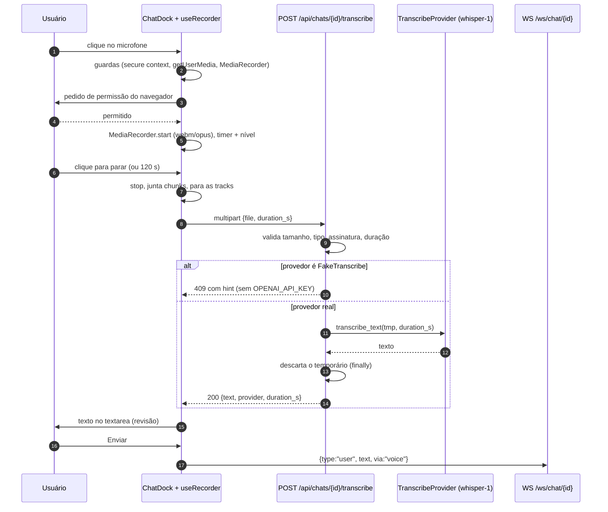
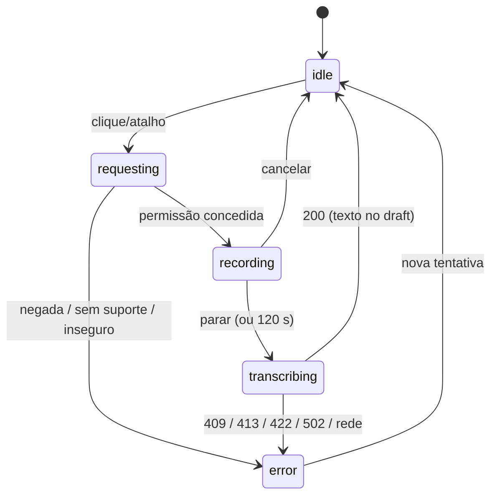

### FDD: chat-audio (entrada por voz no chat) `[extensão]`

Versão: 1.0
Data: 2026-09-06
Responsável: Arthur Diego (modo autônomo /dd-parallel, Wave 11)
Task-Id: ADH-OS-20260906-11
Card(s): #89 https://trello.com/c/a0yHBAm5

---

### 1. Contexto e motivação técnica

O composer do chat é hoje só um `<textarea>` (`frontend/src/areas/chat/ChatDock.tsx:256-263`) e o
frontend não tem uma linha de captura de áudio: `MediaRecorder`, `getUserMedia` e
`SpeechRecognition` não aparecem em `frontend/src` (recon §1.4). O `studio/chat/router.py` não tem
nenhum `UploadFile`; os POSTs existentes são `/api/chats`, `/stop`, `/ask`, `/answer` e `/emit`
(`:86,:146,:155,:170,:176`). Quem conduz uma campanha pelo assistente digita tudo, inclusive
descrições longas de cena, marca e vibe, que são justamente o tipo de texto que sai mais rápido
falando.

Ao mesmo tempo, o studio JÁ tem transcrição pronta e governada por ADR: `studio/edit/captions/
transcribe.py` traz o `Protocol` `TranscribeProvider` (`:71-74`), o provedor real
`OpenAITranscribe` com `whisper-1` (`:152-211`, import lazy do SDK dentro do método `_ouvir`,
`:198`), o `FakeTranscribe` determinístico sem chave (`:141-149`) e o seletor por ambiente
`get_transcribe()` (`:225-235`). A ADR-024 fixa `language="pt"`, `verbose_json`,
`timestamp_granularities=["word"]`, `timeout=120`, `max_retries=1` e a política assimétrica de
falha: `words()` cai no proporcional, `transcribe_text()` levanta `ProviderError`, que o router da
etapa 7 traduz em 502 (`studio/etapas/edit/router.py:232-233`).

Esta feature é o **segundo consumidor** desse provedor, com uma leitura idêntica à de
`transcribe_text()`: não existe texto nosso, o áudio É a mensagem. O encaixe no HLD é direto:

- **HLD chat** ganha uma rota REST nova na tabela de Interfaces (`docs/domains/chat/hld.md:54-64`),
  a primeira do domínio a receber `multipart/form-data`.
- **ADR-040** manda que o agente nunca veja bytes: a transcrição acontece no servidor, e o que
  chega ao `claude -p` é uma mensagem `user` de texto puro, exatamente como se tivesse sido
  digitada. Nenhuma tool MCP nova, nenhum arquivo entregue ao agente.
- **ADR-036** define o protocolo do WS; o campo `via: "voice"` no evento `user` é acréscimo
  aditivo, alinhado com o ADR-041 do protocolo v2 que a F02 (chat-feedback) abre.
- **ADR-024** governa o provedor. Web Speech API no navegador foi **rejeitada** nela
  (`Alternativas Consideradas` item 2: quebra a ADR-008, porque o caminho passaria a viver só no
  cliente, e a qualidade em português varia por navegador). Portanto o fallback de navegador
  previsto no item (5) do card fica **FORA** desta entrega e vira pendência; contrariá-lo exigiria
  um ADR novo, o que esta frente não faz.
- **ADR-008** exige suíte sem rede e sem navegador: o provedor real nunca é chamado em teste, e o
  microfone é exercitado com `MediaRecorder` mockado no Vitest (jsdom).
- **ADR-016** cobra o gasto no livro-caixa. A ADR-024 já registra como lacuna intencional que o
  custo do whisper não entra em `record_generation`; esta entrega **mantém** a lacuna e a registra
  como pendência (o card manda registrar, não implementar).

**Atores**: o dono do produto falando no dock do chat (navegador); o backend FastAPI
(`studio/chat/`); o provedor de STT (OpenAI `whisper-1`, opcional).

**Limites**: nada de STT local (`faster-whisper`), nada de gravação persistida em disco de
projeto, nada de transcrição de arquivos de áudio já existentes no projeto (isso é a etapa 7, rota
`/edit/captions/generate`), nada de tool MCP de transcrição, nenhum evento novo de WS.

**Provides / Consumes** (copiado de `docs/domains/studio/waves/wave-11.md`, seção "Feature:
chat-audio (F09)")

**Provides**
- `POST /api/chats/{id}/transcribe` (multipart ≤10 MB, webm/opus → wav 16 kHz via ffmpeg quando
  preciso) reusando `TranscribeProvider` (`studio/edit/captions/transcribe.py`, extraído para
  `studio/common/transcribe.py` se o reuso pedir); 409 com `hint` sem provider real.
- Botão de microfone no composer (`useRecorder.ts`), estados idle/gravando/transcrevendo/erro;
  texto cai no draft; fallback `SpeechRecognition` do navegador; indicador 🎤 na bolha.
- Decisão registrada: provider = OpenAI `whisper-1` já existente (chave em `.env.local`); STT
  local (`faster-whisper`) fica fora desta wave (pendência no FDD).

**Consumes**
- Estado do composer/status do dock ← **chat-feedback** (F02, sub-wave 1). Motivo real: mesmo
  trecho de `ChatDock.tsx` (composer); sequenciar evita conflito.

Ajustes deste FDD sobre o bloco acima, decididos na entrevista em modo batch e detalhados nas
seções 3 e 5: a conversão webm → wav **não** entra (o `whisper-1` aceita webm; ver §5, C1); o
provider **não** é extraído para `studio/common/` (ver §8); o fallback `SpeechRecognition`
**não** entra, por decisão já tomada na ADR-024 (ver §3, Excluído).

---

### 2. Objetivos técnicos

- Falar no dock e obter o texto no `<textarea>` sem que a mensagem seja enviada sozinha.
  Invariante: `send()` do `useChatSocket` nunca é chamado pelo caminho de voz enquanto a
  preferência "enviar direto" estiver desligada (default desligada).
- O agente nunca recebe bytes (ADR-040). Invariante verificável: o único efeito da transcrição no
  transcript é um evento `kind:"user"` com `text` (string) e, no máximo, `via:"voice"`; `grep` por
  campo de mídia no `events.jsonl` do cenário de voz devolve zero.
- O áudio é descartado. Invariante: depois da resposta, nenhum arquivo do upload existe em disco;
  o arquivo temporário vive dentro de um `TemporaryDirectory` fechado no `finally`, e nunca é
  gravado sob `projects/` nem sob `STATE_DIR`.
- A ausência de provedor real é diagnóstico, nunca texto inventado. Invariante: com
  `FakeTranscribe` (sem `OPENAI_API_KEY`), a rota responde 409 e o corpo diz o que fazer; nunca 200
  com "palavra1 palavra2".
- A suíte continua sem rede e sem navegador (ADR-008): `pytest` com provedor de mentira injetado e
  Vitest com `MediaRecorder`/`getUserMedia` mockados; nenhum teste importa `openai`.
- Teto de 2 minutos por gravação e 10 MB por requisição, medidos nos dois lados (o cliente para a
  gravação, o servidor rejeita com 413).
- Zero regressão no composer: com voz desligada, `ChatDock` se comporta exatamente como hoje
  (mesmo `aria-label`, mesmas classes, mesmo `onKey`).

---

### 3. Escopo e exclusões

**Incluído**
- Rota `POST /api/chats/{chat_id}/transcribe`, multipart, teto de 10 MB, resposta
  `{text, provider, duration_s}`.
- Módulo `studio/chat/voice.py`: validação de formato por allowlist de tipo e assinatura de bytes,
  teto de tamanho e de duração, gravação em diretório temporário, chamada de
  `TranscribeProvider.transcribe_text()`, descarte garantido.
- Reuso direto de `get_transcribe()` / `ProviderError` / `FakeTranscribe` de
  `studio/edit/captions/transcribe.py` (ADR-024), sem mover o módulo.
- 409 explícito quando o provedor resolvido é o `FakeTranscribe`, com texto de diagnóstico.
- Hook `frontend/src/areas/chat/useRecorder.ts`: máquina de estados
  `idle → requesting → recording → transcribing → idle|error`, `MediaRecorder` com
  `audio/webm;codecs=opus` (com negociação de mimeType), timer, nível de entrada, parada automática
  em 120 s.
- Botão de microfone no composer do `ChatDock`, com rótulo acessível, estado visual por fase,
  atalho de teclado, mensagens específicas para permissão negada, navegador sem suporte e contexto
  não seguro.
- Texto transcrito concatenado ao `draft` (não substitui o que já estava escrito).
- Preferência opcional "Enviar direto" (default desligada), persistida em `localStorage`.
- Campo aditivo `via: "voice"` na mensagem do WS e no evento `user` persistido; indicador 🎤 na
  bolha do usuário.
- Testes: `pytest` (multipart com provedor de mentira → texto; 409 sem provedor; 413 no teto; 422
  em webm inválido; 404 em chat inexistente) e Vitest (estados do gravador, permissão negada,
  navegador sem suporte, texto cai no draft, "enviar direto" ligado envia).
- ADR-043 "Entrada por voz no chat `[extensão]`" (esqueleto na seção 12).
- Atualização do HLD do chat (tabela de Interfaces + nota do campo `via`).

**Excluído**
- Fallback `SpeechRecognition` / Web Speech API no navegador. **Rejeitado pela ADR-024**
  (Alternativas Consideradas, item 2) por conflito com a ADR-008. Entra em §12 como pendência; só
  volta com ADR novo.
- STT local (`faster-whisper`, `openai-whisper`). ADR-024 já o descreve como plano B; fora desta
  wave (pendência).
- Registro do custo do whisper no livro-caixa (ADR-016). Lacuna intencional herdada da ADR-024,
  mantida e registrada como pendência.
- Conversão webm → wav 16 kHz. Ver §5, C1: o `whisper-1` aceita webm/ogg/mp4/wav/mp3 diretamente,
  e a etapa 7 converte porque parte de mídia arbitrária do projeto, não porque o provedor exija.
  O gancho fica documentado para o dia em que o provedor mudar.
- Job assíncrono com polling (ADR-006). A chamada é síncrona, como na etapa 7; o teto de 2 min de
  áudio mantém o pior caso dentro do `timeout=120` do SDK.
- Tool MCP de transcrição, resource novo, mudança no `sistema.md`.
- Streaming de transcrição parcial, pontuação assistida, tradução, diarização.
- Saída por voz (TTS).
- Qualquer mudança no `studio/chat/runtime.py` (`normalize_event`, `build_argv`).

---

### 4. Fluxos detalhados e diagramas

**Fluxo principal (gravar, transcrever, revisar)**

1. O usuário clica no botão de microfone do composer (ou usa o atalho). O `useRecorder` entra em
   `requesting`.
2. Guardas do cliente, nesta ordem: `window.isSecureContext` (ou host em `localhost`/`127.0.0.1`),
   `navigator.mediaDevices?.getUserMedia`, `window.MediaRecorder`. Falha em qualquer uma vira
   estado `error` com mensagem própria e o botão volta para `idle`.
3. `getUserMedia({audio: true})`. Concedida a permissão, o hook resolve o `mimeType` pela primeira
   opção suportada (`audio/webm;codecs=opus` → `audio/webm` → `audio/ogg;codecs=opus` →
   `audio/mp4`), instancia o `MediaRecorder`, chama `start(250)` e passa para `recording`.
4. Em `recording`: um timer de 1 s alimenta o contador `mm:ss` e um `AnalyserNode` (quando
   `AudioContext` existir) alimenta a barra de nível. Aos 120 s o hook chama `stop()` sozinho e
   avisa "limite de 2 minutos".
5. O usuário clica de novo (ou usa o atalho). `MediaRecorder.stop()`; no `onstop` os `Blob` de
   `ondataavailable` viram um `Blob` único; todas as tracks do stream são paradas
   (`track.stop()`), liberando o indicador de microfone do navegador. Estado `transcribing`.
6. O cliente monta `FormData` com `file` (o blob, nome `fala.webm` conforme o mimeType) e
   `duration_s` (segundos medidos pelo timer) e faz `POST /api/chats/{chat_id}/transcribe`.
7. O servidor valida: existência da aba, tamanho (≤10 MB), tipo declarado + assinatura dos bytes,
   duração declarada dentro de `[0, 120]`. Resolve o provedor com `get_transcribe()`; se for
   `FakeTranscribe`, responde 409 e nada mais acontece.
8. Com provedor real: grava os bytes em `TemporaryDirectory`, chama
   `provider.transcribe_text(path, duration_s)`, descarta o diretório no `finally` e responde
   `{text, provider, duration_s}`. Loga `chat.voice ok chat_id=… bytes=… duration_s=… chars=…
   elapsed_ms=…` (nunca o texto).
9. O cliente concatena o texto ao `draft` (com um espaço quando já havia texto), foca o
   `<textarea>` e volta para `idle`. Nenhuma mensagem é enviada.
10. O usuário revisa, edita e clica em Enviar. O `send()` do `useChatSocket` inclui
    `via: "voice"` quando a última alteração do draft veio da voz.
11. `_handle_user` persiste o evento `user` com `via:"voice"` e o empurra pelo WS; a bolha mostra
    o indicador 🎤. Daí para a frente o turno é o de sempre (ADR-036): o agente vê só texto.

**Fluxos alternativos e exceções**
- **Preferência "enviar direto" ligada**: no passo 9 o cliente escreve o draft e chama `enviar()`
  na sequência, com `via:"voice"`. Se o texto vier vazio, não envia e mostra "não entendi nada,
  tente de novo".
- **Permissão negada** (`NotAllowedError`/`SecurityError`): estado `error`, mensagem "permissão de
  microfone negada: libere o acesso nas configurações do navegador e tente de novo". O botão
  continua clicável (o usuário pode liberar e repetir).
- **Sem microfone** (`NotFoundError`/`OverconstrainedError`): "nenhum microfone encontrado".
- **Navegador sem suporte** (`MediaRecorder`/`getUserMedia` ausentes): o botão renderiza
  `disabled` com `title` "seu navegador não suporta gravação de áudio"; não há fallback de
  reconhecimento no navegador (ADR-024).
- **Contexto não seguro** (HTTP fora de `localhost`): "gravação exige HTTPS ou localhost"; botão
  `disabled`. Caso real quando o studio é aberto pelo IP da máquina na rede local.
- **Cancelar durante a gravação**: botão "Cancelar" ao lado do microfone descarta os chunks, para
  as tracks e volta para `idle` sem chamar a rota.
- **Turno em andamento** (`busy`): o botão de microfone continua habilitado (gravar e revisar não
  depende do turno), mas o envio automático espera; com "enviar direto" ligado e `busy`, o texto
  fica no draft e um aviso diz "termine o turno atual para enviar".
- **409 sem provedor real**: o cliente mostra o `detail` do corpo como aviso persistente no
  composer e desabilita o microfone até a próxima montagem do dock.
- **502 do provedor** (`ProviderError`): "a transcrição falhou; tente de novo ou digite". O áudio
  já foi descartado; não há retry automático (ADR-024 §7: `max_retries=1` dentro do SDK, sem
  backoff próprio).
- **413 / 422**: mensagem do `detail` no composer; o áudio é descartado igualmente.
- **Desmontagem do dock durante a gravação**: o `useEffect` de limpeza para o recorder e as tracks;
  a requisição em voo é ignorada (flag `cancelled`, mesmo padrão de `useChatSocket.ts:52-56`).

**Diagramas**





---

### 5. Contratos públicos (assinaturas, endpoints, headers, exemplos)

**C1. Transcrição de um áudio da aba de chat**

- Tipo: `http_endpoint`
- Assinatura/Rota: `POST /api/chats/{chat_id}/transcribe`
- Método: POST
- Content-Type da requisição: `multipart/form-data`
- Campos: `file` (`UploadFile`, obrigatório), `duration_s` (`Form(float)`, opcional, default `0`;
  segundos medidos pelo cliente, aceito em `[0, 120]`)
- Limites: corpo ≤ `10 * 1024 * 1024` bytes (`MAX_AUDIO_BYTES`); duração ≤ `120` s
  (`MAX_AUDIO_SECONDS`); timeout efetivo herdado do SDK (`OpenAITranscribe.timeout_s = 120`,
  `max_retries=1`); sem rate limit (app local single user, ADR-001).
- Formatos aceitos (allowlist de `content_type` + assinatura dos primeiros bytes):
  `audio/webm` e `video/webm` (EBML `1A 45 DF A3`), `audio/ogg` (`OggS`), `audio/mp4`/`audio/m4a`
  (`ftyp` no offset 4), `audio/wav`/`audio/x-wav` (`RIFF`…`WAVE`), `audio/mpeg` (`ID3` ou
  `FF Fx`). O `whisper-1` aceita todos eles diretamente, então **não há conversão**; a extração
  para wav 16 kHz da etapa 7 (`studio/edit/captions/audio.py:39-52`) existe porque lá a entrada é
  mídia arbitrária do projeto (inclusive vídeo), não por exigência do provedor.
  `[auto-aceito: sem conversão webm → wav, porque a lista de formatos do whisper-1 já inclui webm
  e a conversão exigiria ffmpeg presente, criando um 409 novo sem ganho]`
- Semântica de status:
  - `200` transcrição concluída; corpo `{text, provider, duration_s}`. `text` pode ser string
    vazia quando o provedor não ouviu nada (o cliente trata como "não entendi nada").
  - `404` aba de chat inexistente (mesma mensagem das outras rotas: `conversa não encontrada: {id}`).
  - `409` não há provedor real de transcrição (o resolvido é `FakeTranscribe`). O `detail` é a
    própria dica de correção.
    `[auto-aceito: 409 (e não 502 nem 422) para "sem provider", seguindo a convenção do repo para
    capacidade não configurada: sem CLI do roteiro (ADR-025), hf.require_cli (ADR-028), motor local
    indisponível (ADR-033) e ffmpeg ausente (studio/etapas/edit/router.py:228-229) são todos 409. O
    502 da ADR-024 fica reservado ao provedor REAL que falhou]`
  - `413` corpo acima de 10 MB (convenção de upload do repo:
    `studio/etapas/edit/router.py:187-188`, `studio/moodboards/router.py:120-121`).
  - `422` arquivo vazio, tipo fora da allowlist, assinatura de bytes incompatível com o tipo
    declarado ou `duration_s` fora de `[0, 120]`. O `detail` começa pelo nome do campo (`file:` ou
    `duration_s:`), como no contrato da etapa 7.
  - `502` `ProviderError` do provedor real (ADR-024 §5, política assimétrica: sem texto nosso não
    existe estimativa aceitável).
- `detail` é sempre **string** (nunca objeto).
  `[auto-aceito: o "hint" do card vira o próprio texto do detail, porque
  frontend/src/api/http.ts:115-117 lê `body.detail` como string e um objeto renderizaria
  "[object Object]" na tela]`
- Versionamento: rota nova, puramente aditiva. Exige `make frontend-schema` e commit de
  `frontend/src/api/schema.ts` (guarda de drift do CI).

**Exemplo de requisição**

```
POST /api/chats/c_7f3a/transcribe HTTP/1.1
Content-Type: multipart/form-data; boundary=----x

------x
Content-Disposition: form-data; name="file"; filename="fala.webm"
Content-Type: audio/webm;codecs=opus

<bytes do MediaRecorder>
------x
Content-Disposition: form-data; name="duration_s"

6.4
------x--
```

**Exemplo de resposta (200)**

```json
{
  "text": "gera as ideias do storyboard e me mostra as quatro melhores",
  "provider": "whisper-1",
  "duration_s": 6.4
}
```

**Exemplo de resposta (409, sem `OPENAI_API_KEY`)**

```json
{
  "detail": "transcrição por voz indisponível: nenhum provedor real configurado. Defina OPENAI_API_KEY em .env.local e recarregue a página (ADR-024). Enquanto isso, digite a mensagem."
}
```

**Exemplo de resposta (422, webm inválido)**

```json
{
  "detail": "file: o arquivo não parece um audio/webm (assinatura inválida)"
}
```

**Assinaturas Python (módulo novo `studio/chat/voice.py`)**

```python
MAX_AUDIO_BYTES: int = 10 * 1024 * 1024
MAX_AUDIO_SECONDS: float = 120.0
NO_PROVIDER: str = "transcrição por voz indisponível: ..."   # texto do 409

class VoiceError(ValueError): ...        # vira 422 no router
class NoProvider(RuntimeError): ...      # vira 409 no router

def check_audio(data: bytes, content_type: str, filename: str) -> str:
    """Valida tamanho, tipo e assinatura; devolve a extensão canônica. Levanta VoiceError."""

def transcribe(data: bytes, content_type: str, filename: str, duration_s: float) -> dict:
    """{'text','provider','duration_s'} usando get_transcribe().transcribe_text().

    Grava em TemporaryDirectory e apaga no finally; levanta NoProvider quando o provedor
    resolvido é FakeTranscribe e ProviderError quando o provedor real falha (ADR-024).
    """
```

**C2. Campo `via` na mensagem do usuário (protocolo do WS, aditivo)**

- Tipo: `stream` (WebSocket `/ws/chat/{chat_id}`)
- Direção cliente → servidor, tipo `user`: acrescenta a chave opcional `via`, com o único valor
  aceito `"voice"`. Ausente = digitado (comportamento atual, byte a byte).
- Direção servidor → cliente e persistência (`events.jsonl`): o evento `kind:"user"` repassa `via`
  quando presente. Nenhum campo é removido nem renomeado.
- Semântica: rótulo de procedência para a UI (indicador 🎤) e para o `trace`. **Não** muda o
  argv do `claude` nem o texto entregue ao agente (ADR-040): o agente vê a mesma string.
- Compatibilidade: cliente antigo com servidor novo funciona (campo ausente); servidor antigo com
  cliente novo funciona (campo ignorado por `msg.get`). O `ChatEvent` do TypeScript já tem index
  signature (`frontend/src/areas/chat/types.ts`), então o campo é aceito sem quebra de tipo; ainda
  assim ele é declarado explicitamente como `via?: "voice"`.
- Alinhamento: **linha a acrescentar ao ADR-041** (protocolo do WS v2, aditivo, aberto pela F02):
  `| user.via | "voice" | opcional; procedência da mensagem; não altera o payload do agente |`.

**Exemplo (cliente → servidor)**

```json
{"type": "user", "text": "gera as ideias do storyboard", "context": null, "via": "voice"}
```

**Exemplo (servidor → cliente e linha em `events.jsonl`)**

```json
{"seq": 42, "ts": "2026-09-06T14:10:03Z", "kind": "user", "text": "gera as ideias do storyboard", "via": "voice"}
```

**C3. Hook `useRecorder` (contrato interno do frontend)**

- Tipo: `function` (React hook, `frontend/src/areas/chat/useRecorder.ts`)
- Assinatura:

```ts
type RecorderState = "idle" | "requesting" | "recording" | "transcribing" | "error";

interface RecorderApi {
  state: RecorderState;
  seconds: number;          // 0..120, contador da gravação em curso
  level: number;            // 0..1, nível de entrada (0 quando não há AudioContext)
  error: string;            // mensagem pronta para exibir (vazia quando não há erro)
  supported: boolean;       // false quando falta MediaRecorder/getUserMedia
  secure: boolean;          // false em HTTP fora de localhost
  start(): void;
  stop(): void;             // para e transcreve
  cancel(): void;           // para e descarta
}

export function useRecorder(chatId: string, onText: (text: string) => void): RecorderApi;
```

- Semântica: `onText` recebe SÓ o texto transcrito; a decisão de concatenar no draft ou enviar
  direto é do `ChatDock`, nunca do hook. O hook não conhece o `useChatSocket`.
- Limites: uma gravação por vez; `start()` em estado diferente de `idle`/`error` é no-op.

---

### 6. Erros, exceções e fallback

**Matriz de erros**

| Condição | Onde | Tratamento | Observação |
| --- | --- | --- | --- |
| Aba de chat inexistente | router | `404 conversa não encontrada: {id}` | mesma mensagem de `/events`, `/ask`, `/emit` |
| Corpo acima de 10 MB | router | `413 fala.webm: arquivo acima de 10 MB` | convenção de upload do repo |
| Arquivo vazio | `voice.check_audio` | `422 file: arquivo de áudio vazio` | |
| `content_type` fora da allowlist | `voice.check_audio` | `422 file: formato não suportado: {tipo}` | lista no `detail` |
| Assinatura de bytes incompatível | `voice.check_audio` | `422 file: o arquivo não parece um {tipo} (assinatura inválida)` | fecha o teste "webm inválido" sem depender de ffmpeg |
| `duration_s` fora de `[0, 120]` | `voice.check_audio` | `422 duration_s: fora do intervalo (0 a 120 s)` | |
| Provedor resolvido é `FakeTranscribe` | `voice.transcribe` → router | `409` com o texto de `NO_PROVIDER` | ADR-024: o fake produz "palavra1 palavra2…", que não pode virar mensagem |
| `ProviderError` (whisper falhou) | `voice.transcribe` → router | `502 {mensagem redigida}` | ADR-024 §5; a chave já vem redigida por `OpenAITranscribe._safe` |
| Exceção inesperada do SDK | `OpenAITranscribe.transcribe_text` | já é convertida em `ProviderError` no módulo da ADR-024 | nada a fazer aqui |
| Permissão de microfone negada | `useRecorder` | estado `error` + mensagem específica | não vira requisição |
| Navegador sem `MediaRecorder`/`getUserMedia` | `useRecorder` | `supported=false`, botão `disabled` com `title` | sem fallback Web Speech (ADR-024) |
| Contexto não seguro (HTTP fora de localhost) | `useRecorder` | `secure=false`, botão `disabled` com `title` | |
| Gravação atinge 120 s | `useRecorder` | `stop()` automático + aviso "limite de 2 minutos" | o áudio gravado até ali É transcrito |
| Texto transcrito vazio | `ChatDock` | aviso "não entendi nada, tente de novo"; draft intacto | não envia, mesmo com "enviar direto" |
| Falha de rede no POST | `ChatDock` | mensagem do `Error` no aviso do composer | áudio já descartado, sem retry |
| Dock desmontado durante a gravação | `useRecorder` cleanup | `stop()` + `track.stop()` + flag `cancelled` | evita microfone preso aberto |

**Estratégias de resiliência**
- Timeouts: `OpenAI(timeout=120, max_retries=1)`, herdado da ADR-024 §7; o teto de 2 min de áudio
  mantém o pior caso equivalente ao da etapa 7.
- Retries: nenhum retry próprio, no servidor nem no cliente. App local single user (ADR-001);
  repetir uma chamada paga em silêncio é o oposto do gate de custo (ADR-016).
- Backoff / circuit breaker: não se aplica.
- Cancelamento: `cancel()` no cliente; no servidor a chamada é síncrona e não é cancelável (mesmo
  desenho da etapa 7).

**Política de fallback**
- Sem provedor real: **não há fallback de texto**. 409 com diagnóstico, e o usuário digita. Cair no
  `FakeTranscribe` seria pôr no chat um texto que ninguém falou, exatamente o erro que a ADR-024 §5
  proíbe.
- Sem suporte no navegador: não há fallback de reconhecimento local (ADR-024 rejeitou Web Speech);
  o composer de texto continua inteiro.

**Invariantes**
- O agente nunca recebe bytes de áudio (ADR-040).
- Nenhum byte de áudio sobrevive à requisição, nem em `projects/`, nem em `STATE_DIR`, nem em
  `MOODBOARDS_DIR`.
- `events.jsonl` guarda somente o texto (e o rótulo `via`).
- A mensagem nunca é enviada sozinha enquanto "enviar direto" estiver desligada.
- Com voz desligada, `ChatDock` é idêntico ao atual (classes, ids e `aria-label` preservados, ADR-032
  e contrato de classes do `shell-redesign-fdd.md` §5).
- Nenhum teste importa `openai` nem abre socket (ADR-008).

---

### 7. Observabilidade

**Métricas** (derivadas de log e do `trace`, sem coletor: o app é local)
- Contagem de transcrições por resultado: `ok`, `no_provider`, `invalid`, `too_large`,
  `provider_error`.
- `elapsed_ms` da chamada ao provedor (p50 e pior caso por sessão de uso).
- `duration_s` e `bytes` do áudio enviado (proxy do custo, já que o gasto não entra no ledger).
- Proporção de mensagens `via:"voice"` sobre o total de `user` no `GET /api/chats/{id}/trace`
  (`studio/chat/router.py:118-143` conta eventos; a contagem por `via` é acréscimo natural, mas
  fica **fora** desta entrega para não mexer no contrato do trace; registrado em §12).

**Logs**
- Logger `studio.chat.voice`, formato `logfmt` como os demais (`captions.provider error=…`).
- Campos: `chat_id`, `bytes`, `content_type`, `duration_s`, `chars` (tamanho do texto),
  `provider` (`whisper-1`), `elapsed_ms`, `result`.
- Linha de sucesso: `chat.voice ok chat_id=c_7f3a bytes=98211 duration_s=6.4 chars=57 provider=whisper-1 elapsed_ms=1830`.
- Linha de falha: `chat.voice error chat_id=c_7f3a result=provider_error msg=<redigida e truncada em 300>`.
- **Proteção de dados**: o texto transcrito **nunca** é logado (só `chars`), pela mesma regra da
  ADR-024 (o roteiro aparece só como `word_count`); a `OPENAI_API_KEY` nunca aparece (a redação já
  acontece em `OpenAITranscribe._safe`, `transcribe.py:213-222`); o áudio nunca é escrito fora do
  temporário.

**Tracing**
- Não há tracing distribuído no repo (monólito single process, ADR-001). O "span" prático é a linha
  de log com `elapsed_ms`, mais o evento `user` com `via:"voice"` no `events.jsonl`, que permite
  reconstruir quais mensagens vieram de voz.

**Dashboards e alertas**
- Nenhum painel novo. O sinal mínimo é o aviso no próprio composer (409/502 visíveis para quem
  está usando) e a linha de log. Um contador de voz no painel "o que o assistente fez" fica como
  pendência (§12).

---

### 8. Dependências e compatibilidade

| Componente | Versão mínima | Observações |
| --- | --- | --- |
| `studio/edit/captions/transcribe.py` | atual (ADR-024) | reuso de `get_transcribe`, `ProviderError`, `FakeTranscribe`, `TranscribeProvider`. **Sem alteração** |
| `openai` (SDK) | `>=1.40` (`requirements.txt:8`) | já presente; import lazy dentro do método (ADR-024 §1) |
| `OPENAI_API_KEY` | opcional | em `.env.local` (versionado com `PORT`; a frente usa `git update-index --skip-worktree`). Sem a chave a feature responde 409 |
| FastAPI (`UploadFile`, `File`, `Form`) | atual | mesmo padrão de `studio/etapas/edit/router.py:182-215` |
| `studio/common/ffmpeg.py` | atual | **não usado nesta entrega**; permanece como gancho para conversão futura |
| Navegador | Chromium/Firefox atuais | `MediaRecorder` + `getUserMedia` + contexto seguro. Safari grava `audio/mp4` (coberto pela negociação de mimeType) |
| Vitest + jsdom | atual | `MediaRecorder`, `getUserMedia` e `AudioContext` mockados (ADR-008) |

**Decisão de acoplamento: o provedor NÃO é extraído para `studio/common/transcribe.py`**
`[auto-aceito: manter o módulo onde está e importá-lo de studio/chat/voice.py]`. Razões:
1. O acoplamento real de `transcribe.py` com a etapa 7 é uma constante: `from studio.edit.captions
   import WPS` (`transcribe.py:33`), usada só em `fake_transcript`. Mover o módulo para
   `studio/common/` criaria a dependência inversa `common → etapa`, que é pior do que a atual.
2. `studio/edit/captions/__init__.py` foi escrito de propósito para ser leve (`TYPE_CHECKING` para
   não puxar `transcribe`), então importar de lá não arrasta o pacote de legendas.
3. A ADR-024 governa aquele módulo por caminho; mover exigiria tocar
   `studio/edit/captions/{service,layout,__init__}.py` e a suíte da etapa 7 numa wave com doze
   frentes paralelas, com zero ganho de comportamento.
4. A regra "não importar serviço de etapa" da ADR-037 é sobre **tools MCP**, e nenhuma tool MCP é
   criada aqui.
Pendência registrada em §12: se aparecer um terceiro consumidor, extrair para
`studio/common/transcribe.py` levando `WPS` junto.

**Garantias de compatibilidade**
- Rota nova e campo `via` opcional: nada existente muda de forma ou de status.
- `schema.ts` regenerado por `make frontend-schema` (rota nova) e `studio/web/dist/` recomitado por
  `make frontend-build`; em conflito de rebase, regenerar, nunca resolver à mão.
- Classes CSS: só acréscimos (`.chat-mic`, `.chat-mic-level`, `.chat-voice-note`,
  `.chat-bubble .via-voice`). Nenhuma classe existente é renomeada (contrato de QA).
- Sem a chave, todo o comportamento anterior do chat permanece idêntico.

---

### 9. Critérios de aceite técnicos

1. `POST /api/chats/{id}/transcribe` com multipart e provedor de mentira injetado (que não é
   `FakeTranscribe`) responde 200 com `{text, provider, duration_s}`, e `text` é exatamente o que
   o provedor devolveu.
2. Sem `OPENAI_API_KEY` (provedor resolvido = `FakeTranscribe`), a mesma chamada responde 409 e o
   `detail` cita `OPENAI_API_KEY` e `.env.local`. Nunca 200 com texto de mentira.
3. Corpo acima de 10 MB responde 413; arquivo vazio, tipo fora da allowlist, assinatura inválida
   (bytes de webm corrompidos) e `duration_s` fora de `[0, 120]` respondem 422 com `detail`
   começando pelo nome do campo.
4. `chat_id` inexistente responde 404 antes de qualquer leitura do arquivo.
5. Provedor real levantando `ProviderError` responde 502 (teste com stub que levanta).
6. Depois de qualquer um dos caminhos acima, `tmp` está limpo: teste que aponta
   `tempfile.tempdir` para um diretório vazio e verifica que ele continua vazio ao fim da chamada.
7. Nenhum teste da suíte importa `openai` (`sys.modules` sem a chave `openai` ao fim de
   `tests/test_chat_transcribe.py`) e nenhum abre socket (ADR-008).
8. Vitest: com `MediaRecorder` mockado, clicar no microfone leva o botão de `idle` a `recording`
   (atributo `data-state`), clicar de novo leva a `transcribing` e, com `fetch` mockado devolvendo
   `{text}`, o `<textarea>` passa a conter o texto e **nenhuma** mensagem é enviada pelo socket.
9. Vitest: `getUserMedia` rejeitando com `NotAllowedError` mostra a mensagem de permissão negada e
   o estado volta para `idle`/`error` sem chamar `fetch`.
10. Vitest: sem `window.MediaRecorder`, o botão renderiza `disabled` com o `title` de navegador sem
    suporte; em `isSecureContext=false` com host não local, o `title` é o de contexto não seguro.
11. Vitest: com a preferência "enviar direto" ligada, o texto transcrito dispara `send` uma única
    vez, com `via:"voice"`.
12. O evento persistido de uma mensagem falada tem `kind:"user"`, `text` e `via:"voice"`, e nenhum
    campo binário (teste de API no `pytest` que injeta a mensagem pelo WS e lê `/events`).
13. A bolha do usuário com `via:"voice"` mostra o indicador 🎤; sem `via`, a bolha é idêntica à
    atual (snapshot do teste existente do dock não muda).
14. Gravação atinge o teto: com timers falsos, aos 120 s o recorder chama `stop()` sozinho.
15. `make verify` e `make frontend-verify` verdes; `frontend/src/api/schema.ts` contém a rota nova
    (guarda de drift do CI) e `studio/web/dist/` está recomitado.
16. A branch está registrada em `TITULARES_DO_NUCLEO` com os prefixos `frontend/` e `studio/web/`
    (`tests/test_adr010_fronteira_nucleo.py` verde).
17. `[cross-feature]` com a **F02 (chat-feedback)** integrada: no estado integrado, o composer
    exibe ao mesmo tempo o botão Parar (F02) e o botão de microfone (F09), sem sobreposição visual e
    sem que a linha de status `aria-live` da F02 seja substituída pelos avisos de voz. Evidência:
    captura do dock e Vitest do `ChatDock` passando nas duas suítes depois do rebase.
18. `[cross-feature]` com a **F01 (chat-markdown)** integrada: o indicador 🎤 da bolha do usuário
    convive com o `MessageMarkdown` sem duplicar o container da bolha (a bolha do usuário continua
    texto puro; o indicador é irmão do conteúdo, não pai).

---

### 10. Riscos e mitigação

### Risco 1: conflito de rebase no composer do `ChatDock.tsx` com a F02

- **Probabilidade:** alta
- **Impacto:** retrabalho no bloco `.chat-composer` e possível perda do botão Parar ou do
  microfone durante a integração (a wave já prevê o conflito em "Conflitos de arquivo previstos").
- **Mitigação:**
  - Sub-wave 2, integrando **depois** de F02, como a ordem de integração da wave define.
  - Todo o estado de voz vive no `useRecorder.ts` (arquivo novo); em `ChatDock.tsx` a mudança é um
    bloco contíguo dentro de `.chat-composer` mais uma linha no `Message` do `user`.
  - Nenhum `useState` novo no `Conversation` além de `voiceOn` e `voiceNote`.
- **Plano de contingência:** se o rebase ficar confuso, refazer o hunk do composer a partir do
  `develop` já com F02 dentro, em vez de resolver conflito linha a linha.

### Risco 2: o provedor real nunca foi exercitado (herdado da ADR-024)

- **Probabilidade:** média
- **Impacto:** a primeira gravação com chave real é a primeira validação de ponta a ponta;
  incompatibilidade de formato ou de campo do SDK só aparece ali.
- **Mitigação:**
  - Reusar **o mesmo** caminho de código já escrito (`OpenAITranscribe._ouvir`), sem parâmetros
    novos, para que o risco não cresça.
  - Enviar formato da lista oficial de aceitos pelo `whisper-1` e validar a assinatura dos bytes
    antes de gastar a chamada.
  - Mensagem de 502 mostrada ao usuário com o texto redigido do SDK, para diagnóstico imediato.
- **Plano de contingência:** se o `whisper-1` recusar o webm do `MediaRecorder`, ligar a conversão
  para wav 16 kHz com `studio/common/ffmpeg.py` (gancho já previsto em §3 e §8) e um 409 quando o
  ffmpeg faltar, como faz a etapa 7.

### Risco 3: microfone preso aberto ou vazamento de `MediaStream`

- **Probabilidade:** média
- **Impacto:** o indicador de gravação do navegador fica ligado depois que o usuário para;
  percepção de app espião num produto local.
- **Mitigação:**
  - `track.stop()` para todas as tracks no `onstop`, no `cancel()` e no cleanup do `useEffect`.
  - Teste de Vitest que verifica `track.stop` chamado em cada um dos três caminhos.
  - Fechar o `AudioContext` junto com a parada.
- **Plano de contingência:** botão "Cancelar" sempre visível durante a gravação, e recarregar a
  página libera tudo.

### Risco 4: custo silencioso do whisper

- **Probabilidade:** média
- **Impacto:** cada gravação é uma chamada paga por minuto de áudio, e ela não passa pelo gate de
  custo (ADR-016) nem aparece no livro-caixa. Um usuário que segure o microfone o dia inteiro não
  vê o gasto em lugar nenhum.
- **Mitigação:**
  - Teto duro de 2 minutos por gravação e 10 MB por requisição.
  - `duration_s` e `bytes` em todo log de sucesso, que é o proxy de custo até a lacuna fechar.
  - Pendência explícita em §12 para registrar `chat.voice` em `ACTIONS`/`record_generation`,
    junto com a lacuna `edit.captions` que a ADR-024 já deixou aberta (a F05 é a frente do
    catálogo de ações).
- **Plano de contingência:** se o gasto incomodar antes da rodada de créditos, desligar a feature é
  remover `OPENAI_API_KEY` do `.env.local` (a rota passa a responder 409 e o botão se desabilita).

### Risco 5: texto transcrito enviado sem revisão

- **Probabilidade:** baixa
- **Impacto:** o assistente age sobre uma frase mal transcrita e gasta créditos numa geração errada.
- **Mitigação:**
  - Default: o texto **sempre** cai no draft; "enviar direto" é opt-in e persistido por navegador.
  - Texto vazio nunca envia.
  - O gate de custo do `_paid` (ADR-016/038) continua no caminho de qualquer geração paga, então
    uma frase mal entendida ainda passa pela confirmação do usuário.
- **Plano de contingência:** se a preferência se mostrar perigosa, removê-la é apagar um checkbox e
  a leitura do `localStorage`.

### Risco 6: contexto não seguro na rede local

- **Probabilidade:** média
- **Impacto:** quem abre o studio pelo IP da máquina (não `localhost`) não consegue gravar, porque
  o navegador bloqueia `getUserMedia` fora de contexto seguro, e o erro do navegador é críptico.
- **Mitigação:**
  - Detectar antes de pedir permissão (`isSecureContext` + hostname) e desabilitar o botão com
    `title` explicando.
  - Registrar a limitação no HLD do chat.
- **Plano de contingência:** nenhum dentro desta entrega; expor o app em HTTPS contraria a ADR-001
  (loopback, sem auth) e seria decisão de outro ADR.

---

### 11. Sequenciamento de implementação (Build Order)

| Ordem | Etapa | Depende de | Componentes/arquivos prováveis | Critérios que fecha (da seção 9) |
| --- | --- | --- | --- | --- |
| 1 | Validação e transcrição no servidor | - | `studio/chat/voice.py` (novo) | 3, 6 |
| 2 | Rota multipart e matriz de status | 1 | `studio/chat/router.py` | 1, 2, 4, 5 |
| 3 | Testes de API | 2 | `tests/test_chat_transcribe.py` (novo) | 1 a 7 |
| 4 | Campo `via` no protocolo | 2 | `studio/chat/router.py` (`_handle_user`), `frontend/src/areas/chat/types.ts` | 12 |
| 5 | Hook do gravador | - | `frontend/src/areas/chat/useRecorder.ts` (novo) | 8, 9, 10, 14 |
| 6 | Botão, estados e preferência no composer | 4, 5 | `frontend/src/areas/chat/ChatDock.tsx`, `frontend/src/areas/chat/chat.css` | 8, 11, 13, 17, 18 |
| 7 | Testes de frontend | 5, 6 | `frontend/src/areas/chat/useRecorder.test.ts` (novo), `frontend/src/areas/chat/ChatDock.test.tsx` (novo) | 8 a 11, 13, 14 |
| 8 | Contrato tipado e bundle | 2, 6 | `frontend/src/api/schema.ts` (gerado por `make frontend-schema`), `studio/web/dist/**` (gerado por `make frontend-build`) | 15 |
| 9 | Titularidade de núcleo | 6 | `tests/test_adr010_fronteira_nucleo.py` | 16 |
| 10 | Registro de decisão e HLD | 2, 4 | `docs/adrs/generated/STUDIO/ADR-043-entrada-por-voz-no-chat.md` (novo), `docs/domains/chat/hld.md` | rastreabilidade (gate ft-pr) |

Contratos (seção 5): 3
Fluxos principais (seção 4): 1
Arquivos previstos: 14

**Decisão direta × SDD**: a regra determinística da wave é "direta se ≤3 contratos E 1 fluxo E ≤8
arquivos". A frente tem 3 contratos e 1 fluxo, mas **14 arquivos previstos** (10 mesmo descontando
os dois gerados e os dois de documentação). Logo: **pipeline SDD (Compozy)**, com
`cy-create-tasks` decompondo as dez etapas acima. As etapas 1 a 3 (servidor) e 5 (hook) são
independentes e podem virar tasks paralelas; 6 é o ponto de junção e o de conflito com a F02.

---

### 12. Decisões auto-aceitas e pendências

**Decisões auto-aceitas** (todas rotuladas no ponto em que aparecem no documento)

1. `[auto-aceito]` **Sem conversão webm → wav** (§3, §5 C1). O `whisper-1` aceita webm, ogg, mp4,
   wav e mp3 diretamente; a conversão da etapa 7 existe porque lá a entrada é mídia arbitrária do
   projeto. Converter exigiria ffmpeg presente e criaria um 409 novo sem ganho. O gancho
   (`studio/common/ffmpeg.py`) fica documentado como contingência do Risco 2.
2. `[auto-aceito]` **409 para "sem provider"** (§5 C1, §6). Segue a convenção do repo para
   capacidade não configurada (ADR-025 sem CLI, ADR-028 `require_cli`, ADR-033 motor local, ffmpeg
   ausente em `studio/etapas/edit/router.py:228-229`). O 502 da ADR-024 fica reservado ao provedor
   real que falhou; o 422 fica para entrada inválida. O card já autorizava o 409, e a justificativa
   está aqui.
3. `[auto-aceito]` **`detail` string, não objeto** (§5 C1). `frontend/src/api/http.ts:115-117` lê
   `body.detail` como string; o "hint" pedido pelo card é o próprio texto da mensagem.
4. `[auto-aceito]` **Provedor não é extraído para `studio/common/transcribe.py`** (§8). Mover
   criaria a dependência inversa `common → etapa` por causa de `WPS`, tocaria o módulo governado
   pela ADR-024 e a suíte da etapa 7, e a regra "tool não importa serviço de etapa" (ADR-037) é
   sobre tools MCP, que esta frente não cria.
5. `[auto-aceito]` **Botão de microfone com clique liga/desliga, não push-to-talk** (§4). O card
   deixava as duas opções; o toggle é operável por teclado, casa com o atalho e é testável em jsdom,
   enquanto `pointerdown`/`pointerup` quebra acessibilidade e conflita com o teto de 2 minutos.
6. `[auto-aceito]` **Atalho `Ctrl+Shift+M` (`⌘+Shift+M` no macOS), com escopo no dock do chat**
   (§3). Não há infraestrutura global de atalhos no shell (`grep` só acha `onKeyDown` locais em
   `Sidebar.tsx:134` e `ChatDock.tsx:259`), então o listener é registrado enquanto o dock está
   montado e removido no cleanup, sem capturar teclas fora dele.
7. `[auto-aceito]` **Preferência "enviar direto" em `localStorage`**, chave
   `studio.chat.voiceAutoSend`, default desligada (§3, §4). O studio não tem store de preferência
   de UI por usuário; `localStorage` é o mais conservador e não cria rota nova.
8. `[auto-aceito]` **Validação de formato por allowlist de `content_type` + assinatura de bytes**
   (§5 C1, §6). Fecha o caso de teste "webm inválido → 422" sem exigir ffmpeg nem rede, mantendo a
   suíte determinística (ADR-008).
9. `[auto-aceito]` **`duration_s` vem do cliente** (§5 C1). O provedor real ignora a duração
   (`OpenAITranscribe.transcribe_text` só chama `_ouvir`); ela serve para o teto e para o log. Ler
   com `ffprobe` acrescentaria dependência de ambiente para nada.
10. `[auto-aceito]` **Nome do campo multipart é `file` (singular)**, e não `files` como nos uploads
    de imagem do repo (§5 C1). Aqui é sempre um único áudio, e a lista traria uma semântica de lote
    que a feature não tem.
11. `[auto-aceito]` **O texto é concatenado ao draft, não o substitui** (§4). Preserva o que o
    usuário já tinha digitado, que é o comportamento menos destrutivo.
12. `[auto-aceito]` **`via` só aceita o valor `"voice"`** (§5 C2). Enum de um valor evita que o
    campo vire um saco de metadados antes de existir um segundo caso de uso.

**Esqueleto do ADR-043 (a ser criado na implementação)**

Caminho: `docs/adrs/generated/STUDIO/ADR-043-entrada-por-voz-no-chat.md`
(numeração combinada na wave: ADR-041 é da F02, ADR-042 fica reservado à F06, ADR-043 é desta
frente).

```markdown
# ADR-043: Entrada por voz no chat `[extensão]`

**Status:** Aceito
**Data:** 2026-09-06
**Módulo:** STUDIO
**Task-Id:** ADH-OS-20260906-11
**ADRs relacionados:** ADR-001, ADR-003, ADR-004, ADR-008, ADR-016, ADR-024, ADR-036, ADR-038,
ADR-040, ADR-041

## Contexto e Problema
O composer do chat é só um textarea; conduzir uma campanha pelo assistente exige digitar textos
longos. O studio já tem transcrição pronta (ADR-024, `whisper-1` com fake sem chave), usada hoje
por um único consumidor (legendas da etapa 7). Falta decidir onde a transcrição acontece, o que o
agente pode ver, o que acontece sem chave e se o navegador pode transcrever.

## Decision Drivers
- ADR-040: o agente nunca lê nem escreve bytes.
- ADR-024: `whisper-1`, import lazy, `language="pt"`, política assimétrica de falha; Web Speech
  rejeitada por conflito com a ADR-008.
- ADR-008: suíte sem rede e sem navegador.
- ADR-016: gasto do usuário é sempre visível; a lacuna do whisper segue aberta.
- ADR-001: monólito local, loopback, sem auth (logo, contexto seguro só em localhost).

## Decisão
1. STT acontece **no servidor**, em `POST /api/chats/{id}/transcribe` (multipart, teto de 10 MB e
   de 120 s), reusando `TranscribeProvider.transcribe_text()` da ADR-024 sem mover o módulo.
2. O produto da rota é **texto**. O texto vira uma mensagem `user` comum; o agente nunca recebe
   áudio (ADR-040).
3. **Sem provedor real, 409 com diagnóstico**, nunca texto do `FakeTranscribe`: transcrição
   inventada no chat é pior que a ausência da funcionalidade.
4. **Sem transcrição no navegador** (Web Speech API): mantém a decisão da ADR-024.
5. O áudio é **descartado** ao fim da requisição; só o texto entra em `events.jsonl`.
6. O evento `user` ganha o campo aditivo `via: "voice"` (linha do protocolo v2 do ADR-041), usado
   só pela UI e pelo trace.
7. O texto cai no draft para revisão; enviar sozinho é opt-in do usuário.

## Consequências
**Positivas**: segundo consumidor do provedor sem duplicar código nem decisão; nenhuma tool MCP
nova; o chat continua inteiro sem chave; a suíte segue 100% fake.
**Negativas**: chamada paga fora do livro-caixa (lacuna herdada da ADR-024, agora com dois
consumidores); sem chave a feature não existe; gravar exige contexto seguro, logo não funciona
quando o studio é aberto pelo IP da rede local; a primeira gravação com chave real continua sendo
a primeira validação de ponta a ponta do provedor.
```

**Linha a acrescentar no ADR-041 (protocolo do WS v2, da F02)**

`| user.via | "voice" | opcional, aditivo; procedência da mensagem do usuário; não altera o texto
entregue ao agente (ADR-040) |`

**Prefixos de núcleo que a frente declara em `TITULARES_DO_NUCLEO`**

`("frontend/", "studio/web/")` para a branch `feature/adh-os-20260906-11-chat-audio`, com o motivo:
"`[extensão]` entrada por voz no chat (ADR-043), card #89: o backend novo vive em `studio/chat/`
(fora de `NUCLEO_PREFIXOS`); o núcleo tocado é `frontend/` (composer do `ChatDock`, hook
`useRecorder`, `chat.css`, `types.ts` e o `schema.ts` regenerado pela rota nova) e o bundle
`studio/web/dist/`. Nenhuma etapa nem o shell são tocados. ADR-024/036/040/043, ADR-010/031/032."

### Pendências para o gate em lote

1. **Custo do whisper fora do livro-caixa (ADR-016).** A lacuna da ADR-024 agora tem dois
   consumidores (`edit.captions` e a voz do chat). Fechar exige uma ação nova no catálogo
   (`ACTIONS` de `studio/common/settings.py`, frente F05) e `record_generation`. Não implementado
   aqui por ordem explícita do card. Requer decisão do dono: registrar como gasto medido ou como
   custo fora de créditos Higgsfield, já que o ledger é denominado em créditos da plataforma e o
   whisper cobra em dólar.
2. **Fallback `SpeechRecognition` no navegador (item 5 do card).** Fica FORA: a ADR-024 o rejeitou
   explicitamente. Reabrir exige um ADR novo que supersede aquela alternativa.
3. **STT local (`faster-whisper`).** Plano B já descrito na ADR-024; fora desta wave. Reabrir
   quando o custo por minuto incomodar.
4. **Extração de `transcribe.py` para `studio/common/`.** Adiada (§8). Gatilho: um terceiro
   consumidor, ou a necessidade de um provedor plugável; nesse dia `WPS` vai junto.
5. **Contagem de mensagens por `via` no `GET /api/chats/{id}/trace`.** Deixada fora para não mexer
   no contrato do trace nesta wave (o trace é observabilidade da Onda E).
6. **Gravação em rede local (contexto não seguro).** Sem solução dentro da ADR-001; se o dono quiser
   usar o studio pelo celular na mesma rede, é decisão de outro ADR (HTTPS local ou túnel).
7. **Numeração de ADR.** Esta frente reserva o **ADR-043**; a wave precisa garantir que F02 fique
   com 041 e F06 com 042 na integração, e atualizar `docs/adrs/README.md` e `docs/adrs/mapping.md`,
   que já estão defasados (recon §0.1 e §0.5).
8. **`.env.local` com `OPENAI_API_KEY`.** O arquivo é versionado no repo (recon §7). A chave
   **não** pode ser commitada; a frente usa `git update-index --skip-worktree .env.local` e o gate
   `ft-pr` bloqueia segredo no diff. Confirmar com o dono onde a chave dele vai morar (variável de
   ambiente da sessão é o mais seguro).
