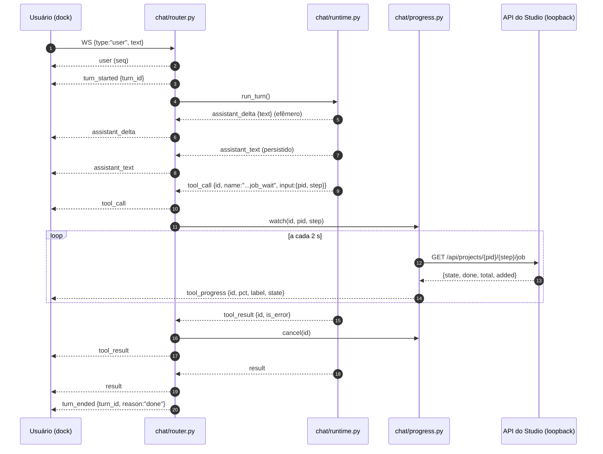
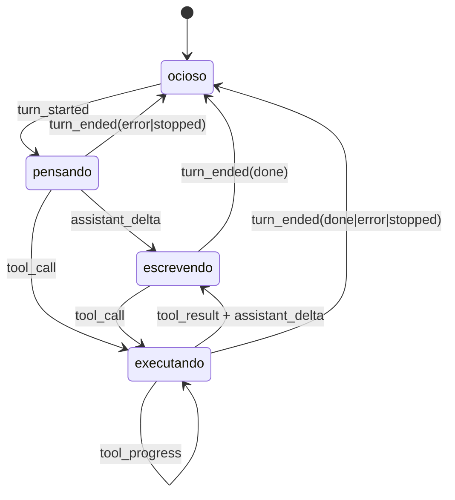

### FDD: chat-feedback `[extensão]`

Versão: 1.0
Data: 2026-09-06
Responsável: Arthur Diego (modo autônomo /dd-parallel, Wave 11)
Task-Id: ADH-OS-20260906-04
Card(s): #86 https://trello.com/c/3BTE2aj8
Wave: 11 (sub-wave 1, frente F02) · Recon compartilhado: `docs/domains/studio/recon-wave-11.md`

---

### 1. Contexto e motivação técnica

Durante um turno do assistente a tela fica muda. O único sinal de que a IA está trabalhando é o
botão Enviar desabilitado (`frontend/src/areas/chat/ChatDock.tsx:264`) e o placeholder
"Respondendo…" (`:260`), que só aparece se o campo estiver vazio. O pontinho animado da aba
(`chat.css:205`, `.chat-tab-dot.st-running`) só é renderizado quando existem 2 ou mais conversas
(`ChatDock.tsx:124`). Durante uma espera de `job_wait` (timeout default 600 s,
`studio/mcp/tools.py:140`) a tela fica estática por até dez minutos.

A causa raiz é dupla. Primeiro, `busy` é uma **heurística do cliente**: o último evento `user`
depois do último `result` (`ChatDock.tsx:188-196`). O servidor sabe exatamente quando o turno começa
e termina (`studio/chat/router.py:239-254`), mas nunca conta isso ao browser. Segundo, o protocolo
de eventos do WS não tem nenhum evento de progresso: `normalize_event`
(`studio/chat/runtime.py:86-128`) emite apenas `system`, `assistant_text`, `tool_call`,
`tool_result`, `result` e `raw`; o router acrescenta `user`, `ask`, `notify` e `show`. Não existe
`turn_started`, `turn_ended`, delta de texto nem progresso de tool.

Encaixe no HLD e nas decisões vigentes:

- HLD chat v1.0, seção "Fluxo de um turno" (passo 4: cada linha do stream vira evento normalizado,
  persistido e empurrado ao WS). Esta frente acrescenta eventos a esse fluxo, sem mudar o mecanismo.
- ADR-036 fixa o runtime (subprocess `claude -p` com `--output-format stream-json`), a lista de
  eventos normalizados (seção 2 da decisão) e registra como custo aceito: *"sem deltas de texto
  (blocos inteiros por mensagem), até adotarmos `--include-partial-messages`"*. Esta frente adota a
  flag, ou seja, exerce uma porta que a própria ADR-036 deixou aberta.
- ADR-038 (humano no laço) continua intacto: nenhum evento novo decide nada pelo usuário; o botão
  Parar é ação humana, não automação.
- ADR-008: `normalize_event` e `build_argv` continuam **puros e fakeáveis**; nenhum teste chama o
  `claude` real; o poller de progresso recebe a função de leitura por injeção.
- ADR-001: tudo continua no mesmo processo `uvicorn`; o poller de progresso é uma task asyncio da
  própria aba, não um segundo runtime.

**Atores**: o usuário no dock; o `ChatDock`/`useChatSocket` no browser; `studio/chat/router.py`
(dono do ciclo de vida do turno); `studio/chat/runtime.py` (dono da normalização do stream); a API
de jobs das etapas e de personagens, lida em loopback.

**Limites**: esta frente não muda o que o agente faz, não cria tool nova, não toca `studio/mcp/`,
não toca nenhuma etapa e não introduz rota REST nova. Ela troca "o cliente adivinha" por "o
servidor conta".

**Bloco Provides/Consumes** (copiado de `docs/domains/studio/waves/wave-11.md`, seção "Feature:
chat-feedback (F02)"):

> **Provides**
> - Eventos novos do WS `/ws/chat/{id}`: `turn_started {turn_id}`, `turn_ended {turn_id, reason}`,
>   `assistant_delta {text}` (quando o CLI suportar `--include-partial-messages`; senão ausente),
>   `tool_progress {id, pct, label}` (durante `job_wait`/`character_wait`).
> - Mapa `frontend/src/areas/chat/toolLabels.ts` (`nome da tool → rótulo humano`, cobre todo `server.py`).
> - Botão Parar no dock ligado ao `stop()` existente; linha de status `aria-live`.
> - `busy` derivado do servidor (heurística atual só como fallback de replay).
>
> **Consumes**: (candidata imediata, sub-wave 1)

---

### 2. Objetivos técnicos

- **O estado "ocupado" passa a vir do servidor.** Invariante: para todo turno iniciado existe
  exatamente um `turn_started` e exatamente um `turn_ended` com o mesmo `turn_id` no `events.jsonl`,
  inclusive nos caminhos de erro e de interrupção. Medida: `tests/test_chat_api.py` conta os pares
  nos três caminhos (sucesso, exceção, `stop`).
- **Latência do primeiro sinal visível abaixo de 300 ms.** `turn_started` é empurrado antes de
  qualquer linha do subprocess; o dock mostra a bolha "digitando" imediatamente. Medida: no teste do
  router, o `turn_started` é o primeiro evento pushado depois do `user`.
- **Texto aparece enquanto é gerado.** Com `--include-partial-messages` disponível (confirmado no
  CLI instalado, ver seção 8), `assistant_delta` chega em blocos parciais e o dock acumula numa
  bolha viva, substituída pelo `assistant_text` completo quando o bloco fecha. Sem suporte, o
  comportamento atual (blocos inteiros) permanece e só o indicador roda.
- **Toda tool pendente tem rótulo humano.** Invariante: toda tool registrada em
  `studio/mcp/server.py` tem entrada em `toolLabels.ts`. Medida: `tests/test_chat_tool_labels.py`
  compara os dois arquivos e falha quando falta rótulo.
- **Espera longa deixa de ser estática.** Enquanto a tool pendente for `job_wait` ou
  `character_wait`, o servidor emite `tool_progress` a cada 2 s com percentual quando o job informa
  `total > 0`. Medida: teste do poller com job falso passando por running → running → done.
- **O usuário pode interromper.** Botão Parar visível apenas durante o turno, ligado ao `stop()` que
  já existe (`useChatSocket.ts:60` → `router.py:208-211`), fechando em `turn_ended {reason:"stopped"}`.
- **Acessibilidade e movimento**: linha de status com `aria-live="polite"`; toda animação nova
  desligada em `prefers-reduced-motion: reduce`, seguindo o precedente de `chat.css:211`.
- **O transcript não incha.** Invariante: `assistant_delta` e `tool_progress` são efêmeros (não
  entram no `events.jsonl`); o replay via `GET /api/chats/{id}/events` continua reproduzindo o
  mesmo texto de antes, mais os pares de turno.

---

### 3. Escopo e exclusões

**Incluído**

- `studio/chat/router.py`: emissão de `turn_started`/`turn_ended` (persistidos), push de eventos
  efêmeros, ciclo de vida do poller de progresso, saneamento de aba presa em `running`.
- `studio/chat/runtime.py`: `--include-partial-messages` condicionado ao suporte do CLI instalado;
  normalização de `stream_event`/`content_block_delta` em `assistant_delta`; descarte explícito dos
  demais subtipos de `stream_event` (nunca viram `raw`).
- `studio/chat/progress.py` (novo): funções puras (`job_url_for`, `pct_of`, `should_emit`) e a task
  assíncrona que consulta o job em loopback a cada 2 s enquanto a tool está pendente.
- Frontend: `toolLabels.ts` (novo, 42 rótulos), bolha "digitando", linha de status `aria-live`,
  chips de tool com três estados e duração, resultado de sucesso colapsado, botão Parar, badge "●"
  no título da aba do navegador, CSS com `prefers-reduced-motion`.
- `useChatSocket`: separação entre eventos persistidos (array `events`) e estado vivo do turno
  (`turn`), com coalescência de deltas e fallback de heurística no replay.
- ADR-041 "Protocolo do WS do chat v2 (aditivo)" (novo) e nota de emenda em ADR-036; HLD chat para
  v1.1 (fluxo e tabela de eventos).
- Testes: pytest de `normalize_event` com `stream_event`, do par turn_started/turn_ended nos três
  caminhos, do poller com job falso, da cobertura de rótulos; vitest de status, rótulos, Parar,
  reduced-motion e replay sem `turn_started`.

**Excluído**

- Raciocínio interno do modelo. `thinking_delta` e `signature_delta` são descartados
  explicitamente, e nenhum evento novo carrega conteúdo de pensamento.
- Qualquer tool nova, mudança de catálogo do MCP ou de permissão do agente (ADR-040 intacto).
- `state_changed` e invalidação de query, que são da frente F03 (chat-sync). Esta frente apenas cria
  o ADR-041 onde a F03 acrescenta uma linha.
- Microfone e transcrição, que são de F09 (chat-audio), consumidora desta frente pelo mesmo trecho
  de composer.
- Widget de custo, `CreditsChip` no dock e `breakdown`, que são de F10.
- Markdown na bolha, que é de F01. As duas frentes tocam `Message`, em regiões distintas.
- Reconexão do WebSocket com replay incremental por `seq`, hoje inexistente e fora do card.
- Métricas com exportador, tracing distribuído e alertas: a aplicação é local e single process
  (ADR-001); a observabilidade desta frente é o transcript mais o `/trace`.

---

### 4. Fluxos detalhados e diagramas

**Fluxo principal A: turno com feedback ao vivo**

1. O usuário envia texto. `_handle_user` grava o evento `user` e dispara a task do turno
   (`router.py:218-236`, inalterado).
2. `_run_turn` gera `turn_id = uuid4().hex[:12]`, marca a aba como `running`, grava e empurra
   `turn_started {turn_id}` **antes** de tocar no subprocess.
3. O dock recebe `turn_started`: `busy` vira verdadeiro, o composer troca para "Respondendo…", os
   botões rápidos desabilitam, aparece a bolha "digitando" (três pontos) e a linha de status
   mostra "Pensando…". O título da aba do navegador ganha o prefixo "● ".
4. `runtime.run_turn` monta o argv. Se o CLI instalado suporta `--include-partial-messages`, a flag
   entra; senão o argv é o de hoje.
5. Cada linha do stdout passa por `normalize_event`:
   - `stream_event` com `event.type == "content_block_delta"` e `delta.type == "text_delta"` vira
     `assistant_delta {text}`;
   - `stream_event` com qualquer outro subtipo (`message_start`, `content_block_start`,
     `content_block_stop`, `message_delta`, `message_stop`, `input_json_delta`, `thinking_delta`)
     é descartado, devolvendo lista vazia;
   - os demais tipos continuam exatamente como hoje.
6. `_run_turn` classifica cada evento: os **persistidos** (tudo que existe hoje, mais
   `turn_started`/`turn_ended`) passam por `sessions.append_event` e ganham `seq`; os **efêmeros**
   (`assistant_delta`, `tool_progress`) vão direto ao `manager.push`, sem `seq` e sem disco.
7. O dock acumula os deltas numa bolha viva, com flush a cada 80 ms para não renderizar por
   caractere. A linha de status passa a "Escrevendo a resposta…".
8. Quando o bloco fecha, chega o `assistant_text` completo (verificado na captura real: o evento
   `assistant` continua vindo mesmo com deltas ligados). O dock descarta o buffer vivo e renderiza a
   bolha definitiva. Não há texto duplicado.
9. Chega o `result`. `_run_turn` grava e empurra `turn_ended {turn_id, reason:"done"}` logo depois,
   marca a aba como `idle`, e o dock volta ao estado ocioso (badge "●" removido do título).

**Fluxo principal B: tool pendente e job longo**

1. O stream traz `tool_call {id, name, input}`. O dock cria um chip com spinner e o rótulo humano de
   `toolLabels.ts`; a linha de status mostra o mesmo rótulo (por exemplo "Buscando referências no
   Pinterest…").
2. Se `name` for `mcp__studio__job_wait` ou `mcp__studio__character_wait`, `_run_turn` abre uma task
   de progresso para aquele `id`, com a URL derivada do input (`/api/projects/{pid}/{step}/job` ou
   `/api/characters/{cid}/job`).
3. A task consulta a URL imediatamente e depois a cada 2 s. Cada leitura vira
   `tool_progress {id, pct, label, state}`, empurrado apenas quando `pct` ou `state` mudou, ou a cada
   10 s como batimento.
4. O dock atualiza o chip e a linha de status: "Aguardando geração (42 %)…". Sem `total` conhecido, o
   percentual é omitido e o texto fica "Aguardando geração…" com o `label` do servidor como detalhe.
5. Chega `tool_result {id, is_error}`. A task de progresso do mesmo `id` é cancelada. O chip vira
   ✓ (sucesso) ou ✗ (erro) e ganha a duração; o conteúdo de sucesso fica colapsado atrás do chip
   (hoje é simplesmente descartado, `ChatDock.tsx:297`) e o de erro continua visível como hoje.

**Fluxo principal C: interromper o turno**

1. Durante o turno o dock mostra o botão Parar (só durante o turno).
2. Clique chama `stop()` (`useChatSocket.ts:60`), o router cancela a task (`router.py:208-211`).
3. O branch `CancelledError` grava o `notify` "Turno interrompido." que já existe, grava e empurra
   `turn_ended {turn_id, reason:"stopped"}`, marca a aba como `idle` e propaga o cancelamento.
4. Todas as tasks de progresso abertas para aquele turno são canceladas no `finally`.

**Fluxos alternativos e exceções**

- **CLI sem suporte a partials.** `runtime` não passa a flag; nenhum `assistant_delta` chega; o dock
  mantém a bolha "digitando" até o primeiro `assistant_text`. Todo o restante (status, chips, Parar,
  progresso) funciona igual.
- **Turno falha com exceção.** O branch `except Exception` de hoje grava `result {is_error}`; a
  frente acrescenta `turn_ended {turn_id, reason:"error"}` e a aba vai para `error`.
- **Turno termina sem `result`.** `run_turn` já sintetiza um `result` de erro
  (`runtime.py:171-172`); o `turn_ended` é emitido do mesmo jeito, com `reason:"error"`.
- **Replay de conversa antiga (sem `turn_started`).** O dock detecta que o transcript não tem nenhum
  `turn_started` e cai na heurística atual (último `user` depois do último `result`).
- **Aba presa em `running`** (servidor reiniciado no meio de um turno). Duas defesas: (a)
  `GET /api/chats` marca como `idle` qualquer aba com status `running` sem task viva em `_turns`;
  (b) no primeiro render após o replay, se existe turno aberto no transcript e o status da aba não é
  `running`, o dock marca aquele `turn_id` como obsoleto e o ignora.
- **Job inacessível.** Se a leitura do job falhar 3 vezes seguidas, a task de progresso encerra em
  silêncio; o chip continua no estado pendente até o `tool_result`. Nenhum erro é mostrado ao
  usuário: progresso é enfeite, não contrato de negócio.
- **Progresso órfão.** Se o turno acabar sem `tool_result` para um `id` observado, o `finally`
  cancela a task e o dock marca o chip como concluído sem ✓ nem ✗ ao receber `turn_ended`.

**Diagramas**





---

### 5. Contratos públicos (assinaturas, endpoints, headers, exemplos)

Todos os contratos abaixo são **aditivos**. Nenhum evento existente muda de forma e nenhum campo
existente é removido ou renomeado, então `frontend/src/api/schema.ts` **não muda** (os eventos do
WebSocket não aparecem no `/openapi.json`) e nenhuma rota REST nova é criada. Isso é verificável:
esta frente não roda `make frontend-schema`, só `make frontend-build`.

**Contrato 1: evento `turn_started`**

- Tipo: stream (evento do WebSocket `/ws/chat/{id}`)
- Origem: `studio/chat/router.py::_run_turn`
- Persistido no `events.jsonl` (tem `seq` e `ts`), portanto visível no replay
  `GET /api/chats/{id}/events`
- Semântica: o turno subiu. Emitido uma única vez por turno, antes do subprocess.

**Exemplo (linha do WS e linha do transcript)**

```json
{"seq": 12, "ts": "2026-09-06T14:03:21Z", "kind": "turn_started", "turn_id": "9f2c1a7b4e30"}
```

**Contrato 2: evento `turn_ended`**

- Tipo: stream (WebSocket) e persistido
- Origem: `studio/chat/router.py::_run_turn` nos três caminhos de saída
- Campos: `turn_id` (o mesmo do `turn_started`), `reason` em `done | error | stopped`
- Semântica de `reason`:
  - `done`: o `result` chegou (com ou sem `is_error`, o turno completou o ciclo do CLI)
  - `error`: o turno morreu por exceção do runtime ou terminou sem `result`
  - `stopped`: o usuário cancelou (botão Parar ou `POST /api/chats/{id}/stop`)

**Exemplo**

```json
{"seq": 27, "ts": "2026-09-06T14:04:02Z", "kind": "turn_ended", "turn_id": "9f2c1a7b4e30", "reason": "done"}
```

**Contrato 3: evento `assistant_delta`**

- Tipo: stream (WebSocket), **efêmero** (sem `seq`, nunca gravado no `events.jsonl`)
- Origem: `studio/chat/runtime.py::normalize_event`, a partir de
  `stream_event / content_block_delta / text_delta`
- Semântica: pedaço de texto do bloco em construção. O cliente acumula; quando chega o
  `assistant_text` do mesmo bloco, o buffer é descartado e a bolha definitiva assume. Nunca é fonte
  de verdade do transcript.
- Ausente quando o CLI instalado não suporta `--include-partial-messages`.

**Exemplo**

```json
{"kind": "assistant_delta", "turn_id": "9f2c1a7b4e30", "text": "Vou conferir o guia da campanha"}
```

**Contrato 4: evento `tool_progress`**

- Tipo: stream (WebSocket), **efêmero**
- Origem: `studio/chat/progress.py`, task por `tool_call.id` pendente de `job_wait`/`character_wait`
- Campos: `id` (o `tool_use_id` correlacionado ao `tool_call`), `pct` (0 a 100, ou `null` quando
  `total` é 0 ou ausente), `label` (texto curto do servidor, já em português), `state` (o `state` do
  job: `running | done | error | idle`)
- Cadência: primeira leitura imediata, depois a cada 2 s. Só empurra quando `pct` ou `state` mudou,
  ou a cada 10 s como batimento.

**Exemplo (etapa)**

```json
{"kind": "tool_progress", "id": "toolu_01A9", "pct": 42, "label": "Etapa refs: 13/31", "state": "running"}
```

**Exemplo (personagem, sem total conhecido)**

```json
{"kind": "tool_progress", "id": "toolu_01B4", "pct": null, "label": "Personagem c3f1: gerando", "state": "running"}
```

**Contrato 5: `studio/chat/runtime.py` (funções puras)**

```python
def build_argv(text: str, *, session_id: str, resume: bool, mcp_config: Path,
               model: str | None = None, partial: bool = False) -> list[str]: ...

def normalize_event(line: str) -> list[dict]: ...

def supports_partial(_probe=None) -> bool:
    """O CLI instalado aceita --include-partial-messages? Resultado cacheado no processo.

    `STUDIO_CHAT_PARTIAL=1|0` força o valor sem sondar (escape hatch e gancho de teste).
    `_probe` é injetável (ADR-008): default roda `claude --help` uma vez e procura a flag.
    """
```

- `build_argv` continua puro: `partial=True` acrescenta `--include-partial-messages` logo depois de
  `--verbose`. Quem decide o valor é `run_turn`, chamando `supports_partial()`.
- `normalize_event` continua puro e continua devolvendo lista. Comportamento novo, verificado contra
  captura real do CLI 2.1.263 (ver seção 8):

| Linha de entrada | Saída |
| --- | --- |
| `{"type":"stream_event","event":{"type":"content_block_delta","index":0,"delta":{"type":"text_delta","text":"ok"}}}` | `[{"kind":"assistant_delta","text":"ok"}]` |
| `{"type":"stream_event","event":{"type":"content_block_delta","index":1,"delta":{"type":"input_json_delta","partial_json":"{\"pid\""}}}` | `[]` |
| `{"type":"stream_event","event":{"type":"content_block_delta","index":0,"delta":{"type":"thinking_delta","thinking":"..."}}}` | `[]` (fora de escopo por decisão do card) |
| `{"type":"stream_event","event":{"type":"message_start", ...}}` | `[]` |
| `{"type":"stream_event","event":{"type":"content_block_start", ...}}` | `[]` |
| `{"type":"stream_event","event":{"type":"content_block_stop","index":0}}` | `[]` |
| `{"type":"stream_event","event":{"type":"message_delta", ...}}` | `[]` |
| `{"type":"stream_event","event":{"type":"message_stop"}}` | `[]` |
| qualquer outro `type` desconhecido | `[{"kind":"raw", ...}]` (inalterado) |

Invariante: **nenhum subtipo de `stream_event` cai em `raw`**. Com partials ligados o CLI emite
dezenas de linhas de controle por bloco; deixá-las virar `raw` inundaria o transcript e a tela.

**Contrato 6: `studio/chat/progress.py` (novo módulo)**

```python
WATCHED = {"job_wait": ..., "character_wait": ...}
POLL_S = 2.0
HEARTBEAT_S = 10.0
MAX_FALHAS = 3

def job_url_for(tool_name: str, tool_input: dict) -> str | None:
    """URL do job da tool observada, ou None se a tool não for observável.

    `mcp__studio__job_wait` + {pid, step} -> `/api/projects/{pid}/{step}/job`
    `mcp__studio__character_wait` + {cid} -> `/api/characters/{cid}/job`
    """

def pct_of(job: dict) -> int | None:
    """0..100 a partir de {done, total}; None quando total <= 0 ou ausente."""

def label_of(tool_name: str, tool_input: dict, job: dict) -> str:
    """Rótulo curto do servidor, ex.: 'Etapa refs: 13/31' ou 'Personagem c3f1: gerando'."""

def should_emit(anterior: dict | None, atual: dict, agora: float) -> bool:
    """True quando pct ou state mudou, ou quando passaram HEARTBEAT_S do último envio."""

async def watch(chat_id: str, call_id: str, url: str, push, *, fetch=None, sleep=asyncio.sleep) -> None:
    """Task por tool pendente. `fetch(url) -> dict` e `sleep` são injetáveis (ADR-008)."""
```

`job_url_for`, `pct_of`, `label_of` e `should_emit` são puras e testáveis sem rede. `watch` recebe
`fetch` por injeção; o default lê a API em loopback com `httpx.AsyncClient`, usando a mesma base que
o MCP usa (`STUDIO_URL` ou `PORT`, `studio/chat/runtime.py:40-41`), coerente com ADR-037 (falar com
a própria API por HTTP, nunca importar serviço de etapa).

**Contrato 7: `frontend/src/areas/chat/toolLabels.ts` (novo)**

```ts
/** Rótulo humano de uma tool do MCP, para a linha de status e o chip. */
export function toolLabel(name: string | undefined): string;
/** Mapa cru nome curto -> rótulo (exportado para o teste de cobertura). */
export const TOOL_LABELS: Record<string, string>;
```

- Entrada aceita o nome cru (`mcp__studio__refs_search`) ou o curto (`refs_search`).
- Fallback para tool desconhecida: `studio.<nome>`, o mesmo texto que `shortTool` produz hoje
  (`ChatDock.tsx:516-519`), de modo que uma tool nova nunca quebra a tela.
- Cobertura obrigatória das 42 tools de `studio/mcp/server.py`:

| Tool | Rótulo |
| --- | --- |
| `projects` | Listando as campanhas |
| `project` | Lendo a campanha |
| `guide` | Conferindo o guia da campanha |
| `guide_step` | Conferindo a etapa |
| `steps` | Consultando o método do curso |
| `doctor` | Checando as ferramentas |
| `job` | Checando o trabalho em andamento |
| `job_wait` | Aguardando geração |
| `api_get` | Consultando dados do Studio |
| `refs_suggest_terms` | Sugerindo termos de busca |
| `refs_search` | Buscando referências no Pinterest |
| `refs_pick` | Aguardando você escolher as referências |
| `mood_prompt` | Escrevendo o prompt de vibe |
| `mood_generate` | Gerando o mood board |
| `mood_pick` | Aguardando você escolher o mood |
| `base_prompt` | Escrevendo o prompt da imagem base |
| `base_generate` | Gerando a imagem base |
| `base_pick` | Aguardando você escolher a imagem base |
| `storyboard_local_generate` | Gerando keyframes no motor local |
| `storyboard_pick` | Aguardando você escolher os keyframes |
| `storyboard_scenes` | Lendo as cenas do storyboard |
| `animate_shots` | Listando os shots para animar |
| `animate_generate` | Animando o take |
| `music_generate` | Gerando a trilha |
| `edit_render` | Renderizando a montagem |
| `export_render` | Exportando os formatos finais |
| `export_qa` | Rodando o QA do export |
| `portfolio` | Lendo o portfólio |
| `ui_choose_one` | Aguardando sua escolha |
| `ui_confirm` | Aguardando sua confirmação |
| `ui_notify` | Avisando você |
| `ui_show` | Mostrando as imagens |
| `ui_open` | Aguardando você concluir na tela |
| `character_list` | Listando os personagens |
| `character_create` | Criando o personagem |
| `character_explore` | Explorando variações do personagem |
| `character_pick` | Aguardando você escolher o personagem |
| `character_sheet` | Gerando o character sheet |
| `character_wait` | Aguardando a geração do personagem |
| `character_apply` | Aplicando o personagem à campanha |
| `character_bind_soul` | Treinando o Soul ID |
| `character_score` | Medindo a semelhança do personagem |

**Contrato 8: `GET /api/chats` (comportamento aditivo, sem mudança de shape)**

- Rota existente (`studio/chat/router.py:81-83`), resposta idêntica em forma.
- Comportamento novo: antes de listar, qualquer aba com `status == "running"` que **não** tenha task
  viva em `_turns` é corrigida para `idle` (aba órfã de reinício do servidor). Sem isso, o pontinho
  da aba e o `busy` derivado do transcript ficariam presos para sempre.

**Exemplo de resposta (inalterado)**

```json
[{"id": "0c2f...", "title": "Campanha X", "pid": "p1", "turns": 4, "status": "idle",
  "created": "2026-09-06T13:00:00Z", "updated": "2026-09-06T14:04:02Z"}]
```

**Contrato 9: `GET /api/chats/{id}/trace` (campos aditivos)**

- Rota existente (`router.py:118-143`), sem `response_model` declarado, logo sem impacto na guarda de
  drift do `schema.ts`.
- Campos novos, derivados dos pares de turno no transcript: `turnos_iniciados`,
  `turnos_interrompidos`, `duracao_media_s` (média em segundos entre `turn_started` e o
  `turn_ended` de mesmo `turn_id`, calculada pelos `ts`; ausente vira 0).

**Exemplo de resposta**

```json
{"chat_id": "0c2f...", "title": "Campanha X", "pid": "p1", "turns": 4, "events": 132,
 "tools": {"guide": 3, "refs_search": 1}, "usd_estimado": 0.4213, "erros": 0,
 "turnos_iniciados": 4, "turnos_interrompidos": 1, "duracao_media_s": 37.5}
```

**Limites e tempos**

- `assistant_delta`: sem limite de taxa no servidor; a coalescência é do cliente (flush de 80 ms).
- `tool_progress`: no máximo 1 evento a cada 2 s por tool observada, mais o batimento de 10 s.
- Vida da task de progresso: encerra no `tool_result` correspondente, no fim do turno, após
  `MAX_FALHAS` leituras com erro, ou no teto de `timeout` do input mais 30 s (limite duro de 1800 s).
- Versionamento: os eventos são aditivos. Cliente antigo que receba `assistant_delta` ou
  `tool_progress` cai no `default: return null` do `Message` e ignora, sem quebrar.

---

### 6. Erros, exceções e fallback

**Matriz de erros**

| Condição | Tratamento | Notas |
| --- | --- | --- |
| CLI sem `--include-partial-messages` | `supports_partial()` devolve falso, a flag não entra no argv, nenhum `assistant_delta` chega | Dock mantém a bolha "digitando" até o `assistant_text` |
| Sonda `claude --help` falha ou demora | Trata como sem suporte (falso), cacheado; nunca lança | A sonda tem timeout curto e roda uma vez por processo |
| `stream_event` com formato inesperado | `normalize_event` devolve `[]` | Nunca vira `raw`; nunca derruba o turno |
| Turno morre por exceção | `result {is_error}` (comportamento atual) mais `turn_ended {reason:"error"}`, aba em `error` | Aba nunca fica presa em `running` |
| Turno termina sem `result` | `run_turn` sintetiza o `result` de erro (já existe) e o router emite `turn_ended {reason:"error"}` | Invariante do par preservado |
| Usuário clica Parar | `CancelledError`: `notify` "Turno interrompido." (já existe) mais `turn_ended {reason:"stopped"}` | Botão some ao receber o `turn_ended` |
| `stop` sem turno em andamento | `POST /stop` devolve `{"stopped": false}` (atual); nenhum evento novo | Botão não é renderizado nesse estado |
| Leitura do job falha (rede, 404, 500) | Conta falha; após 3 seguidas a task encerra em silêncio | Progresso é indicação, nunca bloqueia o turno |
| Job sem `total` | `pct = null`; status mostra o rótulo sem percentual | Evita percentual inventado |
| `tool_call` de `job_wait` sem `pid`/`step` no input | `job_url_for` devolve `None`; nenhuma task é aberta | Guarda contra input malformado do modelo |
| Aba presa em `running` após reinício | `GET /api/chats` sanea para `idle`; o dock marca o turno aberto como obsoleto no primeiro render | Duas defesas independentes |
| WS cai no meio do turno | Comportamento atual (sem reconexão). Ao reabrir, o replay traz `turn_started`/`turn_ended` do disco | Reconexão robusta segue fora de escopo |
| Transcript antigo sem `turn_started` | Heurística atual (`user` depois de `result`) assume | Critério de aceite explícito |
| `tool_result` sem `tool_call` correspondente | Chip órfão não é renderizado; o `tool_result` de erro continua aparecendo como hoje | Correlação por `id`, ausência é tolerada |

**Estratégias de resiliência**

- Timeouts: sonda do `--help` com teto curto; leitura de job com timeout de 5 s por requisição; task
  de progresso com teto duro de 1800 s.
- Retries: nenhuma retentativa imediata; o próprio ciclo de 2 s é a retentativa, limitada a 3 falhas
  seguidas.
- Backoff e circuit breaker: não se aplicam (loopback, single process, ADR-001). O contador de falhas
  faz o papel de disjuntor.
- Cancelamento: todas as tasks de progresso do turno são canceladas no `finally` de `_run_turn`,
  inclusive no caminho de `CancelledError`.

**Política de fallback**

Feedback é **enfeite honesto**: qualquer falha na camada de progresso degrada para o comportamento de
hoje (indicador genérico e blocos inteiros) e nunca impede o turno de rodar nem de terminar.

**Invariantes**

1. Para todo `turn_started` gravado existe exatamente um `turn_ended` com o mesmo `turn_id`, em
   qualquer caminho de saída.
2. `assistant_delta` e `tool_progress` nunca são gravados no `events.jsonl`.
3. O texto reconstruído por deltas é sempre substituído pelo `assistant_text` do bloco. O transcript
   persistido continua sendo a única fonte de verdade do que foi dito.
4. Nenhum subtipo de `stream_event` vira `raw`.
5. `normalize_event` e `build_argv` continuam puros (sem I/O, sem relógio, sem rede).
6. Nenhum evento novo decide por conta própria: escolha e gasto continuam com o usuário (ADR-038).

---

### 7. Observabilidade

O produto é local e single process (ADR-001); não há coletor de métricas nem tracing distribuído, e
introduzir um seria desvio arquitetural. A observabilidade desta frente é o transcript mais o
endpoint de trace que já existe.

**Métricas (derivadas, expostas em `GET /api/chats/{id}/trace`)**

- `turnos_iniciados`: contagem de `turn_started` no transcript.
- `turnos_interrompidos`: contagem de `turn_ended` com `reason == "stopped"`.
- `duracao_media_s`: média das durações de turno pelos `ts` dos pares.
- As métricas existentes (`tools`, `usd_estimado`, `erros`) continuam iguais.

**Logs**

- Transcript `STATE_DIR/chats/<id>/events.jsonl`, uma linha JSON por evento persistido, com `ts` e
  `seq` (formato atual). Os campos novos são `kind`, `turn_id` e `reason`.
- Log da aplicação (stderr do uvicorn): uma linha por task de progresso encerrada por falha
  (`chat.progress: desisti de acompanhar <url> após 3 falhas`), em nível de aviso. Nada de conteúdo
  de conversa em log de aplicação.
- Dado sensível: `turn_id` é um identificador opaco; `assistant_delta` não é gravado; o `label` de
  `tool_progress` contém apenas `pid`, `step` ou `cid` e contadores, nunca prompt.

**Tracing**

- Não se aplica. O par `turn_started`/`turn_ended` no transcript funciona como o span do turno, e o
  par `tool_call`/`tool_result` como o span da tool, ambos correlacionados por id, que é exatamente o
  que o `/trace` lê.

**Painéis e alertas mínimos**

- O painel é o próprio dock: linha de status, chips com duração e badge "●" no título da aba.
- Verificação manual registrada na PR (ADR-036 já exige isso, porque o CI nunca exercita o `claude`
  real): um turno real com `refs_search` e `job_wait`, com captura de tela mostrando a linha de
  status com percentual e o botão Parar.

---

### 8. Dependências e compatibilidade

| Componente | Versão mínima | Observações |
| --- | --- | --- |
| Claude Code CLI (`claude`) | 2.1.x com `--include-partial-messages` | **Verificado nesta máquina**: `claude --version` = `2.1.263 (Claude Code)`; `claude --help` lista `--include-partial-messages  Include partial message chunks as they arrive (only works with --print and --output-format=stream-json)`. Captura real de um turno com a flag confirmou os subtipos `message_start`, `content_block_start`, `content_block_delta/text_delta`, `content_block_stop`, `message_delta`, `message_stop`, e que o evento `assistant` com o bloco completo continua sendo emitido. |
| Python | 3.12 | Sem dependência nova |
| `httpx` | já em uso (`studio/mcp/client.py:12`) | O poller usa `httpx.AsyncClient` em loopback |
| FastAPI/Starlette WebSocket | atual | Sem mudança de transporte |
| React + TypeScript estrito | atual | Sem dependência de frontend nova (F01 é quem adiciona `react-markdown`) |
| Vitest (jsdom) | atual | Testes de `ChatDock`, `toolLabels` e `useChatSocket` |

**Garantias de compatibilidade**

- Protocolo do WS **aditivo**: nenhum evento existente muda de forma. Um dock antigo ignora os
  eventos novos (o `switch` de `Message` cai no `default`).
- Replay `GET /api/chats/{id}/events` continua funcionando: os transcripts antigos não têm os eventos
  novos e caem no fallback heurístico; os novos ganham os pares de turno e nada mais.
- `frontend/src/api/schema.ts` **não muda** (nenhuma rota ou modelo Pydantic novo). `studio/web/dist/`
  muda e precisa ser commitado (ADR-031, guarda de drift do CI).
- ADR-036 permanece válido; ganha uma nota de emenda apontando para o ADR-041, que passa a ser a
  lista viva de eventos do WS.
- Contrato de arquivo com F09 (chat-audio): o composer e o retorno de `useChatSocket` mudam aqui
  primeiro; F09 rebaseia por cima. Contrato com F01: `Message` é tocado nas duas frentes em regiões
  distintas (F01 no corpo da bolha, F02 nos chips e no status).

---

### 9. Critérios de aceite técnicos

**Funcionais**

1. Ao enviar uma mensagem, uma bolha "digitando" (três pontos) aparece em menos de 300 ms e some no
   primeiro texto do assistente.
2. A linha de status abaixo das mensagens mostra "Pensando…" sem tool pendente, o rótulo humano da
   tool enquanto ela está pendente e "Aguardando geração (NN %)…" durante `job_wait` com `total`
   conhecido.
3. Com o CLI que suporta partials, o texto do assistente aparece progressivamente e, ao fechar o
   bloco, a bolha final é idêntica ao `assistant_text` (nenhuma duplicação, nenhum caractere perdido).
4. Com o suporte desligado (`STUDIO_CHAT_PARTIAL=0`), o turno funciona igual ao de hoje, apenas com o
   indicador e o status.
5. Cada `tool_call` vira um chip com três estados: spinner enquanto pendente, ✓ quando o
   `tool_result` correspondente chega sem erro, ✗ quando chega com erro; o chip mostra a duração em
   segundos. O conteúdo de `tool_result` de sucesso fica colapsado (hoje é descartado) e o de erro
   continua visível.
6. O botão Parar aparece somente entre `turn_started` e `turn_ended`; clicá-lo produz o `notify`
   "Turno interrompido." e um `turn_ended {reason:"stopped"}`, e o composer volta a aceitar texto.
7. O título da aba do navegador ganha o prefixo "● " enquanto houver turno em andamento em qualquer
   aba do dock e volta ao original quando todos terminam.
8. `toolLabels.ts` cobre as 42 tools de `studio/mcp/server.py`; tool desconhecida cai no fallback
   `studio.<nome>` sem quebrar a renderização.

**Acessibilidade**

9. A linha de status tem `aria-live="polite"` e `role="status"`, e seu texto muda no máximo a cada
   2 s (a cadência do `tool_progress`), para não inundar o leitor de tela.
10. Com `prefers-reduced-motion: reduce`, a bolha "digitando" e o spinner do chip param de animar e
    passam a um estado estático legível (texto e ponto fixo), mantendo a informação.

**Resiliência e replay**

11. Nos três caminhos de saída (sucesso, exceção, `stop`) o `events.jsonl` termina com exatamente um
    `turn_ended` para o `turn_started` correspondente.
12. Uma conversa antiga (transcript sem `turn_started`) reabre com o `busy` correto pela heurística
    e sem erro no console.
13. Uma aba com `status: "running"` sem task viva volta a `idle` na primeira chamada de
    `GET /api/chats`, e o dock não fica preso em "Respondendo…".
14. `events.jsonl` não contém nenhuma linha com `kind` igual a `assistant_delta` ou `tool_progress`
    depois de um turno completo com deltas e progresso.

**Pureza e testes (ADR-008)**

15. `pytest` cobre: `normalize_event` para todos os subtipos de `stream_event` da tabela do contrato
    5; `build_argv` com e sem `partial`; o par turn_started/turn_ended nos três caminhos;
    `job_url_for`/`pct_of`/`should_emit`; e a task `watch` com `fetch` e `sleep` falsos passando por
    running → running → done.
16. `tests/test_chat_tool_labels.py` falha se alguma tool de `server.py` não tiver rótulo.
17. `vitest` cobre: linha de status por estado, rótulo de tool, botão Parar (aparece, chama `stop`,
    some), reduced-motion e replay sem `turn_started`.
18. Nenhum teste chama o binário `claude`. `make verify` e `make frontend-verify` verdes;
    `studio/web/dist/` reconstruído e commitado.

**Cross-feature (Wave 11)**

19. `[cross-feature]` O ADR-041 criado por esta frente recebe a linha `state_changed` da F03
    (chat-sync) sem reescrita: a tabela de eventos é aditiva e ordenada por nome, e o texto da
    decisão não enumera os eventos fora dela.
20. `[cross-feature]` A API pública de `useChatSocket` (`{events, connected, send, answer, stop,
    turn, busy}`) é o contrato que F09 (chat-audio) consome no mesmo trecho de composer; nomes não
    mudam depois desta frente.
21. `[cross-feature]` Frentes da wave que registrarem tools novas em `studio/mcp/server.py` (F06,
    F07, F08, F12) acrescentam o rótulo correspondente em `toolLabels.ts`; o teste de cobertura é o
    mecanismo que cobra isso na integração.

---

### 10. Riscos e mitigação

### Risco 1: enxurrada de eventos com partials ligados

- **Probabilidade:** alta
- **Impacto:** o WS entrega dezenas de linhas por bloco; o React re-renderiza por caractere e o dock
  engasga em respostas longas.
- **Mitigação:**
    - Descartar todos os subtipos de `stream_event` que não sejam `text_delta` no servidor, dentro da
      função pura.
    - Não persistir delta no `events.jsonl` (nem I/O de disco, nem `seq`).
    - Acumular os deltas num `ref` no cliente com flush a cada 80 ms, fora do array `events`.
    - Renderizar a bolha viva como um componente isolado, para não re-renderizar o log inteiro.
- **Plano de contingência:** `STUDIO_CHAT_PARTIAL=0` desliga os partials sem redeploy, e o dock volta
  ao comportamento de blocos inteiros com o indicador.

### Risco 2: o par turn_started/turn_ended se desequilibra e o dock trava em "Respondendo…"

- **Probabilidade:** média
- **Impacto:** o usuário não consegue mais enviar mensagem naquela aba; pior que o estado atual.
- **Mitigação:**
    - Emitir o `turn_ended` num `finally` do `_run_turn`, não nos ramos, para cobrir qualquer saída.
    - Saneamento em `GET /api/chats` para abas `running` sem task viva.
    - Regra de turno obsoleto no primeiro render do dock após o replay.
    - Teste explícito dos três caminhos de saída.
- **Plano de contingência:** o fallback heurístico permanece no código e assume quando o turno aberto
  é marcado obsoleto, então o pior caso é o comportamento de hoje.

### Risco 3: shape de `stream_event` mudar em versão futura do CLI

- **Probabilidade:** média
- **Impacto:** os deltas somem silenciosamente (regressão invisível) ou linhas viram ruído.
- **Mitigação:**
    - `supports_partial()` sonda o `--help` da versão instalada, não presume.
    - Tabela de subtipos com "desconhecido vira lista vazia", nunca `raw`.
    - Testes com as linhas canônicas capturadas da versão 2.1.263, guardadas como fixture.
    - A bolha "digitando" e o status não dependem de delta: com zero delta a UI continua honesta.
- **Plano de contingência:** desligar por env e abrir card de atualização de fixture.

### Risco 4: leitura de job em loopback conflitar com o polling das telas

- **Probabilidade:** baixa
- **Impacto:** duas leituras a cada 2 s do mesmo endpoint de job; carga desprezível, mas o registro
  em memória (ADR-006) é lido por dois lados.
- **Mitigação:**
    - Só leitura (`GET`), nunca escrita; o `JobRegistry.status` é um dicionário em memória.
    - Uma única task por `tool_call.id`, cancelada no `tool_result`.
    - Teto de 3 falhas seguidas e teto duro de tempo.
- **Plano de contingência:** aumentar `POLL_S` para 4 s (constante única no módulo).

### Risco 5: conflito de rebase em `ChatDock.tsx` com F01, F03 e a sub-wave 2

- **Probabilidade:** alta
- **Impacto:** retrabalho na integração; `wave-11.md` já prevê o conflito.
- **Mitigação:**
    - Concentrar a lógica nova em arquivos novos (`toolLabels.ts`) e em `useChatSocket.ts`, deixando
      no `ChatDock.tsx` apenas a renderização.
    - Não renomear nada existente; só acrescentar casos ao `switch` de `Message` e blocos novos no
      final dos componentes.
    - Não tocar em `chat.css` fora do bloco novo, no fim do arquivo.
- **Plano de contingência:** ordem de integração já definida na wave (F04 → F05 → F01 → F03 → F02);
  `studio/web/dist/` sempre regenerado, nunca resolvido à mão.

### Risco 6: o teste de cobertura de rótulos quebrar branches de outras frentes

- **Probabilidade:** média
- **Impacto:** F06, F07, F08 e F12 registram tools novas e o pytest reprova nelas.
- **Mitigação:**
    - Mensagem de falha explícita, dizendo qual tool falta e qual arquivo editar.
    - Registro do combinado em `wave-11.md` e nas pendências deste FDD (seção 12).
- **Plano de contingência:** se a fricção se mostrar cara na integração, o teste vira aviso em vez de
  falha, mantendo o fallback da UI intacto.

---

### 11. Sequenciamento de implementação (Build Order)

| Ordem | Etapa | Depende de | Componentes/arquivos prováveis | Critérios que fecha (da seção 9) |
| --- | --- | --- | --- | --- |
| 1 | ADR-041 (protocolo do WS v2, aditivo) e nota de emenda em ADR-036 | - | `docs/adrs/generated/STUDIO/ADR-041-protocolo-do-ws-do-chat-v2.md` (novo), `docs/adrs/generated/STUDIO/ADR-036-runtime-de-chat-via-claude-cli-em-processo-terceiro-modo.md` | 19 |
| 2 | Ciclo de vida do turno no servidor (`turn_started`/`turn_ended` no `finally`, saneamento de aba órfã, campos novos do `/trace`) | 1 | `studio/chat/router.py`, `tests/test_chat_api.py` | 6, 11, 13 |
| 3 | Streaming de texto (sonda do CLI, argv, `stream_event` na função pura) | 1 | `studio/chat/runtime.py`, `tests/test_chat_runtime.py` | 3, 4, 15 |
| 4 | Progresso de job (módulo novo, funções puras e task) e ligação no router | 2 | `studio/chat/progress.py` (novo), `studio/chat/router.py`, `tests/test_chat_progress.py` | 2, 15 |
| 5 | Mapa de rótulos e teste de cobertura | - | `frontend/src/areas/chat/toolLabels.ts` (novo), `frontend/src/areas/chat/toolLabels.test.ts` (novo), `tests/test_chat_tool_labels.py` (novo) | 8, 16, 21 |
| 6 | Estado vivo do turno no cliente (`turn`, `busy` do servidor, coalescência de delta, fallback de replay, `stop` exposto) | 2, 3, 4 | `frontend/src/areas/chat/useChatSocket.ts`, `frontend/src/areas/chat/types.ts`, `frontend/src/areas/chat/useChatSocket.test.ts` | 1, 3, 12, 14, 20 |
| 7 | Interface do dock (bolha digitando, linha de status `aria-live`, chips com estado e duração, resultado colapsado, botão Parar, badge "●") | 5, 6 | `frontend/src/areas/chat/ChatDock.tsx`, `frontend/src/areas/chat/ChatDock.test.tsx` (novo) | 1, 2, 5, 6, 7, 9, 17 |
| 8 | Estilos e movimento (bloco novo no fim do CSS, `prefers-reduced-motion`) | 7 | `frontend/src/areas/chat/chat.css` | 10 |
| 9 | Fechamento: titularidade de núcleo, build do bundle, HLD chat v1.1, verificação manual do turno real | 2 a 8 | `tests/test_adr010_fronteira_nucleo.py`, `studio/web/dist/`, `docs/domains/chat/hld.md` | 18 |

**Titularidade de núcleo (ADR-010/031/032)**

A frente registra a branch `feature/adh-os-20260906-04-chat-feedback` em `TITULARES_DO_NUCLEO`
(`tests/test_adr010_fronteira_nucleo.py:72`) com os prefixos **`frontend/`** e **`studio/web/`**, e
apenas esses. `studio/chat/` não está em `NUCLEO_PREFIXOS`. Nenhuma etapa, nenhum plugin,
`studio/app.py`, `steps.py`, `config.py`, `higgsfield.py` e `etapas/__init__.py` intocados.
`frontend/src/api/schema.ts` não muda (nenhuma rota nem modelo Pydantic novo); `studio/web/dist/` é
reconstruído com `make frontend-build` e commitado.

**Contagem para a decisão direta versus SDD**

- Contratos (seção 5): 9
- Fluxos principais (seção 4): 3
- Arquivos previstos: 20

Regra da wave: direta somente se contratos ≤ 3 **e** 1 fluxo **e** arquivos ≤ 8. Os três limites são
ultrapassados, logo esta frente vai por **SDD/Compozy** (`cy-create-tasks` mais
`compozy tasks run`, com reconciliação), usando a tabela acima como recorte inicial das tasks.

---

### 12. Decisões auto-aceitas e pendências

**Decisões auto-aceitas (modo batch)**

1. `[auto-aceito: eventos efêmeros não entram no events.jsonl, porque o texto do delta é integralmente
   reemitido pelo assistant_text e o progresso é transitório; persistir duplicaria o transcript e
   quebraria o replay]` `assistant_delta` e `tool_progress` são pushados sem `seq` e sem gravação.
   Só `turn_started` e `turn_ended` são persistidos, que é o que o replay precisa para derivar `busy`.
2. `[auto-aceito: turn_ended emitido no finally e não nos ramos, porque é a única forma de garantir o
   invariante do par em todos os caminhos de saída]` inclui o caminho de `CancelledError`, que hoje
   já faz push dentro do `except`.
3. `[auto-aceito: reason limitado a done|error|stopped, o conjunto mínimo que a UI precisa distinguir;
   ampliar depois é aditivo]`.
4. `[auto-aceito: suporte a partials sondado com `claude --help` uma vez por processo e cacheado, com
   env STUDIO_CHAT_PARTIAL como escape hatch, porque o card pede verificação de suporte e a sonda é
   mais barata que uma dependência de versão fixa]` verificação já feita nesta máquina: CLI 2.1.263
   suporta a flag.
5. `[auto-aceito: thinking_delta e signature_delta descartados, porque o card coloca o raciocínio
   interno do modelo fora de escopo]`.
6. `[auto-aceito: subtipos desconhecidos de stream_event devolvem lista vazia em vez de raw, porque o
   comportamento atual (raw) inundaria transcript e tela com linhas de controle]` mudança de
   comportamento restrita ao tipo `stream_event`, que hoje não existe no fluxo.
7. `[auto-aceito: o poller lê o job pela API em loopback com httpx, e não importando o serviço da
   etapa, para preservar a fronteira de plugin e o espírito do ADR-037]`.
8. `[auto-aceito: tool_progress inclui `state` além de `{id, pct, label}` do card, porque sem ele o
   cliente não distingue running de done/error ao encerrar o chip]` acréscimo aditivo ao contrato do
   card.
9. `[auto-aceito: duração do chip calculada a partir dos ts dos eventos persistidos (resolução de 1 s),
   porque funciona igual ao vivo e no replay e não exige campo novo]`.
10. `[auto-aceito: saneamento de aba presa em running feito em GET /api/chats, e não como efeito de
    import na subida, para não escrever em disco durante os testes]` comportamento aditivo, resposta
    inalterada.
11. `[auto-aceito: campos novos no /trace (turnos_iniciados, turnos_interrompidos, duracao_media_s)
    porque a seção 7 exigia observabilidade e a rota não tem response_model, logo não há drift de
    schema]`.
12. `[auto-aceito: badge "●" no título do navegador implementado dentro do ChatDock, sem arquivo novo,
    para limitar a superfície de conflito de rebase com F01/F03/F09]`.
13. `[auto-aceito: rótulos das 42 tools escritos em português no gerúndio, sem reticências no mapa;
    as reticências são acrescentadas pela linha de status, para o mesmo rótulo servir ao chip]`.
14. `[auto-aceito: coalescência de deltas a 80 ms no cliente, valor conservador que dá cerca de 12
    quadros por segundo de texto sem custo perceptível de render]`.
15. `[auto-aceito: cadência do poller em 2 s, exatamente o valor pedido no card e o mesmo já usado por
    job_wait (tools.py:140) e character_wait (actions.py:324)]`.
16. `[auto-aceito: prefers-reduced-motion aplicado como no precedente chat.css:211, desligando
    animação e mantendo o estado legível, em vez de esconder o indicador]`.

**Pendências para o gate em lote**

- **P1 (coordenação entre frentes, não é divergência de contrato):** ADR-041 "Protocolo do WS do chat
  v2 (aditivo)" é **compartilhado** com a F03 (chat-sync). Esta frente **cria** o ADR com a tabela de
  eventos (`turn_started`, `turn_ended`, `assistant_delta`, `tool_progress`) e a F03 **acrescenta uma
  linha** (`state_changed`). Na integração, o ADR não deve ser recriado nem renumerado pela F03;
  conflito de rebase na tabela é de inserção, resolvido acrescentando a linha. O número ADR-041 é o
  próximo livre segundo o recon (seção 0.1) e é disputado também pela F09, que o recon marca como
  "ADR-041 recomendado": se as duas frentes precisarem de ADR próprio, a F09 usa ADR-042. Registrado
  aqui para decisão do gate.
- **P2 (compromisso que atravessa a wave):** o teste `tests/test_chat_tool_labels.py` obriga qualquer
  frente que registre tool nova em `studio/mcp/server.py` (F06, F07, F08, F12) a acrescentar o rótulo
  em `frontend/src/areas/chat/toolLabels.ts`. É o mecanismo que mantém a promessa "cobre todo
  `server.py`" do card, mas cria fricção de integração. Alternativa registrada: rebaixar para aviso.
- **P3 (mudança de comportamento em função existente, dentro do escopo do card):** `normalize_event`
  deixa de mandar `stream_event` para `raw`. Como hoje o flag de partials não é usado, nenhuma linha
  desse tipo chega ao normalizador em produção, logo o impacto real é nulo; ainda assim é uma
  alteração de comportamento de uma função pura descrita em ADR-036, e por isso entra no ADR-041.
- **P4 (verificação manual, ADR-036 já exige):** o CI nunca exercita o `claude` real. A prova ponta a
  ponta (um turno com `refs_search` e `job_wait`, mostrando status com percentual e o botão Parar)
  precisa ser feita à mão e anexada à PR.
- **Nada aqui divide contrato publicado**: `frontend/src/api/schema.ts` não muda, nenhuma rota REST é
  criada ou alterada em forma, e nenhum campo existente é removido ou renomeado.
