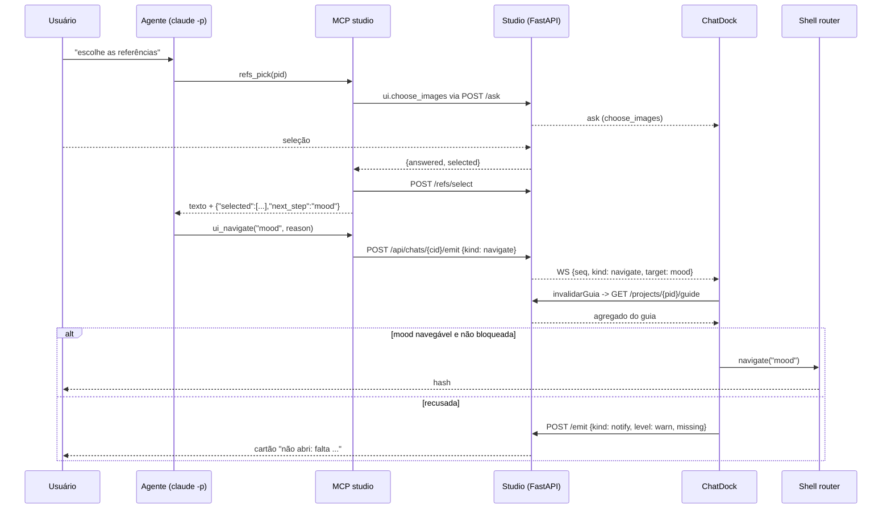

### FDD: chat-navigate `[extensão]`

Versão: 1.0
Data: 2026-09-06
Responsável: Arthur Diego (modo autônomo /dd-parallel, Wave 11)
Task-Id: ADH-OS-20260906-10
Card(s): https://trello.com/c/YNf9Rcwj (#88)

---

### 1. Contexto e motivação técnica

**Problema técnico.** O assistente conduz a campanha inteira pelas tools `mcp__studio__*` (ADR-040),
mas não consegue levar a tela junto. Hoje o único jeito de trocar de etapa a partir do chat é o
widget `open` (`ui.open_screen`, `studio/mcp/ui.py:68-77`), que bloqueia o turno e exige dois cliques
do usuário: "Abrir a tela" (`ChatDock.tsx:474`) e depois "Concluí" (`:477`). O laço `open → done`
previsto no ADR-038 §Consequências nunca fecha sozinho, porque **nenhuma tela publica conclusão**.
O resultado prático relatado pelo dono: ele confirma as fotos de referência no chat e a tela continua
na etapa 1.

Somam-se quatro defeitos de contorno levantados no recon §1.3:

1. `ui.open_screen` envia `params` (`ui.py:77`), mas o `AskCard` ignora e o registro da tool não
   expõe o parâmetro (`server.py:163-165`). O ADR-038 §Consequências promete "a tela alvo aceita
   parâmetros de abertura"; o parâmetro morre no caminho.
2. `ui_choose_images` e `ui_form` existem como helpers (`ui.py:46-55`) e **não** estão registradas
   como tools (`server.py:147-165`); `choose_images` só é alcançável de dentro de `_pick`
   (`actions.py:70`) e `form` não tem chamador nenhum.
3. `navigate` do shell (`frontend/src/shell/router.ts:60-80`) só sabe montar `#/<pid>/<view>`. As
   áreas globais reservadas `#/moodboards[/<mbid>]`, `#/creditos` e `#/characters` já são
   **entendidas** pelo roteador (`router.ts:93-108`, ADR-013/016/039), mas não são **montáveis** por
   `navigate`: `ui_open("moodboards")` gera `#/<pid>/moodboards`, que cai na guarda de view não
   `ready` (`router.ts:125-128`) e vai para o overview em silêncio.
4. Quando o alvo não está pronto, o usuário é jogado no overview sem nenhuma explicação, o que numa
   navegação automática ficaria pior ainda: a tela mudaria sozinha para o lugar errado.

**Encaixe no HLD.** A feature vive na fronteira `chat × studio (shell)`. Do lado do chat ela
acrescenta uma tool não bloqueante (`ui_navigate`) e um `kind` de evento no WebSocket, mantendo a
regra do ADR-037 (a tool é cliente HTTP da própria API, nunca importa serviço de etapa) e do ADR-038
(o agente pergunta, o browser decide). Do lado do studio ela estende o contrato de frontend do shell
(`shell-fdd.md` §5): `navigate` passa a montar também as áreas globais, sem alterar a gramática do
hash, que continua sendo a fonte de verdade da rota. A prontidão continua vindo só do backend
(ADR-010 a): o dock **lê** o guia, nunca calcula status.

**Atores.** (a) o agente (subprocess `claude -p`, ADR-036) que chama `ui_navigate`/`ui_open`;
(b) o servidor MCP stdio (`studio/mcp/`), que traduz a chamada em `POST /api/chats/{cid}/emit`;
(c) o `ChatDock` no browser, que decide se navega; (d) o shell (`router.ts`/`Shell.tsx`), dono do
hash; (e) o usuário, que mantém o poder de veto pelo toggle "seguir o assistente".

**Limites.** Escolha visual e gasto continuam humanos (ADR-038, ADR-016): esta feature move a tela,
não escolhe imagem nem dispara geração paga. Navegar para **outra campanha** está fora do escopo.

#### Provides/Consumes (copiado de `docs/domains/studio/waves/wave-11.md`)

**Provides**
- Tool `ui_navigate(target, reason)` não bloqueante (kind `navigate`); dock executa `navigate` com
  toggle "seguir o assistente"; checagem de `ready` após `invalidarGuia`; `notify` com `missing`
  quando bloqueada.
- `open → done` automático quando a etapa alvo vira `ready`/`done` no guia (opt-in refs/mood/base).
- `ui_open` com `params` de verdade; `ui_choose_images` e `ui_form` registradas como tools.
- `navigate` do shell aceitando áreas globais `moodboards[/<mbid>]`, `creditos`, `characters`:
  **contrato consumido por F12**.
- Adendo ao ADR-038 (navegação automática permitida; escolha visual e gasto continuam humanos).
- Prompt `sistema.md`: regra "após `*_pick` bem-sucedida, `ui_navigate(next_step)`".

**Consumes**
- `state_changed` + `invalidarGuia` no dock: **chat-sync** (F03, sub-wave 1).
- `next_step` no retorno dos `*_pick`: **mcp-pick-shape** (F04, sub-wave 1).
- [cross-feature] Critério: `refs_pick` pelo chat, guia invalidado, tela vai para `mood` sem clique.

---

### 2. Objetivos técnicos

- **O1.** Uma chamada `ui_navigate("mood")` troca a tela sem clique humano, em no máximo 1 evento de
  WebSocket. Invariante: o turno do agente **não** bloqueia (a tool usa `/emit`, nunca `/ask`).
- **O2.** Nenhuma navegação automática cai no overview em silêncio. Invariante: para todo alvo
  recusado existe exatamente um cartão `notify` no transcript dizendo o motivo, e o hash não muda.
- **O3.** A checagem de prontidão é sempre **posterior** ao refresh do guia: o dock invalida o guia
  (F03) e só decide depois que o agregado voltou, com teto de 1500 ms.
- **O4.** O usuário pode desligar a navegação automática a qualquer momento (toggle ligado por
  padrão, persistido). Invariante: com o toggle desligado, `location.hash` nunca muda por evento do
  chat; o cartão vira um botão "Ir agora".
- **O5.** Um `open` pendente de tela opt-in (`refs`, `mood`, `base`) fecha sozinho quando a etapa
  alvo **transita** para `done` no guia. Invariante: um `open` cuja etapa **já estava** `done` no
  nascimento do `ask` nunca é auto-respondido.
- **O6.** Zero rota HTTP nova e zero modelo Pydantic novo: `frontend/src/api/schema.ts` e
  `frontend/openapi.json` ficam byte a byte iguais (a guarda de drift do CI não é acionada).
- **O7.** `params` chega à tela alvo por um canal explícito e testável, sem mudar a gramática do
  hash (`#/<pid>/<view>`, `#/moodboards[/<mbid>]`).

---

### 3. Escopo e exclusões

**Incluído**
- Helper `ui.navigate(client, target, reason)` e tool `ui_navigate` (não bloqueante, `kind: navigate`).
- Registro de `ui_choose_images` e `ui_form`; `ui_open` com o parâmetro `params` exposto no registro.
- `ChatDock`: handler do evento `navigate`, toggle "seguir o assistente", cartão de navegação,
  bloqueio com `notify`, `open → done` automático opt-in, entrega de `params` ao shell.
- `router.ts`: `navigate` monta também `#/moodboards[/<mbid>]`, `#/creditos`, `#/characters`.
- Barramento de intenção de abertura (`emitNavIntent`/`useNavIntent`) em `frontend/src/shell/events.ts`
  (arquivo criado por F03), sticky de um disparo.
- Regra nova no `studio/chat/prompts/sistema.md` (após `*_pick`, `ui_navigate(next_step)`).
- Seção "Adendo (Wave 11)" no ADR-038.
- Testes: `tests/test_mcp_ui.py`, `tests/test_mcp_server_registry.py` (novo), vitest do dock, do
  helper puro de navegação e do roteador.

**Excluído**
- Navegar para **outra campanha** (`ui_navigate` age sempre na campanha ativa do shell).
- Query string no hash e qualquer outra mudança de gramática de rota.
- Tela alguma passa a **consumir** `params` nesta frente: o canal é publicado e testado, os
  consumidores são das frentes F11/F12 e das etapas.
- Publicação de conclusão pelas telas (o `done` automático é derivado do guia, não de um evento novo
  emitido pela tela).
- Novo endpoint HTTP, novo modelo Pydantic, regeneração de `schema.ts`.
- Botão Parar, rótulos de tool, markdown na bolha (F01/F02) e `state_changed` em si (F03).

---

### 4. Fluxos detalhados e diagramas

**Fluxo principal (F1): navegação automática depois de uma escolha.**

1. O usuário pede no chat "escolhe as referências"; o agente chama `refs_pick(pid)`.
2. `_pick` mostra a grade (`ui.choose_images`), o usuário seleciona, a tool faz `POST .../refs/select`
   e devolve o texto humano seguido do sufixo JSON `{"selected": [...], "next_step": "mood"}` (F04).
3. O agente lê `next_step` e chama `ui_navigate(target="mood", reason="referências escolhidas")`.
4. `ui.navigate` faz `POST /api/chats/{cid}/emit` com `{"kind": "navigate", "target": "mood",
   "reason": "..."}`. O router persiste no transcript (`sessions.append_event`) e empurra pelo WS com
   `seq` (`studio/chat/router.py:176-188`). A tool devolve uma string curta e o turno segue.
5. O dock recebe o evento ao vivo. Duas guardas antes de agir: `seq` acima da marca d'água de replay
   da conversa e toggle "seguir o assistente" ligado.
6. O dock dispara `invalidarGuia(qc, pid)` (F03) e espera o agregado do guia
   (`chaves.guia(pid)`) voltar, com teto `TEMPO_MAX_GUIA_MS = 1500`.
7. Decide: `mood` está no catálogo `/api/steps` com `status === "ready"` e o guia de `mood` não está
   `blocked`. Navega: `navigate("mood")`, o hash vira `#/<pid>/mood`, o `PluginHost` monta a tela.
8. O evento fica no transcript como um cartão discreto ("Fui para a etapa Mood board").

**Fluxos alternativos e exceções**

- **A1 (toggle desligado).** Nada muda no hash. O cartão vira "O assistente sugeriu abrir Mood board"
  com um botão "Ir agora" que chama `navigate(target)` pelo mesmo caminho de decisão do passo 7.
- **A2 (etapa bloqueada).** Guia da etapa alvo com `status === "blocked"`: o dock **não** navega e faz
  `POST /api/chats/{cid}/emit` com um `notify` `level: "warn"` listando até 3 itens de
  `guideAll.steps[alvo].missing`. Texto: `Não abri a etapa Mood board: falta imagem base final;
  ao menos 1 referência escolhida.`
- **A3 (etapa `soon` ou id desconhecido).** Mesma recusa, texto próprio: `A tela da etapa "animate"
  ainda não existe nesta versão do Studio.` Não há redirecionamento para overview (é justamente o
  silêncio de `router.ts:125-128` que a feature elimina no caminho do chat).
- **A4 (sem campanha ativa).** `pid === null` e alvo de etapa: recusa com `Abra uma campanha antes de
  pedir para eu trocar de tela.`
- **A5 (área global).** `moodboards`, `moodboards/<mbid>`, `creditos`, `characters`: navega direto,
  sem consultar o guia (áreas globais não têm guia, ADR-013/016/039).
- **A6 (guia lento).** Passados 1500 ms sem o agregado voltar, o dock decide com o que tem em cache;
  se não houver guia nenhum, navega desde que a etapa seja navegável no catálogo (a guarda do
  roteador continua sendo a última linha de defesa).
- **A7 (replay/reload).** Eventos `navigate` que chegam pelo `GET /events` (ou por `seq` menor ou
  igual à marca d'água) **nunca** navegam: ficam como cartão histórico. Cada `seq` é executado no
  máximo uma vez.
- **A8 (`ui_open` com params).** O dock navega pelo mesmo caminho de decisão e, quando `params` não é
  vazio, publica `emitNavIntent({pid, target, params, askId})` no barramento do shell. A intenção é
  sticky de um disparo: a tela que montar depois consome e limpa.
- **A9 (`open → done` automático).** Para cada `ask` de widget `open` ainda não respondido cujo
  `target` esteja em `{refs, mood, base}`, o dock guarda o status da etapa no momento em que o cartão
  é renderizado. Quando o agregado do guia passa a marcar aquela etapa como `done` e o status
  guardado era diferente de `done`, o dock responde o `ask` com `{done: true, auto: true}` e o cartão
  vira "Concluído automaticamente".
- **A10 (etapa já concluída).** `open` nascido com a etapa alvo já `done`: nunca auto-responde (o
  agente pediu edição fina de algo já completo; a decisão continua do usuário).
- **A11 (terminal, sem `STUDIO_CHAT_ID`).** `ui.navigate` não posta nada e devolve `Sem interface de
  chat aqui: peça ao usuário para abrir a tela manualmente.` (mesma degradação do `_ask`, `ui.py:20-27`).
- **A12 (`/emit` falha).** `_emit` já engole a exceção (`ui.py:36-37`); a tool devolve a string normal
  e o agente segue. Nenhum turno quebra por causa da ponte.

**Diagrama (sequência do fluxo principal)**



---

### 5. Contratos públicos (assinaturas, endpoints, headers, exemplos)

**[Contrato 1] Tool MCP `ui_navigate` (nova)**

- Tipo: tool MCP (nome exposto ao agente: `mcp__studio__ui_navigate`)
- Assinatura Python (`studio/mcp/ui.py`, bloco "cartões que não bloqueiam"):

```python
def navigate(client: StudioClient, target: str, reason: str = "") -> str:
    """Leva a tela do Studio para `target` (não bloqueia). ADR-038, adendo Wave 11.

    `target`: id de etapa (`refs`, `mood`, `base`, ...), `"overview"`, ou área global
    (`"moodboards"`, `"moodboards/<mbid>"`, `"creditos"`, `"characters"`). Quem decide se a
    navegação acontece é o dock: o usuário pode ter desligado "seguir o assistente" e etapa
    bloqueada nunca abre.
    """
    if not chat_id():
        return "Sem interface de chat aqui: peça ao usuário para abrir a tela manualmente."
    _emit(client, {"kind": "navigate", "target": target, "reason": reason})
    return (f"Pedido de navegação para `{target}` enviado. Se a etapa estiver bloqueada, "
            "o usuário verá o que falta; confira com `guide_step` antes de insistir.")
```

- Registro (`studio/mcp/server.py`, ao final do bloco `ui.*`):

```python
@t(name="ui_navigate", description="Leva a tela do Studio para uma etapa ou área (não espera resposta). target: id de etapa, 'overview', 'moodboards' ou 'moodboards/<mbid>', 'creditos', 'characters'. Use depois de uma *_pick bem-sucedida, com o next_step que ela devolveu.")
def ui_navigate(target: str, reason: str = "") -> str:
    return ui.navigate(cli, target, reason)
```

- Texto de retorno (3 casos, todos `str`): pedido enviado; `Sem interface de chat aqui: ...`
  (sem `STUDIO_CHAT_ID`); a mesma string de sucesso quando `/emit` falha em silêncio (A12).
- Limites: nenhuma espera, nenhum timeout, nenhum custo. Não há rate limit (ADR-001, processo local).

**[Contrato 2] Evento de WebSocket `navigate` (novo `kind`)**

- Tipo: stream (WS `/ws/chat/{id}`), empurrado por `POST /api/chats/{chat_id}/emit` (rota existente).

**Exemplo de requisição** (o que a tool posta)

```json
{"event": {"kind": "navigate", "target": "mood", "reason": "referências escolhidas"}}
```

**Exemplo de push no WebSocket** (o que o dock recebe)

```json
{"seq": 42, "kind": "navigate", "target": "mood", "reason": "referências escolhidas"}
```

**Exemplo de linha no transcript** (`sessions.append_event` acrescenta `ts`; `read_events` acrescenta `seq`)

```json
{"ts": "2026-09-06T14:03:11", "kind": "navigate", "target": "mood", "reason": "referências escolhidas"}
```

- Semântica: `target` obrigatório (string não vazia); `reason` opcional, texto curto exibido no
  cartão; `seq` é a posição no transcript e serve de chave de idempotência do dock.
- Compatibilidade: `kind` novo em lista aberta. Clientes antigos ignoram (o `switch` de `Message`
  tem `default: return null`, `ChatDock.tsx:306-307`). `frontend/src/areas/chat/types.ts:18` ganha
  `"navigate"` na união de `kind` (aditivo).

**[Contrato 3] `ui_open` com `params` (alterado, aditivo)**

- Helper `ui.open_screen` **não muda** (já aceita `params`, `ui.py:68-77`). Muda o registro:

```python
@t(name="ui_open", description="Pede ao usuário para abrir uma tela do Studio (ex.: 'storyboard') e concluir a edição fina lá (máscara, timeline). target = id da etapa. params = dados de abertura da tela (ex.: {'scene': 'cena02'}).")
def ui_open(target: str, title: str = "", detail: str = "", label: str = "", params: dict | None = None) -> dict:
    return ui.open_screen(cli, target, title, detail, label, params)
```

**Exemplo de `ask` empurrado ao browser**

```json
{"kind": "ask", "ask_id": "9f2c...", "widget": "open", "title": "Abrir a tela storyboard",
 "target": "storyboard", "detail": "pinte a máscara na cena 2", "label": "Abrir a tela",
 "params": {"scene": "cena02", "panel": "inpaint"}}
```

**Exemplo de resposta (auto, contrato 4 do laço `open → done`)**

```json
{"type": "answer", "ask_id": "9f2c...", "answer": {"done": true, "auto": true}}
```

- Semântica: `auto: true` marca a conclusão derivada do guia (não houve clique). A resposta manual
  continua `{"done": true}` / `{"done": false, "skipped": true}` (`ChatDock.tsx:477-481`), inalterada.
  A tool `open_screen` continua devolvendo `{answered, done|skipped}` ao agente; `auto` chega junto e
  é informativo.

**[Contrato 4] Tools `ui_choose_images` e `ui_form` (registro de helpers existentes)**

```python
@t(name="ui_choose_images", description="Mostra uma grade de imagens para o USUÁRIO escolher (ele decide, ADR-038). images: [{id, thumb, label?}]; thumb é URL servível (/files, /mbfiles, /cfiles).")
def ui_choose_images(title: str, images: list[dict], minimum: int = 1, maximum: int | None = None) -> dict:
    return ui.choose_images(cli, title, images, minimum, maximum)

@t(name="ui_form", description="Pede vários campos de uma vez ao usuário. fields: [{name, label, type?, value?}]. Retorna {answered, values}.")
def ui_form(title: str, fields: list[dict]) -> dict:
    return ui.form(cli, title, fields)
```

- Retornos (dict, inalterados): `{"answered": true, "selected": ["a1", "a2"]}` e
  `{"answered": true, "values": {"titulo": "..."}}`; sem `STUDIO_CHAT_ID`,
  `{"answered": false, "no_ui": true}`.

**[Contrato 5] `navigate` do shell aceitando áreas globais (contrato de frontend, consumido por F12)**

- Tipo: função exportada pelo núcleo do shell (`frontend/src/shell/router.ts`), exposta em
  `useShell().navigate` (`frontend/src/shell/context.ts:32`). Assinatura **inalterada**:

```ts
navigate: (target: string, opts?: { pid?: string; replace?: boolean }) => void
```

| `target` | hash resultante | observação |
| --- | --- | --- |
| `"mood"` | `#/<pid>/mood` | comportamento atual, intacto |
| `"overview"` | `#/<pid>/overview` | comportamento atual, intacto |
| `"moodboards"` | `#/moodboards` | novo; `pid` corrente preservado em `pidRef` |
| `"moodboards/<mbid>"` | `#/moodboards/<mbid>` | novo; gramática já existente (`router.ts:95-99`) |
| `"characters"` / `"characters/<cid>"` | `#/characters[/<cid>]` | novo |
| `"creditos"` | `#/creditos` | novo; sub-rota é ignorada (a área não tem sub-tela) |
| qualquer outro com `/` | nenhum | recusado pelo dock (A3); `navigate` mantém o comportamento atual |

- Regra: os prefixos aceitos são exatamente `MB_ROUTE`, `CHAR_ROUTE` e `CR_ROUTE`
  (`frontend/src/shell/constants.ts:21-25`), que já são nomes reservados de campanha (ADR-013/016).
- Compatibilidade: nenhuma chamada existente muda de resultado, porque hoje esses alvos produzem uma
  rota que o roteador descarta (`#/<pid>/moodboards` cai em overview). Gramática do hash inalterada:
  `shell-fdd.md` §5 não precisa de emenda.

**[Contrato 6] Barramento de intenção de abertura (`frontend/src/shell/events.ts`, arquivo de F03)**

```ts
export interface NavIntent {
  pid: string | null;
  /** Mesmo vocabulário de `navigate`: id de etapa, "overview" ou área global. */
  target: string;
  params: Record<string, unknown>;
  /** `ask_id` do `open` que originou a intenção, quando houver. */
  askId?: string;
}

/** Publica a intenção; fica retida (sticky) até alguém consumir. Só a última vale. */
export function emitNavIntent(intent: NavIntent): void;

/** Consome, uma única vez, a intenção retida cujo `target` bate. Retorna se consumiu. */
export function useNavIntent(target: string, cb: (intent: NavIntent) => void): void;
```

- Semântica: sticky de um disparo resolve a corrida entre navegar e montar a tela (a intenção é
  publicada antes de o componente alvo existir). Consumir limpa: recarregar a página não repete a
  abertura parametrizada.
- Consumidores nesta wave: nenhum (ver §3 Excluído). O contrato existe para F11/F12 e para as etapas.

---

### 6. Erros, exceções e fallback

**Matriz de erros**

| # | Condição | Tratamento | Notas |
| --- | --- | --- | --- |
| E1 | `ui_navigate` sem `STUDIO_CHAT_ID` (terminal) | devolve texto "Sem interface de chat aqui: ..." e não posta | mesma degradação de `_ask` (ADR-038 §3) |
| E2 | `POST /emit` falha (rede/loopback) | `_emit` engole (`ui.py:36-37`); a tool devolve sucesso | o turno nunca quebra por causa da ponte |
| E3 | `chat_id` inexistente no servidor | `/emit` responde 404; cai em E2 | |
| E4 | `target` vazio ou não string | o dock ignora o evento e emite `notify` warn "pedido de navegação inválido" | defesa do cliente; a tool não valida vocabulário |
| E5 | `target` com `/` fora das áreas globais | recusa + `notify` (A3) | evita `#/<pid>/p1%2Fmood` |
| E6 | etapa `soon` ou fora do catálogo | recusa + `notify` (A3) | substitui o redirect silencioso de `router.ts:125-128` |
| E7 | guia da etapa `blocked` | recusa + `notify` com até 3 itens de `missing` (A2) | fonte: agregado do guia, ADR-010 a |
| E8 | guia indisponível (query em erro) | navega se a etapa for navegável no catálogo; sem `notify` | o guia é informativo (mesma política do `guide-sync.ts`) |
| E9 | refresh do guia excede 1500 ms | decide com o cache atual (A6) | teto constante, sem retry |
| E10 | `pid === null` e alvo de etapa | recusa + `notify` (A4) | |
| E11 | evento `navigate` repetido (mesmo `seq`) | ignorado | idempotência por `seq` |
| E12 | evento `navigate` vindo de replay | vira cartão histórico, não navega (A7) | marca d'água no mount |
| E13 | `answer` automático de `open` já respondido | `bridge.resolve` devolve `false`; o dock marca como respondido | `uibridge.py:50-58` já é idempotente |
| E14 | `open` com `target` fora do opt-in | fica manual (botões atuais) | opt-in `refs`, `mood`, `base` |

**Estratégias de resiliência.** Sem retry e sem backoff: navegação é uma ação idempotente e barata,
e insistir contra a vontade do usuário é justamente o que o ADR-038 proíbe. Timeouts: só o teto de
1500 ms do refresh do guia. Sem circuit breaker (processo local, ADR-001).

**Política de fallback.** Toda recusa degrada para o comportamento de hoje: o cartão no chat com
botão "Ir agora" (equivalente ao "Abrir a tela" do `open`), e o `open` continua com "Concluí"/"Pular"
manuais.

**Invariantes**
- I1: o turno do agente nunca bloqueia por causa de `ui_navigate`.
- I2: com o toggle desligado, nenhum evento do chat altera `location.hash`.
- I3: nenhuma navegação automática acontece antes do refresh do guia terminar ou estourar o teto.
- I4: toda recusa produz exatamente um `notify` e nenhuma mudança de hash.
- I5: `seq` do transcript é executado no máximo uma vez por sessão do dock.
- I6: nenhuma rota HTTP nova; `schema.ts` e `openapi.json` inalterados.
- I7: `auto: true` só aparece em resposta de `open` cuja etapa transitou para `done`.

---

### 7. Observabilidade

**Métricas.** Nenhuma. Ferramenta local de usuário único (ADR-001, HLD studio §Observabilidade):
não há coletor, e inventar telemetria aqui seria contrariar o HLD.
[auto-aceito: sem telemetria, coerente com shell-fdd §8 e ADR-001]

**Logs.** O transcript do chat (`STATE_DIR/chats/<id>/events.jsonl`, ADR-003) é o log estruturado da
feature: cada `navigate` fica gravado com `ts`, `target` e `reason`, e cada recusa fica gravada como
`notify` com o motivo em texto. Nenhum dado sensível: `target` é id de etapa e `reason` é texto do
agente. O `GET /api/chats/{id}/trace` (Onda E) continua servindo para auditar o turno.

**Tracing.** Sem tracing distribuído (processo único). O par "evento `navigate` seguido de `notify` de
recusa" é o rastro suficiente para diagnosticar "por que a tela não trocou".

**Dashboards e alertas.** Nenhum. O sinal visível ao usuário é o próprio cartão no dock e o estado do
toggle.

---

### 8. Dependências e compatibilidade

| Componente | Versão mínima | Observações |
| --- | --- | --- |
| `chat-sync` (F03) | sub-wave 1 integrada | `invalidarGuia` exportado e `frontend/src/shell/events.ts`; sem ele, fallback local com `qc.invalidateQueries({queryKey: chaves.guia(pid), exact: true})` e um módulo `events.ts` mínimo criado por F08 |
| `mcp-pick-shape` (F04) | sub-wave 1 integrada | sufixo JSON `{"selected", "next_step"}` nos `*_pick`; sem ele o agente ainda pode chamar `ui_navigate` com o id que leu do guia |
| `mcp` (Python) | `>=1.0,<2` (`requirements.txt:9`) | registro das tools novas; import tardio mantido |
| TanStack Query | a versão já usada por `frontend/` | `invalidateQueries` devolve Promise que aguarda o refetch das queries ativas |
| FastAPI/Uvicorn | inalterados | rota `/emit` já existe (`studio/chat/router.py:176`) |
| `studio/web/dist/` | rebuild obrigatório | `make frontend-build` e commit do bundle (ADR-031, CI reprova drift) |

**Garantias de compatibilidade**
- Nenhum campo existente é removido ou renomeado: `kind` novo, `params` novo, `auto` novo, todos
  aditivos. O contrato publicado (`frontend/openapi.json`) não muda.
- Conversas antigas continuam abrindo: eventos desconhecidos caem no `default` do `Message`.
- Terminal (`.mcp.json` do repo, sem `STUDIO_CHAT_ID`): as tools novas degradam para texto.
- `navigate` do shell mantém assinatura e todo comportamento atual de campanha (cenários de QA
  C-SHELL-12/13 e C-OVERVIEW-05 seguem válidos, `scripts/qa/cenarios/` não é editado).

---

### 9. Critérios de aceite técnicos

1. `ui_navigate("mood", reason="x")` com `STUDIO_CHAT_ID` posta em `/api/chats/<cid>/emit` um evento
   `{"kind": "navigate", "target": "mood", "reason": "x"}` e devolve string; sem `STUDIO_CHAT_ID` não
   posta nada (pytest `tests/test_mcp_ui.py`).
2. `ui_open(target, params={"scene": "cena02"})` posta um `ask` cujo payload traz
   `params == {"scene": "cena02"}`; o registro da tool expõe `params` no schema de entrada
   (pytest `tests/test_mcp_server_registry.py`).
3. `ui_choose_images` e `ui_form` aparecem no `list_tools()` do servidor construído por
   `build_server(FakeClient())`, junto de `ui_navigate` (mesmo teste).
4. Recebendo `navigate` ao vivo com toggle ligado e etapa navegável, o dock chama `navigate(target)`
   exatamente uma vez, depois de invalidar o guia (vitest, ordem verificada por spy).
5. Com o toggle desligado, o mesmo evento não chama `navigate`, e o cartão mostra o botão "Ir agora"
   (vitest).
6. Alvo com guia `blocked`: o dock não navega e faz `POST /api/chats/<cid>/emit` com
   `kind: "notify"`, `level: "warn"` e texto contendo os itens de `missing` (vitest).
7. Alvo `soon`/desconhecido: não navega, emite `notify` e o hash não muda (vitest).
8. `open` pendente de `refs` com guia `todo` que passa a `done`: o dock envia
   `answer(askId, {done: true, auto: true})` uma única vez; se o guia já estava `done` quando o cartão
   nasceu, nenhum `answer` é enviado (vitest).
9. `navigate("moodboards/mb123")` produz `location.hash === "#/moodboards/mb123"`;
   `navigate("creditos")` produz `"#/creditos"`; `navigate("mood")` continua produzindo
   `"#/<pid>/mood"` (vitest `frontend/src/shell/router.test.ts`).
10. Eventos `navigate` carregados pelo replay (`GET /events`) não disparam navegação (vitest).
11. `make verify` e `make frontend-verify` verdes; `studio/web/dist/` recommitado por
    `make frontend-build`; `git diff --stat` mostra `frontend/src/api/schema.ts` e
    `frontend/openapi.json` **inalterados**.
12. `tests/test_adr010_fronteira_nucleo.py` passa com a branch registrada em `TITULARES_DO_NUCLEO`
    com os prefixos `frontend/` e `studio/web/`.
13. ADR-038 contém a seção "Adendo (Wave 11)" e `studio/chat/prompts/sistema.md` contém a regra do
    `ui_navigate(next_step)` após `*_pick`.
14. **[cross-feature]** QA manual no estado integrado: escolher as referências pelo chat
    (`refs_pick`), o guia é invalidado e a tela vai para `mood` sem nenhum clique.
15. **[cross-feature]** `ui_navigate("moodboards/<mbid>")` abre o editor do board (critério de F12,
    verificado no estado integrado após a integração das duas frentes).

---

### 10. Riscos e mitigação

### R1. Navegação automática atrapalhando o usuário (a tela pula enquanto ele lê ou edita)

- **Probabilidade:** média
- **Impacto:** perda de contexto e de confiança na ferramenta; no pior caso, edição perdida numa tela
  com estado local não persistido (o painel 03 do storyboard, por exemplo, só persiste em alguns
  gestos, recon §6.1).
- **Mitigação:**
    - Toggle "seguir o assistente" visível no cabeçalho do dock, desligável em um clique.
    - Navegação só acontece em resposta a evento **ao vivo** e nunca em replay.
    - `reason` sempre exibido no cartão, para o usuário entender o que aconteceu.
    - Opt-in do `done` automático limitado a três etapas (`refs`, `mood`, `base`).
- **Plano de contingência:** inverter o default do toggle (desligado) por uma constante única no
  dock, sem mudar contrato nenhum.

### R2. Corrida entre `state_changed`/invalidação do guia (F03) e a decisão de navegar

- **Probabilidade:** média
- **Impacto:** decidir com guia velho e recusar uma etapa que já está liberada (ou o contrário).
- **Mitigação:**
    - A decisão é sempre posterior ao `await` do refresh do agregado.
    - Teto de 1500 ms para não prender a UI; ao estourar, decide pelo catálogo e deixa a guarda do
      roteador agir.
    - Testes de vitest com `queryClient` real e resposta atrasada.
- **Plano de contingência:** aumentar o teto por constante; em último caso navegar sem checar guia
  (a guarda do roteador impede rota inválida, apenas volta ao silêncio de hoje).

### R3. Conflito de rebase em `ChatDock.tsx` com F01, F02, F03, F09, F10 e F11

- **Probabilidade:** alta (previsto em `wave-11.md` §Conflitos)
- **Impacto:** retrabalho na integração.
- **Mitigação:**
    - Toda a lógica nova em `frontend/src/areas/chat/navigate.ts` (funções puras) e no barramento; o
      `ChatDock` recebe apenas o handler, o toggle e três chamadas.
    - Ordem de integração da wave (F10, F08, F11, F09, F12) respeitada.
    - `studio/web/dist/` e `schema.ts` sempre regenerados, nunca resolvidos à mão.
- **Plano de contingência:** rebase com `make frontend-build` após cada resolução.

### R4. `done` automático fechando um `open` que o usuário não concluiu

- **Probabilidade:** baixa
- **Impacto:** o agente segue achando que a edição fina terminou.
- **Mitigação:**
    - Só transição `!= done` para `done`, nunca estado inicial `done`.
    - Apenas telas opt-in, cujo guia tem output verificável em disco (ADR-010 a).
    - `auto: true` no payload, e o cartão diz "Concluído automaticamente" (auditável no trace).
- **Plano de contingência:** esvaziar a lista opt-in (constante única), voltando ao "Concluí" manual.

### R5. Divergência entre "navegável" (catálogo) e "liberada" (guia)

- **Probabilidade:** média
- **Impacto:** mensagem de recusa confusa ("não existe" versus "está bloqueada").
- **Mitigação:**
    - Dois textos distintos, decididos por duas fontes distintas e explícitas (`/api/steps` versus
      guia), em função pura testada isoladamente.
    - Nenhuma inferência de prontidão no cliente além de comparar campos que o backend mandou.
- **Plano de contingência:** unificar as duas mensagens em uma só, mais genérica.

---

### 11. Sequenciamento de implementação (Build Order)

| Ordem | Etapa | Depende de | Componentes/arquivos prováveis | Critérios que fecha (da seção 9) |
| --- | --- | --- | --- | --- |
| 1 | Titularidade do núcleo e ambiente da worktree | - | `tests/test_adr010_fronteira_nucleo.py` (entrada no topo do dict), `.env.local` (skip-worktree) | 12 |
| 2 | Tool e evento: `ui.navigate`, registro de `ui_navigate`, `ui_choose_images`, `ui_form`, `params` no `ui_open` | 1 | `studio/mcp/ui.py`, `studio/mcp/server.py` | 1, 2, 3 |
| 3 | Testes Python das tools e do registro | 2 | `tests/test_mcp_ui.py`, `tests/test_mcp_server_registry.py` (novo) | 1, 2, 3 |
| 4 | Decisão pura de navegação (alvo global, navegável, bloqueada, textos de recusa) | 1 | `frontend/src/areas/chat/navigate.ts` (novo), `frontend/src/areas/chat/navigate.test.ts` (novo) | 6, 7 |
| 5 | `navigate` do shell com áreas globais | 4 | `frontend/src/shell/router.ts`, `frontend/src/shell/router.test.ts` | 9, 15 |
| 6 | Barramento de intenção de abertura | 4 | `frontend/src/shell/events.ts` (arquivo de F03), teste no mesmo arquivo de F03 | 2 |
| 7 | Dock: handler do evento, toggle, cartão, marca d'água de replay | 2, 4, 5, 6 | `frontend/src/areas/chat/ChatDock.tsx`, `frontend/src/areas/chat/types.ts`, `frontend/src/areas/chat/chat.css` | 4, 5, 6, 7, 10 |
| 8 | `open → done` automático e `params` do `open` | 7 | `frontend/src/areas/chat/ChatDock.tsx`, `frontend/src/areas/chat/ChatDock.test.tsx` (novo) | 8 |
| 9 | Prompt do sistema e adendo do ADR-038 | 2 | `studio/chat/prompts/sistema.md`, `docs/adrs/generated/STUDIO/ADR-038-protocolo-humano-no-laco-do-chat.md` | 13 |
| 10 | Build, verificação e evidência | 1 a 9 | `make frontend-verify`, `make frontend-build`, `studio/web/dist/**`, `make verify` | 11, 14 |

Contratos (seção 5): 6
Fluxos principais (seção 4): 1
Arquivos previstos: 17

**Decisão direta versus SDD:** a regra é direta apenas com no máximo 3 contratos, 1 fluxo e no máximo
8 arquivos. Com 6 contratos e 17 arquivos, a frente vai por **SDD/Compozy** (`cy-create-tasks` +
`compozy tasks run`), com reconciliação antes do PR.

Lista dos 17 arquivos: `studio/mcp/ui.py`, `studio/mcp/server.py`, `studio/chat/prompts/sistema.md`,
`tests/test_mcp_ui.py`, `tests/test_mcp_server_registry.py`, `tests/test_adr010_fronteira_nucleo.py`,
`frontend/src/areas/chat/navigate.ts`, `frontend/src/areas/chat/navigate.test.ts`,
`frontend/src/areas/chat/ChatDock.tsx`, `frontend/src/areas/chat/ChatDock.test.tsx`,
`frontend/src/areas/chat/types.ts`, `frontend/src/areas/chat/chat.css`,
`frontend/src/shell/router.ts`, `frontend/src/shell/router.test.ts`,
`frontend/src/shell/events.ts`, `studio/web/dist/**` (bundle),
`docs/adrs/generated/STUDIO/ADR-038-protocolo-humano-no-laco-do-chat.md`.

**Prefixos de núcleo declarados em `TITULARES_DO_NUCLEO`:** `frontend/` e `studio/web/`.
Recorte mínimo do registro: "`[extensão]` F08 chat-navigate (card #88, ADH-OS-20260906-10): tool
`ui_navigate` e registro de tools em `studio/mcp/` (fora de NUCLEO_PREFIXOS); no núcleo, só
`frontend/src/areas/chat/**`, `frontend/src/shell/{router.ts,events.ts}` e o bundle
`studio/web/dist/`. Nenhuma rota nova, nenhuma etapa tocada. ADR-038/010/031/032."

---

### 12. Decisões auto-aceitas e pendências

**Decisões auto-aceitas (modo batch)**

1. [auto-aceito: gramática do hash inalterada; `params` viaja por barramento em memória (sticky de um
   disparo) em vez de query string, porque `shell-fdd` §5 e os cenários C-SHELL-12/13 dependem da
   gramática atual e a opção mais conservadora é não tocá-la]
2. [auto-aceito: a recusa de navegação usa `POST /api/chats/{cid}/emit` (rota existente) em vez de
   rota nova, mantendo `schema.ts`/`openapi.json` intactos]
3. [auto-aceito: toggle "seguir o assistente" global do dock (não por aba), ligado por padrão,
   persistido em `localStorage` na chave `studio.chat.follow`, seguindo o padrão de `studio.chat.open`
   e `studio.chat.active` do próprio dock]
4. [auto-aceito: "ready" do card vira duas checagens distintas: navegável = etapa no catálogo
   `/api/steps` com `status === "ready"`; liberada = guia da etapa com `status !== "blocked"`; o
   vocabulário do guia é `todo|in_progress|done|blocked|unknown` (`api/types.ts:28`)]
5. [auto-aceito: `open → done` automático só na TRANSIÇÃO para `done`; `open` nascido com a etapa já
   `done` nunca é auto-respondido, para não fechar sozinho um pedido de edição fina]
6. [auto-aceito: opt-in do `done` automático como constante `AUTO_DONE_STEPS = {refs, mood, base}` no
   dock, exatamente a lista do card]
7. [auto-aceito: eventos `navigate` de replay nunca navegam; marca d'água de `seq` registrada no
   primeiro render da conversa, e cada `seq` executado no máximo uma vez]
8. [auto-aceito: `ui_navigate` não consulta o guia no servidor e devolve `str` curta; a checagem é
   toda do dock, como o card determina ("o dock executa navigate(target) sozinho")]
9. [auto-aceito: teto de 1500 ms para esperar o refresh do guia; passado o teto, decide pelo cache e
   pelo catálogo, para a UI não ficar refém de um guia lento]
10. [auto-aceito: adendo ao ADR-038 como seção "Adendo (Wave 11)" no próprio ADR-038, e não ADR novo
    (o card já registra essa escolha porque F02 reserva o ADR-041 e F06 pode criar o ADR-042)]
11. [auto-aceito: `navigate` aceita como área global apenas `moodboards`, `characters` e `creditos`
    (os três nomes já reservados em `constants.ts`); `creditos` ignora sub-rota, porque a área não tem
    sub-tela no roteador]
12. [auto-aceito: sem métricas e sem telemetria; o transcript é o log da feature, coerente com
    ADR-001 e com `shell-fdd` §8]
13. [auto-aceito: `ui_navigate` age sempre na campanha ativa do shell (`pidRef`), sem parâmetro de
    `pid`; trocar de campanha está fora do escopo pelo card]
14. [auto-aceito: nenhuma tela consome `params` nesta frente; o canal é publicado e testado, e os
    consumidores são F11/F12 e as etapas, evitando tocar UI de etapa (ADR-010 b)]
15. [auto-aceito: fallback documentado caso F03 não exporte `invalidarGuia`: o dock chama
    `qc.invalidateQueries({queryKey: chaves.guia(pid), exact: true})` e cria `events.ts` mínimo]

**Pendências para o gate em lote**

- **P1 (flexibilização do ADR-038).** O `done` automático faz um `ask` ser respondido **sem gesto
  humano**. O ADR-038 §2 descreve `open` como "navega e espera `ui.done`". O card ordena a mudança e
  o adendo é auto-aceito por ele, mas fica o registro para auditoria: a partir da Wave 11, "concluir"
  pode ser derivado do guia. Escolha visual e gasto seguem exigindo clique, sem exceção.
- **P2 (default do toggle).** "Seguir o assistente" nasce **ligado**, ou seja, a tela pode trocar
  sozinha na primeira vez que o usuário usar o chat, antes de ele saber que o toggle existe. É o que
  o card pede; se o dono preferir "desligado até o primeiro uso", é uma constante.
- **P3 (dependência de sub-wave).** F08 assume `invalidarGuia` exportado e `frontend/src/shell/events.ts`
  criados por F03, e o sufixo JSON com `next_step` de F04. Se a integração da sub-wave 1 mudar esses
  nomes, o §8 traz o fallback, mas a decisão de nomes é da integração (W5).
