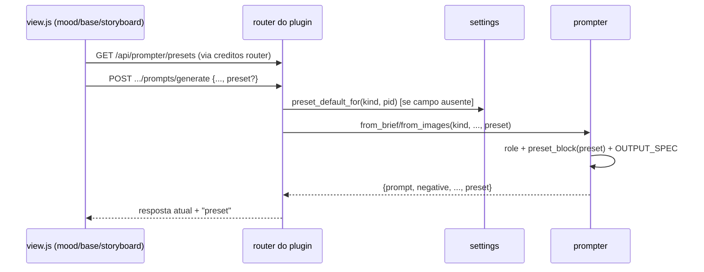

### FDD: prompter-presets-realismo `[extensão]`

Versão: 1.1
Data: 2026-08-30
Responsável: dd-parallel (Wave 9, modo batch, auto-aceite) · **aprovado no gate em lote W3**
Domínio: studio (serviço transversal `studio/common/prompter.py` + settings + telas mood/base/storyboard)
Base: `develop` @ `7162c41` · Card da wave: https://trello.com/c/T53Hnvlv
Recon: `docs/domains/studio/recon-wave-9.md` · Wave: `docs/domains/studio/waves/wave-9.md`

> Não existe `docs/domains/studio/prd.md`; por decisão do fluxo da wave, o contexto de produto
> fica registrado aqui na seção 1 (nenhum PRD de domínio é criado por esta feature).

---

### 0. Amendas do Gate W3 (vinculantes — 2026-08-30, v1.0 → v1.1)

A v1.0 subiu ao gate em lote com três pendências. O gate (`docs/domains/studio/waves/wave-9.md`,
seção "Gate W3") resolveu todas; esta versão do FDD **já incorpora** as resoluções. Onde o texto
das seções 4–9 divergir destas amendas, **as amendas vencem**.

| # | Pendência v1.0 | Resolução do gate W3 | Onde impacta |
|---|---|---|---|
| P1 | Default ativo × opt-in | **Default de código `null` (opt-in)** para `mood`/`base`/`motion` — fidelidade à aula (ADR-004) preservada byte a byte. Sem preset explícito, o prompt enviado ao CLI é byte-idêntico ao de hoje. | §4 (fluxos alternativos), §5 (settings), §9 (critério 5), §10 (risco 1 neutralizado) |
| P2 | UI administrativa de defaults | Nesta wave, configuração de preset default **só via API**; editar na tela "Créditos & Custos" tocaria núcleo `web/*` (ADR-010) e fica para frente de shell futura. | §3 (exclusões, já previsto) |
| P3 | ADR de extensão | Com opt-in em mood/base/motion, **a marca `[extensão]` basta** — esta feature NÃO cria ADR. O default ativo de `storyboard.script` é registrado na ADR-025, que nasce na feature consumidora (`storyboard-roteiro-llm`). | §6 (pendências encerradas) |

**Amenda A1 — resolução de preset por AÇÃO, genérica (contrato do handoff).**
O gate fixou a chave oficial de settings `storyboard.script` (default `documentary-street`),
**implementada pela consumidora** `storyboard-roteiro-llm` (sub-wave 2). Consequência para esta
feature (provedora): a resolução de preset NÃO pode ser fechada nos três kinds do prompter — ela
opera sobre um **registro de ações extensível** (`settings.PRESET_ACTIONS`), no qual a
consumidora acrescenta a própria chave sem tocar em nada desta frente. O que a provedora entrega:

- `settings.PRESET_ACTIONS: dict[str, str | None]` — registro `{ação: preset default de código}`,
  inicializado com `{"mood": None, "base": None, "motion": None}` (opt-in do gate).
- `settings.preset_default_for(kind, pid=None)` aceita **qualquer chave registrada**, inclusive
  chaves pontuadas de ação no padrão de `settings.ACTIONS` (`storyboard.script`); a validação é
  contra `PRESET_ACTIONS`, nunca contra uma tupla fixa.
- O bloco `defaults` de `GET /api/prompter/presets` é montado **iterando `PRESET_ACTIONS`**, de
  modo que a ação registrada pela consumidora aparece no endpoint automaticamente, sem mudança
  de contrato nem nova versão da rota.
- `PROMPTER_KINDS = ("mood", "base", "motion")` permanece como a tupla dos três papéis do
  prompter (usada pelos routers de etapa desta frente), mas **não** é mais o universo de
  validação da configuração de preset.

**Amenda A3 — colisão de nomenclatura na etapa 4 (achado da implementação, relevante para a
consumidora).** O domínio storyboard **já usa a palavra "preset" para outro conceito**: as
"fórmulas da aula" (`studio/storyboard/service.py:180` `presets()` sobre o dict `PRESETS`,
consumidas pelo `<select id="sbPreset">` em `studio/etapas/storyboard/view.html:102` e
`view.js:82`). Nada disso é tocado por esta feature. Para evitar ambiguidade e não quebrar os
testes de view existentes:

- Os nomes **globais** do contrato permanecem os da seção 5, sem prefixo: `REALISM_PRESETS`,
  `preset_block`, `GET /api/prompter/presets`, campo `preset` no body/resposta e chave
  `prompter_presets` no `config.json`. O escopo já os desambigua.
- Os identificadores **locais da etapa 4** (id de elemento, variável de view) usam o prefixo
  `realism`: `#sbRealismPreset` e afins. O id `sbPreset` continua sendo o das fórmulas da aula.
- A consumidora `storyboard-roteiro-llm`, que também põe um seletor de preset na tela da etapa 4,
  fica avisada: usar `realism` no identificador local e nunca reaproveitar `sbPreset`.

**Amenda A4 — PENDÊNCIA P4: a UI de preset da etapa 2 (mood) NÃO é implementável como
especificada. `[HARD-GATE — não decidido pela frente]`**

Achado da implementação, em divergência com o texto da v1.0 (§3 "Incluído" e §9 critério 11):

- `POST /api/projects/{pid}/mood/prompts/generate` (`studio/etapas/mood/router.py:106`) **existe
  mas está morto**: nenhuma tela o chama. A ADR-014 tirou a criação de prompt de vibe da etapa 2
  e a levou para a biblioteca global de mood boards.
- `tests/test_mood_view.py:52-58` (`test_view_removed_the_creation_panels`) **trava essa decisão
  por teste**: a string `"mood/prompts/generate"` NÃO pode aparecer em
  `studio/etapas/mood/view.js`. Pôr o seletor de preset naquela tela quebraria esse teste e
  contrariaria a ADR-014.
- A tela viva de prompt de vibe é a da biblioteca (`POST /api/moodboards/{mbid}/prompt/generate`
  em `studio/moodboards/router.py:155`, UI em `studio/web/moodboards.js`). Ela está **duplamente
  fora** do escopo desta feature: o serviço `studio/moodboards/` não consta da §3, e a UI vive em
  `studio/web/*`, proibido pelo ADR-010 e pelos Limites da §1.

Decisão da frente: **parar esta parte e registrar**, sem inventar contrato.

- ENTREGUE: o campo aditivo `preset` no endpoint `mood/prompts/generate` (está na §5, é
  retrocompatível e deixa o contrato pronto para quando a tela voltar a existir).
- NÃO ENTREGUE: o `<select>` de preset na tela da etapa 2 — o critério 11 passa a valer para
  **base e storyboard**, as duas telas de plugin que de fato geram prompt hoje.
- SOBE PARA DECISÃO (P4): levar presets de realismo à biblioteca de mood boards
  (`studio/moodboards/*` + `studio/web/moodboards.js`) é escopo novo e toca o núcleo `web/*` —
  cabe a uma frente de preparo/shell, junto da P2. Não é decisão desta frente.

**Amenda A5 — persistência do preset no histórico da etapa 4.** A §7 previa gravar `"preset"` no
"registro do video-prompt". Verificado no código: `storyboard.video_prompt`
(`studio/storyboard/service.py:736`) **não grava `prompts.json`** — quem persiste é a UI, pelo
`PUT /storyboard/scenes`, dentro do mapa `photos[img].video_prompt` de `scenes.json`. Como
ADR-018/022 impedem reestruturar `scenes.json`, a frente entrega o `"preset"` **na resposta** do
`video-prompt` (auditável e suficiente para a UI), e não altera o schema de `scenes.json`.
Observabilidade por histórico segue valendo para mood e base, que têm `prompts.json` de verdade.

**Amenda A6 — notas de implementação (doc-sync do fechamento da frente).** Três detalhes em que o
código entregue é mais preciso que o texto da v1.0, sem mudar o contrato da §5:

- **Validação do preset acontece antes do serviço**, por `field_validator` do pydantic nos bodies
  de generate e por `ValueError` em `settings`, não por `KeyError` de `preset_block` capturado no
  router. O efeito especificado é o mesmo — 422 antes de qualquer chamada ao CLI — e mais cedo.
  `preset_block` continua levantando `KeyError` para id desconhecido, como contrato de função.
- **A UI sempre manda o campo `preset`** (string vazia do `<select>` convertida em `null`). O
  estado "campo ausente" continua existindo e é o dos clientes antigos e de outros consumidores;
  é ele que dispara a resolução de default. A distinção ausente × `null` é implementada pelo
  sentinela `settings.PRESET_UNSET`.
- **`GET /api/prompter/presets` responde 200 sempre que o `pid` for válido ou ausente**; com
  `?pid=` de projeto inexistente responde **404**, pelo mesmo `project_dir(pid)` das demais rotas
  por projeto do módulo. O "200 sempre" da §5 vale para o catálogo em si (dict em memória, sem
  I/O), não para um pid inválido. Consumidores que só querem o catálogo devem chamar sem `pid`.
- **Shape de `GET /api/prompter/preset-config`** (que a §5 declarava sem fixar): responde
  `{"defaults": {ação: {preset, source}}}`, o mesmo bloco do endpoint de catálogo, restrito ao
  nível global (sem `pid`).
- **`fidelity` não vai na resposta HTTP.** O campo é comum a todo preset e vive em
  `REALISM_PRESETS` (critério 1 da §9); o exemplo de resposta da §5 já o omitia. Consumidores
  in-process leem `prompter.REALISM_PRESETS[<id>]["fidelity"]`; a API expõe rig/luz/grade/
  negativos, que é o que a UI precisa para montar seletor.
- **Limitação conhecida: não há rota para REMOVER o override global**, só para sobrescrevê-lo
  (inclusive com `null`). Por projeto existe o `DELETE`. Como o default de código é `null`, gravar
  `null` no global produz hoje o mesmo efeito observável de não ter override; a rota de remoção
  fica como evolução, sem impacto no contrato da §5.
- **`settings.resolve_preset(kind, pid, preset)`** foi introduzida como o ponto único que devolve
  `(resolvido, explícito)`. Só o preset **explícito** alimenta `fallback_template`, o que preserva
  o determinismo do template do curso quando o preset veio apenas de um default configurado
  (regra da §4, agora com um nome próprio no código).

**Amenda A2 — semântica do default `null`.** Com o opt-in, `preset_default_for("mood")` sem
override devolve `{"kind": "mood", "preset": None, "source": "code"}`. Um body de generate **sem**
o campo `preset` resolve esse default e, sendo `None`, não injeta bloco algum: o comportamento
observável dos três endpoints existentes continua idêntico ao de `develop@7162c41`. Preset só
entra quando o usuário escolhe (na UI) ou quando alguém configurou override por projeto/global.

---

### 1. Contexto e motivação técnica

**Bloco de contratos da wave (cópia literal de `waves/wave-9.md`):**

> ### Feature: prompter-presets-realismo
> **Provides**:
> - Catálogo de presets de realismo em `studio/common/prompter.py` (novo dict `REALISM_PRESETS`),
>   contendo ao menos `documentary-street` (default) e `arri-natural-narrative`, cada um com
>   rig (câmera+lente+abertura+formato), luz, grade e vocabulário de fidelidade — estrutura
>   derivada da skill `/generate_realistic_prompt_images` (rig presets, aberturas, negativos).
> - Ação de configuração por padrão ADR-016 em `studio/common/settings.py` (preset default por
>   ação, override projeto → global → código).
> - Endpoint `GET /api/prompter/presets` (lista id, nome, descrição de uma linha, rig) para a
>   UI montar seletores.
> - Parâmetro opcional `preset` aceito por `prompter.from_brief`/`from_images` (aditivo,
>   default preserva comportamento atual).
> **Consumes**: — (nenhum; candidata imediata)

**Contexto de produto (na ausência de PRD de domínio).** O levantamento do curso × código da
Wave 9 identificou que os prompts do bot (mood, base, motion) não incorporam de forma sistemática
o vocabulário de realismo cinematográfico que produz imagens indistinguíveis de foto real
(rig coerente de câmera+lente+abertura+formato, uma luz dominante, imperfeição controlada,
negativos anti-IA). Esse conhecimento existe validado na skill externa
`~/.claude/skills/generate_realistic_prompt_images/` (SKILL.md + reference.md), que NÃO pode ser
dependência de runtime do repo: seu conteúdo relevante é transcrito para `prompter.py`
(catálogo `REALISM_PRESETS`) e para este FDD. A feature também é a provedora da
`storyboard-roteiro-llm` (sub-wave 2), que consome o catálogo e o endpoint de listagem.
[auto-aceito: o "porquê" de negócio vem do bloco da wave e da comparação levantamento × código;
nenhuma aula do curso ensina presets de realismo, por isso toda a feature é `[extensão]` (ADR-004)]

**Motivação técnica.** Hoje o realismo depende do texto livre dos papéis `ROLES` e do que o
Claude decide na hora; não há forma de fixar um "look" (rig + luz + grade + negativos) coerente e
repetível entre gerações, nem de configurá-lo por projeto. O padrão ADR-016 (default por ação,
projeto → global → código) já existe para modelos e é o encaixe natural para preset por ação.

**Atores.** Usuário do Studio (telas das etapas 2 mood, 3 base, 4 storyboard);
`studio/common/prompter.py` (serviço transversal); `studio/common/settings.py` (resolução de
default); `studio/creditos/router.py` (área campanha-independente já registrada em `app.py`,
hospeda as rotas novas sem tocar o núcleo); serviços `mood/base/storyboard` e seus routers de
plugin; feature `storyboard-roteiro-llm` (consumidora futura).

**Limites (ADR-010).** Nada em `app.py`, `steps.py`, `web/*`. As rotas novas entram em
`studio/creditos/router.py` (módulo `[extensão]` fora do núcleo, router já incluído pelo
`app.py` existente) e nos routers de plugin `studio/etapas/{mood,base,storyboard}/router.py`.
[auto-aceito: hospedar `GET /api/prompter/presets` e as rotas de config de preset no
`creditos/router.py`, porque é a única área campanha-independente editável sem tocar núcleo e já
é a casa do padrão ADR-016 (config de defaults); o path público permanece o do contrato da wave]

**Suposições e restrições.**
- `PROMPT_FORMAT`, `EXAMPLE_PROMPT`, `PROMPT_SECTIONS`, `split_sections`, `provenance` e o
  retorno `{prompt, negative, camera, notes_pt, source, seconds}` são contratos publicados
  (FDDs `prompter-fdd.md` e `base-prompt-provenance-fdd.md`) e ficam intocados.
- Tudo aditivo: chave nova em config.json, campo novo em request/response, parâmetro novo com
  default; nenhuma rota, chave ou string de teste existente é renomeada (recon, ATENÇÃO).
- Prompts de geração em inglês; docs e UI em pt-BR (CLAUDE.md).

---

### 2. Objetivos técnicos

- Catálogo `REALISM_PRESETS` em `prompter.py` com os 5 rigs da skill externa transcritos;
  invariante: cada preset tem `id`, `name`, `desc_pt` (1 linha), `rig{camera,lens,format,focal,
  aperture}`, `light`, `grade`, `fidelity`, `negative` (lista) e `documentary-street` marcado
  `default: true`. Testável por asserção de estrutura em `tests/test_prompter.py`.
  [auto-aceito: incluir os 5 rig presets da skill (não só 2), pois a tabela é pequena, validada, e
  a wave pede "os rig presets que fizerem sentido"; todos fazem sentido como looks distintos]
- `from_brief(kind, brief, preset=None)` e `from_images(kind, images, instruction, brief,
  preset=None)`: com `preset=None` o texto enviado ao CLI é byte-idêntico ao atual (invariante de
  retrocompatibilidade, coberto por teste); com preset válido, o prompt de papel ganha um bloco
  adicional de instrução de realismo e a resposta ganha `"preset": <id>`.
- Resolução de preset default por ação de prompt (`mood`, `base`, `motion`) via settings, na
  ordem projeto → global → código, com override inválido ignorado (mesma semântica de
  `default_for`); retrocompatível com `config.json` existentes (chave nova, ausência = default de
  código).
- `GET /api/prompter/presets` responde em < 50 ms (leitura de dict em memória) e alimenta os
  seletores de UI das etapas 2/3/4 e da feature consumidora `storyboard-roteiro-llm`.
- Formato do prompt final inalterado: parágrafo + 5 linhas `Camera:/Lighting:/Composition:/
  Color grading:/Style:`; `provenance()` continua mapeando as mesmas seções (preset não cria
  seção nova).

---

### 3. Escopo e exclusões

**Incluído**
- `studio/common/prompter.py`: dict `REALISM_PRESETS`, helper `preset_block(preset_id)` (texto em
  inglês injetado no prompt do papel), parâmetro `preset` em `from_brief`/`from_images`, campo
  `"preset"` no retorno.
- `studio/common/settings.py`: chave nova `prompter_presets` no `config.json` (global e de
  projeto), funções `preset_default_for(kind, pid=None)`, `set_global_preset`,
  `set_project_preset`, `clear_project_preset`, `PROMPTER_KINDS = ("mood", "base", "motion")`.
- `studio/creditos/router.py`: `GET /api/prompter/presets`, `GET/PUT /api/prompter/preset-config`
  (global) e `PUT/DELETE /api/projects/{pid}/prompter/preset-config` (projeto).
- Routers de plugin: campo opcional `preset` no body de
  `POST /api/projects/{pid}/mood/prompts/generate`,
  `POST /api/projects/{pid}/base/prompts/generate` e
  `POST /api/projects/{pid}/storyboard/video-prompt`; serviços repassam ao prompter.
- UI `[extensão]`: `<select>` de preset nas telas que já geram prompt (etapa 2 painel de prompts,
  etapa 3 painel 01, etapa 4 vídeo/motion), populado por `GET /api/prompter/presets`,
  pré-selecionado com o default resolvido, com opção "(sem preset)". Apenas nos `view.js`/
  `view.html` dos plugins; nada em `web/*`.
- Testes: `tests/test_prompter.py` (estrutura do catálogo, injeção do bloco, retrocompat
  byte-idêntica), `tests/test_settings*.py` ou equivalente (resolução projeto → global → código,
  override inválido), testes de API das rotas novas e do campo `preset` aditivo.

**Excluído**
- Papel `script` do prompter e endpoints de roteiro (feature `storyboard-roteiro-llm`, sub-wave 2).
- Qualquer edição em `app.py`, `steps.py`, `web/*` (ADR-010). Pendência registrada para a UI
  administrativa (ver seção 6/pendências).
- Alterar `ROLES`, `PROMPT_FORMAT`, `STYLE_VARIANTS`, `MOOD_GUARDS`, `enforce_mood_rules`.
- Ajuste automático de aspect ratio por preset (a nota da skill "Anamorphic força 2.39:1" vira
  texto no `desc_pt`/`notes`, não regra imposta pelo serviço).
  [auto-aceito: não impor aspect ratio; o Studio não tem esse conceito no prompter hoje e impor
  seria mudança de comportamento fora do contrato]
- Perfis por modelo alvo da skill (Midjourney/Flux etc.): o Studio só gera via Higgsfield CLI;
  a seção "AJUSTES POR MODELO" da skill não é transcrita.

---

### 4. Fluxos detalhados e diagramas

**Fluxo principal (geração com preset, ex.: etapa 3)**
1. A tela carrega `GET /api/prompter/presets` e o status já existente da etapa; o `<select>`
   `[extensão]` mostra os presets com `desc_pt` e pré-seleciona o default resolvido
   (`preset_default_for("base", pid)`).
2. O usuário clica "Gerar prompt"; o `view.js` envia o body atual + `"preset": "<id>"`
   (ou `"preset": null` se escolheu "(sem preset)"; campo ausente = servidor resolve o default).
3. O router valida o id contra `REALISM_PRESETS` (422 se desconhecido) e o serviço chama
   `prompter.from_images("base", ..., preset=<id resolvido>)`.
4. `from_images` monta o prompt do papel como hoje e, se `preset` não for `None`, anexa o bloco
   `preset_block(id)`: instrução em inglês mandando usar exatamente corpo, lente, formato e
   abertura do rig na linha `Camera:`, a luz do preset como fonte dominante na linha `Lighting:`,
   a grade na linha `Color grading:`, o vocabulário de fidelidade no parágrafo/`Style:` e os
   negativos do preset mesclados ao campo `"negative"` da saída.
5. Retorno normal `{prompt, negative, camera, notes_pt, source, seconds}` + `"preset": <id>`;
   histórico (`prompts.json` da etapa) grava o preset usado; UI mostra o prompt como hoje.
6. Nada muda no fluxo pago: geração de imagem continua com `cost` → `confirmCost` →
   `record_generation` (esta feature não cria geração paga nova).

**Fluxos alternativos e exceções**
- Campo `preset` ausente no body: o serviço resolve `preset_default_for(kind, pid)`
  (projeto → global → código). **Default de código: `None` (opt-in — amenda A1/A2 do gate W3)**,
  logo, sem override configurado, nada é injetado e a saída é byte-idêntica à de hoje. A UI
  pré-seleciona `documentary-street` como sugestão visual, mas quem manda no servidor é o campo
  enviado.
- `"preset": null` explícito no body: nenhum bloco é injetado; comportamento atual preservado
  (rota de fuga garantida ao usuário).
- Fallback sem Claude (`fallback_template`): quando um preset foi explicitamente pedido na
  requisição, as linhas `Camera:`/`Lighting:`/`Color grading:` do template usam o rig/luz/grade do
  preset; quando o preset veio apenas da resolução de default (não explícito), o template fica
  byte-idêntico ao atual. [auto-aceito: preserva o determinismo e as strings do template fixadas
  em testes existentes (recon, ATENÇÃO), mantendo o preset disponível a quem pedir]
- Override de preset no `config.json` apontando para id inexistente: ignorado, cai para o próximo
  nível da cadeia (mesma semântica de `default_for` para modelos).
- Config de preset para `kind` fora de `PROMPTER_KINDS` ou id inexistente via PUT: 422.
- Claude indisponível/timeout/JSON inválido: matriz atual intocada (409/502, FDD prompter §6).

**Diagrama (sequência resumida)**


---

### 5. Contratos públicos (assinaturas, endpoints, headers, exemplos)

**Catálogo `REALISM_PRESETS`** (transcrição da skill externa; fonte de runtime é este dict, nunca
o arquivo em `~/.claude/skills/`)
- Tipo: dict de módulo em `studio/common/prompter.py`.
- Conteúdo (5 presets; valores em inglês, `desc_pt` em pt-BR):

| id | rig (camera / lens / format / focal · aperture) | light | grade | desc_pt (1 linha) |
|---|---|---|---|---|
| `documentary-street` (default) | Blackmagic Pocket 6K Pro / Cooke S4 / Super 35 / 24–35mm · T2.8 | soft overcast diffused daylight, handheld feel | raw, grainy, muted documentary grade, real film grain | Documentário autêntico: cru, granulado, câmera na mão, contexto amplo de rua. |
| `arri-natural-narrative` | ARRI Alexa Mini LF / Cooke S4 / Large Format / 40–50mm · T2.0 | one dominant soft key, gentle fill, 1:2–1:3 ratio | warm skin tones, soft contrast, gentle highlight roll-off ("Cooke look") | Narrativa cinematográfica orgânica: pele quente e contraste suave; default seguro com pessoa. |
| `red-commercial-precision` | RED V-Raptor / Zeiss Supreme Prime / Large Format / 35–50mm · T4.0 | clean controlled key, crisp speculars | precise color, high micro-contrast, clean punchy look | Precisão comercial: nitidez cristalina para produto, moda e tech. |
| `sony-venice-night` | Sony Venice 2 / Zeiss Supreme Prime / Full Frame / 35mm · T2.0 | practical lights only (neon, lamps), low-light dual-base ISO | clean shadows, high latitude night grade | Noturno limpo: neon e interiores escuros sem ruído. |
| `anamorphic-film-look` | ARRI Alexa Mini LF / Hawk V-Lite Anamorphic / Large Format / 40mm · T2.2 | key with horizontal blue flares allowed | filmic grade, oval bokeh, edge distortion | Widescreen épico: flares horizontais e bokeh oval (indicado p/ 2.39:1). |

- Campos comuns a todo preset: `fidelity` (vocabulário fixo da skill: "hyper-detailed natural
  skin with visible pores, subtle imperfections and asymmetry, physically accurate light behavior,
  imperfect real-world details, must look like an unedited photograph, not an AI render") e
  `negative` (lista base da skill: `["plastic skin", "airbrushed look", "oversaturation",
  "HDR glow", "extra fingers", "deformed anatomy", "CGI look", "perfect symmetry"]`, ajustável
  por preset). [auto-aceito: fidelidade/negativos comuns vêm do TEMPLATE UNIVERSAL e das REGRAS DE
  OURO da skill, únicos trechos com vocabulário canônico]
- Tabela de aberturas da skill (f/1.4 a f/8.0) NÃO vira contrato próprio: a abertura já vem no
  rig; override de abertura fica para evolução futura. [auto-aceito: opção conservadora; a wave
  só exige rig completo por preset]

**Funções do prompter** (aditivo; assinaturas atuais preservadas)
- `prompter.from_brief(kind: str, brief: dict, preset: str | None = None) -> dict`
- `prompter.from_images(kind, images, instruction="", brief=None, preset: str | None = None) -> dict`
- `prompter.preset_block(preset_id: str) -> str` (instrução em inglês; levanta `KeyError` p/ id
  desconhecido; routers convertem em 422)
- Retorno de ambos ganha `"preset": <id | None>`; demais chaves inalteradas.
- `prompter.fallback_template(kind, brief, variation=0, no_people=True, preset: str | None = None)`
  (preset explícito preenche Camera/Lighting/Color grading do template; `None` = template atual).

**Settings** (padrão ADR-016; chave nova retrocompatível no `config.json`)
- Persistência: `{"prompter_presets": {"mood": "<id>", "base": "<id>", "motion": "<id>"}}` ao lado
  de `"defaults"` no `STATE_DIR/config.json` (global) e `projects/<pid>/config.json` (projeto).
  Configs existentes sem a chave continuam válidas (ausência = próximo nível da cadeia).
- `settings.PRESET_ACTIONS: dict[str, str | None]` — registro extensível `{ação: default de
  código}`, inicializado `{"mood": None, "base": None, "motion": None}` (opt-in, gate W3/A1). A
  consumidora `storyboard-roteiro-llm` acrescenta `"storyboard.script": "documentary-street"`.
- `settings.preset_default_for(kind, pid=None) -> {"kind", "preset", "source"}` com
  `source ∈ {project, global, code}`; **default de código `None`** para `mood`/`base`/`motion`
  (amenda A2). `kind` pode ser qualquer chave de `PRESET_ACTIONS`, incluindo chaves pontuadas
  (`storyboard.script`); chave não registrada → `ValueError` (→ 422 no router).
- `settings.set_global_preset(kind, preset)`, `settings.set_project_preset(pid, kind, preset)`,
  `settings.clear_project_preset(pid, kind)`; validação: kind em `PRESET_ACTIONS`, preset em
  `REALISM_PRESETS` ou `None` (= "sem preset", persistido como `null`).
  [auto-aceito: `null` persistido significa "sem preset" escolhido de propósito, distinto de chave
  ausente que cai para o próximo nível; espelha a semântica de override de modelo]

**`GET /api/prompter/presets`** (novo; hospedado em `studio/creditos/router.py`)
- Tipo: http_endpoint · Método: GET · Sem auth (app local, padrão do projeto).
- 200 sempre (catálogo em memória). Query opcional `pid` para resolver defaults do projeto.

Exemplo de resposta:
```json
{
  "presets": [
    {"id": "documentary-street", "name": "Documentary Street Realism", "default": true,
     "desc_pt": "Documentário autêntico: cru, granulado, câmera na mão, contexto amplo de rua.",
     "rig": {"camera": "Blackmagic Pocket 6K Pro", "lens": "Cooke S4", "format": "Super 35",
              "focal": "24-35mm", "aperture": "T2.8"},
     "light": "soft overcast diffused daylight, handheld feel",
     "grade": "raw, grainy, muted documentary grade, real film grain",
     "negative": ["plastic skin", "airbrushed look", "oversaturation", "HDR glow",
                   "extra fingers", "deformed anatomy", "CGI look", "perfect symmetry"]}
  ],
  "defaults": {"mood": {"preset": null, "source": "code"},
                "base": {"preset": null, "source": "code"},
                "motion": {"preset": null, "source": "code"}}
}
```

O bloco `defaults` é montado **iterando `settings.PRESET_ACTIONS`** (amenda A1): quando a
consumidora registra `storyboard.script`, a chave passa a aparecer aqui sozinha, com
`{"preset": "documentary-street", "source": "code"}`. Consumidores devem tratar `defaults` como
mapa aberto (iterar as chaves presentes), nunca como as três chaves fixas.

**`GET /api/prompter/preset-config`** e **`PUT /api/prompter/preset-config`** (global)
- PUT body: `{"kind": "mood"|"base"|"motion", "preset": "<id>" | null}` → devolve
  `preset_default_for(kind)`; 422 para kind/preset inválido.

**`PUT /api/projects/{pid}/prompter/preset-config`** e
**`DELETE /api/projects/{pid}/prompter/preset-config/{kind}`** (projeto)
- Mesma semântica; `project_dir(pid)` inexistente → 404 (handler do núcleo, como no creditos).

**Endpoints existentes estendidos (campo aditivo `preset` no body; resposta ganha `"preset"`)**
- `POST /api/projects/{pid}/mood/prompts/generate` (`studio/etapas/mood/router.py:106`)
- `POST /api/projects/{pid}/base/prompts/generate` (`studio/etapas/base/router.py:83`)
- `POST /api/projects/{pid}/storyboard/video-prompt` (`studio/etapas/storyboard/router.py:211`)
- Semântica do campo: ausente = resolver default; `null` = sem preset; `"<id>"` = usar esse.
- Compatibilidade: clientes atuais (sem o campo) continuam funcionando; formato do `prompt`
  devolvido continua parágrafo + 5 linhas (provenance intacto).

---

### 6. Erros, exceções e fallback

**Matriz de erros**

| Condição | Tratamento | Observações |
|---|---|---|
| `preset` desconhecido no body de generate | 422 com lista de ids válidos | validação no router, antes de chamar o CLI |
| `kind`/`preset` inválido em PUT preset-config | 422 | espelha `_valid` de modelos |
| `pid` inexistente nas rotas de projeto | 404 | `project_dir` + handler do núcleo (padrão creditos) |
| Override de preset inválido em `config.json` | ignorado; cai para global → código | UI nunca presa a id morto (semântica `default_for`) |
| Claude ausente | 409 (inalterado) | UI oferece template; preset explícito ainda aplica no template |
| Timeout 180 s / JSON inválido do CLI | 502 (inalterado) | matriz do FDD prompter §6 preservada |
| `preset_block` com `KeyError` interno | bug de programação; coberto por validação prévia | teste garante paridade router × catálogo |

**Resiliência**: nenhuma chamada externa nova; timeouts/retries do CLI inalterados. Escrita de
config via `atomic.write_json_atomic` (padrão existente).

**Política de fallback**: sem Claude, `fallback_template` com preset explícito produz as 5 linhas
com o rig do preset; sem preset explícito, template byte-idêntico ao atual.

**Invariantes**
- `preset=None` nas funções do prompter produz prompt de entrada byte-idêntico ao de hoje.
- `PROMPT_FORMAT`/`PROMPT_SECTIONS`/`provenance` intocados; preset nunca cria seção nova.
- Nenhuma chave existente de `config.json`, rota ou string de teste renomeada.
- `MOOD_GUARDS`/`enforce_mood_rules` não interagem com preset (negativos do preset entram no
  campo `negative` da resposta, não no prompt do mood).

**Pendências para o gate em lote — TODAS RESOLVIDAS na seção 0 (gate W3, 2026-08-30)**

- **P1 → RESOLVIDA: opt-in.** Default de código `null` para mood/base/motion. O texto original
  abaixo fica como registro da deliberação; a implementação segue a seção 0.
- **P2 → RESOLVIDA: só via API nesta wave** (tela de custos fica para a frente de shell).
- **P3 → RESOLVIDA: `[extensão]` basta**, sem ADR nesta feature; a ADR-025 nasce na consumidora.

<details><summary>Registro original das pendências (v1.0, pré-gate)</summary>

- **P1 (default ativo × fidelidade ao curso)**: o contrato da wave fixa `documentary-street`
  como default, e com a resolução por settings ele passa a ser aplicado por padrão em toda
  geração de prompt com Claude (mood/base/motion), alterando o output default de telas do curso.
  Nenhuma aula ensina presets; o "porquê" de ligar por padrão (em vez de opt-in "(sem preset)")
  não tem fonte canônica além do bloco da wave. Confirmar no gate: default ativo (como
  especificado aqui) OU default de código `null` com documentary-street apenas pré-selecionado
  na UI. O FDD implementa a leitura literal do contrato da wave; a alternativa é 1 linha de
  mudança em `settings` se o gate decidir opt-in.
- **P2 (UI administrativa)**: a tela "Créditos & Custos" (painel natural para editar defaults
  ADR-016) vive no núcleo `web/*`; expor a edição de preset default lá exige frente de
  preparo/shell (ADR-010). Nesta feature a edição de default fica só via API
  (`PUT .../preset-config`); registrar a pendência para a frente de shell, não fazer.
- **P3 (ADR de extensão)**: presets de realismo constam do recon como `[extensão]` que exige
  aprovação do dono; se o gate entender que ligar preset por padrão é "desvio de método"
  (gate 4 do CLAUDE.md), a decisão vira ADR-025 (próximo número livre). Proposta: só a marca
  `[extensão]` se P1 resolver por opt-in; ADR-025 se resolver por default ativo.

</details>

---

### 7. Observabilidade

Padrão do projeto (estado em arquivo, sem stack de métricas; ADR-003/006):

**Histórico por etapa**: `mood/prompts.json`, `base/prompts.json` e o registro do video-prompt
passam a gravar `"preset": <id|null>` junto de `mode`, `seconds` e `source` (campo aditivo).

**Resposta da API**: `"preset"` presente em toda resposta de generate (auditável na UI e nos
testes; permite ao usuário ver qual preset foi de fato aplicado e de onde veio o default via
`GET /api/prompter/presets?pid=`, campo `source`).

**Logs**: exceções seguem o tratamento atual dos routers (mensagem no detail HTTP); nenhuma
chamada nova ao CLI, então nenhum log novo de subprocess.

**Sem métricas/tracing novos**: o app é local single-process; latência já é exposta por
`seconds` no retorno do prompter.

---

### 8. Dependências e compatibilidade

| Componente | Versão mínima | Observações |
|---|---|---|
| `claude` CLI no PATH | atual | inalterado; preset só muda o texto do prompt enviado |
| `studio/common/prompter.py` | develop @ 7162c41 | contratos `PROMPT_FORMAT`/provenance preservados |
| `studio/common/settings.py` | develop @ 7162c41 | chave nova `prompter_presets`; `defaults` intocado |
| `studio/creditos/router.py` | develop @ 7162c41 | rotas novas; nenhuma rota existente alterada |
| Skill externa `generate_realistic_prompt_images` | n/a | fonte de transcrição em design-time; NUNCA dependência de runtime |

**Garantias de compatibilidade**
- `config.json` antigos (global e projeto) seguem válidos sem migração.
- Clientes que não enviam `preset` recebem comportamento definido pela resolução de default
  (ver P1); enviar `"preset": null` reproduz exatamente o comportamento pré-feature.
- `tests/test_prompter.py` existentes passam sem alteração (fakes de `BIN`/`subprocess.run`).
- Consumidora `storyboard-roteiro-llm` (sub-wave 2) depende apenas de `REALISM_PRESETS`,
  `preset_block` e `GET /api/prompter/presets` conforme esta seção 5.

---

### 9. Critérios de aceite técnicos

1. `REALISM_PRESETS` contém os 5 ids da seção 5, cada um com `id, name, desc_pt, rig{camera,
   lens, format, focal, aperture}, light, grade, fidelity, negative`; exatamente
   `documentary-street` tem `default: true` (teste de estrutura).
2. Com CLI fakeado, `from_brief("mood", brief)` sem `preset` monta prompt byte-idêntico ao da
   versão atual; com `preset="arri-natural-narrative"`, o prompt contém "ARRI Alexa Mini LF",
   "Cooke S4" e "Large Format", e a resposta traz `"preset": "arri-natural-narrative"`.
3. `from_images` idem (bloco de preset presente/ausente conforme o parâmetro); limite de 4
   imagens e `--allowedTools Read` inalterados.
4. `fallback_template(kind, brief, preset="red-commercial-precision")` produz linha `Camera:` com
   "RED V-Raptor"; sem `preset`, saída idêntica à atual (strings dos testes existentes intactas).
5. `settings.preset_default_for("base")` sem nenhum override devolve
   `{"preset": None, "source": "code"}` (opt-in do gate W3); com override de projeto válido
   devolve `source: "project"`; com override apontando para id inexistente, cai para o próximo
   nível. Uma ação registrada em `PRESET_ACTIONS` com default não-nulo (ex.: chave pontuada de
   teste `"x.y"`) devolve esse preset com `source: "code"` — prova de que a resolução é genérica
   por ação e serve à chave `storyboard.script` da consumidora.
6. `GET /api/prompter/presets` devolve os 5 presets com `desc_pt` e o bloco `defaults` resolvido
   para **todas** as chaves de `PRESET_ACTIONS`; com `?pid=` reflete o override do projeto.
7. `PUT /api/prompter/preset-config` com kind ou preset inválido → 422; válido persiste em
   `STATE_DIR/config.json` sob `prompter_presets` sem tocar a chave `defaults`.
8. `POST .../mood/prompts/generate`, `POST .../base/prompts/generate` e
   `POST .../storyboard/video-prompt` aceitam `preset` aditivo (ausente/`null`/id), devolvem
   `"preset"` na resposta e gravam o campo no histórico; body antigo (sem o campo) continua 200.
9. `preset` desconhecido nesses endpoints → 422 antes de qualquer chamada ao CLI.
10. `split_sections`/`provenance` sobre um prompt gerado com preset seguem devolvendo as 5 seções
    e os mesmos rótulos de proveniência (nenhum teste de provenance alterado).
11. Seletor de preset presente e marcado `[extensão]` nos `view.html`/`view.js` de **base e
    storyboard** (a etapa 2 sai por força da amenda A4/P4: a tela de mood não gera prompt desde a
    ADR-014, e `tests/test_mood_view.py` trava isso); nenhuma alteração em `studio/web/*` no diff
    da feature.
12. `make verify` verde (ruff + pytest, sem rede/navegador).

---

### 10. Riscos e mitigação

### Risco 1: default ativo muda o output das telas do curso (fidelidade) — NEUTRALIZADO no gate W3

> O gate W3 escolheu o opt-in (default de código `null`): o plano de contingência descrito abaixo
> virou a especificação. O risco só voltaria a existir se alguém trocasse `PRESET_ACTIONS` para
> um default não-nulo em mood/base/motion.

- **Probabilidade:** alta (era o comportamento especificado pelo contrato da wave na v1.0)
- **Impacto:** prompts de mood/base/motion passam a carregar rig/luz/grade que a aula não ensina
- **Mitigação:**
    - Pendência P1 explícita no gate em lote antes da implementação
    - Opção "(sem preset)" sempre visível na UI e `"preset": null` na API
    - Bloco de preset só ACRESCENTA instruções; papéis `ROLES` das aulas intocados
- **Plano de contingência:** trocar o default de código para `null` (1 linha em settings), sem
  mudança de contrato de API

### Risco 2: bloco de preset conflita com o formato e quebra `provenance`

- **Probabilidade:** baixa
- **Impacto:** UI de proveniência da base degrada para legenda geral
- **Mitigação:**
    - `preset_block` instrui a preencher as 5 linhas existentes, nunca criar seções novas
    - Teste de aceite 10 cobre `split_sections`/`provenance` com preset
- **Plano de contingência:** degradação graciosa já prevista no FDD base-prompt-provenance
  (linha ausente não vira parte)

### Risco 3: prompt maior eleva latência/custo do CLI ou estoura o limite de 120–220 palavras

- **Probabilidade:** média
- **Impacto:** respostas mais lentas ou prompt final fora do padrão do instrutor
- **Mitigação:**
    - Bloco de preset curto (< 80 palavras), só vocabulário essencial do rig/luz/grade/fidelidade
    - O limite de palavras do `PROMPT_FORMAT` continua mandatório na instrução
- **Plano de contingência:** encurtar o bloco para apenas rig + luz (negativos ficam só no campo
  `negative`)

### Risco 4: divergência de schema com a consumidora storyboard-roteiro-llm

- **Probabilidade:** baixa
- **Impacto:** retrabalho na sub-wave 2 e no teste de handoff da W5
- **Mitigação:**
    - Seção 5 é o contrato congelado (ids, campos do preset, shape do endpoint)
    - Critério cross-feature da wave validado no estado integrado (W5)
- **Plano de contingência:** campos extras são aditivos; a consumidora nunca depende de campo
  não listado na seção 5

---

### 11. Sequenciamento de implementação (Build Order)

| Ordem | Etapa | Depende de | Componentes/arquivos prováveis | Critérios que fecha (da seção 9) |
| --- | --- | --- | --- | --- |
| 1 | Catálogo + `preset_block` + param `preset` no prompter | - | `studio/common/prompter.py`, `tests/test_prompter.py` | 1, 2, 3, 4, 10 |
| 2 | Resolução de default em settings | 1 | `studio/common/settings.py`, teste de settings | 5 |
| 3 | Rotas novas (catálogo + config global/projeto) | 1, 2 | `studio/creditos/router.py`, `tests/test_api.py` | 6, 7 |
| 4 | Campo `preset` nos 3 endpoints de generate + serviços + histórico | 1, 2 | `studio/{mood,base,storyboard}/service.py`, `studio/etapas/{mood,base,storyboard}/router.py`, testes de API por etapa | 8, 9 |
| 5 | Seletores `[extensão]` na UI das etapas 2/3/4 | 3, 4 | `studio/etapas/{mood,base,storyboard}/view.html`, `view.js` | 11 |
| 6 | Verificação final | 1–5 | `make verify` | 12 |
