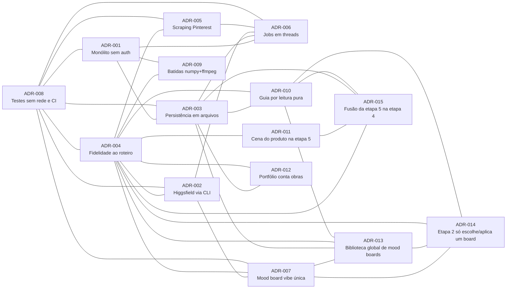

# Índice de ADRs — Orquestrador Studio

Este documento indexa as Architecture Decision Records (ADRs) geradas para o `orquestrador-studio`,
organizadas por módulo, e mostra o grafo de relacionamentos entre elas.

## Índice

| Número  | Título                                                                                                    | Módulo     | Status  | Link                                                                                                                     |
| ------- | ---------------------------------------------------------------------------------------------------------- | ---------- | ------- | ------------------------------------------------------------------------------------------------------------------------- |
| ADR-001 | Monólito Single-Process, Local, Sem Autenticação, Bind em Loopback                                          | STUDIO     | Aceito  | [generated/STUDIO/ADR-001-monolito-single-process-sem-autenticacao-bind-loopback.md](./generated/STUDIO/ADR-001-monolito-single-process-sem-autenticacao-bind-loopback.md) |
| ADR-002 | Integração com a Higgsfield somente via CLI oficial (nunca API HTTP direta ou automação de UI)              | HIGGSFIELD | Aceito  | [generated/HIGGSFIELD/ADR-002-integracao-higgsfield-somente-via-cli-oficial.md](./generated/HIGGSFIELD/ADR-002-integracao-higgsfield-somente-via-cli-oficial.md) |
| ADR-003 | Persistência em Sistema de Arquivos, sem Banco de Dados                                                     | STUDIO     | Aceita  | [generated/STUDIO/ADR-003-persistencia-em-sistema-de-arquivos-sem-banco-de-dados.md](./generated/STUDIO/ADR-003-persistencia-em-sistema-de-arquivos-sem-banco-de-dados.md) |
| ADR-004 | Fidelidade ao Roteiro do Curso como Restrição Arquitetural                                                  | STUDIO     | Aceito  | [generated/STUDIO/ADR-004-fidelidade-ao-roteiro-do-curso-como-restricao-arquitetural.md](./generated/STUDIO/ADR-004-fidelidade-ao-roteiro-do-curso-como-restricao-arquitetural.md) |
| ADR-005 | Coleta de Referências do Pinterest via Scraping com Playwright (em vez de API)                              | REFS       | Aceito  | [generated/REFS/ADR-005-scraping-pinterest-via-playwright.md](./generated/REFS/ADR-005-scraping-pinterest-via-playwright.md) |
| ADR-006 | Jobs Assíncronos em Threads com Estado em Memória e Polling                                                 | STUDIO     | Aceita  | [generated/STUDIO/ADR-006-jobs-assincronos-em-threads-com-estado-em-memoria-e-polling.md](./generated/STUDIO/ADR-006-jobs-assincronos-em-threads-com-estado-em-memoria-e-polling.md) |
| ADR-007 | Mood board de vibe única — um prompt, teto de 8 imagens selecionadas, grid de 4 como orientação de UI       | MOOD       | Aceito  | [generated/MOOD/ADR-007-mood-board-vibe-unica-teto-de-8-grid-de-4-como-orientacao-de-ui.md](./generated/MOOD/ADR-007-mood-board-vibe-unica-teto-de-8-grid-de-4-como-orientacao-de-ui.md) |
| ADR-008 | Estratégia de Testes sem Rede/Navegador, CI com Ruff+Pytest e Gitflow com Rastreabilidade Task-Id           | STUDIO     | Aceito  | [generated/STUDIO/ADR-008-estrategia-de-testes-sem-rede-ci-ruff-pytest-gitflow-task-id.md](./generated/STUDIO/ADR-008-estrategia-de-testes-sem-rede-ci-ruff-pytest-gitflow-task-id.md) |
| ADR-009 | Detecção de batidas com numpy + ffmpeg (sem librosa) | MUSIC | Aceito | [ADR-009](generated/MUSIC/ADR-009-deteccao-de-batidas-com-numpy-e-ffmpeg.md) |
| ADR-010 | Guia por Etapa Calculado por Leitura Pura de Artefatos; Núcleo Editável Só pelo Preparo/Shell | STUDIO | Aceito | [ADR-010](generated/STUDIO/ADR-010-guia-por-etapa-por-leitura-pura-e-nucleo-editavel-so-pelo-preparo-shell.md) |
| ADR-011 | A cena do produto permanece na etapa 5, decidida na etapa 7 | MUSIC | Aceito | [ADR-011](generated/MUSIC/ADR-011-cena-do-produto-permanece-na-etapa-5.md) |
| ADR-012 | Portfólio Global Conta Projetos Distintos (Obras), Não Arquivos do Mesmo Projeto | PUBLISH | Aceito | [ADR-012](generated/PUBLISH/ADR-012-portfolio-global-conta-projetos-distintos.md) |
| ADR-013 | Biblioteca Global de Mood Boards Reutilizáveis (estende a ADR-007) | STUDIO | Aceito | [ADR-013](generated/STUDIO/ADR-013-biblioteca-global-de-mood-boards-reutilizaveis.md) |
| ADR-014 | A etapa 2 da campanha só escolhe e aplica um mood board da biblioteca (criação centralizada; estende a ADR-007, complementa a ADR-013) | STUDIO | Aceito | [ADR-014](generated/STUDIO/ADR-014-etapa-2-so-escolhe-e-aplica-um-mood-board-da-biblioteca.md) |
| ADR-015 | A etapa 5 (Ângulos por cena) é fundida na etapa 4 (Storyboard) e sai do pipeline (storyboard passa a cobrir aulas 010+011; estende a ADR-004, amenda a moldura de numeração da ADR-011) | STUDIO | Aceito | [ADR-015](generated/STUDIO/ADR-015-fusao-da-etapa-5-angulos-na-etapa-4-storyboard.md) |

## Grafo de relacionamentos

_Índice atualizado no fechamento da wave 4 (2026-08-27): ADR-010 a ADR-012, geradas nas waves 1–2, entraram na tabela e no grafo. A wave 4 (fidelidade ao protótipo) não criou ADR — suas decisões de lote foram pré-autorizadas pelo dono do produto e ficam em `docs/domains/studio/waves/wave-4.md` §"Decisões do lote" e na retro `wave-4-retro.md`._

_ADR-014 (2026-08-27, ADH-OS-20260827-07): a criação de mood boards foi centralizada na biblioteca global e a etapa 2 da campanha passou a só escolher e aplicar um board — estende a ADR-007 e complementa a ADR-013._

_ADR-015 (2026-08-27, ADH-OS-20260827-10): a etapa 5 (Ângulos por cena, aula 011) foi fundida na etapa 4 (Storyboard, aula 010) e saiu do pipeline — o Storyboard passa a cobrir as aulas 010+011, cada cena carrega várias imagens/ângulos, o pipeline encolhe para 10 etapas (animate=5, music=6, edit=7, export=8, publish=9, prospect=10) e o `animate` lê `storyboard/storyboard.json`. Estende a ADR-004 (`[extensão]`) e amenda a moldura de numeração da ADR-011 (a cena do produto é preservada, agora dentro da etapa 4)._

**Legenda dos agrupamentos:**
- **Backbone STUDIO** (ADR-001, ADR-003, ADR-006): a arquitetura base de processo único, sem
  banco de dados e com jobs em threads/memória é coerente e mutuamente referenciada.
- **CLI e scraping como execuções assíncronas** (ADR-002, ADR-005 → ADR-006): a chamada ao CLI
  da Higgsfield e o scraping do Pinterest são as duas operações de longa duração que o modelo de
  threads + polling do ADR-006 existe para suportar.
- **Guarda-chuva de fidelidade ao curso** (ADR-004 → ADR-002, ADR-005, ADR-007): o ADR-004 é a
  restrição arquitetural que justifica explicitamente as escolhas de CLI-only (ADR-002), scraping
  via Playwright (ADR-005) e vibe única (ADR-007).
- **Integração Higgsfield ↔ Mood board** (ADR-002 ↔ ADR-007): o mood board consome as imagens
  geradas/importadas via CLI da Higgsfield.
- **Testes e CI cobrem todo o domínio** (ADR-008 ↔ todas): a estratégia de testes sem rede/CI se
  aplica a STUDIO, HIGGSFIELD, REFS e MOOD por igual.
