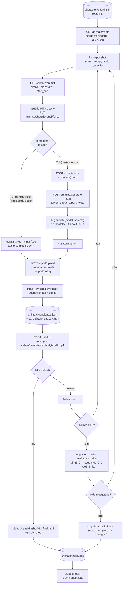
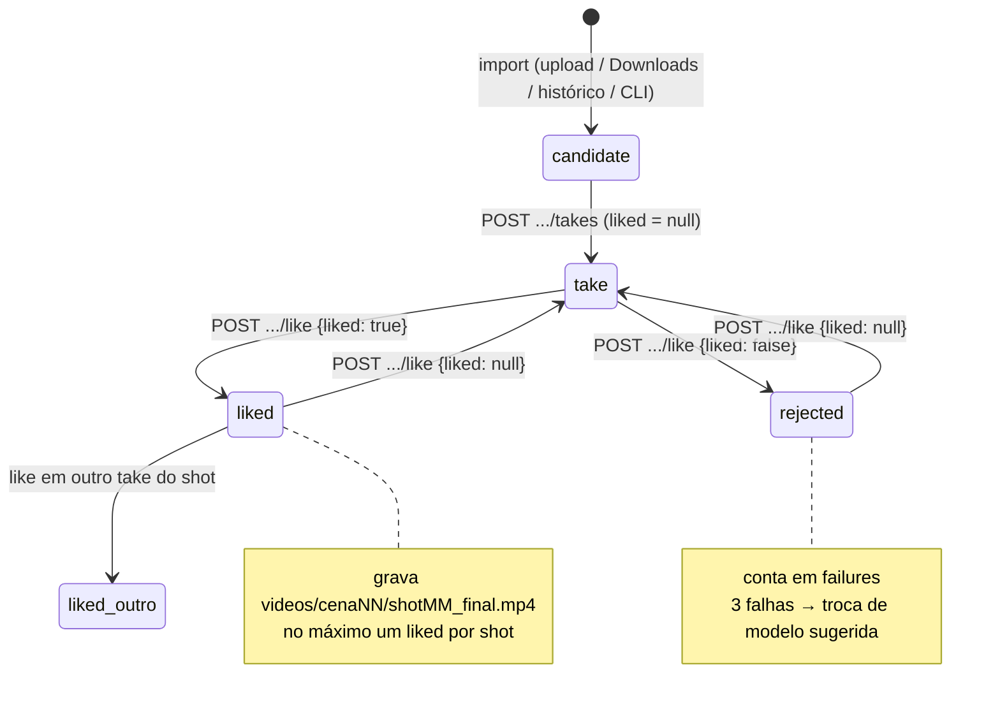
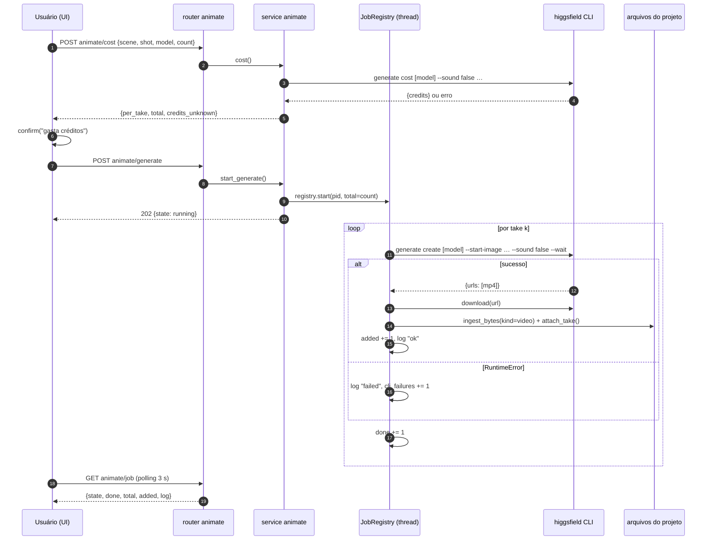

# Diagramas — animate (etapa 6, aula 012)

Fonte: `docs/domains/animate/features/animate-fdd.md` (seções 4 e 5).

## 1. Fluxo principal (modo UI) e caminho pago pelo CLI

## 2. Estados de um take

## 3. Sequência da geração paga pelo CLI

