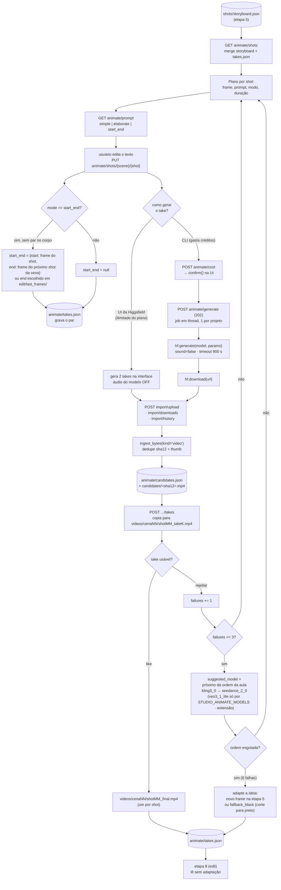
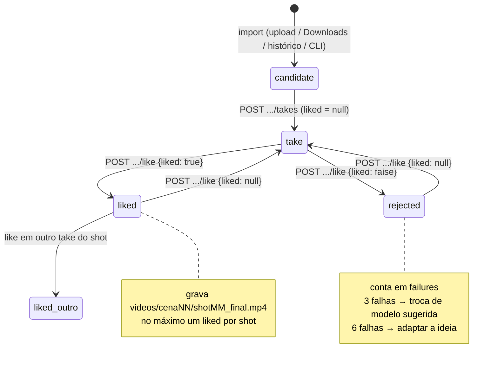
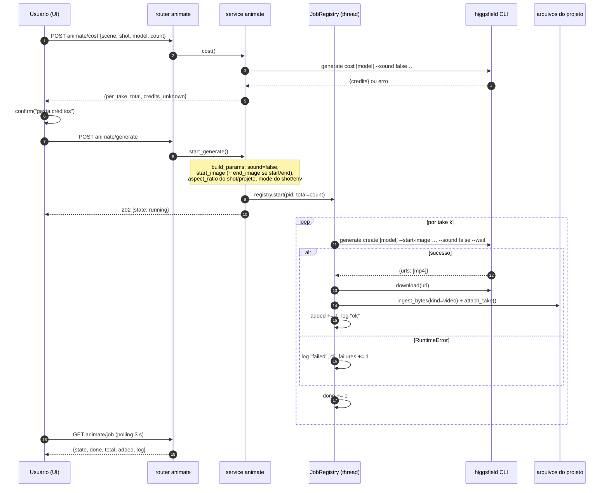
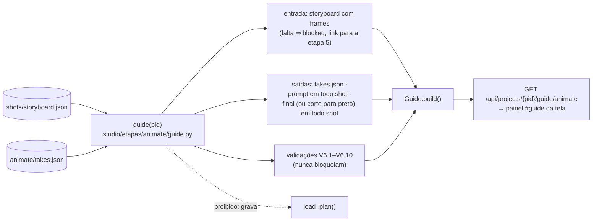
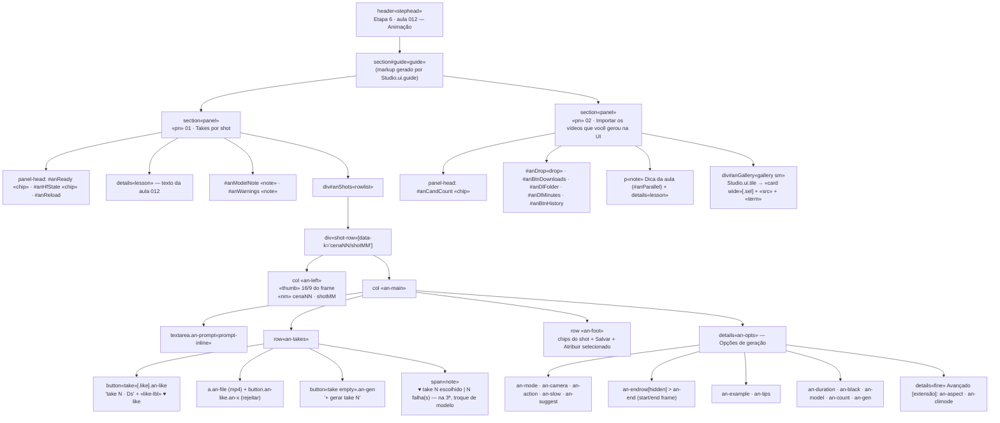

# Diagramas — animate (etapa 6, aula 012)

Fonte: `docs/domains/animate/features/animate-fdd.md` (seções 4, 5 e 12 — wave 2/OS-017).

## 1. Fluxo principal (modo UI) e caminho pago pelo CLI

## 2. Estados de um take

## 3. Sequência da geração paga pelo CLI

## 4. Guia da etapa (wave 2 · leitura pura)

---

## Estrutura da tela após o redesign (wave 3 · `ADH-OS-20260826-06`)

Fonte: `docs/domains/animate/features/views-animate-redesign-fdd.md` §5. Nomes entre `«»` são
classes do catálogo do shell (`shell-redesign`, `ADH-OS-20260826-02`).

Roteamento de clique (delegação única em `#anShots`, `e.target.closest('button')`):
`an-suggest` → `GET animate/prompt` · `an-save` → `PUT animate/shots/{c}/{s}` ·
`an-assign` → `POST …/takes` · `an-like` → `POST …/takes/{id}/like` ·
`an-gen` (inclusive o tile `«take empty»`) → `confirmCost` + `POST animate/generate` + polling.
