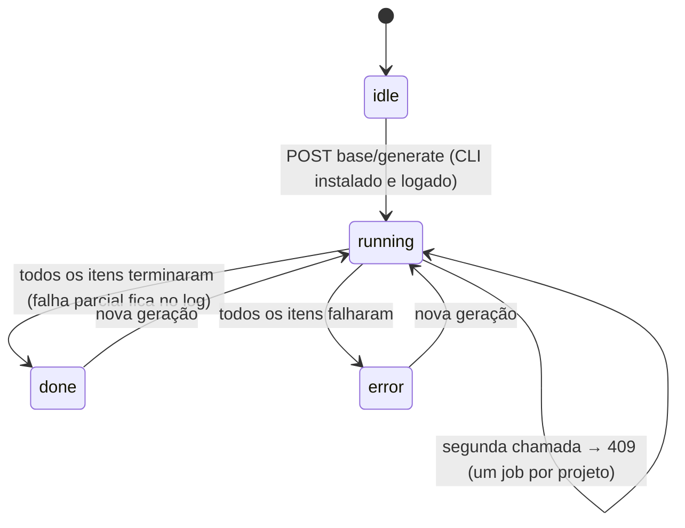
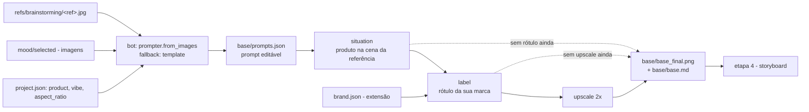

# Etapa 3 — Imagem base (aula 009)

## Fluxo principal: modo UI (o caminho da aula)

```mermaid
sequenceDiagram
    autonumber
    actor U as Usuário
    participant V as view.js (SPA)
    participant R as router.py (/api/projects/{pid}/base)
    participant S as studio/base/service.py
    participant I as studio/common/ingest.py
    participant FS as projects/&lt;pid&gt;/
    participant B as bot: common/prompter.py (Claude CLI)
    participant HF as UI da Higgsfield (fora do Studio)

    U->>V: abre a Etapa 3
    V->>R: GET /api/higgsfield/status (chip do CLI) e GET /api/mood/downloads-folder (pasta padrão)
    V->>R: GET base/prompts, base/brand, base/candidates, guide/base
    R->>S: prompts(pid)
    S->>FS: lê project.json, refs/candidates.json + brainstorming/, mood/selected/, base/prompts.json
    S-->>V: por referência: instrução para o BOT (sessão sem viés) + prompt para gerar (editável)
    Note over S,V: 422 quando falta referência escolhida (etapa 1) ou imagem em mood/selected/ (etapa 2)

    U->>V: "Gerar prompt" (referência + instrução em uma frase)
    V->>R: POST base/prompts/generate {ref_id, mode, instruction, no_bias, no_people}
    R->>S: generate_prompt(...)
    S->>B: from_images("base", [referência] + mood[:4], instrução, brief)
    B-->>S: prompt detalhado em inglês (câmera, lente, luz)
    S->>FS: base/prompts.json (histórico)
    Note over V,B: não entregou a ideia? no_bias=true → só a referência, sem brief e sem mood<br/>(a "aba nova" da aula é do bot, não da Higgsfield)<br/>sem Claude CLI: modo template (fallback determinístico)

    U->>HF: anexa referência + 1..3 do mood, cola o prompt gerado
    HF-->>U: imagens geradas (ilimitado do plano)
    U->>V: importa (upload / pasta Downloads / histórico do CLI) com kind=situation e ref_id
    V->>R: POST base/import/*
    R->>S: import_*(pid, kind, ref_id)
    S->>I: ingest_bytes (dedupe sha12, thumb)
    I->>FS: base/candidates/&lt;id&gt;.png + base/candidates.json
    S->>FS: completa kind (situation|label|upscale) e ref_id nas novas candidatas
    S-->>V: {added, warnings}  %% kind=upscale: avisa se a largura não ficou ~2x a da origem

    U->>V: escolhe a melhor situação
    V->>R: POST base/select {id}
    R->>S: select(pid, id)
    S->>FS: selected exclusivo no kind + base/base_final.png + base/base.md

    U->>V: informa a marca (extensão) e copia o prompt de rótulo
    U->>HF: Nano Banana troca o rótulo (uma instrução por vez)
    U->>V: importa com kind=label, seleciona
    U->>HF: Upscale 2x, preset High Fidelity V2
    U->>V: importa com kind=upscale, seleciona
    S->>FS: base_final.png passa a ser a upscale; base.md registra a cadeia e os prompts inteiros
    V->>R: GET guide/base (depois de cada ação que muda artefato)
    R->>S: guide(pid) — leitura pura: entradas, saídas, validações da aula, próxima ação
```

## Alternativa paga: geração via CLI



## Cadeia da imagem base



`base_final.png` é sempre a candidata selecionada mais avançada (upscale &gt; label &gt; situação).
Escolher um passo anterior recomeça a cadeia: as seleções dos passos seguintes caem.

## O guia da etapa (`etapas/base/guide.py`, wave 2)

```mermaid
flowchart TD
    subgraph L[leitura pura — nunca grava]
        P1[project.json] --> G
        P2[refs/candidates.json + brainstorming/] --> G
        P3[mood/selected/] --> G
        P4[base/candidates.json] --> G
        P5[base/brand.json] --> G
        P6[base/base.md] --> G
        P7[base/prompts.json] --> G
    end
    G[guide&#40;pid&#41;] --> IN[entradas: refs, mood, produto<br/>fail = etapa BLOQUEADA]
    G --> OUT[saídas: base_final.png, base.md<br/>fração ok = progresso]
    G --> CK[validações da aula<br/>upscale ~2x · rótulo · prompt EN ≥ 40 palavras<br/>ref_id válido · ≥ 2048 px · prompts no base.md]
    IN --> ST{status}
    OUT --> ST
    ST --> R[blocked / todo / in_progress / done]
    CK --> NA[próxima ação: escolher situação → trocar rótulo → upscale 2x]
```



Validações **nunca** bloqueiam (são atenção); só entradas em `fail` bloqueiam a etapa.
