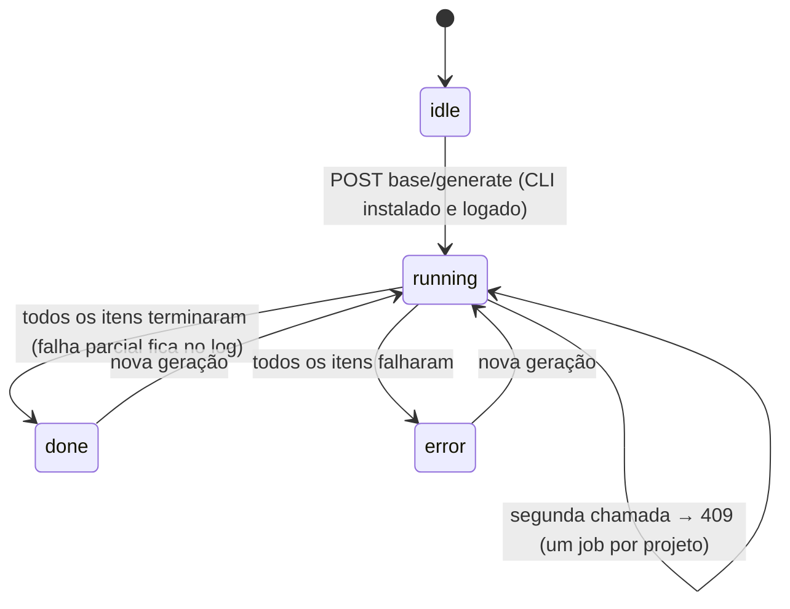
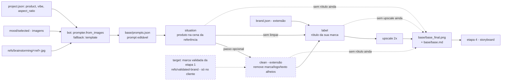

# Etapa 3 — Imagem base (aula 009)

## Fluxo principal: modo UI (o caminho da aula)

```mermaid
sequenceDiagram
    autonumber
    actor U as Usuário
    participant V as view.js (SPA)
    participant R as router.py (/api/projects/{pid}/base)
    participant S as studio/base/service.py
    participant I as studio/common/ingest.py
    participant FS as projects/&lt;pid&gt;/
    participant B as bot: common/prompter.py (Claude CLI)
    participant HF as UI da Higgsfield (fora do Studio)

    U->>V: abre a Etapa 3
    V->>R: GET /api/higgsfield/status (chip do CLI) e GET /api/mood/downloads-folder (pasta padrão)
    V->>R: GET base/prompter (o bot está disponível?), base/prompts, base/prompts/history
    V->>R: GET base/brand, base/candidates, guide/base
    R->>S: prompts(pid)
    S->>FS: lê project.json, refs/candidates.json + brainstorming/, mood/selected/, base/prompts.json
    S-->>V: por referência: instrução para o BOT (sessão sem viés) + prompt para gerar (editável)
    Note over S,V: 422 quando falta referência escolhida (etapa 1) ou imagem em mood/selected/ (etapa 2)

    U->>V: "Gerar prompt" (referência + instrução em uma frase)
    V->>R: POST base/prompts/generate {ref_id, mode, instruction, no_bias, no_people}
    R->>S: generate_prompt(...)
    S->>B: from_images("base", [referência] + mood[:4], instrução, brief)
    B-->>S: prompt detalhado em inglês (câmera, lente, luz)
    S->>FS: base/prompts.json (histórico)
    Note over V,B: não entregou a ideia? no_bias=true → só a referência, sem brief e sem mood<br/>(a "aba nova" da aula é do bot, não da Higgsfield)<br/>sem Claude CLI: modo template (fallback determinístico)

    U->>HF: anexa referência + 1..3 do mood, cola o prompt gerado
    HF-->>U: imagens geradas (ilimitado do plano)
    U->>V: importa (upload / pasta Downloads / histórico do CLI) com kind=situation e ref_id
    V->>R: POST base/import/*
    R->>S: import_*(pid, kind, ref_id)
    S->>I: ingest_bytes (dedupe sha12, thumb)
    I->>FS: base/candidates/&lt;id&gt;.png + base/candidates.json
    S->>FS: completa kind (situation|clean|label|upscale) e ref_id nas novas candidatas
    S-->>V: {added, warnings}  %% kind=upscale: avisa se a largura não ficou ~2x a da origem

    U->>V: escolhe a melhor situação
    V->>R: POST base/select {id}
    R->>S: select(pid, id)
    S->>FS: selected exclusivo no kind + base/base_final.png + base/base.md

    Note over U,HF: passo OPCIONAL [extensão] wave 9: limpar a marca alheia da situação<br/>copia o prompt de limpeza, edita na UI e importa com kind=clean<br/>(caminho pago: ver "Limpeza de marca — caminho pago")

    U->>V: informa a marca (extensão) e copia o prompt de rótulo
    U->>HF: Nano Banana troca o rótulo (uma instrução por vez)
    U->>V: importa com kind=label, seleciona
    U->>HF: Upscale 2x, preset High Fidelity V2
    U->>V: importa com kind=upscale, seleciona
    S->>FS: base_final.png passa a ser a upscale; base.md registra a cadeia e os prompts inteiros
    V->>R: GET guide/base (depois de cada ação que muda artefato)
    R->>S: guide(pid) — leitura pura: entradas, saídas, validações da aula, próxima ação
```

## Alternativa paga: geração via CLI



## Cadeia da imagem base



`base_final.png` é sempre a candidata selecionada mais avançada
(upscale &gt; label &gt; clean &gt; situação). Escolher um passo anterior recomeça a cadeia: as
seleções dos passos seguintes caem.

O passo `clean` `[extensão]` (wave 9, `RANK` 1) é **opcional**: projeto sem candidata `clean` roda a
cadeia de três passos da aula exatamente como antes. Quando existe uma clean selecionada, é ela — e
não a situação — que o `label` usa como imagem de origem; sem ela, o fallback é a situação, como
sempre foi. "Trocar por minha marca" não é um kind híbrido: é o passo `label` de sempre, partindo da
embalagem já limpa.

## Limpeza de marca `[extensão]` — caminho pago (wave 9)

FDD `docs/domains/base/features/base-clean-marca-fdd.md`, seção 4. Nenhuma rota nova: `clean` é um
valor novo do `kind` nos contratos que já eram parametrizados por ele. No modo UI (ilimitado) o
usuário copia o mesmo prompt da tela, edita na Higgsfield e importa com `kind=clean` — o desenho
abaixo é só do atalho pago.

```mermaid
sequenceDiagram
    autonumber
    actor U as Usuário
    participant V as view.js (SPA)
    participant RF as router refs (/refs/validated-brand)
    participant R as router.py (/api/projects/{pid}/base)
    participant S as studio/base/service.py
    participant ST as common/settings.py (ADR-016)
    participant HF as CLI da Higgsfield (ADR-002)
    participant FS as projects/&lt;pid&gt;/

    Note over U,V: pré-condição: melhor situação JÁ escolhida<br/>senão 422 "Escolha primeiro a melhor imagem de situação (aula 009)."

    V->>RF: GET refs/validated-brand (leitura SÓ no cliente, ADR-020)
    RF-->>V: {"brand": "Red Bull"} → pré-preenche o campo target
    V-->>U: prompt de limpeza editável + aviso "aproximação por prompt, não é inpaint"

    U->>V: "Gerar via CLI"
    V->>R: POST base/cost {kind:"clean", target}
    R->>S: estimate_cost(..., target)
    S->>S: _plan("clean") — origem = situação selecionada<br/>prompt = prompt editado OU clean_prompt(target)
    S->>HF: hf.cost (não gasta crédito)
    S-->>V: {per_item, count: 3, total}
    V-->>U: Studio.ui.confirmCost (modal)
    U-->>V: confirma

    V->>R: POST base/generate {kind:"clean", target}
    R->>S: start_generate(..., target)
    S->>ST: default_for("base.clean", pid) → nano_banana_2 / 2k
    loop count itens (default 3)
        S->>HF: hf.generate {prompt, image_references: [arquivo da situação]}
        HF-->>S: urls
        S->>FS: ingest_bytes → candidata kind="clean"
        S->>ST: record_generation(action="base.clean") → spend-ledger.jsonl
    end
    V->>R: GET base/job (polling 3 s) até done
    Note over S,V: falha de um item fica no log e o job segue (regra atual)

    U->>V: escolhe a melhor clean
    V->>R: POST base/select {id}
    R->>S: select(pid, id)
    S->>FS: exclusiva no kind + derruba label/upscale + base_final.png + base.md
    S-->>V: {final, kind: "clean", chain: {situation, clean, label: null, upscale: null}}
    V-->>U: atalho "trocar pela minha marca" → navega ao passo de rótulo
```

## O guia da etapa (`etapas/base/guide.py`, wave 2)

```mermaid
flowchart TD
    subgraph L[leitura pura — nunca grava]
        P1[project.json] --> G
        P2[refs/candidates.json + brainstorming/] --> G
        P3[mood/selected/] --> G
        P4[base/candidates.json] --> G
        P5[base/brand.json] --> G
        P6[base/base.md] --> G
        P7[base/prompts.json] --> G
    end
    G[guide&#40;pid&#41;] --> IN[entradas: refs, mood, produto<br/>fail = etapa BLOQUEADA]
    G --> OUT[saídas: base_final.png, base.md<br/>fração ok = progresso]
    G --> CK[validações da aula<br/>upscale ~2x · rótulo · prompt EN ≥ 40 palavras<br/>ref_id válido · ≥ 2048 px · prompts no base.md]
    IN --> ST{status}
    OUT --> ST
    ST --> R[blocked / todo / in_progress / done]
    CK --> NA[próxima ação: escolher situação → trocar rótulo → upscale 2x]
```



Validações **nunca** bloqueiam (são atenção); só entradas em `fail` bloqueiam a etapa.
