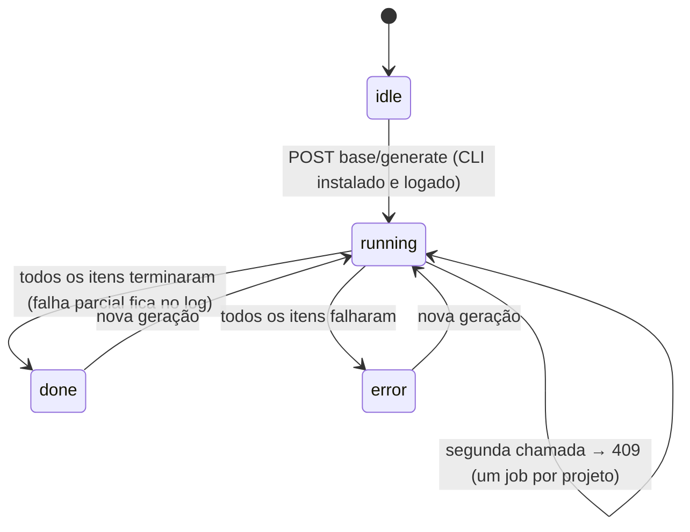
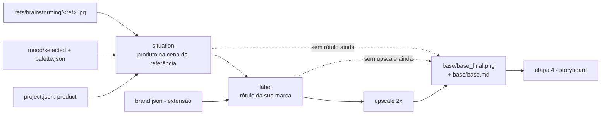

# Etapa 3 — Imagem base (aula 009)

## Fluxo principal: modo UI (o caminho da aula)

```mermaid
sequenceDiagram
    autonumber
    actor U as Usuário
    participant V as view.js (SPA)
    participant R as router.py (/api/projects/{pid}/base)
    participant S as studio/base/service.py
    participant I as studio/common/ingest.py
    participant FS as projects/&lt;pid&gt;/
    participant HF as UI da Higgsfield (fora do Studio)

    U->>V: abre a Etapa 3
    V->>R: GET base/prompts, base/brand, base/candidates
    R->>S: prompts(pid)
    S->>FS: lê project.json, refs/candidates.json + brainstorming/, mood/palette.json, mood/selected/
    S-->>V: 1 prompt de situação por referência (+ variante sem viés), prompt de rótulo, hint de upscale
    Note over S,V: 422 quando falta referência escolhida ou mood salvo (volte às etapas 1 e 2)

    U->>HF: aba nova, anexa referência + 1..3 do mood, cola o prompt
    HF-->>U: imagens geradas (ilimitado do plano)
    U->>V: importa (upload / pasta Downloads / histórico do CLI) com kind=situation e ref_id
    V->>R: POST base/import/*
    R->>S: import_*(pid, kind, ref_id)
    S->>I: ingest_bytes (dedupe sha12, thumb)
    I->>FS: base/candidates/&lt;id&gt;.png + base/candidates.json
    S->>FS: completa kind (situation|label|upscale) e ref_id nas novas candidatas

    U->>V: escolhe a melhor situação
    V->>R: POST base/select {id}
    R->>S: select(pid, id)
    S->>FS: selected exclusivo no kind + base/base_final.png + base/base.md

    U->>V: informa a marca (extensão) e copia o prompt de rótulo
    U->>HF: Nano Banana troca o rótulo (uma instrução por vez)
    U->>V: importa com kind=label, seleciona
    U->>HF: Upscale 2x High Fidelity V2
    U->>V: importa com kind=upscale, seleciona
    S->>FS: base_final.png passa a ser a upscale; base.md registra a cadeia
```

## Alternativa paga: geração via CLI



## Cadeia da imagem base



`base_final.png` é sempre a candidata selecionada mais avançada (upscale &gt; label &gt; situação).
Escolher um passo anterior recomeça a cadeia: as seleções dos passos seguintes caem.
