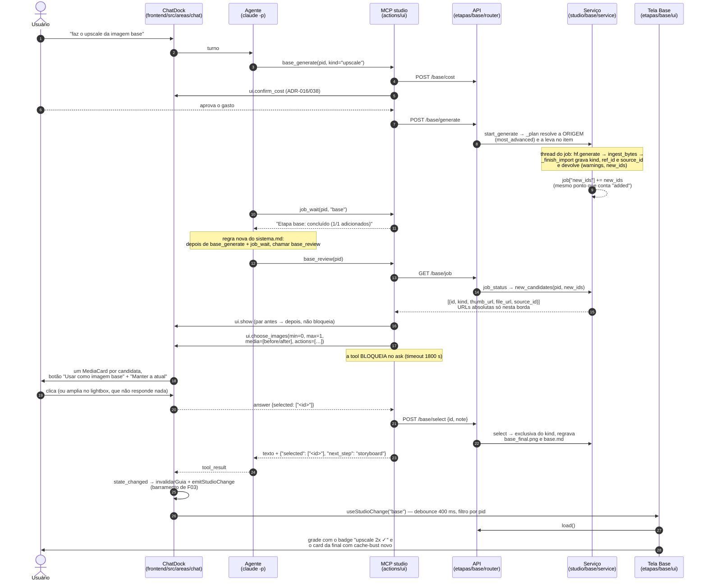

# Revisão do upscale pelo chat `[extensão]`

Fluxo principal do FDD `base-upscale-chat` §4 (Wave 11 · F11, card #94, Task-Id
ADH-OS-20260906-13): do pedido no dock até a tela Base mostrar a nova final **sem navegação e sem
F5**. Complementa `fluxo-imagem-base.md`, que documenta a cadeia da etapa 3 pela tela.

O que o diagrama mostra de novo em relação ao de hoje: o job passa a **devolver o que produziu**
(`new_candidates` + `source_id`), o que dá ao agente um caminho servível para mostrar; e a escolha
continua sendo um clique do usuário resolvendo um `ask` (ADR-038) — a tool nunca seleciona sozinha.

## Caminhos alternativos (FDD §4 e §6)

| Situação | O que acontece |
| --- | --- |
| Sem job recente (`state:"idle"` ou `new_candidates: []`) | cai para `GET /base/candidates` e revisa o `kind` mais avançado ainda sem seleção |
| `base_review(ids=[…])` | usa só esses ids; id inexistente vira aviso no texto, sem derrubar o fluxo |
| "Manter a atual" (`{selected: [], keep: true}`) | **nenhum** `POST /base/select`; retorno sem sufixo JSON |
| Sem resposta (timeout do `ask`) | "O usuário não escolheu (sem resposta)"; nada é selecionado |
| Sem interface (terminal, sem `STUDIO_CHAT_ID`) | a tool lista ids e URLs em texto e pede que o usuário diga qual usar |
| Job `running` | "Ainda gerando (d/t)"; a tool **não** abre `ask` |
| Job `error` | reporta o erro e, havendo candidatas, segue para a escolha |
| Candidata sem `source_id` (ou origem apagada) | o par antes/depois é omitido; só a imagem nova aparece |
| Tela Base não montada, ou montada em outro `pid` | o evento é descartado pelo barramento; ao abrir, o `useEffect([pid])` carrega o estado certo |

## Invariantes preservados

- No máximo 1 candidata `selected` por `kind`; `base_final.png` existe se e somente se há alguma
  selecionada, e é sempre a mais avançada.
- `file`/`thumb` continuam relativos à raiz do projeto; a prefixação com `/files/{pid}/` só ocorre
  em `new_candidates` e em `_images_for`.
- `base_review` só chama `POST /base/select` com um `ask` respondido e um id vindo da resposta.
- `len(new_candidates) == job["added"]` nos jobs concluídos com sucesso.
- `source_id` é `null` ou o id de **outra** candidata do mesmo projeto, nunca o próprio id.
