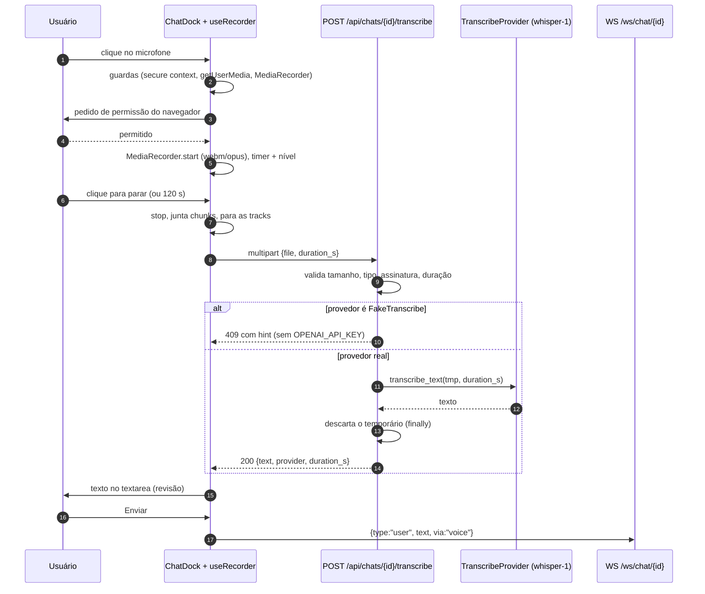
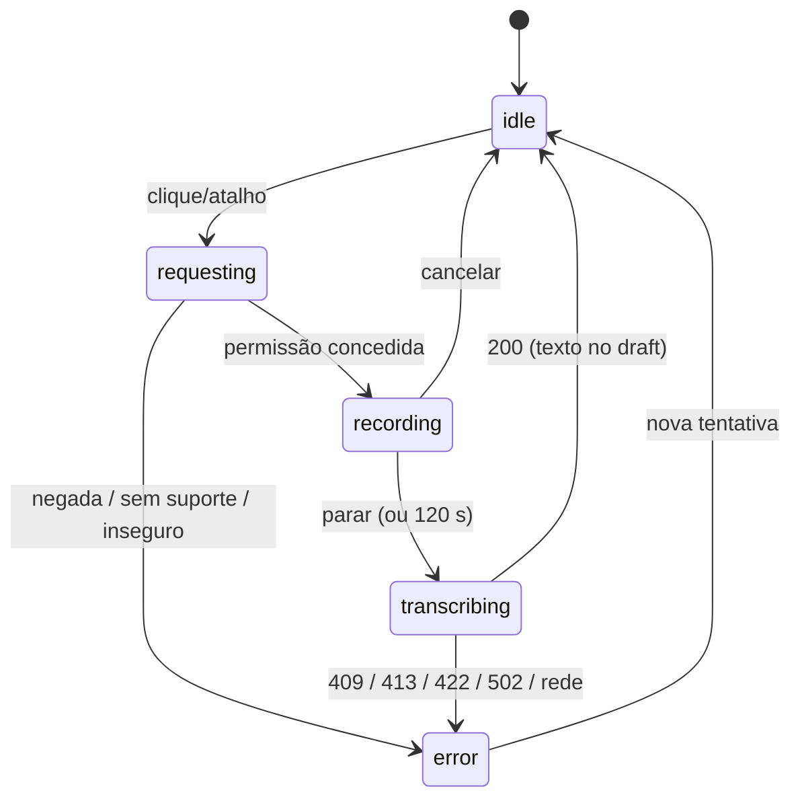

# chat — entrada por voz (fluxo da fala ao envio) `[extensão]`

Task-Id: ADH-OS-20260906-11 · Card #89 https://trello.com/c/a0yHBAm5
FDD: [chat-audio](../../features/chat-audio-fdd.md) (§4) · HLD: [chat](../../hld.md) v1.4
ADR: [ADR-043](../../../../adrs/generated/STUDIO/ADR-043-entrada-por-voz-no-chat.md) (entrada por
voz) · [ADR-024](../../../../adrs/generated/STUDIO/ADR-024-transcricao-de-legendas-via-openai-whisper-1-com-fake-sem-chave.md)
(provedor de STT) · [ADR-041](../../../../adrs/generated/STUDIO/ADR-041-protocolo-do-websocket-do-chat-v2-aditivo.md)
(campo `user.via` no protocolo do WS)

Conferidos contra a implementação em `studio/chat/voice.py`, `studio/chat/router.py`,
`frontend/src/areas/chat/useRecorder.ts` e `frontend/src/areas/chat/ChatDock.tsx`.

Os dois invariantes que os diagramas existem para tornar visíveis:

1. **O agente nunca vê áudio** (ADR-040). A rota de transcrição é uma conversa entre o browser e o
   servidor; o que entra no turno é a mesma mensagem `user` de sempre, agora com a procedência
   `via:"voice"`.
2. **Nenhum byte sobrevive à requisição.** O arquivo só existe dentro de um `TemporaryDirectory`
   fechado no `finally` — inclusive quando o provedor levanta.

## 1. Sequência: gravar, transcrever, revisar, enviar

Passos 8–12 são a rota; o resto é browser. O `409` é o **único erro terminal**: o cliente o mostra
como aviso persistente no composer e desabilita o microfone até a próxima montagem do dock —
insistir sem chave só repete o mesmo diagnóstico. `413`/`422`/`502` mostram o `detail` e voltam
para `idle`, porque uma nova tentativa pode dar certo.

Com a preferência `studio.chat.voiceAutoSend` ligada, os passos 20–22 acontecem sem o clique em
Enviar; com o turno `busy`, o texto fica no draft e o aviso pede que o turno atual termine.

## 2. Máquina de estados do `useRecorder`

`recording → idle` (Cancelar) descarta os chunks e **não** chama a rota. Toda transição que sai de
`recording` — parar, cancelar, teto de 120 s, desmontagem do dock — passa por `track.stop()` em
todas as tracks do stream; é isso que apaga o indicador de microfone do navegador. A desmontagem
do dock durante `transcribing` marca a requisição em voo como cancelada (mesmo padrão de
`useChatSocket.ts`), então nenhuma resposta tardia escreve num draft que já não existe.
