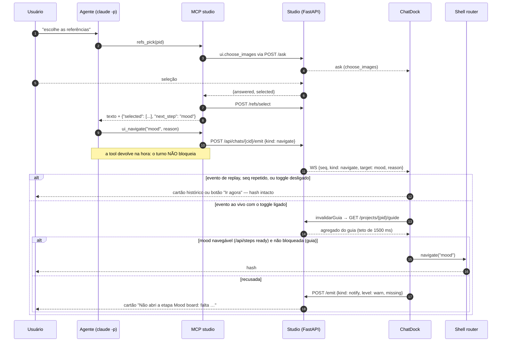
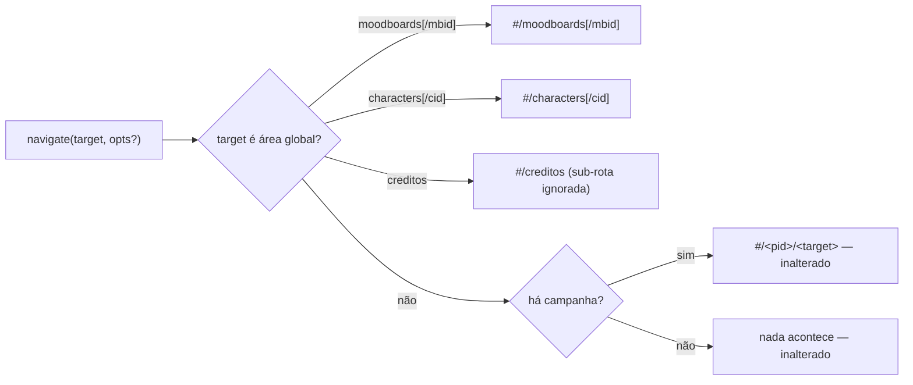
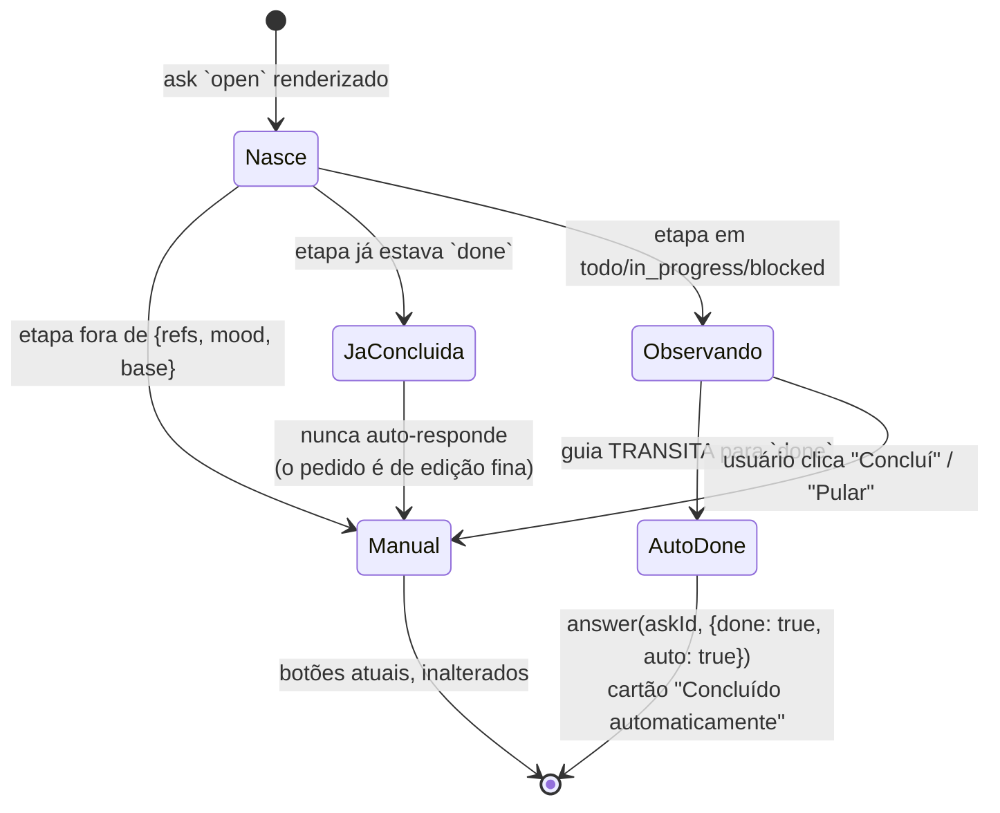

# Navegação automática pelo chat (`ui_navigate`) `[extensão]`

Task-Id: ADH-OS-20260906-10 · Card #88 https://trello.com/c/YNf9Rcwj
FDD: [chat-navigate](../../features/chat-navigate-fdd.md) · ADR-038 (adendo Wave 11)

Fluxo principal da seção 4 do FDD: depois de o usuário escolher as referências pelo chat, a tela
vai sozinha para a etapa seguinte. Três invariantes desenham o diagrama:

- A tool **não bloqueia**: `ui_navigate` usa `POST /api/chats/{cid}/emit`, nunca `/ask`. O turno do
  agente segue enquanto o browser decide.
- **Quem decide é o dock**, não o agente (ADR-038). O usuário mantém veto pelo toggle "seguir o
  assistente", e a decisão só acontece **depois** do refresh do guia (a mesma invalidação que a
  F03 já dispara), com teto de 1500 ms.
- **Nenhuma recusa é silenciosa.** O redirecionamento mudo para o overview
  (`frontend/src/shell/router.ts`) é justamente o que esta feature elimina no caminho do chat: todo
  alvo recusado vira um cartão `notify` com o motivo, e o hash não muda.

Prontidão continua vindo do backend (ADR-010 item a): o dock compara dois campos que o servidor
mandou — `status === "ready"` no catálogo `/api/steps` (navegável) e `status !== "blocked"` no guia
da etapa (liberada) — e não deriva nada.

## Áreas globais

`navigate` do shell passa a montar também as áreas globais já reservadas em
`frontend/src/shell/constants.ts` — contrato **consumido pela frente F12**. A gramática do hash não
muda; o que muda é o conjunto de alvos que `navigate` sabe montar.

Áreas globais navegam **sem consultar o guia** (não têm guia: ADR-013 / ADR-016 / ADR-039) e
funcionam sem campanha aberta.

## O laço `open → done`

O ADR-038 previa `open → done`, mas a conclusão nunca fechava sozinha: nenhuma tela publica
conclusão. O adendo da Wave 11 resolve **derivando do guia**, com duas travas contra fechar o que o
usuário não concluiu (risco R4 do FDD).

`auto: true` marca no transcript que não houve clique — auditável pelo `GET /api/chats/{id}/trace`.
A lista opt-in é uma constante única no dock (`AUTO_DONE_STEPS`); esvaziá-la volta ao "Concluí"
manual sem mudar contrato nenhum.
