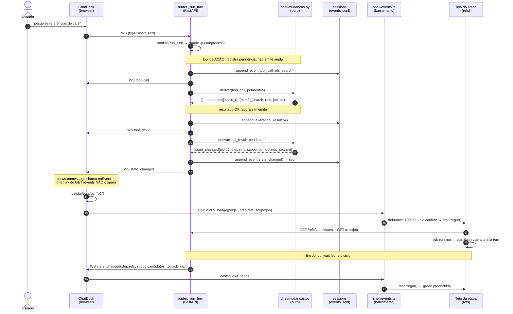
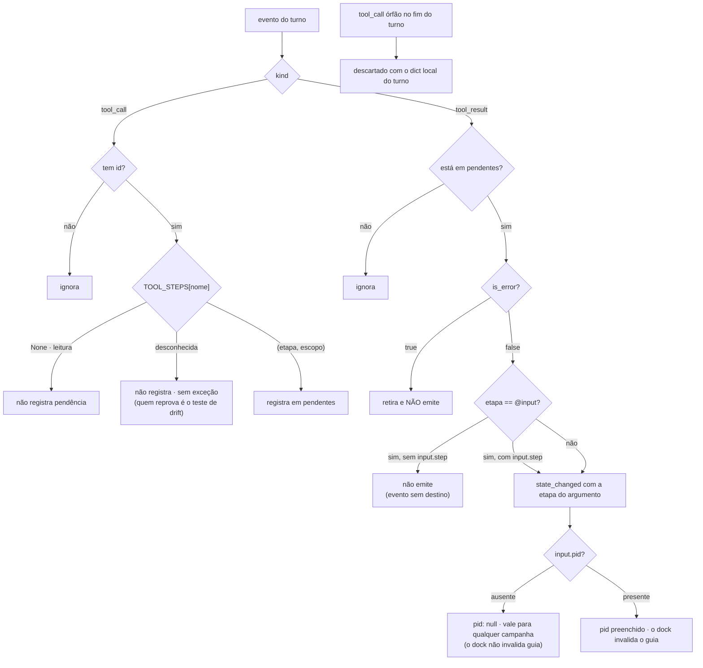

# Sincronização chat → telas (`state_changed`) `[extensão]`

Task-Id: ADH-OS-20260906-05 · Card #87 https://trello.com/c/CvcqIxB5
FDD: [chat-sync](../../features/chat-sync-fdd.md) · ADR-041 (protocolo do WS v2, aditivo)

Fluxo principal da seção 4 do FDD: uma tool de ação disparada pelo chat faz a tela da etapa
recarregar sozinha, sem o usuário navegar. O evento é um **aviso** — quem tem os dados continua
sendo o backend (ADR-010 item a), e o polling das telas continua como está (ADR-006).

## Ramos que NÃO emitem

