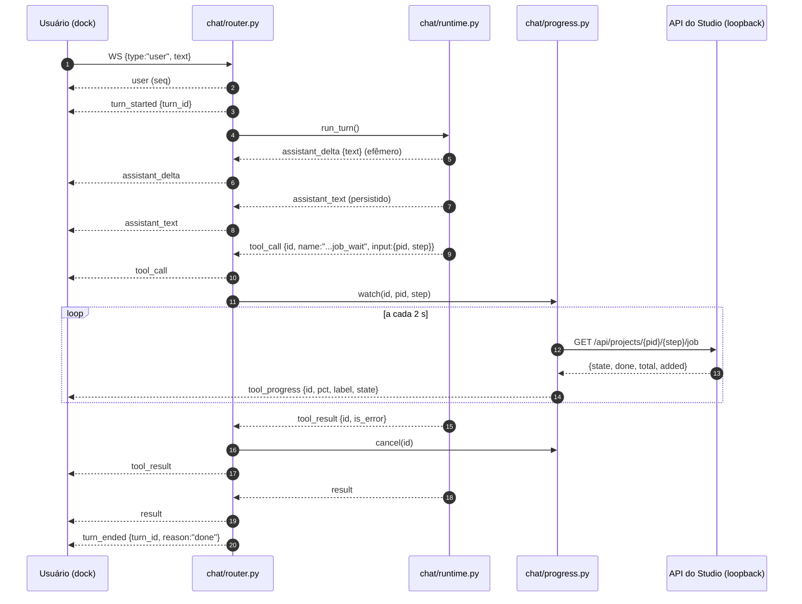
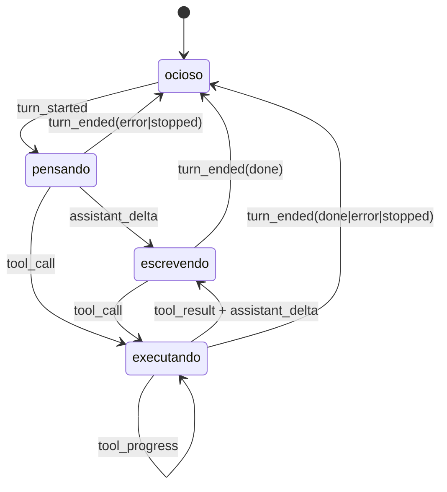

# chat — feedback ao vivo do turno

Diagramas da fatia **Wave 11 · F02 (`chat-feedback`)**, card #86 / `ADH-OS-20260906-04`.
Fonte normativa: `docs/domains/chat/features/chat-feedback-fdd.md` (§4 e §5) e
`docs/domains/chat/hld.md` v1.1, seção "Feedback ao vivo do turno". Protocolo do WebSocket:
ADR-041 (nota de emenda em ADR-036). Conferidos contra a implementação em `studio/chat/router.py`,
`studio/chat/runtime.py`, `studio/chat/progress.py` e `frontend/src/areas/chat/`.

## 1. Sequência de um turno com feedback ao vivo

O que o diagrama mostra: onde nasce cada um dos quatro eventos novos e quem os classifica. O
`_run_turn` do router é o único ponto que decide **persistido × efêmero** (constante `EFEMEROS`):
persistido passa por `sessions.append_event` e ganha `seq`; efêmero vai direto ao `manager.push`,
com o `turn_id` injetado e **sem** `seq`. O `turn_ended` sai do `finally`, e não dos ramos, para que
nenhum caminho de saída (sucesso, exceção ou cancelamento) deixe o par de turno aberto.

## 2. Máquina de estados do dock

O que o diagrama mostra: o estado que o dock desenha é derivado só dos eventos do servidor — não há
mais heurística sobre o transcript no cliente. `ocioso` é a ausência de turno aberto; `pensando` é o
turno aberto sem texto nem tool; `escrevendo` é a bolha viva alimentada por `assistant_delta`;
`executando` é a linha de status com o rótulo humano da tool e, quando o job declara `total`, o
percentual. Qualquer `turn_ended` volta para `ocioso`, com `reason` em `done | error | stopped`.

