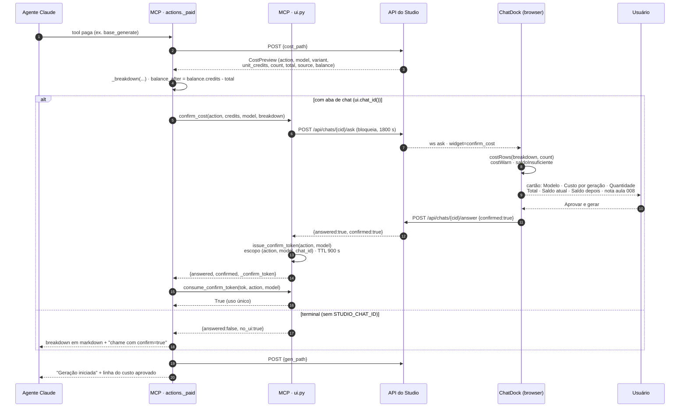
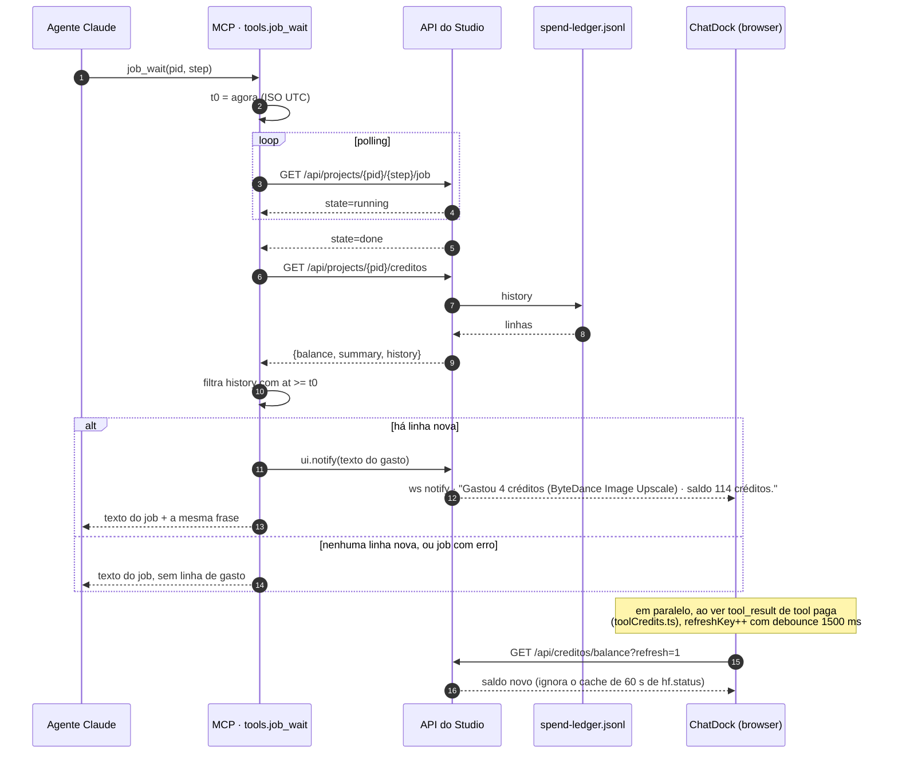
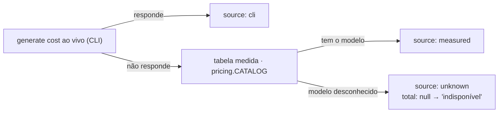

# Diagramas — creditos-chat `[extensão]`

Wave 11 · F10 · Task-Id `ADH-OS-20260906-12` · Card #91 <https://trello.com/c/XGFr052w>
FDD: `docs/domains/creditos/features/creditos-chat-fdd.md` (seção 4)

Os três fluxos principais da feature. O gate de custo da aula 008 (ADR-016) e a regra de que o
gasto é decisão do usuário (ADR-038) governam os três.

---

## Fluxo A — gate de custo rico no chat, com `confirm_token`

Corrige a assimetria entre tela e chat: o `breakdown` (o `CostPreview` inteiro) atravessa o MCP até
o dock, que renderiza as MESMAS linhas do `CostSheet` por `costRows`. Nenhum `POST` de geração
acontece sem token consumido (ADR-038 §3).



**Caminhos de recusa** (nenhum gera): usuário cancela · `ask` expira · token não emitido · token de
outra ação · token expirado · token já consumido. O token nunca chega ao modelo, nunca vai ao WS e
nunca é persistido.

---

## Fluxo B — gasto anunciado e saldo refrescado

O `notify` é derivado do **livro-caixa** (o que `record_generation` gravou), nunca da estimativa.
O que o chat anuncia é o que ficou registrado.



---

## Fluxo C — leitura de créditos pelo agente e reconciliação na tela

O MCP é cliente HTTP da própria API (ADR-037): `credits_status` nunca importa
`studio.creditos.service`.

```mermaid
flowchart TD
    Us([Usuário: "quanto ainda tenho?"]) --> Ag[Agente Claude]
    Ag --> T{pid informado?}
    T -->|sim| G1["GET /api/projects/{pid}/creditos"]
    T -->|não| G2["GET /api/creditos"]
    G1 --> F[tools.credits_status formata]
    G2 --> F
    Ag -.alternativa.-> R["resource studio://credits<br/>(escopo global)"]
    R --> F

    F --> Txt["Saldo Higgsfield + plano<br/>Gasto local: hoje · campanha · total<br/>5 últimos gastos<br/>parágrafo de reconciliação"]
    Txt --> Us

    subgraph Fontes["Duas contabilidades que NÃO se reconciliam"]
        CLI["Saldo — CLI da Higgsfield<br/>(higgsfield account status)"]
        LED["Gasto — livro-caixa local<br/>(spend-ledger.jsonl)"]
    end

    CLI -.-> F
    LED -.-> F

    subgraph Tela["Área #/creditos · BalanceCard"]
        BC["Saldo do CLI<br/>+ gasto hoje / neste projeto / total<br/>+ o texto que explica a diferença"]
    end

    CLI -.-> BC
    LED -.-> BC

    Note["Geração feita na UI da Higgsfield consome plano<br/>e NUNCA aparece no livro-caixa.<br/>Inferir o gasto pela variação do saldo seria<br/>invenção de método (ADR-004) — a feature explica, não infere."]
    Fontes --- Note
```

---

## Precedência do custo (política de fallback, seção 6 do FDD)



Nunca um número inventado. Com `total` nulo o botão de aprovar continua ativo: a decisão de gastar
é do usuário (ADR-038).
