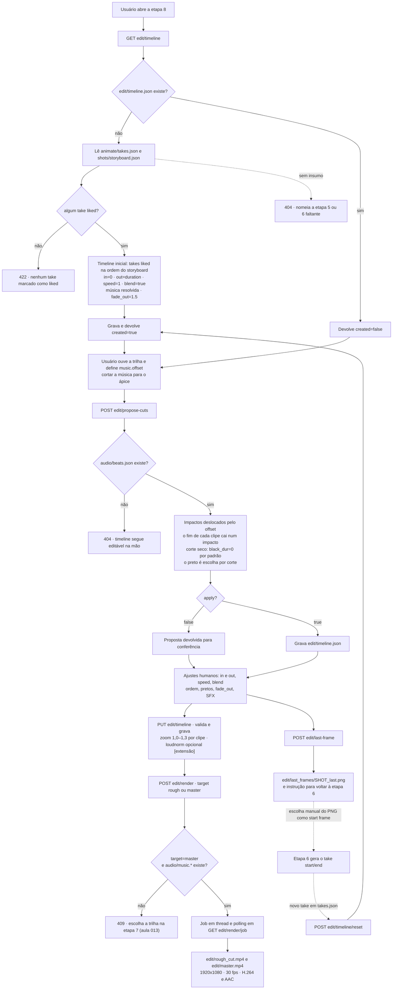
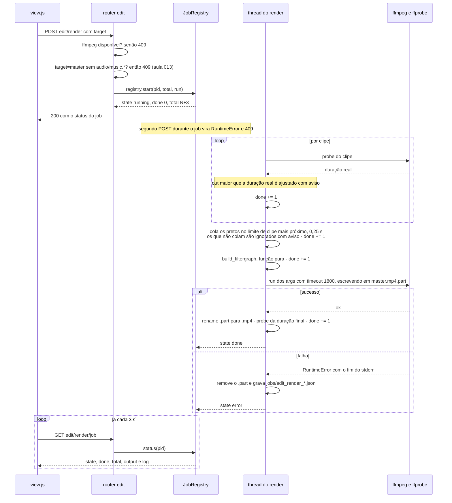
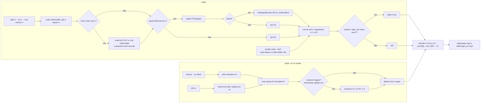

# Diagramas — edit (etapa 8 · Montagem no ritmo · aula 014)

Fonte: `docs/domains/edit/features/edit-fdd.md` (seções 4 e 6).

## Fluxo principal da montagem

## Render: fases do job e estados

## Composição do filtergraph

O `rough` usa o mesmo grafo sem `loudnorm`, sem `fade`/`afade` e sem SFX, com
`-preset veryfast -crf 23` — é a prévia rápida para conferir o ritmo dos cortes.
