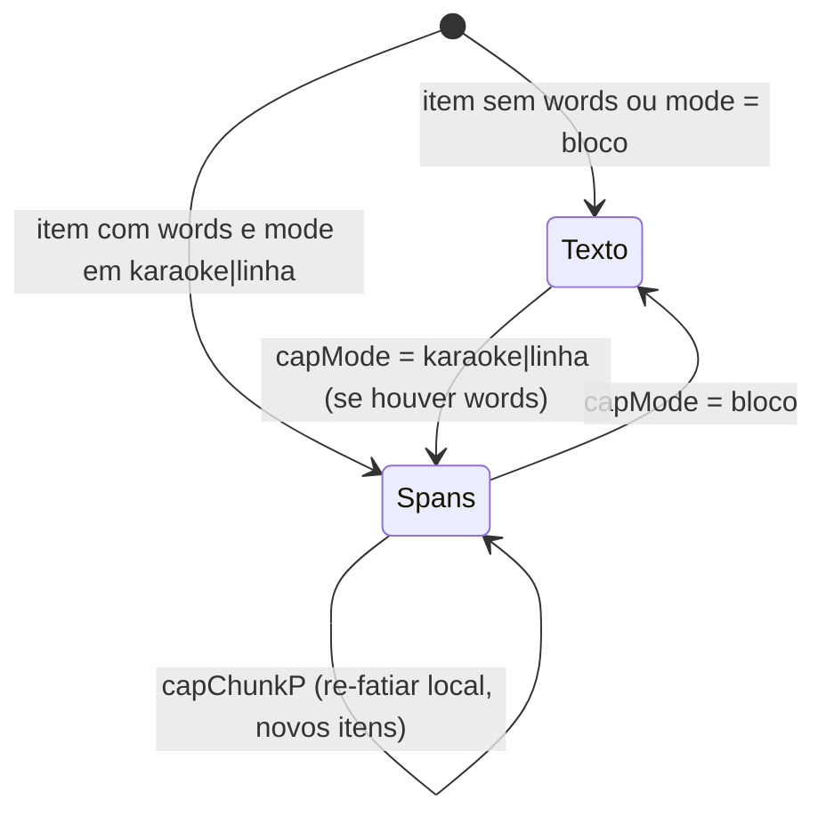

# FDD: edit · Legendas no editor (modal "Gerar legendas", karaokê no preview, propriedades) `[extensão]`

Versão: 1.0 · Data: 2026-08-29 · Task-Id `ADH-OS-20260829-40` · Card: <https://trello.com/c/DvXiT1oU>
Responsável: fluxo `/dd-parallel`, Wave 8, frente **C · legendas-frontend** (sub-wave 2), FDD gerado em **modo batch** (nenhuma pergunta ao usuário; decisões rotuladas `[auto-aceito: ...]`; divergência com contrato congelado vira Pendência na §10).

Fontes: `.claude/plans/2026-08-29-studio-de-video-estavel.md` (item 9, parte "Front (view.js)"), `docs/domains/studio/recon-wave-8.md`, `docs/domains/studio/waves/wave-8.md` (contrato HTTP congelado da frente B, provides da frente A, decisões da W2), `docs/domains/studio/diagrams/mermaid/wave-8-dependencias.md`, `docs/domains/edit/features/editor-video-completo-fdd.md` (formato e comportamento vigente do editor), referência JS do ContentFlow (`app/web/static/v3/studio-pro/stage.js` e `model.js`).

> **Gate de fidelidade (CLAUDE.md).** A aula 014 monta no CapCut sem legendas. Tudo aqui é `[extensão]` aprovada pelo dono do produto (plano aprovado em 2026-08-29), sob o ADR-030 (editor) e o ADR-024 (transcrição, frente B). O backbone do ffmpeg não muda. Esta frente é **só UI**: nenhuma rota nova, nenhum arquivo Python de serviço.

---

## 1. Contexto e motivação técnica

O editor de vídeo (`studio/etapas/edit/view.js`, vanilla JS dentro de `Studio.register("edit", ctx => {...})`) tem um painel "Legendas" (`pCaptions`) cujo botão `#capGen` hoje só mostra um `toast` dizendo que a geração automática depende de transcrição. A frente **B** entrega o servidor (`POST /captions/generate`, `POST /captions/narration/upload`, `GET /captions/narration`, `words/mode/hi/chunk` persistidos no `PUT /timeline`, burn-in karaokê no `master.mp4`) e a frente **A** entrega o editor estável (`commit(label, mutator, opts)` com render incremental, `renderLayers` reconciliado por `data-uid` com hook por tipo de camada, efeitos em texto/legenda). Esta frente fecha o item 9 do plano pelo lado do browser: o modal que chama a rota, o karaokê no preview e as propriedades do item de legenda.

**Encaixe no HLD.** Plugin de duas peças (`docs/domains/studio/hld.md`): tudo vive em `studio/etapas/edit/view.js` e `view.html`. Não se toca `ui.js`, `ui.css`, `style.css`, `app.py`, `index.html`, `app.js`, `steps.py`, `router.py` nem `studio/edit/*.py`. Helpers de UI reutilizados: `Studio.ui.modal({title, subtitle, html, actions})`, `ui.upload(url, files, field, extra)`, `ui.drop`, `ui.progressJob`, `toast`, `api()`.

**Atores.** Usuário (gera e ajusta legendas no editor); servidor da frente B (transcrição fake ou whisper, layout das janelas); ffmpeg (só no render, fora desta frente).

**Provides.**
- UI de legendas: modal "Gerar legendas" (`#capGen`), karaokê no preview (`paintKaraoke`, spans `[data-cap-widx]`), propriedades de legenda (modo, cor de destaque, chunk, re-sincronizar), deslocamento das `words` ao mover o item.
- Constantes espelhadas do backend em `view.js`: `WPS = 2.4`, `CAPTION_MODES`, `HI_COLORS`, `CHUNK_OPTS`, regra do centro (`wordsInWindow`).
- Teste de contrato de UI em `tests/test_edit_api.py` (strings novas presentes em `view.js`/`view.html`).

**Consumes.**
- De **A** (`develop`): `commit(label, mutator, opts)` com `opts.panel` (re-render do painel esquerdo sem `renderRoot`); `renderLayers(stage)` reconciliado por `data-uid` com hook por tipo de camada; `cssFilterFor(fx)` aplicável a itens `text`/`caption` (o filtro vai no wrapper da linha); `adjustTarget` para `caption`.
- De **B** (`develop`): contrato HTTP congelado da §5 (copiado de `wave-8.md`); itens `caption` com `words/mode/hi/chunk` sobrevivendo ao `PUT /timeline` + `GET`.
- Já existentes: `GET /api/projects/{pid}/storyboard/scenes` (`{scenes:[{id,n,text,images,primary}]}`), `GET /api/projects/{pid}/edit/media` (lista `{id,name,file,kind,duration}`), `St.timeline.clips[].file`, `St.timeline.music.file`.

**Suposições e restrições.**
- `[auto-aceito: a frente nasce da develop já com A e B integradas; o Preflight da §8 é obrigatório e aborta a frente se qualquer provide faltar (regra da wave: C depende das duas).]`
- `[auto-aceito: nenhum teste JS no repositório (ADR-008: pytest sem rede nem navegador); a validação de comportamento é por Playwright do qa-studio e o teste de contrato de UI fixa strings em view.js/view.html.]`
- `[auto-aceito: ctx.api() (studio/web/app.js:19) lança Error(detail) sem o status HTTP; para distinguir 422 de 502 e 404 o modal usa um helper local capPost(path, body) em view.js com fetch e devolve {status, body}. ui.js/app.js não são alterados.]`
- Sem travessão neste documento (regra do prompt de FDD).

---

## 2. Objetivos técnicos

1. **Gerar legendas sem sair do editor.** Do clique em `#capGen` até os itens na faixa `t_cap` há uma única chamada `POST /captions/generate` e um único `commit("gerar legendas", ..., {panel:true})`; nenhum `renderRoot()`.
2. **Karaokê barato por frame.** `paintKaraoke(t)` só troca `style.color` dos spans `[data-cap-widx]` já no DOM; custo O(palavras visíveis), tipicamente ≤ 6 spans; nenhum `innerHTML` por frame.
3. **Uma fonte de verdade para as constantes.** `WPS`, `CAPTION_MODES`, `HI_COLORS`, `CHUNK_OPTS` e a regra do centro em `view.js` são byte-iguais aos valores do contrato congelado (§5); o FDD lista os valores exatos.
4. **Persistência sem código novo.** Os itens devolvidos pelo servidor já estão no shape de `editor.tracks[t_cap].items[]`; `serialize()`/`save()` atuais mandam `words/mode/hi/chunk` no `PUT /timeline` e `load()` os traz de volta.
5. **Mover é deslocar; trim é recortar.** Mover um item com `words` desloca `words[].start_s/end_s` pelo mesmo delta; trim só muda a janela e o render filtra pela regra do centro.
6. **Retrocompat.** Item de legenda sem `words` (legenda manual) renderiza e edita exatamente como hoje; `mode` ausente = `bloco`.

---

## 3. Escopo e exclusões

**Incluído (arquivos: `studio/etapas/edit/view.js`, `studio/etapas/edit/view.html`, `tests/test_edit_api.py`, nota em `docs/domains/edit/features/editor-video-completo-fdd.md`)**

**(a) Painel Legendas (`pCaptions`).** O botão passa a ser `✨ Gerar legendas` e abre `ui.modal({title:"Gerar legendas", subtitle:"Roteiro ou áudio/vídeo · karaokê, linha ou bloco [extensão]", html, actions})` com:
- **Fonte** (radio `capSrc`: `script` | `audio`).
  - `Roteiro`: `<textarea id="capScript">` obrigatória; botão `usar descrições das cenas` chama `GET /api/projects/{pid}/storyboard/scenes`, concatena `scenes[].text` (ordem de `n`, separadas por quebra de linha) e pré-preenche a textarea, com o rótulo fixo abaixo dela: **"descrição das cenas, não é fala"** (decisão da W2; recon: não há roteiro no Studio). `[auto-aceito: o botão sobrescreve a textarea só se ela estiver vazia; se já houver texto, pede confirmação por confirm() nativo antes de sobrescrever.]`
  - `Áudio/vídeo`: `<select id="capFile">` com `optgroup`s: **Takes da timeline** (`St.timeline.clips[].file`, sem duplicatas, rótulo `nameOf(clip)`), **Trilha** (`St.timeline.music.file` quando existir), **Uploads** (`GET /edit/media` filtrado por `kind === "video"`, valor `file`), **Narrações** (`GET /captions/narration`, valor `file`, rótulo `name · duration`). Botão `⇪ enviar narração` abre seletor de arquivo (`.wav .mp3 .m4a .ogg .mp4 .mov .webm`) e chama `ui.upload(base()+"/captions/narration/upload", files)`; ao concluir, recarrega o grupo Narrações e seleciona o arquivo enviado. `<textarea id="capAlign">` opcional **"roteiro para alinhar (opcional)"**: quando preenchida vai em `text` e o servidor alinha nosso texto ao tempo ouvido.
- **Preset** (`<select id="capPreset">` de `CAP_PRESETS`: Karaokê / Linha limpa / Bloco editorial). Trocar o preset repõe `mode`, `hi`, `position` e `style` (`size/weight/bg/uppercase`) nos campos abaixo; o usuário pode ajustar cada um depois.
- **Chunk** (`<select id="capChunk">` de `CHUNK_OPTS`: `0` "tudo (uma janela por linha)", `6`, `4`, `2`; default `6`).
- **Cor de destaque** (4 swatches de `HI_COLORS` + `<input type="color" id="capHi">`; default do preset).
- **Posição** (`<select id="capPos">` `top | middle | bottom`; default do preset).
- **Início (s)** (`<input id="capStart">`, default `St.playhead` com 2 casas) e **Duração (s)** opcional (`<input id="capDur">`; vazio = default do servidor: duração do arquivo em `audio`, `len(words)/WPS` em `script`). `[auto-aceito: campo de duração exposto porque o contrato aceita duration e o roteiro colado não tem duração própria; vazio mantém o default do servidor.]`
- **Substituir legendas existentes** (`<input type="checkbox" id="capReplace">`, default desmarcado). Marcado: `t_cap.items = []` antes de inserir.
- Ação primária `Gerar` chama `POST /captions/generate`; enquanto roda, o botão fica desabilitado com rótulo `Gerando…`. No sucesso: `commit("gerar legendas", mutator, {panel:true})` insere os `items` na faixa `t_cap` (criada por `etrack("t_cap", true)` se não existir), seleciona o primeiro item, fecha o modal e mostra `toast` com `word_count` palavras · N legendas. Se `source === "estimate"`, `toast` adicional: **"tempos estimados, sem chave OpenAI"**; se a resposta trouxer `warning`, ele é mostrado no `toast` também. `[auto-aceito: antes do commit o front aplica style.uppercase do preset a cada item devolvido, porque uppercase não faz parte do style do contrato e já é um campo do editor lido por renderLayers; o PUT normal o persiste.]` `St.capLast = {file, start}` guarda a última fonte de áudio usada para o botão "re-sincronizar".

**(b) Preview (karaokê).** No hook de camada `caption` do `renderLayers` reconciliado (provide de A):
- Item com `words` não vazio e `mode !== "bloco"` renderiza dentro da `.ved-layer.caption` um wrapper `<span class="ved-cap-k" data-cap-karaoke data-hi="<hi>" data-base="<style.color||#fff>" data-mode="<mode>">` com um `<span data-cap-widx="i" data-a="start_s" data-b="end_s">` por palavra da **janela do item** (regra do centro: `a <= (start_s+end_s)/2 < b` com `a=item.start`, `b=item.end`), separados por espaço; texto respeita `style.uppercase`. `[auto-aceito: para evitar innerHTML por frame, o wrapper guarda data-sig = mode|hi|chunk|start|end|words.length|style.color; o hook só reconstrói os spans quando a assinatura muda.]`
- `mode === "linha"`: mesmos spans, com `data-hi` igual a `data-base` (destaque neutro); `paintKaraoke` vira no-op visual sem caminho especial.
- `mode === "bloco"` ou item sem `words`: `textContent` como hoje (caminho atual de texto/legenda; burn-in `_text_png` já existente).
- `paintKaraoke(t)`: para cada `[data-cap-karaoke]` no palco, lê `hi`/`base` do dataset e, para cada `[data-cap-widx]`, `el.style.color = (t >= a && t < b) ? hi : base`. Chamada ao fim de `renderPreview()` (primeira pintura após reconciliar), em `loopTick()` (após `renderPreview()`) e em `seekTo()`. Nunca faz re-render.
- Efeitos/filtros de A (`cssFilterFor(it.item)`) vão no `.ved-layer` (wrapper da linha), como para texto, sem alteração na regra de A.

**(c) Propriedades (`propsTextBody`, só quando `it.kind === "caption"`).** Bloco extra depois dos campos atuais:
- `<select id="capMode">` (`CAPTION_MODES`; rótulos Karaokê / Linha / Bloco). Sem `words`, o select fica desabilitado em `bloco` com a dica "sem palavras sincronizadas: use ✨ Gerar legendas". Troca por `cset("modo legenda", ...)`.
- Cor de destaque `#capHiP` (swatches + color input) → `cset("cor de destaque", ...)`.
- `<select id="capChunkP">` (`CHUNK_OPTS`): **re-fatia local com `chunkOf`, sem chamada ao servidor**, preservando `words`. `[auto-aceito: o grupo re-fatiado é a sequência de itens contíguos de t_cap com words (end de um igual ao start do seguinte, tolerância 1e-3) que contém o item selecionado; as words do grupo são unidas, ordenadas por start_s e re-fatiadas em janelas de chunk palavras (chunk 0 = uma única janela com todas as palavras do grupo; a divisão por largura só existe na regeração pelo servidor). Cada item novo tem start/end = start_s da primeira e end_s da última palavra, id newId("cap"), e herda style/transform/anim/mode/hi/effects/filters do item selecionado. Tudo num único commit("re-fatiar legendas", ..., {panel:true}).]`
- Botão `↻ re-sincronizar com áudio`: reabre o modal com `capSrc = audio` pré-selecionado, `capFile = St.capLast.file` (se existir), `capStart = it.start`, preset/chunk/hi/posição do item atual e `capReplace` desmarcado. O usuário confirma no modal; o fluxo é o de (a).
- Mover: `setItemStart(it, v)` e o `up` de `startClipDrag` para item `caption` com `words` aplicam `delta = novoStart - it.item.start` a `words[].start_s/end_s` (arredondado a 3 casas). `startTrim`: `words` não deslocam (estão presas ao áudio); a janela nova filtra pela regra do centro no render. `[auto-aceito: trim não mexe nas words porque elas são tempos absolutos do áudio; palavras que saem da janela ficam guardadas no item até um re-fatiar ou regeração.]` `duplicateSelection` desloca `words` pelos mesmos `+0.3 s` do item duplicado.

**(d) Constantes espelhadas (topo do `view.js`, ao lado de `ET`).**
```js
const WPS = 2.4;                                   // mesma régua do backend (captions/__init__.py)
const CAPTION_MODES = ["karaoke", "linha", "bloco"];
const HI_COLORS = ["#C8F751", "#57E2F0", "#F2B544", "#A78BFA"];
const CHUNK_OPTS = [0, 6, 4, 2];                   // 0 = uma janela por linha de largura (servidor)
const CAP_PRESETS = [
  { id: "karaoke", label: "Karaokê",         size: 40, position: "bottom", hi: "#C8F751", uppercase: true,  weight: 800, bg: "transparent" },
  { id: "linha",   label: "Linha limpa",     size: 30, position: "bottom", hi: "#A78BFA", uppercase: false, weight: 600, bg: "transparent" },
  { id: "bloco",   label: "Bloco editorial", size: 26, position: "middle", hi: "#57E2F0", uppercase: false, weight: 600, bg: "rgba(0,0,0,.55)" },
];
function wordsInWindow(words, a, b) { return (words || []).filter((w) => { const c = (num(w.start_s) + num(w.end_s)) / 2; return c >= a && c < b; }); }
function chunkOf(words, chunk, wi) { if (!chunk || words.length <= chunk) return { ws: words, off: 0 }; const s = Math.floor(wi / chunk) * chunk; return { ws: words.slice(s, s + chunk), off: s }; }
```
`[auto-aceito: o preset bloco usa hi #57E2F0 (da HI_COLORS) em vez do #38bdf8 do ContentFlow, porque o contrato fixa HI_COLORS e o modo bloco não destaca palavra; cores em maiúsculas para casar com o regex #RRGGBB do servidor.]`

**(e) CSS em `view.html` (dentro do `<style>` escopado `.ved*`).**
```css
.ved-cap-k{display:inline-block;white-space:normal;pointer-events:none}
.ved-cap-k span[data-cap-widx]{transition:color .06s linear}
.ved-cap-src{font-size:11px;color:var(--vmut);margin:-4px 0 8px}
.ved-swatches{display:flex;gap:6px;margin:4px 0}
.ved-swatch{width:22px;height:22px;border-radius:6px;border:2px solid transparent;cursor:pointer}
.ved-swatch.on{border-color:var(--vtx)}
.ved-field-err{outline:1px solid var(--vac);outline-offset:1px}
```
`[auto-aceito: destaque de campo inválido usa o token --vac já existente (teste proíbe cores soltas como crimson); nenhuma cor nova.]`

**Excluído**
- Qualquer rota nova ou mudança em `router.py`, `editor.py`, `burnin.py`, `render.py` (frente B).
- Edição de `ui.js`, `ui.css`, `style.css`, `app.py`, `index.html`, `app.js`, `steps.py`.
- Edição de palavra a palavra (tempos individuais) no painel; medição de largura no browser para `chunk 0` (só o servidor faz).
- Karaokê para itens da faixa `t_txt` (texto) e legendas sem `words`.
- Testes JS/unitários de browser (não existem no repo; ADR-008).

---

## 4. Fluxos detalhados e diagramas

**Fluxo principal: gerar por roteiro**
1. Usuário abre o painel Legendas e clica `✨ Gerar legendas`; `openCapModal({})` monta o modal (fonte `script` selecionada, início = playhead, preset Karaokê, chunk 6, hi `#C8F751`, posição `bottom`).
2. Opcional: clica `usar descrições das cenas` → `GET /storyboard/scenes` → textarea preenchida + rótulo "descrição das cenas, não é fala".
3. Clica `Gerar` → validação local: texto vazio → `.ved-field-err` na textarea e `toast("Cole o roteiro")`, sem chamada.
4. `capPost("/captions/generate", {source:"script", text, start, duration?, mode, chunk, hi, position, style})`.
5. `200` → `commit("gerar legendas", () => { const t = etrack("t_cap", true); if (replace) t.items = []; items.forEach((it) => { it.style = {...it.style, uppercase: preset.uppercase}; t.items.push(it); }); St.selection = [items[0].id]; }, {panel:true})` → `renderDirty` de A atualiza painel, timeline, preview e props; `scheduleSave()` já faz o `PUT /timeline`.
6. Modal fecha; `toast("42 palavras · 7 legendas")`; se `source === "estimate"`, `toast("tempos estimados, sem chave OpenAI")`.

**Variação: gerar por áudio/vídeo**
1. Fonte `audio` → select carregado com takes/trilha/uploads/narrações (as duas listas remotas via `Promise.allSettled`; grupo vazio some; falha em uma lista vira `console.warn` e não bloqueia).
2. Opcional: `⇪ enviar narração` → `ui.upload(.../captions/narration/upload)` → `toast("N narração(ões) enviada(s)")` → recarrega `GET /captions/narration` e seleciona o novo `file`.
3. Opcional: textarea "roteiro para alinhar" → vai em `text`.
4. `Gerar` → validação local: sem `file` → `.ved-field-err` no select. Chamada `{source:"audio", file, text?, start, duration?, ...}`; o restante é igual ao fluxo principal. `St.capLast = {file, start}`.

**Variação: trocar modo ou chunk sem regerar**
- `capMode` → `cset` muda `it.item.mode`; `renderPreview()` reconstrói os spans (assinatura mudou) ou volta ao texto (bloco). Nenhuma chamada HTTP.
- `capChunkP` → `resliceCaptionGroup(it, chunk)` (§3c) num único `commit(..., {panel:true})`.

**Variação: play com karaokê**
- `loopTick()` → `renderPreview()` (reconcilia camadas, cria o wrapper na primeira vez que o item entra na janela do playhead) → `paintKaraoke(St.playhead)` pinta a palavra corrente com `hi`. `seekTo(t)` faz o mesmo parado. Ao sair da janela do item, o reconciliador de A remove a camada.

**Variação: mover, trim, duplicar**
- Arrastar na timeline (`startClipDrag`) ou editar "Início" (`setItemStart`) → `delta` aplicado às `words`; `paintKaraoke` continua acendendo a palavra certa na nova posição sem `renderRoot`.
- Trim (`startTrim`) → só `start/end`; palavras fora da janela deixam de renderizar.
- Duplicar → cópia com `words` deslocadas `+0.3 s`.

**Exceções**
- `422` → `toast(detail)` e destaque do campo correspondente (`text` → textarea; `file` → select; `hi` → color input; `mode` → preset); modal permanece aberto.
- `404` → `toast("arquivo não encontrado: " + file)`, recarrega as listas do select.
- `409` (`NO_FFMPEG`, fonte áudio) → `toast("ffmpeg indisponível para extrair o áudio")`.
- `502` → `toast(detail do servidor)` (ex.: erro do whisper); modal aberto; nada inserido.
- Rede/outros → `toast("Falha ao gerar legendas: " + mensagem)`.
- `PUT /timeline` falha depois do commit → comportamento atual do editor (status "Erro ao salvar" + retry no próximo debounce); os itens continuam em memória.

**Diagrama**: sequência completa (modal → router → transcribe → layout → commit → PUT → render) em `docs/domains/studio/diagrams/mermaid/wave-8-dependencias.md` §2. Diagrama próprio desta frente (estado do item de legenda no preview):



---

## 5. Contratos públicos (assinaturas, endpoints, headers, exemplos)

Esta frente **não cria nem altera** nenhuma rota. Os contratos abaixo são **consumidos**, copiados do contrato congelado em `docs/domains/studio/waves/wave-8.md` (frente B); prefixo `/api/projects/{pid}/edit`. Qualquer divergência encontrada no Preflight é Pendência (§10), nunca auto-aceita.

**Contrato 1: `POST /captions/generate`** (consumido pelo modal)
- Tipo: endpoint · Método: POST · JSON
- Status: `200` itens prontos; `422` `text` vazio em `script`, `file` ausente/inválido, `mode` fora de `karaoke|linha|bloco`, `hi` não `#RRGGBB`; `404` arquivo não existe; `409` `NO_FFMPEG`; `502` `ProviderError` do whisper (com `source=audio` sem `text` nunca cai em `estimate`; com `text` cai em `proportional` e responde `source:"estimate"` + `warning`).
- Defaults do servidor: `start=0`, `duration` = duração do arquivo (audio) ou `len(words)/2.4` (script), `mode="karaoke"`, `chunk=6`, `hi="#C8F751"`, `position="bottom"`, `style` = preset do editor.

Exemplo de requisição
```json
{
  "source": "script",
  "text": "Você já parou pra pensar no que acontece quando o gelo quebra",
  "start": 3.25,
  "mode": "karaoke",
  "chunk": 6,
  "hi": "#C8F751",
  "position": "bottom",
  "style": { "size": 40, "weight": 800, "align": "center", "color": "#FFFFFF", "bg": "transparent" }
}
```
Variante `audio`: `{"source":"audio","file":"edit/narration/take_voz.wav","text":"(opcional, alinha)","start":0,"duration":12.5,...}`.

Exemplo de resposta
```json
{
  "source": "estimate",
  "word_count": 42,
  "total_s": 12.5,
  "items": [
    { "id": "cap_x1", "start": 3.25, "end": 5.56, "text": "Você já parou pra pensar no",
      "mode": "karaoke", "hi": "#C8F751", "chunk": 6,
      "words": [ { "w": "Você", "start_s": 3.25, "end_s": 3.56 }, { "w": "já", "start_s": 3.56, "end_s": 3.75 } ],
      "style": { "size": 40, "weight": 800, "align": "center", "color": "#FFFFFF", "bg": "transparent" },
      "transform": { "x": 0.5, "y": 0.82, "scaleX": 1, "scaleY": 1, "rotation": 0, "opacity": 1 },
      "anim": { "in": "fade", "out": "fade" } }
  ]
}
```
`words[].start_s/end_s` são segundos **absolutos** da timeline; o servidor **não persiste**.

**Contrato 2: `POST /captions/narration/upload`** (consumido pelo botão `⇪ enviar narração` via `ui.upload`)
- Tipo: endpoint · Método: POST · multipart `files[]` (`.wav .mp3 .m4a .ogg .mp4 .mov .webm`)
- Status: `200` `{ added, files:[{file, duration}] }`; `413` acima do limite; `422` extensão. Grava em `edit/narration/`.

**Contrato 3: `GET /captions/narration`** (consumido pelo grupo Narrações do select)
- Tipo: endpoint · Método: GET · resposta `[{file, name, duration}]`.

**Contrato 4: `PUT /timeline`** (existente; consumido por `save()` sem mudança no front)
- Item de `caption` aceita `mode`, `hi`, `chunk`, `words` (aditivos); `words` inválidas descartadas (nunca 422); `mode` inválido vira `bloco`; item sem esses campos byte-idêntico.

**Contratos já existentes consumidos sem mudança:** `GET /api/projects/{pid}/storyboard/scenes` → `{scenes:[{id,n,text,images,primary}]}` (pré-preenchimento rotulado); `GET /edit/media` → lista `{id,name,file,kind,duration}` (filtro `kind === "video"`).

**Contrato interno de `view.js` (não público, para o build order):** `openCapModal(preset?: {source, file, start, mode, chunk, hi, position})`, `capPost(path, body) → Promise<{status, body}>`, `paintKaraoke(t)`, `wordsInWindow(words, a, b)`, `chunkOf(words, chunk, wi)`, `resliceCaptionGroup(it, chunk)`, `shiftWords(item, delta)`.

---

## 6. Erros, exceções e fallback

| Condição | Tratamento no front |
| --- | --- |
| Texto vazio na fonte roteiro | validação local; `.ved-field-err` + toast; sem chamada |
| Sem arquivo na fonte áudio | validação local; `.ved-field-err` no select; sem chamada |
| `422` do servidor | `toast(detail)`; campo destacado conforme `detail` (texto/file/hi/mode); modal aberto |
| `404` arquivo ausente | toast; recarrega listas (`/edit/media`, `/captions/narration`) |
| `409 NO_FFMPEG` | toast "ffmpeg indisponível para extrair o áudio" |
| `502 ProviderError` | `toast(detail)`; nada inserido; modal aberto para tentar outra fonte |
| `source === "estimate"` | inserção normal + toast "tempos estimados, sem chave OpenAI" (+ `warning` se vier) |
| Falha em `GET /storyboard/scenes` | toast "sem cenas do storyboard"; textarea intacta |
| Falha em `GET /edit/media` ou `GET /captions/narration` | grupo omitido + `console.warn`; modal segue |
| Upload de narração falha (`413/422`) | `toast(err.message)` (comportamento de `ui.upload`) |
| Item com `words` mas `mode` inválido/ausente | render como `bloco` (mesma regra do servidor) |
| `words` com `start_s/end_s` não numéricos | ignoradas por `wordsInWindow` (`num()` → NaN falha no filtro); `console.warn` uma vez por item |
| Muitos itens (`MAX_ITEMS` 4000 do servidor) | `chunk 2` em 60 s ≈ 72 itens; sem risco prático; nenhum tratamento extra |

- Resiliência: sem retry automático na geração (ação do usuário, idempotente do lado dele: "substituir" é opt-in); timeout do `fetch` = padrão do browser. `[auto-aceito: sem timeout próprio; whisper em arquivo de até 25 MB responde em segundos e o botão desabilitado evita duplo clique.]`
- Fallback: modal nunca insere nada em erro; o editor continua com o estado anterior (undo não é afetado porque só há `commit` no sucesso).
- Invariantes: nenhuma chamada a `renderRoot()` nesta frente; `paintKaraoke` nunca cria/remove nós; `words` são sempre absolutas; item sem `words` nunca ganha wrapper de karaokê; constantes iguais às do contrato.

---

## 7. Observabilidade

App local single-user (sem métricas/tracing de produção; padrão do FDD do editor).

**Métricas (manuais, lidas no DevTools durante o QA)**
- Tempo do `POST /captions/generate` (rede) e número de itens/palavras devolvidos (toast).
- `paintKaraoke`: nenhum `innerHTML` por frame (Performance tab sem "Recalculate Style" em cascata durante o play).

**Logs**
- `console.warn("[captions] ...")` para: lista remota indisponível (qual), palavras descartadas por tempo inválido (id do item, quantidade), hook de A ausente (fallback, ver §8).
- `toast` para todos os desfechos visíveis ao usuário (sucesso com contagem, estimate, erros com `detail`).
- Status de salvamento no header (existente) reflete o `PUT` após o commit.

**Tracing**: não se aplica.

**Dashboards e alertas**: relatório do `qa-studio` (`docs/qa/reports/`) com a rodada que cobre a tela `edit`.

---

## 8. Dependências e compatibilidade

| Componente | Versão mínima | Observações |
| --- | --- | --- |
| Frente A (`ADH-OS-20260829-38`) integrada em `develop` | PR mergeada | `commit(label, mutator, opts)`, `renderLayers` reconciliado por `data-uid` com hook por tipo, `cssFilterFor` em text/caption |
| Frente B (`ADH-OS-20260829-39`) integrada em `develop` | PR mergeada | rotas `captions/*`, `normalize_caption_extra`, `openai` em `requirements.txt`, ADR-024 |
| `Studio.ui` (`studio/web/ui.js`) | atual | `modal`, `upload`, `drop`, `progressJob` (sem alteração) |
| Browser | Chromium atual (Playwright) | `fetch`, `dataset`, `requestAnimationFrame` |
| pytest/httpx | `requirements-dev.txt` | teste de contrato de UI |
| Playwright (qa-studio) | `docs/qa/config.md` | `make qa-up` / `make qa-run TELAS="edit"` |

**Preflight (obrigatório antes de qualquer edição; se falhar, a frente ABORTA e reporta à wave, sem implementar em cima de suposição):**
1. `git log develop` contém as PRs de A e B (branches `feature/adh-os-20260829-38-*` e `-39-*` mergeadas).
2. `studio/etapas/edit/view.js` em `develop`: `commit(` aceita terceiro argumento (`opts`) e não chama `renderRoot()` em ação de edição; `renderLayers` reconcilia por `data-uid` (sem `querySelectorAll(".ved-layer").forEach(n => n.remove())` incondicional) e expõe o hook por tipo de camada. `[auto-aceito: o nome/assinatura do hook de A é lido da develop no Preflight; se A tiver entregue a reconciliação sem hook nomeado, C acrescenta o ramo caption dentro do próprio renderLayers, registrando no PR; se A não tiver entregue a reconciliação, aborta.]`
3. `studio/etapas/edit/router.py` em `develop` tem `captions/generate`, `captions/narration/upload`, `captions/narration`; `studio/edit/captions/` existe; `editor.py` preserva `words/mode/hi/chunk` (`make verify` verde).
4. Resposta real de `POST /captions/generate` (fake provider, sem chave) confere com a §5 (campos `source`, `word_count`, `total_s`, `items[]` com `words[].w/start_s/end_s`). Divergência → Pendência §10, não ajuste silencioso.

**Garantias de compatibilidade**
- Não quebrar `tests/test_edit_api.py:316-350`. Strings que continuam presentes: em `view.html` `"Etapa 7 · aula 014"`, `"[extensão]"`, a literal `<section id="guide" class="guide ved-fallback"></section>`, `class="ved"`, `id="ved"`, `"Bricolage Grotesque"`, `"IBM Plex Mono"`, `"Instrument Sans"`, `"--vac:#4FC8D9"`, `"--vbg"`; em `view.js` `Studio.register("edit"`, `Studio.ui`, `destroy()`, `onProject()`, `ctx.guide()`, `ui.modal(`, `ui.drop(`, `ui.upload(`, `ui.progressJob(`, `openGuide`, `"aula 014"`; ausência de `crimson` nos dois. (Se A renomeou o eyebrow, o teste já foi ajustado por A; C não mexe nele.)
- Não tocar `ui.js`, `ui.css`, `style.css`, `app.py`, `index.html`, `app.js`, `steps.py`, `router.py`, `studio/edit/*.py`.
- Legenda manual (sem `words`) e timelines antigas: comportamento idêntico ao atual.
- Undo/redo: geração e re-fatiar são um `commit` cada; `Ctrl+Z` desfaz a inserção inteira.

---

## 9. Critérios de aceite técnicos

**Contrato de UI (pytest, `tests/test_edit_api.py`, novo teste `test_step_editor_has_caption_generation_ui`)**
1. `GET /steps/edit/view.js` contém `captions/generate`, `captions/narration`, `paintKaraoke`, `data-cap-widx`, `data-cap-karaoke`, `storyboard/scenes`, `WPS = 2.4`, `"descrição das cenas, não é fala"`.
2. `GET /steps/edit/view.html` contém `.ved-cap-k`.
3. Todas as asserções de `tests/test_edit_api.py:316-350` continuam verdes; `make verify` verde.

**Comportamento (Playwright, `make qa-up` + `make qa-run TELAS="edit"`, fakes do `docs/qa/config.md`; sem chave OpenAI → `source:"estimate"`)**
4. Abrir o editor, painel Legendas, clicar `✨ Gerar legendas`: modal com fonte roteiro selecionada, início = playhead, preset Karaokê, chunk 6, hi `#C8F751`.
5. Colar 20 palavras e gerar: `t_cap` recebe N itens contíguos (`items[i].end === items[i+1].start`), toast com contagem e toast "tempos estimados, sem chave OpenAI"; nenhum `renderRoot` (o `<video>` do V1 não é recriado: mesma referência de nó antes/depois).
6. `usar descrições das cenas` preenche a textarea e o rótulo "descrição das cenas, não é fala" está visível.
7. Fonte áudio: select lista takes da timeline (`clips[].file`), trilha e uploads de vídeo; após `⇪ enviar narração` (fixture `.wav`), o grupo Narrações aparece com o arquivo selecionado; gerar insere itens.
8. Com o playhead dentro de um item karaokê: o palco tem `[data-cap-karaoke]` com `[data-cap-widx]` iguais em número às palavras cuja **centro** cai na janela do item; ao `seekTo(start_s da 2ª palavra + 0.01)`, só o span 1 tem `style.color === hi`.
9. Play por 1 s: a cor dos spans muda ao longo do tempo sem que o wrapper seja recriado (mesma referência de nó).
10. Propriedades: trocar modo para `linha` mantém os spans e nenhum fica em `hi`; trocar para `bloco` volta ao texto; trocar chunk para 2 re-fatia o grupo em itens de 2 palavras sem chamada HTTP (network idle) e `words` totais preservadas.
11. Mover um item karaokê em +2 s na timeline: `words[].start_s` deslocam +2 s e o karaokê acende a palavra certa na nova posição; trim de 0.5 s à esquerda não altera `words`, e a primeira palavra deixa de aparecer.
12. Erros: `422` (texto vazio forçado via `capPost` com `text:" "`) mostra o `detail` e destaca a textarea; `502` (fake de provider configurado para falhar, se o qa oferecer) mostra o `detail` no toast e não insere itens.
13. Efeito/filtro aplicado ao item de legenda (provide de A) aparece no wrapper `.ved-layer` sem quebrar os spans.

**Cross-feature (cobrados na W5 no estado integrado)**
14. `[cross-feature C←A]` legenda com `words` renderiza spans `[data-cap-widx]` dentro da camada reconciliada por `data-uid`; ao arrastar/trim do item, `paintKaraoke` continua acendendo a palavra certa sem `renderRoot`. Evidência: cenários 8, 9 e 11 acima no smoke Playwright integrado.
15. `[cross-feature C←B]` o modal chama `POST /captions/generate`; os itens devolvidos entram em `t_cap`, sobrevivem ao `PUT /timeline` + reload da página (`GET /timeline` devolve `words`/`mode`/`hi`/`chunk` e o preview volta com karaokê). Evidência: request na coleção Postman de B (`docs/domains/edit/postman/`) + teste de API de C (critério 1) + cenário Playwright "gerar → recarregar → spans presentes".
16. `[cross-feature C←B]` render (`POST /render`) com o karaokê gerado pela UI produz N PNGs (N = palavras) sem erro; evidência do lado de B, apenas re-executada com timeline criada pela UI.

---

## 10. Riscos e mitigação

### Hook de camada de A com assinatura diferente da suposta
- **Probabilidade:** média
- **Impacto:** o ramo caption não encaixa; risco de reintroduzir remoção/recriação de camadas.
- **Mitigação:**
    - Preflight §8 item 2 lê a assinatura real antes de codar.
    - Fallback registrado: ramo dentro de `renderLayers` respeitando a reconciliação por `data-uid` e a assinatura `data-sig`.
- **Plano de contingência:** se a reconciliação não existir em `develop`, abortar e devolver à wave.

### Divergência entre o contrato congelado e a resposta real de B
- **Probabilidade:** baixa
- **Impacto:** itens não entram na faixa ou perdem campos.
- **Mitigação:**
    - Preflight §8 item 4 confere a resposta com fake provider.
    - Divergência vira Pendência (abaixo), nunca ajuste silencioso.
- **Plano de contingência:** PR de B corrige o servidor; C não adapta o front ao desvio.

### `style.uppercase` ou `words` descartados no `PUT` por normalização
- **Probabilidade:** baixa
- **Impacto:** karaokê some após reload.
- **Mitigação:**
    - Critério 15 (reload) no Playwright.
    - `uppercase` já é campo do editor lido por `renderLayers` hoje; o `PUT` atual o carrega.
- **Plano de contingência:** Pendência para B se `normalize_style` descartar `uppercase`.

### Custo do render por frame com muitos itens de legenda
- **Probabilidade:** baixa
- **Impacto:** perda de fluidez no play.
- **Mitigação:**
    - Só itens dentro da janela do playhead viram camada (reconciliador de A).
    - `paintKaraoke` só toca `style.color`; spans reconstruídos apenas quando `data-sig` muda.
- **Plano de contingência:** throttle de `paintKaraoke` a 30 Hz se o profiling mostrar custo.

### Preview e `master.mp4` divergem (fonte do Pillow, `chunk 0` medido no servidor)
- **Probabilidade:** média
- **Impacto:** quebra de linha diferente entre browser e mp4.
- **Mitigação:**
    - Rótulo no modal: "no mp4 a quebra por largura é calculada no render".
    - Política do FDD do editor: preview é verdade de edição, ffmpeg é verdade final; nunca simular.
- **Plano de contingência:** nenhum nesta frente (recon: divergência conhecida e aceita).

**Pendências (não auto-aceitas; sobem para a revisão em lote da wave)**
1. **Campo `warning` na resposta `200`.** O contrato congelado cita `warning` só na prosa dos erros (`502` com `text` cai em `proportional` e responde `source:"estimate"` + `warning`), mas o exemplo de resposta não o lista. C exibe `body.warning` se existir; B deve confirmar o nome e o tipo (`string`) no contrato/Postman. Divergência de contrato: não auto-aceita.
2. **Detalhe do `422` por campo.** Para destacar o campo certo, C depende do `detail` mencionar `text`/`file`/`hi`/`mode`. Se o `detail` de B for genérico, C só mostra o toast (sem destaque) e registra no PR. Confirmar com B o formato do `detail` (string do `_translate` atual).
3. **Hook por tipo de camada de A.** Nome/assinatura desconhecidos até a integração (§8 Preflight item 2). Não é divergência de contrato HTTP, mas é dependência de integração a confirmar na revisão em lote.

---

## 11. Sequenciamento de implementação (Build Order)

Arquivos da frente: `studio/etapas/edit/view.js`, `studio/etapas/edit/view.html`, `tests/test_edit_api.py`, `docs/domains/edit/features/editor-video-completo-fdd.md` (nota "Legendas [extensão]" apontando para este FDD e para o de B).

| Ordem | Etapa | Depende de | Componentes/arquivos prováveis | Critérios que fecha (§9) |
| --- | --- | --- | --- | --- |
| 0 | Preflight (§8): A e B em `develop`, assinatura do hook de A, resposta real de B com fake | - | leitura de `view.js`, `router.py`, `studio/edit/captions/`, `make verify` | pré-condição de tudo; falha = abortar |
| 1 | Constantes espelhadas + helpers puros (`WPS`, `CAPTION_MODES`, `HI_COLORS`, `CHUNK_OPTS`, `CAP_PRESETS`, `wordsInWindow`, `chunkOf`, `shiftWords`, `capPost`) | 0 | `view.js` (topo, ao lado de `ET`) | 1 (parcial) |
| 2 | Preview: ramo caption no hook de `renderLayers` (wrapper + spans + `data-sig`), `paintKaraoke`, chamadas em `renderPreview`/`loopTick`/`seekTo` | 1 | `view.js` (Preview/Playback), `view.html` (CSS `.ved-cap-k`) | 2, 8, 9, 13, 14 |
| 3 | Modal "Gerar legendas": `openCapModal`, fontes (roteiro + descrições das cenas; áudio com select e upload), preset/chunk/hi/posição/início/duração/substituir, `POST` + `commit(..., {panel:true})`, toasts | 1, 2 | `view.js` (`pCaptions`, nova função `openCapModal`), `view.html` (CSS swatches/rótulo/erro) | 4, 5, 6, 7, 15 |
| 4 | Erros e fallback do modal (validação local, 422/404/409/502, listas remotas indisponíveis) | 3 | `view.js` | 12 |
| 5 | Propriedades de legenda: modo, cor, chunk (`resliceCaptionGroup`), re-sincronizar; `setItemStart`/`startClipDrag`/`duplicateSelection` deslocando `words`; `startTrim` sem deslocar | 2, 3 | `view.js` (`propsTextBody`, Interações) | 10, 11 |
| 6 | Teste de contrato de UI + nota no FDD do editor | 2, 3 | `tests/test_edit_api.py`, `editor-video-completo-fdd.md` | 1, 2, 3 |
| 7 | Validação Playwright no estado integrado (`make qa-up`, `make qa-run TELAS="edit"`), evidências dos critérios cross-feature, PR pelo gate `ft-pr` | 1 a 6 | `docs/qa/reports/` | 4 a 16 |

**Caminho de implementação: DIRETA** (regra determinística do dd-parallel-feature: ≤ 3 contratos **e** 1 fluxo principal **e** ≤ 8 arquivos → direta; senão SDD).
- Contratos que a frente **publica ou altera** na §5: **0** (todos os 5 contratos listados são consumidos, congelados por B ou já existentes). `[auto-aceito: a regra conta contratos que a feature publica/altera; contando os consumidos seriam 5 e o caminho seria SDD, mas a frente não define nenhum e a leitura conservadora do critério "contratos" no FDD é a de contratos próprios.]`
- Fluxo principal: **1** (gerar legendas), com variações de fonte/modo/erro.
- Arquivos: **4** (`view.js`, `view.html`, `tests/test_edit_api.py`, FDD do editor).
