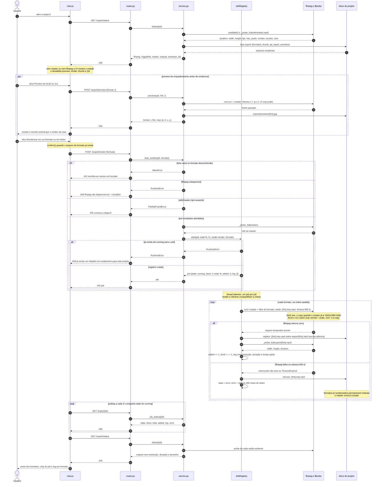
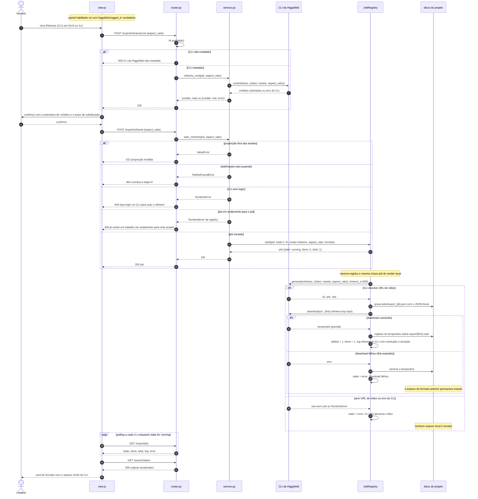
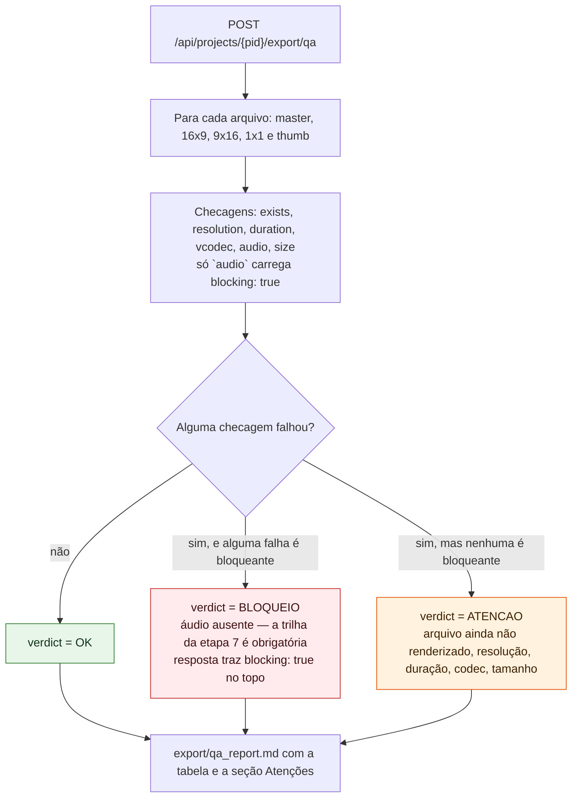

# Export (etapa 9) — Fluxo principal de render e reframe

Fonte: `docs/domains/export/features/export-fdd.md` (seções 4 "Fluxos detalhados e diagramas",
5 "Contratos públicos" e 6 "Erros, exceções e fallback"), conferida contra a implementação em
`studio/export/service.py`, `studio/etapas/export/router.py` e `studio/common/jobs.py`.
São dois `sequenceDiagram` porque o que está sendo modelado é uma troca de mensagens ao longo
do tempo entre UI, rota, serviço, job em thread e processo externo — não um fluxo de decisão.
O primeiro diagrama é o caminho canônico (render local por ffmpeg); o segundo é a alternativa
opcional paga (reframe via CLI da Higgsfield), separada porque envolve outros atores e um
gasto de créditos que exige confirmação do usuário.

## Como ler

Os participantes são, na ordem: o **usuário**, `view.js` (a UI da etapa), `router.py` (rotas
sob `/api/projects/{pid}/export`), `service.py` (o serviço puro), a `JobRegistry` (registro de
jobs em thread daemon, ADR-006), os binários **ffmpeg/ffprobe** e o **disco** do projeto
(`projects/{pid}/`). Setas cheias (`->>`) são chamadas; setas tracejadas (`-->>`) são retornos
ou respostas HTTP.

O bloco `alt` logo após `start_render` mostra a **ordem real das checagens no código**, que é
também a ordem de precedência dos erros: primeiro a validação dos formatos (`ValueError` →
**422**), depois a disponibilidade do ffmpeg (`RuntimeError` → **409**), depois a existência
de `edit/master.mp4` (`FileNotFoundError` → **404**) e só então a `JobRegistry`, que recusa um
segundo job para o mesmo `pid` (`RuntimeError` → **409**). A tradução exceção→status acontece
num único ponto, o helper `_call` do `router.py`. Um `pid` inexistente vira 404 antes de tudo,
pelo `KeyError` de `project_dir` tratado no núcleo.

O ponto central do laço do job é a **escrita atômica**: o ffmpeg nunca escreve no arquivo
final. Ele grava em `export/.{fmt}.tmp.mp4` e só depois de retornar com sucesso o serviço faz
`tmp.replace(dest)`, de modo que `export/{fmt}.mp4` ou não existe ou existe completo. Em caso
de falha ou de estouro dos 600 s de timeout, o `.tmp` é removido, o job vai para `state=error`
com os últimos 400 caracteres do stderr, e os formatos já renderizados nas iterações
anteriores **permanecem no disco** — o job para, mas não desfaz o que já entregou.

O `loop` final é o polling da UI: enquanto o job estiver `running`, `view.js` reagenda
`GET /export/job` a cada **3 s** (`setTimeout(poll, 3000)`); ao ver `done` ou `error`, ele para
de repolar e recarrega `GET /export/status` para repopular os cards com o probe de cada
arquivo. Note que `GET /export/status` e `GET /export/job` são as duas únicas rotas que nunca
falham por estado: com master ausente ou sem ffmpeg elas respondem 200 (com `master.exists`
falso e `ffmpeg: false`), e é a UI que desabilita os botões — todas as rotas de ação
(`preview`, `render`, `thumb`, `qa`) respondem 409 nesse estado.

## Diagrama 1 — Render local (caminho canônico)

## Diagrama 2 — Reframe via CLI da Higgsfield (alternativa opcional paga)

O reframe **nunca é acionado automaticamente**: é o usuário que escolhe trocar o crop central
do ffmpeg pelo reenquadramento do modelo. O botão só aparece habilitado quando
`status.higgsfield.logged_in` é verdadeiro, o `cost` sempre roda antes para mostrar os créditos,
e a UI pede `confirm()` avisando que o arquivo do formato será substituído. O job usa a mesma
`registry` e a mesma chave `pid` do render local, então os dois modos se excluem: com um render
em andamento, o reframe responde 409, e vice-versa. O download também é atômico
(`.{fmt}.reframe.tmp.mp4` + `replace`), de forma que uma falha de rede nunca deixa o
`export/{fmt}.mp4` anterior corrompido ou pela metade.

## Premissas explícitas e desvios em relação ao FDD

- O rascunho do `sequenceDiagram` na seção 4 do FDD mostra a UI iniciando o polling **depois**
  do laço do job. No código, `view.js` reagenda o polling assim que a resposta do `POST /render`
  chega com `state=running`, ou seja, em paralelo ao laço. Os diagramas acima colocam o `loop`
  de polling depois do laço apenas por legibilidade vertical: a ordem real é concorrente, o job
  roda em thread daemon e a rota HTTP já retornou.
- Os textos de erro no diagrama são os do código. O 409 de concorrência vem da `JobRegistry`
  com a mensagem "Já existe um trabalho em andamento para este projeto.", e não
  "job em andamento" como está no FDD (o status é o mesmo).
- O reframe grava em `.{fmt}.reframe.tmp.mp4` e só então renomeia. O FDD descreve
  `hf.download(url, export/<format>.mp4)` direto no arquivo final; o código é mais conservador
  e estendeu a escrita atômica ao caminho do CLI. Diagramado conforme o código.
- O FDD prevê **502** para "falha do CLI ao iniciar" no contrato 9. O `router.py` não emite 502
  em rota nenhuma: `_call` mapeia `RuntimeError` para 409, e a chamada a `hf.generate` acontece
  dentro da thread do job, virando `state=error`. O 502 não tem caminho de execução e está fora
  dos diagramas.
- A URL do vídeo é escolhida em `res["urls"]` filtrando por extensão de vídeo
  (`.mp4`, `.mov`, `.webm`), e não por regex sobre o `raw` como diz a seção 4 do FDD.
- O `t` da thumb é persistido em `export/.state.json` (`_save_state`) para reaparecer no
  `GET /status`. Esse arquivo não está descrito em nenhuma seção do FDD; `list_outputs` o ignora
  por começar com ponto, junto com os `.tmp`.
- A assinatura real é `_filter_for(fmt, width, height, vcodec="")` — o FDD lista três
  parâmetros. O `vcodec` é o que decide o caminho `-c copy` do 16x9, e por isso o diagrama
  mostra a decisão dentro do laço, e não antes dele.
- O crop de 9x16 e 1x1 é calculado em Python (`_crop_rect`, retângulo central com números
  concretos) e não pela expressão `crop=ih*9/16:ih:...` da tabela do FDD. A diferença importa
  quando o master é mais estreito que a proporção alvo (o código corta pela largura; a
  expressão do FDD assume master mais largo).

---

## Atualização da wave 2 (OS-019) — veredito do QA

A auditoria 9.5 tornou **áudio ausente** um bloqueio, para o QA não discordar da etapa 8 (o master
passou a exigir trilha). O restante continua sendo atenção: a aula 014 manda publicar mesmo
imperfeito, e o checklist técnico não julga gosto.

O QA e a thumb são `[extensão]` (a aula 014 não os ensina), e a escolha do formato pelo destino
vem do plano §1.4 — não da aula 007, que fala de formato de **imagem** no Midjourney.
