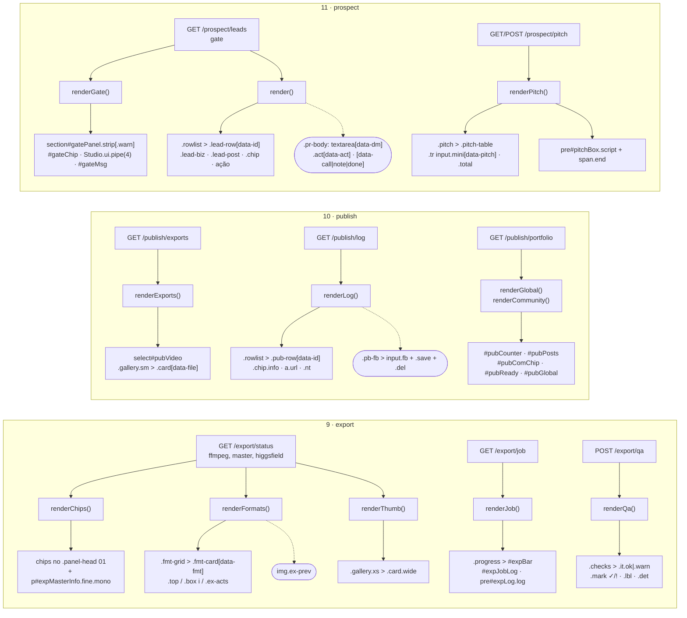
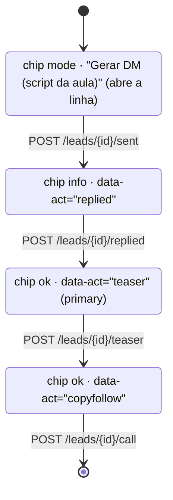

# Etapas 9–11 no redesign (wave 3) — de que dado sai cada bloco de markup

Fonte: `docs/domains/export/features/views-export-publish-prospect-redesign-fdd.md`
(seções 4 "Fluxos detalhados" e 5 "Contratos públicos — mapa painel → markup/ids"), conferida
contra `studio/etapas/{export,publish,prospect}/view.js` e o catálogo de classes de
`docs/domains/studio/features/shell-redesign-fdd.md` §5.

É um `flowchart` e não um `sequenceDiagram` porque o que a wave 3 mudou nestas três telas não
foi a troca de mensagens com o backend (essa continua exatamente como nos FDDs de wave 1 e 2,
já diagramada em `export-fluxo-principal.md`, `prospect-gate.mmd` e
`prospect-estados-lead.mmd`): o que mudou foi **para qual marcação cada resposta da API é
traduzida**. O diagrama existe para tornar auditável essa correspondência — é por ela que a
integração (W5) confere se algum dado da API deixou de ter lugar na tela.

## Como ler

- Coluna da esquerda: a resposta da rota (inalterada nesta entrega).
- Coluna do meio: a função de render do `view.js` que consome essa resposta.
- Coluna da direita: o bloco de markup do catálogo do shell que ela produz.
- Retângulo tracejado: markup que só existe em `<style>` escopado da própria etapa (lacuna do
  catálogo, candidata a promoção na W5).

## Regra de estado que o diagrama não mostra

A ação principal da `.lead-row` é escolhida por `acaoPrincipal(l)` na ordem literal da aula, e
é a única parte do markup com regra de negócio embutida:

`data-act="teaser"` só é emitido quando `l.replied` é verdadeiro — em nenhum outro estado o
botão existe no DOM, nem na linha fechada nem no corpo expandido. É o que
`tests/test_prospect_api.py::test_view_esconde_o_teaser_ate_a_resposta_e_mostra_os_segmentos`
fixa e o que o roteiro Playwright da frente verifica no navegador.
