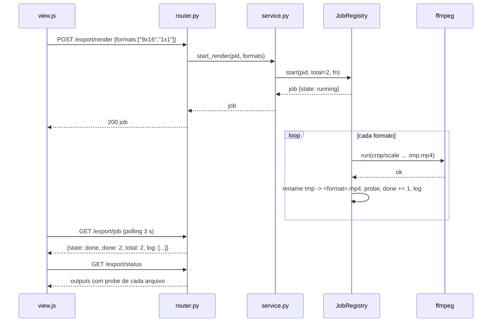

### FDD: export (Etapa 9 · Export · aula 014; QA e thumb são `[extensão]`)

> **Tela redesenhada pela wave 3 (`ADH-OS-20260826-08`).** A descrição de tela (markup,
> classes e ids do `view.html`/`view.js`) deste FDD foi substituída por
> `docs/domains/export/features/views-export-publish-prospect-redesign-fdd.md` §5, que cobre
> as etapas 9, 10 e 11 juntas. Backend, rotas, serviços e regra de negócio deste documento
> continuam valendo sem alteração.

> **Título e §1 corrigidos pela wave 2 (OS-019, auditoria 9.2).** A atribuição original "aulas
> 007/014" estava errada: a aula 007 fala de formato de **imagem** no Midjourney ("vertical,
> quadrado, widescreen"), não de export de vídeo. A escolha 16:9 / 9:16 pelo destino vem do
> plano §1.4. Ver a seção "Wave 2 — fidelidade e guia" no fim deste FDD.

Versão: 0.1.0
Data: 2026-08-25
Responsável: frente OS-009 da Wave 1 (`/dd-parallel`, modo batch)

Documento gerado em modo batch: cada decisão auto-decidida está marcada `[auto-aceito: ...]` no ponto em que aparece e é revisada em lote na W5. Fontes, nesta ordem: `docs/domains/studio/waves/wave-1.md` (bloco "Feature: export"), `wave-1-api-transversal.md`, `recon-wave-1.md`, `CLAUDE.md`.

---

### 1. Contexto e motivação técnica

A etapa 8 (`edit`) entrega um único `edit/master.mp4` 16:9. ~~A aula 007 diz que vertical serve para Instagram/TikTok e 16:9 para YouTube~~ — **corrigido na wave 2:** quem diz isso é o plano §1.4; a aula 007 trata de formato de imagem no Midjourney. A aula 014 encerra com "publique mesmo que o primeiro fique ruim". A etapa 9 materializa isso: deriva os formatos por rede a partir do master, extrai uma thumb no tempo escolhido pelo usuário e escreve um checklist técnico (o que o ffprobe consegue medir), sem julgamento estético.

Encaixe no HLD `studio`: plugin `studio/etapas/export/` descoberto por `discover()` (`META.n = 9`, `aula = "014"`), serviço puro em `studio/export/service.py`, rotas sob `/api/projects/{pid}/export/...`, jobs longos via `studio/common/jobs.JobRegistry` (ADR-006), ffmpeg/ffprobe via `studio/common/ffmpeg` (estático em `~/.local/bin`), persistência em `projects/<pid>/export/` (ADR-003, pasta já criada por `create_project`). Higgsfield somente via CLI (ADR-002) e apenas como alternativa opcional paga.

**Provides** (copiado de `wave-1.md`)
- `export/16x9.mp4`, `export/9x16.mp4`, `export/1x1.mp4`, `export/thumb.jpg`, `export/qa_report.md`

**Consumes** (copiado de `wave-1.md`)
- `edit/master.mp4` ← edit; `shots/storyboard.json` (POI por shot, opcional) ← shots

Nota: `shots/storyboard.json` fica listado por fidelidade ao schema da wave, mas NÃO é lido nesta versão, porque a única utilidade (posição do crop por shot) é `[extensão]` não aprovada. O crop é central fixo.

Atores: usuário (escolhe formato, tempo da thumb, dispara render e QA); ffmpeg/ffprobe (render e medição); CLI da Higgsfield (opcional, `generate workflow reframe`).

Suposições e restrições:
- `edit/master.mp4` é H.264 + AAC, 1920x1080, 30 fps, produzido pela etapa 8 (`plano §4.2`). Em fixtures de teste, `make_video(path, seconds=2, size="320x240")` do `conftest` gera um master pequeno.
- Sem banco, sem rede nos testes (ADR-008); a frente não edita arquivos únicos listados no recon ("ATENCAO PARA ESTE TRABALHO").
- `[auto-aceito: o master da etapa 8 pode não existir quando o usuário abre a etapa 9; a UI mostra estado "aguardando master" e as ações ficam desabilitadas, sem erro]`

---

### 2. Objetivos técnicos

- Gerar `export/9x16.mp4` (1080x1920) e `export/1x1.mp4` (1080x1080) por crop central do master, com duração igual à do master (tolerância 0,5 s) e trilha de áudio preservada (`-c:a copy`). Invariante: `probe(out).has_audio == probe(master).has_audio`.
- Gerar `export/16x9.mp4` (1920x1080). `[auto-aceito: quando o master já for 1920x1080 H.264 o arquivo é re-encapsulado com `-c copy` (rápido, sem perda); caso contrário scale+pad para 1920x1080 com re-encode; a aula não pede reprocessar o 16:9]`
- Preview de enquadramento antes do render: um JPEG do frame em `t` com o mesmo filtro de crop do formato, em `export/previews/<format>.jpg`, gerado em menos de 3 s para um master de 30 s.
- `export/thumb.jpg` no tempo `t` escolhido pelo usuário (0 ≤ t ≤ duração). `[auto-aceito: default t = 3 s, valor do comando `-ss 3` do plano §4.2]`
- `export/qa_report.md` determinístico: para cada arquivo de `export/*.mp4` mais `thumb.jpg` e o master, listar duração, resolução, fps, codec de vídeo, codec de áudio, áudio presente, tamanho em bytes, e um veredito `OK` ou `ATENCAO` por checagem objetiva. Mesma entrada, mesma saída.
- Um job de render por projeto por vez (`JobRegistry`, RuntimeError → 409), com `log` por formato e polling a cada 3 s na UI.

---

### 3. Escopo e exclusões

**Incluído**
- Plugin `studio/etapas/export/` (`__init__.py` com META, `router.py`, `view.html`, `view.js`).
- Serviço `studio/export/service.py`: `status`, `preview`, `start_render`, `job_status`, `make_thumb`, `qa_report`, `list_outputs`, `reframe_cost`, `start_reframe`.
- Render local por ffmpeg dos três formatos, crop central fixo com preview. **[extensão]** o 1:1
  (a aula não trata de formato de vídeo; 16:9 e 9:16 vêm do destino, plano §1.4).
- Thumb por tempo. **[extensão]** — a aula 014 não pede capa (auditoria 9.1).
- QA técnico via ffprobe, gravado em `export/qa_report.md`. **[extensão]** — a aula não ensina QA;
  é ferramenta de entrega. Desde a wave 2, a única checagem bloqueante é `audio` (auditoria 9.5).
- Opcional pago via CLI: `generate workflow reframe --video edit/master.mp4 --aspect-ratio 9:16|1:1`, só com `logged_in`, sempre com `cost` antes e `confirm()` na UI; resultado baixado por URL para o mesmo nome de arquivo do formato (substitui o render local). `[auto-aceito: reframe entra como alternativa de ferramenta (gate 3 do CLAUDE.md, regra comum da wave "alternativa paga via CLI só quando logado, sempre com cost antes"); ADR-004 lista reframe como inferência, registrado como pendência para o lote]`
- Testes `tests/test_export_service.py` e `tests/test_export_api.py`.

**Excluído**
- Posição horizontal do crop ajustável por clipe ou por percentual na UI (`[extensão]` NÃO aprovada). Leitura de POI em `shots/storyboard.json`.
- Legendas automáticas (`captions.srt`, Whisper/`speech2text`), hook nos 3 s, safe areas, end card, `brain_activity`, QA estético ou de "ritmo": a aula não ensina.
- Qualquer edição do master (cortes, fade, música): pertence à etapa 8.
- Publicação em rede social: etapa 10.
- Edição de `studio/app.py`, `steps.py`, `studio/web/*`, `studio/common/*`, `studio/higgsfield.py`, `tests/conftest.py`, `tests/test_steps_and_config.py`, `requirements*.txt`, `pyproject.toml`.

---

### 4. Fluxos detalhados e diagramas

**Fluxo principal (render local)**
- Usuário abre a etapa 9; `view.js` chama `GET /export/status`. O serviço resolve `root = project_dir(pid)`, verifica `edit/master.mp4`, roda `ffmpeg.probe` no master e lista o que já existe em `export/` (com probe de cada saída). Devolve também `ffmpeg.available()` e `hf.status()` resumido (`installed`, `logged_in`).
- Se o master não existe, a UI mostra "Aguardando `edit/master.mp4` da etapa 8" e desabilita render, thumb e QA.
- Usuário clica "Preview" em um formato (9:16 ou 1:1): `POST /export/preview {format, t}`. O serviço extrai um frame em `t` aplicando o filtro de crop do formato e grava `export/previews/<format>.jpg`. A UI mostra a imagem via `ctx.files("export/previews/9x16.jpg")`.
- Usuário clica "Renderizar" (um formato ou "todos"): `POST /export/render {formats: [...]}`. O router valida o corpo (Pydantic), o serviço chama `registry.start(pid, total=len(formats), fn)`; se já houver job `running` para o `pid`, RuntimeError → 409.
- Dentro do job, para cada formato em ordem: monta o comando ffmpeg (tabela abaixo), grava em arquivo temporário `export/.<format>.tmp.mp4`, roda `ffmpeg.run(args, timeout=600)`, renomeia para `export/<format>.mp4` (escrita atômica), roda `probe` no resultado, `job["done"] += 1`, `job["log"].append("<format>: <w>x<h> <dur>s")`. Exceção vira `state=error` com stderr resumido no `error`.
- UI faz polling em `GET /export/job` a cada 3 s até `done|error` e recarrega `GET /export/status`.
- Usuário informa o tempo da thumb e clica "Gerar thumb": `POST /export/thumb {t}`. O serviço valida `0 ≤ t ≤ duração` (ValueError → 422) e roda `ffmpeg -ss t -i master -frames:v 1 -q:v 2 export/thumb.jpg`. A UI mostra a thumb.
- Usuário clica "Gerar QA": `POST /export/qa`. O serviço roda ffprobe no master e em cada saída existente, calcula as checagens, grava `export/qa_report.md` e devolve `{file, items}`. A UI renderiza os itens em tabela (chip `ok`/`warn`) e um link para o arquivo.

Filtros ffmpeg por formato (crop central fixo; `iw`, `ih` do master):

| Formato | Filtro de vídeo | Saída |
| --- | --- | --- |
| `16x9` | `-c copy` se master já é 1920x1080 H.264; senão `scale=1920:1080:force_original_aspect_ratio=decrease,pad=1920:1080:(ow-iw)/2:(oh-ih)/2` | 1920x1080 |
| `9x16` | `crop=ih*9/16:ih:(iw-ih*9/16)/2:0,scale=1080:1920` | 1080x1920 |
| `1x1` | `crop=ih:ih:(iw-ih)/2:0,scale=1080:1080` | 1080x1080 |

Flags comuns nos re-encodes: `-c:v libx264 -crf 18 -preset medium -pix_fmt yuv420p -c:a copy -movflags +faststart -y`. `[auto-aceito: crf 18 e libx264 seguem o comando do master no plano §4.2; áudio copiado em vez de re-encodado para preservar o mix da etapa 8]`

**Fluxos alternativos e exceções**
- Master sem áudio: render continua; ~~o QA marca "áudio presente: não" como `ATENCAO`~~ —
  **wave 2 (9.5): o veredito é `BLOQUEIO`** e a resposta traz `blocking: true`, porque a trilha da
  etapa 7 é obrigatória e o master da etapa 8 passou a exigi-la (frente OS-018).
- Master com proporção diferente de 16:9 (ex.: fixture 320x240): os filtros de crop funcionam igual (usam `ih`); o 16x9 cai no caminho scale+pad.
- ffmpeg indisponível (`ffmpeg.available()` False): `GET /status` devolve `ffmpeg: false`; qualquer render/preview/thumb/qa responde 409 "ffmpeg não disponível".
- Job em andamento: novo `POST /render` responde 409 "job em andamento".
- Falha do ffmpeg em um formato: o job para naquele formato, `state=error`, arquivos anteriores permanecem, o `.tmp` é removido.
- Render de um formato já existente: sobrescreve (o usuário pode re-renderizar após mudar o master). `[auto-aceito: sobrescrever sem confirmação no backend; a UI pede `confirm()` quando o arquivo já existe]`
- Reframe via CLI: usuário clica "Reframe (CLI)" em 9:16 ou 1:1. Botão só habilitado com `logged_in`. UI chama `POST /export/reframe/cost {aspect_ratio}` → mostra créditos e `confirm()` → `POST /export/reframe {aspect_ratio}` → job na mesma `registry` (chave `pid`). No job: `hf.generate("reframe", {...})`; a URL de vídeo é extraída de `raw` (a regex `MEDIA_URL_RE` estendida na API transversal já cobre mp4), `hf.download(url, export/<format>.mp4)`, probe, log. Não logado → 409; erro do CLI → job `error` com stderr; o JSON bruto vai para `projects/<pid>/jobs/export_<jobid>.json`.

**Diagrama de sequência (render local)**



---

### 5. Contratos públicos (assinaturas, endpoints, headers, exemplos)

Todas as rotas vivem em `studio/etapas/export/router.py` (`router = APIRouter(tags=["export"])`), prefixo `/api/projects/{pid}/export`. `pid` inválido ou inexistente → `KeyError` em `project_dir` → 404 pelo handler do núcleo. Corpos JSON (`Content-Type: application/json`), respostas JSON. Sem headers próprios. Modelos Pydantic de request declarados no `router.py`.

Assinaturas do serviço (`studio/export/service.py`):

```python
FORMATS = {"16x9": (1920, 1080), "9x16": (1080, 1920), "1x1": (1080, 1080)}
registry = JobRegistry()
def status(pid: str) -> dict
def preview(pid: str, fmt: str, t: float = 3.0) -> dict          # grava export/previews/<fmt>.jpg
def start_render(pid: str, formats: list[str]) -> dict           # RuntimeError se job running
def job_status(pid: str) -> dict
def make_thumb(pid: str, t: float = 3.0) -> dict                 # ValueError se t fora da duração
def qa_report(pid: str) -> dict                                  # grava export/qa_report.md
def list_outputs(pid: str) -> list[dict]
def reframe_cost(pid: str, aspect_ratio: str) -> dict            # hf.cost, nunca lança
def start_reframe(pid: str, aspect_ratio: str) -> dict           # RuntimeError se não logado ou job running
def _filter_for(fmt: str, width: int, height: int, vcodec: str = "") -> list[str]  # args ffmpeg do formato
def _probe_full(path: Path) -> dict                              # probe + codec_name (v/a) + size
def _safe_probe(path: Path) -> dict                              # _probe_full que devolve {} em arquivo ilegível
```

**Contrato 1: status**
- Tipo: endpoint
- Assinatura/Rota: `GET /api/projects/{pid}/export/status`
- Método: GET
- Semântica de status:
  - 200: sempre que o projeto existe, mesmo sem master
  - 404: projeto inexistente

**Exemplo de resposta**
```json
{
  "ffmpeg": true,
  "higgsfield": {"installed": true, "logged_in": false},
  "master": {"exists": true, "file": "edit/master.mp4", "duration": 30.4, "width": 1920, "height": 1080, "fps": 30.0, "has_audio": true},
  "outputs": {
    "16x9": null,
    "9x16": {"file": "export/9x16.mp4", "duration": 30.4, "width": 1080, "height": 1920, "has_audio": true, "size": 8123456},
    "1x1": null,
    "thumb": {"file": "export/thumb.jpg", "t": 3.0},
    "qa_report": {"file": "export/qa_report.md"}
  },
  "previews": {"9x16": "export/previews/9x16.jpg"},
  "job": {"state": "idle"}
}
```

**Contrato 2: preview do enquadramento**
- Tipo: endpoint
- Assinatura/Rota: `POST /api/projects/{pid}/export/preview`
- Método: POST
- Semântica de status:
  - 200: preview gravado
  - 404: master ausente
  - 409: ffmpeg indisponível
  - 422: `format` fora de `FORMATS` ou `t` fora de `[0, duração]`

**Exemplo de requisição**
```json
{"format": "9x16", "t": 3.0}
```

**Exemplo de resposta**
```json
{"format": "9x16", "t": 3.0, "file": "export/previews/9x16.jpg", "crop": {"w": 608, "h": 1080, "x": 656, "y": 0}}
```

**Contrato 3: render (job por formato)**
- Tipo: endpoint
- Assinatura/Rota: `POST /api/projects/{pid}/export/render`
- Método: POST
- Semântica de status:
  - 200: job iniciado; corpo é o dict do job
  - 404: master ausente
  - 409: ffmpeg indisponível ou job em andamento
  - 422: lista vazia ou formato desconhecido
- Limites: timeout de 600 s por formato (`ffmpeg.run` default); um job por projeto.

**Exemplo de requisição**
```json
{"formats": ["16x9", "9x16", "1x1"]}
```

**Exemplo de resposta**
```json
{"state": "running", "done": 0, "total": 3, "added": 0, "error": null, "log": [], "formats": ["16x9", "9x16", "1x1"]}
```

**Contrato 4: job**
- Tipo: endpoint
- Assinatura/Rota: `GET /api/projects/{pid}/export/job`
- Método: GET
- Semântica de status: 200 sempre (`{"state": "idle"}` quando nunca houve job); 404 projeto inexistente.

**Exemplo de resposta**
```json
{"state": "done", "done": 3, "total": 3, "added": 3, "error": null, "log": ["16x9: copy 1920x1080 30.4s", "9x16: 1080x1920 30.4s", "1x1: 1080x1080 30.4s"], "formats": ["16x9", "9x16", "1x1"]}
```

**Contrato 5: thumb**
- Tipo: endpoint
- Assinatura/Rota: `POST /api/projects/{pid}/export/thumb`
- Método: POST
- Semântica de status: 200 gravada; 404 master ausente; 409 ffmpeg indisponível; 422 `t` fora de `[0, duração]`.

**Exemplo de requisição**
```json
{"t": 12.5}
```

**Exemplo de resposta**
```json
{"file": "export/thumb.jpg", "t": 12.5, "width": 1920, "height": 1080}
```

**Contrato 6: QA técnico**
- Tipo: endpoint
- Assinatura/Rota: `POST /api/projects/{pid}/export/qa`
- Método: POST
- Semântica de status: 200 relatório gravado (mesmo com itens `ATENCAO` ou `BLOQUEIO`); 404 master ausente; 409 ffmpeg/ffprobe indisponível.
- **Wave 2 (9.5):** a resposta traz `blocking: bool` no topo; `verdict` ∈ `OK | ATENCAO | BLOQUEIO`; o item de checagem ganha `blocking: true` quando a falha impede publicar (hoje só `audio`).
- Síncrono (ffprobe leva menos de 1 s por arquivo).

**Exemplo de resposta**
```json
{
  "file": "export/qa_report.md",
  "generated": "2026-08-25T14:02:11",
  "blocking": false,
  "items": [
    {"file": "edit/master.mp4", "duration": 30.4, "width": 1920, "height": 1080, "fps": 30.0, "vcodec": "h264", "acodec": "aac", "has_audio": true, "size": 14210344, "checks": [{"name": "audio", "ok": true, "blocking": true}, {"name": "duration", "ok": true}], "verdict": "OK"},
    {"file": "export/9x16.mp4", "duration": 30.4, "width": 1080, "height": 1920, "fps": 30.0, "vcodec": "h264", "acodec": "aac", "has_audio": true, "size": 8123456, "checks": [{"name": "exists", "ok": true}, {"name": "resolution", "ok": true, "expected": "1080x1920"}, {"name": "duration", "ok": true, "expected": 30.4, "tolerance": 0.5}, {"name": "vcodec", "ok": true, "expected": "h264"}, {"name": "audio", "ok": true}, {"name": "size", "ok": true}], "verdict": "OK"},
    {"file": "export/1x1.mp4", "exists": false, "checks": [{"name": "exists", "ok": false}], "verdict": "ATENCAO"}
  ]
}
```
Master mudo (wave 2): `blocking: true` no topo e o item vira
```json
{"file": "edit/master.mp4", "has_audio": false,
 "checks": [{"name": "audio", "ok": false, "blocking": true}, {"name": "duration", "ok": true}],
 "verdict": "BLOQUEIO"}
```

Formato de `export/qa_report.md` (pt-BR, determinístico, sem julgamento estético):

```markdown
# QA técnico do export

Projeto: <pid> · Gerado: <ISO> · Fonte: edit/master.mp4
Checklist técnico. Não avalia gosto. Aula 014: publique mesmo que o primeiro fique ruim.

| Arquivo | Duração (s) | Resolução | fps | Vídeo | Áudio | Áudio presente | Tamanho | Veredito |
| --- | --- | --- | --- | --- | --- | --- | --- | --- |
| edit/master.mp4 | 30.4 | 1920x1080 | 30 | h264 | aac | sim | 13.6 MB | OK |
| export/16x9.mp4 | ... |
| export/9x16.mp4 | ... |
| export/1x1.mp4 | ausente | | | | | | | ATENCAO |
| export/thumb.jpg | | 1920x1080 | | jpeg | | | 210 KB | OK |

## Atenções
- export/1x1.mp4: arquivo ausente (renderize na etapa 9).
```

Checagens (todas objetivas): `exists`; `resolution == FORMATS[fmt]`; `abs(duration - master.duration) <= 0.5`; `vcodec == "h264"`; `has_audio == master.has_audio` e `has_audio == True`; `size > 0`. Thumb: `exists` e `width x height == master`.

**Contrato 7: lista de saídas**
- Tipo: endpoint
- Assinatura/Rota: `GET /api/projects/{pid}/export/list`
- Método: GET
- Semântica de status: 200 sempre; 404 projeto inexistente. É o contrato que a etapa 10 (`publish`) consome (`[cross-feature]`).

**Exemplo de resposta**
```json
{"files": [
  {"name": "16x9.mp4", "file": "export/16x9.mp4", "kind": "video", "format": "16x9", "width": 1920, "height": 1080, "duration": 30.4, "size": 14210344},
  {"name": "9x16.mp4", "file": "export/9x16.mp4", "kind": "video", "format": "9x16", "width": 1080, "height": 1920, "duration": 30.4, "size": 8123456},
  {"name": "thumb.jpg", "file": "export/thumb.jpg", "kind": "image", "width": 1920, "height": 1080, "size": 215040},
  {"name": "qa_report.md", "file": "export/qa_report.md", "kind": "doc", "size": 1310}
]}
```

**Contrato 8: custo do reframe (opcional, CLI)**
- Tipo: endpoint
- Assinatura/Rota: `POST /api/projects/{pid}/export/reframe/cost`
- Método: POST
- Semântica de status: 200 `{credits|null, raw|error}` (erro do CLI vira corpo, não status); 404 master ausente; 409 CLI não instalado; 422 `aspect_ratio` fora de `{"9:16", "1:1"}`. A ordem de validação é projeto (404) → corpo (422) → CLI (409).

**Exemplo de requisição**
```json
{"aspect_ratio": "9:16"}
```

**Exemplo de resposta**
```json
{"credits": 12, "raw": {"...": "..."}}
```

**Contrato 9: reframe (opcional, CLI, job)**
- Tipo: endpoint
- Assinatura/Rota: `POST /api/projects/{pid}/export/reframe`
- Método: POST
- Semântica de status: 200 job iniciado; 404 master ausente; 409 CLI não instalado, não logado ou job em andamento; 422 `aspect_ratio` fora de `{"9:16", "1:1"}`. Ordem de validação: projeto (404) → corpo (422) → CLI instalado (409) → login e job (409). **Não existe 502 nesta rota**: o `hf.generate` só roda depois que o 200 do job foi devolvido, então falha do CLI aparece como `state=error` no `GET /export/job`, nunca como status HTTP (ver seção 6 e as notas de implementação).
- Limites: `timeout_s=600` no `hf.generate`; um job por projeto (mesma `registry` do render).

**Exemplo de requisição**
```json
{"aspect_ratio": "9:16"}
```

**Exemplo de resposta**
```json
{"state": "running", "done": 0, "total": 1, "added": 0, "error": null, "log": [], "mode": "reframe", "aspect_ratio": "9:16"}
```

`[auto-aceito: o reframe grava no mesmo `export/9x16.mp4` ou `1x1.mp4` do render local, substituindo o arquivo, para que publish e o QA não precisem conhecer a origem; a origem fica no log do job e em `jobs/export_<jobid>.json`]`

Versionamento: contratos internos da instância local; sem versionamento de rota (padrão das etapas 1 e 2).

---

### 6. Erros, exceções e fallback

Matriz de erros previstos e tratamentos (`RuntimeError`→409, `ValueError`→422, `FileNotFoundError`→404). O padrão `CLI→502` do recon **não se aplica** a esta etapa: nenhuma rota chama o CLI de forma síncrona — `cost` devolve o erro no corpo com 200 e `generate` roda dentro do job:

| Condição | Tratamento | Notas |
| --- | --- | --- |
| `pid` inválido ou projeto inexistente | `KeyError` em `project_dir` → 404 (núcleo) | sem código na frente |
| `edit/master.mp4` ausente | `FileNotFoundError` → 404 `"edit/master.mp4 não encontrado; conclua a etapa 8"` | `GET /status` NÃO falha: devolve `master.exists=false` |
| ffmpeg/ffprobe indisponível | `RuntimeError` → 409 `"ffmpeg não disponível em ~/.local/bin"` | `GET /status` devolve `ffmpeg=false`; UI desabilita ações |
| Job já `running` para o `pid` | `RuntimeError` da `registry` → 409 `"job em andamento"` | render e reframe compartilham a chave `pid` |
| `format` desconhecido, lista vazia | `ValueError` → 422 | validado no Pydantic e no serviço |
| `t` fora de `[0, duração]` ou não numérico | `ValueError` → 422 | preview e thumb |
| ffmpeg retorna código não zero | dentro do job: `state=error`, `error` = últimos 400 chars do stderr, `.tmp` removido | arquivos já prontos permanecem |
| ffmpeg estoura 600 s | `subprocess.TimeoutExpired` → `state=error` `"timeout ao renderizar <fmt>"` | mesmo tratamento do item acima |
| CLI não instalado | `HTTPException(409, "CLI da Higgsfield não instalado")` | padrão mood |
| CLI instalado mas não logado | `RuntimeError` → 409 `"faça login no CLI para usar o reframe"` | botão desabilitado na UI |
| `hf.generate` lança `RuntimeError` | dentro do job: `state=error` com stderr resumido | JSON bruto salvo quando existir |
| Resultado do reframe sem URL de vídeo | `state=error` `"CLI não devolveu vídeo"` | arquivo local não é tocado |
| `hf.download` falha (link expirado) | `state=error` `"download falhou: <msg>"` | usuário pode reimportar por Downloads em outra etapa; sem retry automático |

Estratégias de resiliência: timeout de 600 s por comando ffmpeg e por `hf.generate`; sem retries automáticos (render é determinístico e o usuário reexecuta pela UI); sem backoff nem circuit breaker (ferramenta local single-process, ADR-001). Escrita atômica por `.tmp` + `rename`.

Política de fallback: o caminho canônico é o render local por ffmpeg; o reframe via CLI é opcional e nunca é acionado automaticamente. Se o reframe falhar, o arquivo local anterior (se existir) permanece intacto.

Invariantes:
- Nunca modificar `edit/master.mp4` nem qualquer arquivo fora de `projects/<pid>/export/` e `projects/<pid>/jobs/`.
- `export/<fmt>.mp4` só existe completo (nunca parcial): tmp + rename.
- Um job por projeto, independentemente do modo (render ou reframe).
- `qa_report.md` é função pura dos arquivos presentes (sem timestamp além do cabeçalho `Gerado`).
- Nenhuma checagem do QA lê conteúdo visual; apenas metadados do ffprobe e `stat`.

---

### 7. Observabilidade

**Métricas**
- Contadores no próprio job (`done`, `total`, `added`) expostos por `GET /job`; sem backend de métricas (ferramenta local, ADR-001).
- Tempo de render por formato registrado no `log` do job (`"9x16: 1080x1920 30.4s em 41.2s"`).

**Logs**
- `logging.getLogger("studio.export")`, formato do núcleo. Campos: `pid`, `action` (`preview|render|thumb|qa|reframe`), `format`, `elapsed_ms`, `ok`, `error` (resumido). Comando ffmpeg completo em nível DEBUG. Nunca logar URLs assinadas do CLI em INFO (podem carregar token).

**Tracing**
- Não há tracing distribuído (single-process). O `job["log"]` cumpre o papel de trilha por execução.

**Dashboards e alertas**
- Nenhum. Painel mínimo é a própria UI da etapa: chips `ffmpeg`, `master`, `CLI`, estado do job e tabela do QA com chips `ok`/`warn`.

---

### 8. Dependências e compatibilidade

| Componente | Versão mínima | Observações |
| --- | --- | --- |
| ffmpeg/ffprobe estático | 7.0.2 (`~/.local/bin`) | libx264, aac; via `studio/common/ffmpeg` (`available`, `run`, `probe`, `video_thumb`) |
| `studio/common/jobs.JobRegistry` | API transversal da wave | `registry = JobRegistry()` no módulo do serviço |
| `studio/common/ffmpeg.probe` | API transversal | devolve `duration,width,height,fps,has_audio`; codec e tamanho vêm de `_probe_full` (ffprobe `-show_entries stream=codec_name,codec_type` + `Path.stat`) `[auto-aceito: chamar o binário `ffmpeg.FFPROBE` via `subprocess` dentro do serviço para os campos que `probe` não devolve, sem alterar o módulo comum]` |
| `studio/higgsfield.py` | CLI 1.1.23 | `available`, `status`, `cost`, `generate("reframe", ...)`, `download`; `MEDIA_URL_RE` já cobre mp4 |
| `studio/refs/service.project_dir` | atual | resolve raiz e valida `pid` |
| FastAPI / Pydantic | 0.141 / 2.13 | modelos de request no router |
| Pillow | 12.3 | somente para ler `width/height` da thumb no `list` |
| `tests/conftest.py` | API transversal | `studio_env["svc"]("export")`, `make_video`, `pytest.skip` sem ffmpeg |

**Garantias de compatibilidade**
- Nomes de arquivo fixos por schema da wave: `export/16x9.mp4`, `9x16.mp4`, `1x1.mp4`, `thumb.jpg`, `qa_report.md`. `publish` depende disso.
- `GET /export/list` é aditivo: campos novos podem entrar; os existentes não mudam de nome.
- Nenhum arquivo único do repositório é editado; `META = {"id": "export", "n": 9, "title": "Export e QA", "aula": "014", "desc": ...}` bate com o catálogo `SOON`.
- `previews/` é subpasta interna de `export/`; `list` a ignora.

---

### 9. Critérios de aceite técnicos

- Com um master de fixture (`make_video`, 2 s, 320x240), `POST /render {formats:["9x16","1x1"]}` termina com `state=done` e produz `export/9x16.mp4` 1080x1920 e `export/1x1.mp4` 1080x1080, duração 2 s ± 0,5 s, `has_audio` igual ao do master.
- `POST /render {formats:["16x9"]}` produz `export/16x9.mp4` 1920x1080; com master 1920x1080 H.264 o log contém `copy`.
- `POST /preview {format:"9x16", t:1}` grava `export/previews/9x16.jpg` com proporção 9:16 (tolerância de 1 px) e devolve o retângulo de crop central (`x == (iw - w) // 2`).
- `POST /thumb {t:1.0}` grava `export/thumb.jpg` com a resolução do master; `t` maior que a duração responde 422; `t` negativo responde 422.
- `POST /qa` grava `export/qa_report.md` com uma linha por arquivo (master, 3 formatos, thumb), veredito `ATENCAO` para arquivo ausente, ~~e para master sem áudio~~ **`BLOQUEIO` para master sem áudio (wave 2, 9.5)**, `OK` quando todas as checagens passam; duas chamadas seguidas geram o mesmo conteúdo exceto a linha `Gerado`.
- O relatório não contém nenhuma palavra de avaliação estética (teste verifica ausência de "bonito", "feio", "ritmo", "hook", "legenda").
- `GET /status` com projeto sem master responde 200 com `master.exists=false`; `POST /render` no mesmo estado responde 404.
- Segundo `POST /render` com job `running` (gate por `threading.Event`) responde 409.
- `GET /list` lista só arquivos existentes em `export/` (ignora `previews/`), com `kind` e metadados.
- `POST /reframe` com CLI fakeado como não logado responde 409; com CLI fakeado logado e `generate` devolvendo uma URL mp4, o job termina `done` e o arquivo `export/9x16.mp4` é o baixado (download fakeado por `monkeypatch`). Nenhum teste toca rede.
- Sem ffmpeg (monkeypatch `available` False), render/preview/thumb/qa respondem 409 e `status` devolve `ffmpeg=false`.
- `[cross-feature]` na integração W5, o `edit/master.mp4` real produzido pela frente `edit` (a partir de `takes.json` + `beats.json`) é consumido sem adaptação: os três formatos e o QA são gerados com veredito `OK` em duração e áudio.
- `[cross-feature]` a frente `publish` lista os arquivos de `export/` gerados por esta frente via `GET /export/list` ou leitura direta da pasta, sem renomear nada.
- `ruff check studio tests` e `pytest` verdes; testes que dependem de ffmpeg fazem `pytest.skip` quando `ffmpeg.available()` é False.
- `tests/test_steps_and_config.py` continua verde: `META.n == 9`, `view.html`/`view.js` servidos.

---

### 10. Riscos e mitigação

### Risco 1: crop central corta o sujeito nos formatos vertical e quadrado

- **Probabilidade:** média
- **Impacto:** vídeo 9:16 ou 1:1 com o produto fora do quadro em alguns shots; o usuário publica algo pior do que o master.
- **Mitigação:**
    - Preview do enquadramento antes de renderizar, para o usuário ver o corte.
    - Alternativa opcional paga via `reframe` do CLI quando logado.
    - Sugerir no PR (não implementar) a `[extensão]` de posição horizontal por clipe, usando `shots/storyboard.json`.
- **Plano de contingência:** usuário ajusta a composição na etapa 8 ou usa o reframe.

### Risco 2: master ainda não existe quando a frente integra (handoff da etapa 8)

- **Probabilidade:** alta durante a wave, baixa após W5
- **Impacto:** frente não consegue validar contra o artefato real.
- **Mitigação:**
    - Fixture `make_video` (2 s) como master nos testes.
    - `GET /status` tolera ausência; UI mostra o estado sem erro.
    - Critério `[cross-feature]` cobrado na integração em ordem topológica.
- **Plano de contingência:** integração W5 roda `edit` antes de `export` e repete os testes de API contra o master real.

### Risco 3: `probe` do módulo comum não expõe codec nem tamanho

- **Probabilidade:** alta (fato do contrato transversal)
- **Impacto:** QA incompleto se a frente depender só de `probe`.
- **Mitigação:**
    - `_probe_full` no serviço chama `ffprobe` com `-show_entries stream=codec_name,codec_type` e usa `Path.stat().st_size`.
    - Sem editar `studio/common/ffmpeg.py` (arquivo único).
- **Plano de contingência:** propor ao orquestrador estender `probe` numa tarefa transversal pós-wave.

### Risco 4: reframe depende de modelo/flags não confirmados no catálogo (login pendente)

- **Probabilidade:** média
- **Impacto:** o botão de reframe falha com erro do CLI.
- **Mitigação:**
    - Caminho canônico é o ffmpeg local; reframe é opcional e isolado.
    - `cost` antes, `confirm()` na UI, erro do CLI vira `state=error` sem afetar arquivos locais.
    - Parâmetros passados como `{"video": path, "aspect_ratio": "9:16"}` deixando `hf._params` gerar `--aspect-ratio` (hífen), como o help do CLI mostra.
- **Plano de contingência:** desabilitar o painel de reframe por `META`/flag se o catálogo confirmar que o workflow não existe; registrar em ADR se virar desvio permanente.

### Risco 5: render longo bloqueia a thread do job por vários minutos

- **Probabilidade:** média para masters de 60 s+ em máquina fraca
- **Impacto:** UI em polling por muito tempo; usuário acha que travou.
- **Mitigação:**
    - Log por formato com tempo decorrido; `done/total` na barra de progresso.
    - `-preset medium` e `-c copy` no 16:9 quando possível.
- **Plano de contingência:** usuário renderiza um formato por vez.

---

### 11. Sequenciamento de implementação (Build Order)

| Ordem | Etapa | Depende de | Componentes/arquivos prováveis | Critérios que fecha (da seção 9) |
| --- | --- | --- | --- | --- |
| 1 | Plugin e META, serviço de status e list | - | `studio/etapas/export/__init__.py`, `studio/export/__init__.py`, `studio/export/service.py` (`status`, `list_outputs`, `_probe_full`), `studio/etapas/export/router.py` (GET status, GET list) | status sem master 200; list ignora previews; `test_steps_and_config` verde |
| 2 | Render local por formato (job) e preview | 1 | `service.py` (`FORMATS`, `_filter_for`, `preview`, `start_render`, `job_status`), `router.py` (POST preview, POST render, GET job), `tests/test_export_service.py` | 9x16 e 1x1 corretos; 16x9 copy; preview 9:16 com crop central; 409 em job concorrente; 404 sem master |
| 3 | Thumb por tempo | 1 | `service.py` (`make_thumb`), `router.py` (POST thumb), testes | thumb na resolução do master; 422 fora da duração |
| 4 | QA técnico | 2, 3 | `service.py` (`qa_report`, checagens, escrita do md), `router.py` (POST qa), testes de determinismo e ausência de termos estéticos | relatório determinístico; ATENCAO em ausente e sem áudio; sem termos estéticos |
| 5 | Reframe opcional via CLI | 2 | `service.py` (`reframe_cost`, `start_reframe`), `router.py` (POST reframe/cost, POST reframe), `tests/test_export_api.py` com `hf` fakeado | 409 não logado; job done com download fakeado; sem rede |
| 6 | UI da etapa | 1 a 5 | `studio/etapas/export/view.html`, `studio/etapas/export/view.js` (chips ffmpeg/master/CLI, cards por formato com preview e render, campo de tempo da thumb, tabela do QA, painel reframe desabilitado sem login, polling 3 s) | status refletido na UI; ações desabilitadas sem master ou sem ffmpeg |
| 7 | Erros, logs e testes de API | 2 a 6 | `router.py` (tradução de exceções), `service.py` (`logging`), `tests/test_export_api.py` | 409 sem ffmpeg; 404/422/409 por rota; ruff e pytest verdes |

Arquivos da entrega: `studio/etapas/export/{__init__.py, router.py, view.html, view.js}`, `studio/export/{__init__.py, service.py}`, `tests/test_export_service.py`, `tests/test_export_api.py`, `docs/domains/export/prd.md`, `docs/domains/export/features/export-fdd.md`.

---

### Registro de auto-aceites (para o lote da W5)

- 16x9.mp4 é `-c copy` quando o master já é 1920x1080 H.264; senão scale+pad.
- Thumb default em t = 3 s (plano §4.2).
- Reframe via CLI como alternativa opcional paga (gate 3 e regra comum da wave), apesar de ADR-004 listar `reframe` como inferência.
- Render sobrescreve arquivo existente; `confirm()` só na UI.
- Reframe grava no mesmo nome de arquivo do formato.
- `_probe_full` chama ffprobe direto para codec e tamanho, sem editar o módulo comum.
- Master ausente: `GET /status` responde 200 com `exists=false`; ações desabilitadas na UI.
- crf 18 / libx264 / áudio copiado, seguindo o comando do master no plano §4.2.

### Pendências (não auto-aceitáveis)

- Confirmar que `reframe` pode ficar como opcional apesar de ADR-004 listá-lo como [INFERÊNCIA]; se não, remover contratos 8 e 9 e o painel correspondente.
- ~~Confirmar leitura da aula 007 para o formato 1:1~~ — **FECHADA na wave 2 (OS-019).** A auditoria 9.2 leu a aula 007 inteira: ela fala de *formato de imagem no Midjourney* ("vertical, quadrado, widescreen"), **não** de export de vídeo. A escolha 16:9 / 9:16 pelo destino vem do plano §1.4; o **1:1 é `[extensão]`** e está rotulado como tal na tela, no guia e nesta seção. A etapa deixou de citar a aula 007.
- `MEDIA_URL_RE`/`hf.generate` devolvendo URLs de mp4 depende da extensão transversal já mergeada; confirmar no bootstrap da worktree.

---

### Notas de implementação (frente OS-009, wave 1)

Registro das diferenças entre o que este FDD especificou e o que a frente entregou. Nada aqui
muda contrato publicado; são detalhes que o revisor do lote (W5) precisa ver.

- **`export/.state.json` (novo, interno).** O contrato 1 devolve `outputs.thumb.t`, mas nada no
  schema guardava esse tempo entre requisições. A frente grava um arquivo oculto
  `export/.state.json` com `{"thumb_t": <s>}`. É dotfile: `GET /export/list` ignora arquivos
  que começam com `.` e `previews/`, então o schema da wave (`16x9.mp4`, `9x16.mp4`, `1x1.mp4`,
  `thumb.jpg`, `qa_report.md`) continua exato para a etapa 10.
- **502 do contrato 9 não implementado.** `POST /export/reframe` só chama o CLI dentro do job
  (`hf.generate` roda na thread), então não existe "falha do CLI ao iniciar" para traduzir em
  502: falha do CLI vira `state=error` no job, como já previsto na seção 6. Os 404/409/422 do
  início da rota valem como especificado.
- **`_filter_for` recebeu um quarto parâmetro opcional.** `_filter_for(fmt, width, height,
  vcodec="")`: o codec é necessário para decidir o caminho `-c copy` do 16:9 (o FDD já exigia a
  decisão, mas a assinatura da seção 5 não passava o codec). Parâmetro com default, sem quebra.
- **Ordem de validação no reframe.** As duas rotas de reframe resolvem o projeto antes de checar
  o CLI, para que um `pid` inexistente responda 404 (e não 409 "CLI não instalado").
- **HLD não atualizado nesta branch.** `docs/domains/studio/hld.md` é arquivo único compartilhado
  pela wave e está proibido para as frentes; o parágrafo da etapa 9 e o bump ficam para a W5.
- **Download do reframe também é atômico.** A seção 4 descrevia `hf.download(url, export/<fmt>.mp4)`
  direto no arquivo final; a implementação baixa para `export/.<fmt>.reframe.tmp.mp4` e só então faz
  `replace`, pelo mesmo invariante do render (o arquivo do formato nunca fica parcial). Se o download
  falhar, o arquivo anterior continua intacto.
- **URL do vídeo vem de `res["urls"]`, não de uma regex própria.** `hf.generate` já aplica
  `MEDIA_URL_RE` e devolve `urls`; o serviço apenas filtra por sufixo de vídeo (`.mp4`, `.mov`,
  `.webm`). Efeito igual, sem duplicar regex.
- **Crop calculado em Python, não por expressão do ffmpeg.** A tabela da seção 4 usava
  `crop=ih*9/16:ih:(iw-ih*9/16)/2:0`. A implementação calcula o retângulo (`_crop_rect`) e emite
  números concretos — o que também define o comportamento quando o master é **mais estreito** que a
  proporção alvo (corta pela largura em vez de pedir um crop maior que o frame). O retângulo devolvido
  por `POST /export/preview` é exatamente o que vai para o filtro.
- **Mensagem do 409 de concorrência.** O texto vem da `JobRegistry` ("Já existe um trabalho em
  andamento para este projeto."), não da string `"job em andamento"` do FDD. O status é o
  especificado; quem assertar mensagem precisa usar a da registry.
- **`GET /export/status` sem ffmpeg é mais enxuto que o exemplo do contrato 1.** Sem ffmpeg não há
  probe: `master` vem só com `exists`/`file` e cada output só com `file`. É o que permite a rota
  continuar respondendo 200 nesse estado.
- **`reframe_cost` blinda o CLI, não a entrada.** Erro do CLI vira `{"credits": null, "error": ...}`,
  mas `aspect_ratio` inválido continua 422 e master ausente continua 404.
- **`GET /export/status` e `GET /export/list` nunca dependem de um arquivo íntegro.** As duas rotas
  prometem 200 sempre que o projeto existe, mas o ffprobe sai com código não zero em arquivo
  corrompido ou de 0 byte. `_safe_probe` captura essa falha e a entrada volta só com `file`
  (ou sem os campos de mídia, no `list`), com aviso no log. Coberto por teste de regressão.
- **Ordem de validação do reframe: projeto → corpo → CLI.** `aspect_ratio` inválido responde 422
  mesmo em máquina sem o CLI instalado; o 409 "CLI da Higgsfield não instalado" só aparece com o
  corpo válido.

- **Critérios `[cross-feature]` pendentes.** O master usado na verificação foi fixture
  (`make_video`, 1920x1080/30 fps e 320x240), nunca o `edit/master.mp4` real da frente `edit`;
  o consumo por `publish` também não foi exercido. Ambos ficam para a integração.


---

### Wave 2 — fidelidade e guia (frente OS-019)

Correções desta wave (auditoria `docs/domains/studio/waves/wave-2-auditoria-etapas-7-11.md`,
itens 9.1, 9.2 e 9.5) e o guia por etapa (contrato em `studio/common/guide.py`, ADR-010).

#### 9.1 e 9.2 — o que é da aula e o que é `[extensão]`

A aula 014 termina em *"publique o seu trabalho, mesmo imperfeito"*. Ela **não** ensina export,
QA nem thumb. O que existe é a escolha do formato pelo destino, e isso vem do plano §1.4 — não da
aula 007. Passam a ficar explicitamente marcados `[extensão]` no código, na tela e no guia:

| Item | Marca | Onde |
| --- | --- | --- |
| Formato 1:1 (feed) | `[extensão]` | `view.html` (lede), `view.js` (`LABELS`), `guide.py` (`formato_1x1`) |
| Thumb (`export/thumb.jpg`) | `[extensão]` | `view.html` §3, `guide.py` (`thumb`) |
| QA técnico (`export/qa_report.md`) | `[extensão]` | `view.html` §4, `guide.py` (`qa`) |
| Reframe pelo CLI | `[extensão]` (já era opcional) | `view.html` §5 |

O `eyebrow` da tela passou de `Etapa 9 · aulas 007 e 014` para `Etapa 9 · aula 014` (coerente com
`META["aula"]`), e o lede diz "formato por rede (plano 1.4) — a aula só manda publicar".

#### 9.5 — áudio ausente é bloqueio, não atenção

A trilha é obrigatória desde a etapa 7 e o master da etapa 8 passou a exigi-la (frente OS-018).
Para não haver duas verdades, o QA ganhou o conceito de **checagem bloqueante**:

- `_check(name, ok, blocking=False, **extra)` — a chave `blocking: true` só aparece quando a
  checagem é bloqueante (o schema das demais não mudou).
- `_verdict(checks)` devolve `"BLOQUEIO"` quando falha uma checagem bloqueante, `"ATENCAO"` para
  as demais falhas, `"OK"` quando tudo passa.
- Hoje só a checagem `audio` é bloqueante (no master e em cada formato). Arquivo ainda não
  renderizado continua `ATENCAO`.
- `POST /export/qa` passou a devolver `blocking: bool` no topo da resposta, além de `items`.

#### Guia da etapa (`studio/etapas/export/guide.py`)

| Categoria | Item | Regra |
| --- | --- | --- |
| Entrada | `edit/master.mp4 (etapa 8)` | `fail` → **bloqueia**; `step: "edit"` |
| Saída | `export/<fmt>.mp4` do formato da rede-alvo | `fmt` vem de `project.aspect_ratio` (`[extensão]`, default `16:9`) |
| Validação | `formato_16x9`/`formato_9x16` (o outro formato) | opcional — `ok`/`todo` |
| Validação | `formato_1x1` | opcional `[extensão]` |
| Validação | `preview` | preview do corte central conferido (`export/previews/<fmt>.jpg`) |
| Validação | `thumb`, `qa` | `[extensão]` |
| Validação | `duracao` | 30 s a 1 min (aula 016); `warn` fora da faixa |

A duração é calculada **sem ffprobe**: o hook soma os clipes de `edit/timeline.json`
(`(out - in) / speed` + quadros pretos), porque o guia é puro por contrato (ADR-010). Sem
timeline, a validação fica `todo` em vez de mentir.

#### Auto-aceites desta wave (para a retro)

- `blocking` como campo aditivo do item de checagem, em vez de uma lista separada de bloqueios:
  mantém o schema de `checks` compatível com quem já lia `{name, ok}`.
- Veredito novo `BLOQUEIO` em vez de reaproveitar `ATENCAO` com uma flag: quem lê o markdown vê
  a diferença sem precisar interpretar.
- A duração do comercial é lida da timeline da etapa 8, e não do arquivo exportado: é a única
  fonte disponível para um hook puro. Divergência entre timeline e arquivo final é assunto do QA.
- O formato cobrado como **saída** é só o da rede-alvo. Os demais são validações opcionais — a
  aula manda publicar, não manda publicar em toda rede.
- **Auto-aceite que merece revisão no lote (candidato a ADR):** o veredito `BLOQUEIO` cria, numa
  etapa cujo lema é "publique mesmo imperfeito", uma falha que **não** é atenção. A justificativa é
  de coerência interna (o master da etapa 8 passou a exigir trilha, frente OS-018), não da aula —
  e o acoplamento entre as duas etapas é justamente o que precisa ser confirmado na retro. Se a
  decisão 8.2 for revertida, este veredito volta a ser `ATENCAO`.
