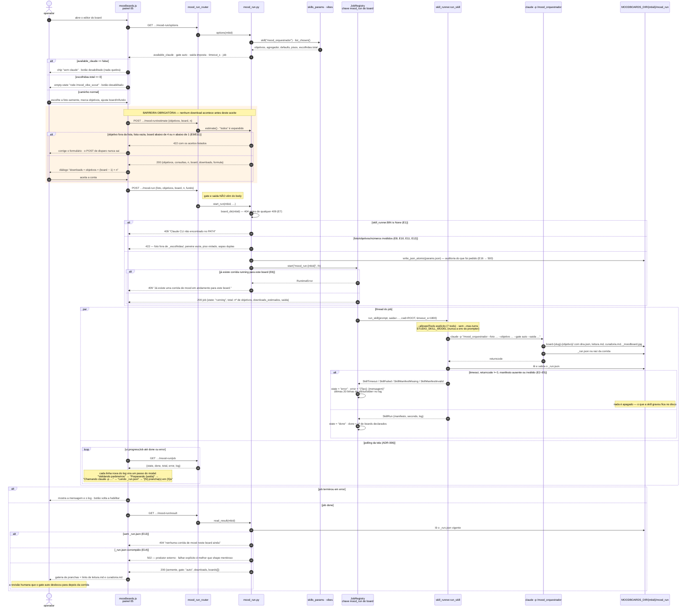
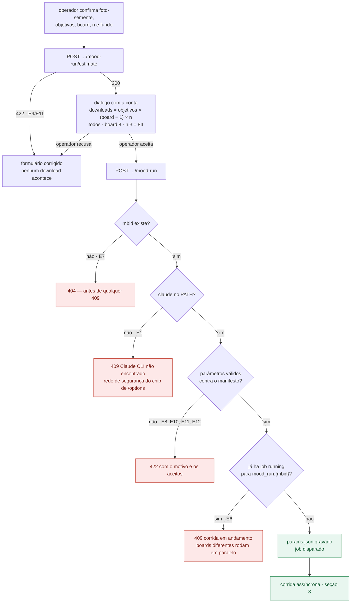
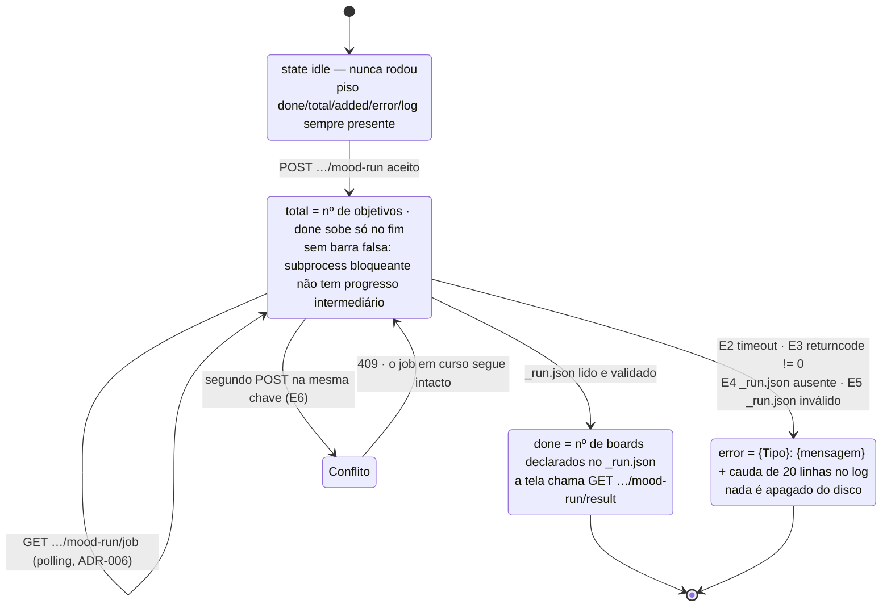
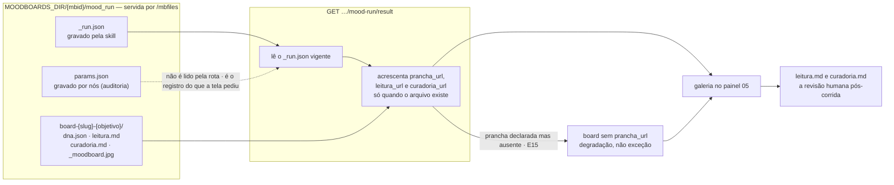

# Fluxo — a tela dispara a cadeia de skills `mood_` `[extensão]`

Task-Id: `ADH-OS-20260902-01` · FDD: `docs/domains/mood/features/mood-run-fdd.md`

Três fatos do desenho que o diagrama tem de deixar visível:

- **a estimativa é obrigatória** — `POST …/mood-run/estimate` fica entre a escolha dos parâmetros
  e o disparo, e é a única barreira antes de dezenas de downloads de terceiros (FDD §4.1.4, R3);
- **o servidor impõe dois parâmetros** — `gate` é sempre `auto` e não é aceito no body (D3, porque
  em `claude -p` não existe `AskUserQuestion`); `saida` é imposto como
  `MOODBOARDS_DIR/<mbid>/mood_run` (D1), o que confina a escrita à pasta do board;
- **a cadeia é gratuita** — não há gate de crédito, `require_cli()` nem chamada à Higgsfield em
  nenhum ponto deste fluxo, e nenhum `spend_action` é registrado (ADR-016, ADR-002).

## 1. O caminho inteiro do fluxo 4.1

## 2. A barreira da estimativa e a matriz de erros do disparo

> Nenhum ramo deste desenho passa por gate de crédito, `require_cli()` ou `higgsfield`. A conta
> mostrada no diálogo é de **downloads de terceiros**, não de dinheiro.

## 3. Ciclo de vida do job `mood_run:<mbid>`

## 4. O que a corrida grava e o que a galeria mostra

> Uma nova corrida **sobrescreve** `_run.json` e `params.json`; as pastas de boards anteriores
> continuam no disco e acessíveis pela pasta do board, mas `GET …/mood-run/result` mostra apenas
> o que o `_run.json` vigente declara.
