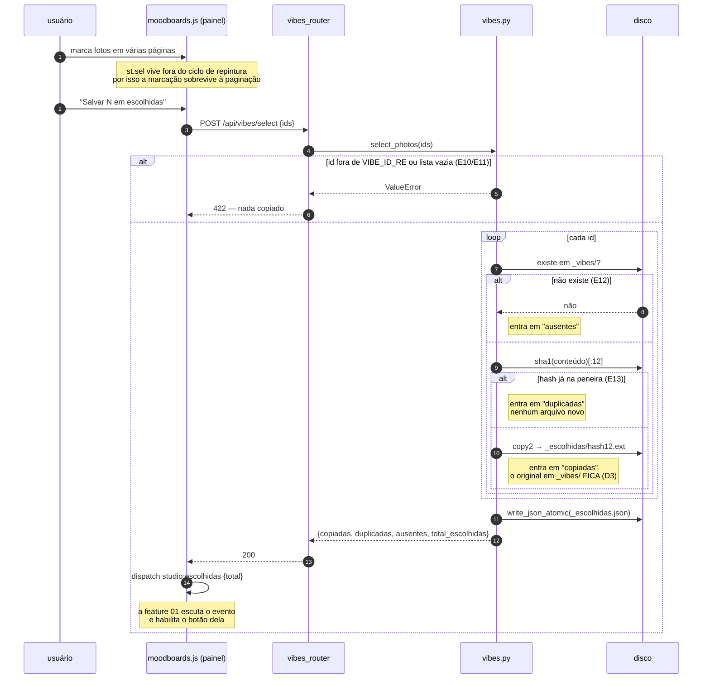

# Fluxo — painel paginado de seleção das fotos de vibe `[extensão]`

Task-Id: `ADH-OS-20260902-03` · FDD: `docs/domains/mood/features/painel-vibes-fdd.md`

## 1. Da pesquisa à peneira (visão de dados)

```mermaid
flowchart TB
  subgraph skill["fora do Studio"]
    S["/mood_vibe_scout<br/>entrevista + Pinterest"]
  end
  subgraph disco["MOODBOARDS_DIR — gitignored, servida por /mbfiles"]
    V["_vibes/<br/>NN-slug-i.jpg<br/>custom-… · extra-…<br/>_indice.json"]
    E["_escolhidas/<br/>hash12.jpg<br/>_escolhidas.json"]
    B["&lt;mbid&gt;/<br/>moodboard.json<br/>(a biblioteca, ADR-013)"]
  end
  subgraph api["studio/moodboards/vibes_router.py"]
    L["GET /api/vibes<br/>page · per_page≤20 · vibe · origem"]
    F["GET /api/vibes/facets"]
    P["POST /api/vibes/select"]
    C["GET /api/escolhidas"]
    D["DELETE /api/escolhidas/{id}"]
  end
  T["painel #/moodboards/_vibes<br/>studio/web/moodboards.js"]
  O["feature 01 — mood-run<br/>/mood_orquestrador --foto"]

  S -->|--saida| V
  V --> L
  V --> F
  L --> T
  F --> T
  T --> P
  P -->|copia + dedupe sha1| E
  E --> C
  C --> T
  T --> D
  D --> E
  C -->|total + caminho| O
  V -.->|invisível: MBID_RE rejeita "_"| B
```

## 2. Salvar uma seleção (caminho feliz e desvios)



## 3. Degradação do `_indice.json`

```mermaid
stateDiagram-v2
  [*] --> Lendo
  Lendo --> Ok: arquivo existe e é objeto com `vibes`
  Lendo --> Ausente: arquivo não existe (E3)
  Lendo --> Corrompido: JSON inválido ou formato inesperado (E4)

  Ok: indice.ok = true<br/>vibe, vibe_nome e origem_url vêm do índice
  Ausente: indice.ok = false · erro = "ausente"<br/>vibe lida de &lt;NN&gt;-&lt;slug&gt;-&lt;i&gt;<br/>origem_url = null
  Corrompido: indice.ok = false · erro = "corrompido: …"<br/>mesma degradação da ausência

  Ok --> [*]: 200
  Ausente --> [*]: 200 + chip warn na tela
  Corrompido --> [*]: 200 + chip warn na tela
```

> `origem` (catálogo / pedida / sugerida) **nunca** depende do índice: vem do prefixo do arquivo
> (`(nenhum)`, `custom-`, `extra-`), que sobrevive a qualquer estado do `_indice.json`.
