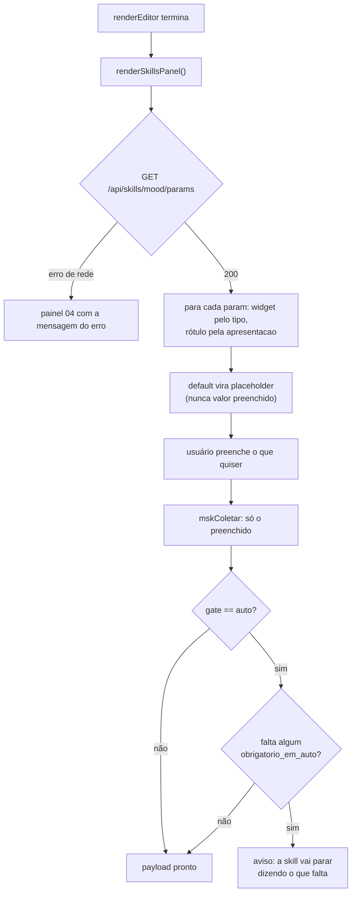

### FDD: manifesto de parâmetros das skills `mood_` `[extensão]` — ADH-OS-20260902-04

| | |
|---|---|
| **Task-Id** | `ADH-OS-20260902-04` |
| **Card** | https://trello.com/c/Jdb770fa |
| **Domínio** | `mood` — biblioteca global de mood boards (ADR-013), **não** a etapa 2 |
| **Plano de origem** | `docs/domains/mood/planos/plano-04-params-das-skills-no-front.md` |
| **Recon da wave** | `docs/domains/mood/recon-wave-10.md` (seções G e H) |
| **Wave** | 10, frente 04 — depende da frente 05 (skills versionadas em `.claude/skills/`) |
| **Status** | backend implementado · **front bloqueado por ADR-010** (ver §3.1 e §14) |

---

### 1. Contexto e motivação técnica

A cadeia `mood_` (`mood_orquestrador`, `mood_board_builder`, `mood_vibe_scout`,
`mood_visual_dna`) é `[extensão]`: pesquisa de referência visual que acontece **antes** da etapa 2
do curso. Hoje ela só é acionável por linha de comando.

Para acioná-la pela tela é preciso um formulário. Se esse formulário tiver os campos escritos à
mão no JavaScript, cada parâmetro novo numa skill obriga a mexer no front — e, quando ninguém
mexe, as duas verdades divergem **em silêncio**: a tela oferece um campo que a skill não aceita
mais, ou esconde um que ela passou a aceitar. O antídoto é inverter a direção: a tela **pergunta**
à API quais parâmetros existem e desenha exatamente o que vier.

Isso só funciona se houver alguém conferindo o manifesto contra a realidade. Esse alguém é um
teste que roda no CI e falha quando os dois lados divergem. Essa é a entrega central desta
feature; o endpoint e o formulário são a consequência.

#### 1.1 Por que `obrigatorio_em_auto` existe

Spike executado em 2026-09-02 (registrado como risco 5 do recon), resultado GO:

```
claude -p "/mood_orquestrador --gate auto --objetivo ambiente" --allowedTools "Read,Glob,Grep"
→ exit 0, SKILL.md carregado
```

Duas descobertas que viram requisito:

1. **Em `claude -p` não existe `AskUserQuestion`.** A skill não tem como perguntar nada. Logo
   `--gate auto` é o único modo viável quando quem dispara é uma tela.
2. **A skill para sozinha** e diz o que falta quando o insumo obrigatório não vem (`--foto`).

`obrigatorio_em_auto` marca no manifesto os campos que a skill vai cobrar nessa situação, para a
tela avisar **antes** de gastar a corrida — não para a tela substituir a validação da skill.

---

### 2. Objetivos técnicos

1. Publicar um manifesto de parâmetros por skill em `GET /api/skills/mood/params`.
2. Garantir por teste automatizado que o manifesto não diverge dos `SKILL.md`.
3. Gerar o formulário do front inteiramente a partir do manifesto — zero campo hardcoded.
4. Entregar o manifesto como contrato consumível pela frente 01 (painel de disparo).

---

### 3. Escopo e exclusões

**Entregue:** `studio/moodboards/skills_params.py` (o manifesto),
`studio/moodboards/skills_router.py` (a rota), o teste de divergência, o contrato HTTP e a
atualização de `docs/domains/mood/skills-mood-uso.md`.

**Especificado e escrito, mas NÃO entregue nesta PR:** o formulário gerado em
`studio/web/moodboards.js`. Ver §3.1.

**Não entra:** disparar as skills (é a frente 01 — ADH-OS-20260902-01); vocabulário de restrição de
busca (`--assunto`, `--tipo`, `--excluir`, …), retirado do plano em 2026-09-02 porque a qualidade da
consulta é responsabilidade da skill, não da tela; qualquer mudança de comportamento das skills;
`mood_visual_dna`, que não tem parâmetro de linha de comando.

#### 3.1 Parada de HARD-GATE: o front é do shell, não desta frente

O prompt desta frente pedia o formulário em `studio/web/moodboards.js`. Isso colide com um
contrato publicado e vigente.

**ADR-010** (STUDIO, *Aceito*, 25-08-2026) decide que "os arquivos únicos do núcleo
(`studio/app.py`, `steps.py`, `config.py`, `higgsfield.py`, `etapas/__init__.py` e
**`studio/web/*`**) passam a ser editáveis somente pelas frentes de preparo e shell de uma wave", e
a seção Consequências é explícita sobre o procedimento: "uma frente de etapa que precise de uma
rota nova, de um componente compartilhado ou de uma pasta em `PROJECT_LAYOUT` **para**, registra a
pendência e pede à frente de preparo — **mesmo que a mudança seja de uma linha**".

Não é letra morta nem regra de uma feature isolada:

- **ADR-013 §Decisão** classifica a própria área de mood boards como "**Área própria no shell**
  (`studio/web/*`, ADR-010)" — `studio/web/moodboards.js` é território de shell por construção;
- `docs/domains/music/features/views-music-edit-redesign-fdd.md:88` e `:352` — "**Nunca editar
  `studio/web/*` (ADR-010)**", com a mitigação de `<style>` escopado no próprio `view.html`;
- `docs/domains/studio/recon-wave-9.md:23` — "as 5 features editam apenas plugin+serviço; nada em
  `app.py`/`steps.py`/`web/*`";
- a regra é **executável**: `tests/test_prompter_presets_view.py::test_diff_da_feature_nao_toca_o_nucleo`
  compara o diff da branch contra `develop` e falha se qualquer caminho começar com `studio/web/`.

Não existe caminho alternativo conforme: `studio/web/index.html` também é núcleo, então um arquivo
JS novo não teria como ser carregado, e ADR-014 proíbe que a UI volte para `studio/etapas/mood/view.*`.

**O que foi feito, em vez de decidir o gate sozinho:** o front foi escrito, revisado e testado, e
está empacotado como patch aplicável em
`docs/domains/mood/features/pendencias/manifesto-skills-mood-front.patch` (o bloco `04` de
`moodboards.js`, a linha de hook em `renderEditor` e `tests/test_skills_params_front.py`, com 5
testes). Aplica limpo sobre `develop` e deixa os testes verdes — evidência em §9. **A frente de
preparo/shell da Wave 10 aplica; esta frente não aplica.** O backend e o teste de divergência —
que é o núcleo da feature — não dependem disso e vão nesta PR.

O que **não** foi feito, de propósito: afrouxar ou reescrever
`test_diff_da_feature_nao_toca_o_nucleo` para deixar a mudança passar. O teste é o mecanismo de
enforcement do ADR-010; alterá-lo para acomodar o próprio diff seria decidir um gate que não é
desta frente.

---

### 4. Fluxos

**Fluxo principal — desenhar e serializar o formulário** (especificação; entregue no patch de §3.1)

1. `renderEditor` do mood board termina e chama `renderSkillsPanel()`.
2. O front faz `GET /api/skills/mood/params`.
3. Para cada `param` do manifesto, `mskCampoHtml` escolhe o widget pelo `tipo` (camada declarada)
   e decora pela `apresentacao`. `grupo: "principal"` fica visível; `grupo: "avancado"` entra num
   `<details>` recolhido.
4. O `default` declarado vira **placeholder** (ou o rótulo da opção vazia do `<select>`) —
   **nunca** valor pré-preenchido do campo.
5. `mskColetar` devolve só os campos preenchidos. Campo vazio não entra no payload; a skill cai no
   default dela. É isto que faz "controle total" e "modo default" serem o mesmo caminho de código.
6. Se o parâmetro `gate` da skill estiver em `auto`, `mskFaltandoEmAuto` lista os campos marcados
   com `obrigatorio_em_auto` que não foram preenchidos, e a tela avisa.



**Fluxo de manutenção — a skill muda**

1. Alguém edita um `SKILL.md` (nova flag, default diferente, opção de enum a mais).
2. `make verify` → `tests/test_skills_params.py` **falha**, apontando skill, flag e os dois valores.
3. Quem mudou a skill atualiza o manifesto. O front não é tocado.

---

### 5. Contratos públicos

Um único contrato HTTP.

| Método · Caminho | Body | Retorno |
|---|---|---|
| `GET /api/skills/mood/params` | — | manifesto completo (abaixo) · **200 sempre** |

A rota é somente leitura, serve uma constante de processo, não toca disco e não depende de
campanha (`pid`). Está registrada em `studio/moodboards/skills_router.py` e incluída em
`studio/moodboards/router.py` por um bloco de duas linhas no fim do arquivo — mitigação do risco 3
do recon (três frentes da Wave 10 acrescentam rotas ao mesmo arquivo).

#### 5.1 As duas camadas do manifesto

Esta é a decisão estruturante da feature, e é o que torna o teste de divergência **passável sem
virar teatro**.

| Camada | Chaves | Origem | O teste compara? |
|---|---|---|---|
| **Declarada** | `flag`, `posicional`, `tipo`, `opcoes`, `agregador`, `default` | é o que o `SKILL.md` realmente declara | **Sim** — falha se divergir |
| **Apresentação** | `apresentacao`: `rotulo`, `ajuda`, `grupo`, `min`, `max`, `obrigatorio_em_auto` | decisão de UI, mora só no manifesto | **Não** |

O plano §4 propunha `min`, `max`, `grupo` e `obrigatorio_em_auto` como se fossem declaradas pelas
skills. **Nenhum `SKILL.md` declara nenhuma dessas chaves** (risco 10 do recon). Cobrá-las de um
documento que não as declara tem dois desfechos possíveis, ambos ruins: inventar declarações nos
`SKILL.md` para o teste passar, ou afrouxar a comparação inteira até ela não pegar mais nada. A
separação em duas camadas resolve: o teste cobra 100% do que é declarável, e não finge cobrar o
resto.

#### 5.2 Divergências entre o plano e os `SKILL.md` reais, e o que foi feito

| # | O plano dizia | O `SKILL.md` diz | Decisão |
|---|---|---|---|
| 1 | `n` da `mood_vibe_scout` tem `max: 8` | declara um **aviso** acima de 8 ("avise e siga se confirmarem"), não um teto | `max: null`; o aviso virou `ajuda`. Coberto por `test_o_teto_do_n_da_vibe_scout_nao_e_inventado` |
| 2 | `board` tem `min: 4` | "inteiro ≥ 4", em prosa livre, não em chave declarada | fica na camada de apresentação, não comparada |
| 3 | manifesto só com `mood_orquestrador` e `mood_vibe_scout` | `mood_board_builder` declara os mesmos flags do orquestrador | a builder **entra** no manifesto, com `default: null` em `n`/`board`/`saida`/`fundo` — ela não declara defaults próprios, herda na prática |
| 4 | (silente) | a `mood_vibe_scout` **não tem `--gate`**: a parada humana dela é fixa (aprovar a shortlist) | nenhum `gate` inventado. Coberto por `test_a_vibe_scout_nao_ganha_um_gate_inventado` |
| 5 | (silente) | a `mood_vibe_scout` aceita um **posicional** de descrição livre | vira o param `descricao` com `flag: null, posicional: true` |
| 6 | (silente) | o `--objetivo` do orquestrador aceita `todos`; o da builder, **um só** | `agregador: "todos"` no orquestrador, `null` na builder; e `tipo` `multi` × `enum` |
| 7 | (silente) | o orquestrador declara `--params` (JSON com as mesmas chaves) | listado em `parametros_ignorados` com motivo: é o próprio mecanismo pelo qual a tela entrega os outros parâmetros |
| 8 | contrato como objeto indexado por nome | — | virou **lista ordenada** de `params`: a ordem dos campos do formulário é significativa e objeto JSON não garante ordem |

#### 5.3 Shape exato — seção **Provides** (contrato para a frente 01)

A frente **ADH-OS-20260902-01** (painel de disparo das skills) consome este endpoint para montar o
painel dela. O shape abaixo é o contrato; `versao` sobe se ele mudar de forma incompatível.

```jsonc
{
  "versao": 1,
  "skills": [                                   // LISTA ordenada — a ordem é a da tela
    {
      "nome": "mood_orquestrador",              // nome da skill em .claude/skills/
      "rotulo": "Orquestrador do mood",
      "resumo": "Foto escolhida → DNA visual → prancha, um board por objetivo.",
      "skill_md": ".claude/skills/mood_orquestrador/SKILL.md",   // relativo à raiz do repo
      "params": [                               // LISTA ordenada — a ordem é a dos campos
        {
          // ---- camada DECLARADA (conferida contra o SKILL.md pelo teste) ----
          "nome": "objetivo",                   // chave do payload e do JSON de --params
          "flag": "--objetivo",                 // null quando o param é só posicional
          "posicional": false,                  // a skill também aceita o valor por posição
          "tipo": "multi",                      // enum|multi|inteiro|texto|caminho|lista|booleano
          "opcoes": ["ambiente", "campanha", "produto", "personagem"],   // [] fora de enum/multi
          "agregador": "todos",                 // literal que vale por toda a lista; null se não há
          "default": null,                      // default DECLARADO; null = o SKILL.md não declara
          // ---- camada de APRESENTAÇÃO (decisão de UI, não comparada pelo teste) ----
          "apresentacao": {
            "rotulo": "Objetivos",
            "ajuda": "um board por objetivo marcado",
            "grupo": "principal",               // principal = visível · avancado = recolhido
            "min": null,                        // dica de UI para tipo inteiro
            "max": null,                        // null = a skill não impõe teto
            "obrigatorio_em_auto": true
          }
        }
      ],
      "parametros_ignorados": [                 // flags que a skill declara e o manifesto omite
        { "flag": "--params", "motivo": "…" }   // de propósito, sempre com motivo
      ]
    }
  ],
  "fora_do_manifesto": [                        // skills mood_* sem parâmetro de linha de comando
    { "nome": "mood_visual_dna", "motivo": "…" }
  ]
}
```

**Regras de consumo — valem para qualquer consumidor, não só o front desta feature:**

1. `default` é **placeholder, nunca valor pré-preenchido**. Campo vazio não é enviado; a skill
   aplica o default dela. Pré-preencher quebraria a equivalência entre "modo default" e "controle
   total" e passaria a enviar valores que o usuário não escolheu.
2. `default: null` significa "o `SKILL.md` não declara default", **não** "o default é vazio". Na
   `mood_board_builder` isso é a regra: ela herda os defaults do orquestrador na prática.
3. `opcoes: []` só ocorre fora de `enum`/`multi`; a recíproca também vale.
4. `agregador` é atalho de UI: marcar `todos` marca todas as opções, mas o payload continua sendo
   a lista explícita. O literal também é aceito pela skill, então enviá-lo é válido.
5. `obrigatorio_em_auto` é aviso preventivo, não validação. Quem valida é a skill.
6. O único acoplamento nome-a-nome permitido no consumidor é o par `gate`/`auto`, necessário para
   avaliar a regra 5. Está isolado em `mskFaltandoEmAuto` e explicitado no teste
   (`LITERAIS_PERMITIDOS`). Todo o resto vem do manifesto.

**Reuso do front:** `window.Studio.moodSkillsForm` expõe `carregar()`, `montar(skill)`,
`coletar(root, skill)` e `faltandoEmAuto(root, skill)` — a frente 01 monta o mesmo formulário sem
duplicar regra.

---

### 6. Erros e fallback

| Situação | Onde | Comportamento |
|---|---|---|
| Manifesto servido | `GET /api/skills/mood/params` | **200 sempre**. Não há I/O nem parâmetro de entrada: nenhum 404/409/422/500 próprio |
| Rota inexistente sob `/api/skills/...` | FastAPI | **404** padrão do núcleo |
| `GET` falha no front (rede, servidor caído) | `renderSkillsPanel` | painel 04 renderiza `<div class="empty">` com a mensagem do erro; **o resto do editor continua funcionando** (o painel é acrescentado por `insertAdjacentHTML`, não substitui a tela) |
| Manifesto vazio ou sem `skills` | `renderSkillsPanel` | painel 04 com "Nenhuma skill parametrizável no manifesto" |
| `param` de tipo desconhecido | `mskCampoHtml` | cai no input de texto (degradação, não exceção) — o campo continua editável e enviável |
| `gate: auto` sem os campos exigidos | `mskFaltandoEmAuto` | chip de aviso listando os rótulos que faltam. **Não bloqueia**: quem barra é a skill, que para e diz o que falta |
| Manifesto diverge do `SKILL.md` | `tests/test_skills_params.py` | **falha o CI**, apontando skill, flag, valor no manifesto e valor no `SKILL.md` |
| `SKILL.md` ausente no caminho declarado | `tests/test_skills_params.py` | **falha** com o caminho na mensagem — nunca `skip` |
| Skill `mood_*` nova com `## Invocação` | `tests/test_skills_params.py` | **falha**: ou entra no manifesto, ou vai para `FORA_DO_MANIFESTO` com motivo |

Nota de guideline (§7.2): não há nenhum `except Exception: return {}` no caminho do manifesto. A
única captura é a do `fetch` no front, e ela renderiza a mensagem do erro em vez de engoli-la.

---

### 7. O teste de divergência — o que ele cobre de fato

`tests/test_skills_params.py` (61 casos) lê os `SKILL.md` versionados em `.claude/skills/mood_*/`,
extrai deles a camada declarada e compara com o manifesto **nas duas direções**.

**Cobre:**

| # | Regra | Teste |
|---|---|---|
| 1 | toda skill `mood_*` com `## Invocação` está no manifesto; as que não estão têm motivo em `FORA_DO_MANIFESTO` **e** de fato não declaram Invocação | `test_toda_skill_mood_com_invocacao_esta_no_manifesto` |
| 2 | o `skill_md` de cada skill aponta para um arquivo que existe | `test_todo_skill_md_do_manifesto_existe_no_caminho_declarado` |
| 3 | flag no manifesto que a skill não declara → falha | `test_as_flags_do_manifesto_e_do_skill_md_sao_as_mesmas` |
| 4 | flag na skill que o manifesto não expõe → falha, a menos que esteja em `ignorados` **com motivo** | idem + `test_toda_flag_ignorada_tem_motivo` |
| 5 | `ignorados` citando flag que a skill não declara mais → falha | idem |
| 6 | `default` do manifesto ≠ default declarado no `SKILL.md` → falha (inclusive quando um dos lados é "não declarado") | `test_o_default_do_manifesto_e_o_declarado_no_skill_md` |
| 7 | `opcoes ∪ {agregador}` ≠ literais declarados no `SKILL.md` → falha | `test_as_opcoes_do_enum_sao_as_declaradas_no_skill_md` |
| 8 | flag com alternativas no bloco de uso (`--gate interativo\|auto`) que o manifesto não trata como enum → falha | `test_toda_flag_com_alternativas_no_bloco_de_uso_e_enum_no_manifesto` |
| 9 | posicional no bloco de uso ⟺ exatamente um param com `posicional: true` | `test_o_posicional_do_manifesto_bate_com_o_bloco_de_uso` |
| 10 | regressões nomeadas: nenhum `gate` na `mood_vibe_scout`; nenhum teto inventado para o `--n` dela | `test_a_vibe_scout_nao_ganha_um_gate_inventado`, `test_o_teto_do_n_da_vibe_scout_nao_e_inventado` |
| 11 | coerência interna: todo param é alcançável por flag ou posição; `tipo` e `opcoes` batem; `agregador` só em `multi`; todo param tem rótulo; nomes únicos por skill | `test_cada_param_e_alcancavel_por_flag_ou_por_posicao`, `test_nomes_de_param_sao_unicos_por_skill` |

**Não cobre, deliberadamente:** `rotulo`, `ajuda`, `grupo`, `min`, `max`, `obrigatorio_em_auto`
(camada de apresentação — nenhum `SKILL.md` as declara); a semântica em prosa das skills; e
requisitos **cruzados** entre campos — a `mood_board_builder` exige `--dna` **ou** `--foto`, e o
manifesto expressa obrigatoriedade por campo, não condicional entre campos. Isso está registrado
na `ajuda` dos dois campos e é limite conhecido (ver §10).

**Como ele evita ser decoração:**

- **Sem `skipif`.** Os `SKILL.md` são versionados (frente 05, commit `0e153eb`); arquivo ausente é
  falha legítima, com o caminho na mensagem.
- **Guarda anti-teatro.** Se o formato dos `SKILL.md` mudar e o parser passar a devolver conjuntos
  vazios, todas as comparações passariam trivialmente.
  `test_o_parser_realmente_extrai_o_conteudo_dos_skill_md` ancora valores literais conferidos à
  mão (`--board` = `8`, `--n` da scout = `3`, `--gate` da builder = `interativo`, o enum de
  `--objetivo` com os quatro objetivos mais `todos`, e a contagem mínima de flags por skill). Se
  esse teste falha, o defeito é do parser, não do manifesto.
- **O parser mora no teste, não em produção.** Ele é o auditor; o manifesto é o auditado. Ler o
  `SKILL.md` em tempo de requisição faria o endpoint herdar os modos de falha do parser e
  eliminaria a independência entre as duas fontes.
- **Mutation testing executado** antes do commit — seis mutações, seis falhas (§9).

**Formas sintáticas que o parser reconhece** (são as três usadas pelas skills `mood_`):

| Forma | Exemplo | Skill |
|---|---|---|
| coluna `Default` de tabela markdown | `` \| `--board` \| inteiro ≥ 4 \| `8` \| … \| `` | `mood_orquestrador` |
| prosa em negrito | ``- `--n`: imagens por vibe. **Default 3.**`` | `mood_vibe_scout` |
| marcador `(default)` | ``- `--gate`: `interativo` (default) para na curadoria`` | `mood_board_builder` |

Metavariáveis em MAIÚSCULAS no bloco de uso (`LISTA|todos`, `ARQUIVO|TRECHO|DIRETÓRIO`) são
ignoradas de propósito: não são literais aceitos. Tokens entre crases com `/`, `_` ou `<`
(`processo_manual/…`, `mood_visual_dna`, `<saida>/curadoria.md`) também não entram como opção.

---

### 8. Observabilidade

Sem instrumentação nova: a rota é síncrona, sem I/O e sem estado. O sinal operacional desta
feature é o **CI**, e é onde ele deve estar — `make verify` vermelho no teste de divergência é o
alarme de que manifesto e skill se separaram. O front expõe o payload gerado num `<pre>`, que é o
que se cola num relato de bug.

---

### 9. Evidências de verificação

```
$ .venv/bin/python -m pytest tests/test_skills_params.py tests/test_skills_params_api.py -q
68 passed
```

**Mutation testing do teste de divergência** (mutação aplicada, teste rodado, mutação revertida):

| Mutação | Resultado |
|---|---|
| manifesto: `--board` default `8` → `6` | ✅ falhou em `test_o_default_do_manifesto_e_o_declarado_no_skill_md[mood_orquestrador--board]` |
| manifesto: inventa a flag `--assunto` | ✅ falhou em `test_as_flags_do_manifesto_e_do_skill_md_sao_as_mesmas` |
| `SKILL.md`: ganha a flag `--orientacao` | ✅ falhou em `test_as_flags_do_manifesto_e_do_skill_md_sao_as_mesmas` |
| manifesto: inventa `gate` na `mood_vibe_scout` | ✅ falhou em 3 testes, inclusive o de regressão nomeado |
| `SKILL.md`: default do `--gate` vira `auto` | ✅ falhou em `test_o_default_do_manifesto_e_o_declarado_no_skill_md[mood_orquestrador--gate]` |
| `SKILL.md`: `--fundo` perde a opção `claro` | ✅ falhou em `test_as_opcoes_do_enum_sao_as_declaradas_no_skill_md` |

**Gerador de formulário, contra o manifesto real** (harness em node, sem navegador):

```
mood_orquestrador:  7 campos de 7 params · 3 principais
mood_board_builder: 8 campos de 8 params · 4 principais
mood_vibe_scout:    5 campos de 5 params · 2 principais
```

**Endpoint em execução** (`PORT=8767 ./run.sh`): `GET /api/skills/mood/params` → `200`, com as
três skills e `mood_visual_dna` em `fora_do_manifesto`.

**Patch do front (§3.1), medido nos dois estados:**

```
$ git apply docs/domains/mood/features/pendencias/manifesto-skills-mood-front.patch
$ node --check studio/web/moodboards.js                       # ok
$ pytest tests/test_skills_params_front.py -q                 # 5 passed
$ pytest tests/test_prompter_presets_view.py -q               # 1 failed  ← o guard do ADR-010
$ git checkout -- studio/web/moodboards.js && rm tests/test_skills_params_front.py
$ pytest tests/test_prompter_presets_view.py -q               # 8 passed
```

É a medida exata da pendência: o front funciona e é testado, e é o ADR-010 — não um defeito — que
o mantém fora desta PR.

**`make verify`:** ruff limpo; pytest com **as 3 falhas pré-existentes e nenhuma a mais**
(`test_animate_api.py::test_generate_validates_and_starts_a_job` e as duas de
`test_edit_captions.py`, todas métrica de fonte no macOS, presentes na `develop` limpa).

---

### 10. Riscos e limites conhecidos

| Risco | Mitigação |
|---|---|
| Manifesto e skill divergirem | o teste de divergência (§7), que roda em `make verify` |
| O teste virar decoração se o formato dos `SKILL.md` mudar | guarda anti-teatro com âncoras literais (§7) |
| Três frentes editando `studio/moodboards/router.py` | rotas em módulo próprio (`skills_router.py`), incluídas por bloco de duas linhas no fim do arquivo |
| Três frentes editando `studio/web/moodboards.js` | todo o código novo num bloco contíguo delimitado por comentário, mais **uma** linha em `renderEditor` |
| CSS novo colidir com o das outras frentes | `<style>` inline com prefixo `.msk-` (ADR-019); `ui.css` e `style.css` intactos, verificado por teste |
| **Limite:** requisito cruzado entre campos | a builder aceita `--dna` **ou** `--foto`; o manifesto não expressa condicional entre campos. Registrado na `ajuda` dos dois; quem barra é a skill |
| **Limite:** parâmetro que a skill vira enum sem o manifesto perceber | pego pela regra 8 do §7 se as alternativas aparecerem no bloco de uso; se aparecerem só em prosa nova, não |
| Usuário marcar `todos` sem ver o custo | fora de escopo: a estimativa de downloads é da frente 01, que é quem dispara |

---

### 11. Build order e arquivos

| # | Arquivo | Ação | Linhas |
|---|---|---|---|
| 1 | `studio/moodboards/skills_params.py` | 🆕 manifesto (dataclasses + `manifesto()`) | ~400 |
| 2 | `studio/moodboards/skills_router.py` | 🆕 `GET /api/skills/mood/params` | ~28 |
| 3 | `studio/moodboards/router.py` | ✏️ bloco de inclusão no fim do arquivo | +6 |
| 4 | `tests/test_skills_params.py` | 🆕 teste de divergência + parser dos `SKILL.md` | ~340 |
| 5 | `tests/test_skills_params_api.py` | 🆕 contrato HTTP + auditoria do front | ~130 |
| 6 | `docs/domains/mood/skills-mood-uso.md` | ✏️ seção do manifesto | +~50 |
| 7 | `docs/domains/mood/features/manifesto-skills-mood-fdd.md` | 🆕 este documento | — |
| 8 | `docs/domains/mood/features/pendencias/manifesto-skills-mood-front.patch` | 🆕 o front, empacotado para a frente de shell (§3.1) | ~308 |

Oito arquivos, um contrato público, um fluxo principal → **implementação direta**, sem pipeline
SDD (regra do Passo 6 do `dd-parallel-feature`).

**Não tocados:** `studio/web/*` inteiro — `moodboards.js`, `index.html`, `app.js`, `ui.js`,
`ui.css`, `style.css` (núcleo, ADR-010, §3.1) — mais `studio/app.py`, `studio/steps.py` e
`studio/moodboards/service.py`. A pegada em arquivo compartilhado é de **6 linhas**, todas num
bloco delimitado por comentário no fim de `studio/moodboards/router.py`.

---

### 12. Critérios de aceite

| # | Critério | Verificação |
|---|---|---|
| 1 | `GET /api/skills/mood/params` reflete os parâmetros reais; o teste falha se divergirem | ✅ `tests/test_skills_params.py` + mutation testing (§9) |
| 2 | `make verify` verde | ✅ §9 — só as 3 falhas pré-existentes de métrica de fonte no macOS |
| 3 | O manifesto expõe as duas camadas separadas e é estável entre chamadas | ✅ `tests/test_skills_params_api.py` |
| 4 | A tela mostra dois controles principais — objetivos (múltipla escolha com `todos`) e aprovação humana | ⏸️ **pendente do patch** — harness node: 3 campos principais no orquestrador (foto, objetivos, aprovação humana) |
| 5 | Nada preenchido = comportamento default das skills | ⏸️ **pendente do patch** — `test_o_front_so_envia_o_que_foi_preenchido`; `default` só como placeholder |
| 6 | Nenhum campo do formulário existe fora do manifesto | ⏸️ **pendente do patch** — `test_o_front_nao_tem_nenhum_campo_hardcoded` |
| 7 | O grupo `avancado` nasce recolhido | ⏸️ **pendente do patch** — `test_o_grupo_avancado_nasce_recolhido` |
| 8 | `[cross-feature]` A frente 01 consome o manifesto para montar o painel de disparo | só verificável no estado integrado (W5) |
| 9 | `[cross-feature]` O painel 04 convive com os painéis novos das frentes 01 e 03 no mesmo `renderEditor` | só verificável no estado integrado (W5) |

Os critérios 4–7 estão **implementados e testados**, mas a verificação deles só é executável depois
que a frente de preparo/shell aplicar o patch de §3.1.

---

### 13. Dependências

- **Frente 05 (ADH-OS-20260902-05)** — pré-requisito **duro**, já integrado (`0e153eb`): sem os
  `SKILL.md` versionados o teste de divergência não teria o que ler num clone limpo do CI.
- **Frente 01 (ADH-OS-20260902-01)** — consumidora, não bloqueante. Ver §5.3 (Provides).
- ADR-013 (biblioteca global), ADR-019 (CSS escopado inline), ADR-008 (testes sem rede, CI),
  ADR-004 (a cadeia `mood_` inteira é `[extensão]`).

---

### 14. Pendências para a integração (W5)

| # | Pendência | Dono | Ação |
|---|---|---|---|
| 1 | **O front do manifesto** — bloco `04` de `studio/web/moodboards.js`, 1 linha em `renderEditor` e `tests/test_skills_params_front.py` | frente de **preparo/shell** da Wave 10 | `git apply docs/domains/mood/features/pendencias/manifesto-skills-mood-front.patch`, depois `make verify`. Aplica limpo sobre `develop`; evidência em §9 |
| 2 | **`test_diff_da_feature_nao_toca_o_nucleo` afeta as três frentes de front da Wave 10** — o recon (§G, risco 3) planejou 01, 03 e 04 editando `studio/web/moodboards.js` e **não** viu o ADR-010. As frentes 01 e 03 vão bater no mesmo guard | orquestração da wave | decidir na W5: (a) uma frente de shell consolida o front das três, ou (b) ADR novo que dê a `studio/web/moodboards.js` o mesmo regime dos plugins. **Não é decisão de frente** |
| 3 | **HLD do domínio `mood` (v1.2) desatualizado** — não menciona ADR-013/014, multishot nem a cadeia `mood_` (risco 13 do recon) | W5 | bump + parágrafo desta fatia. Esta frente não editou o HLD por ser artefato único compartilhado |
| 4 | **Critérios `[cross-feature]`** — consumo do manifesto pela frente 01 e convivência dos painéis novos no mesmo `renderEditor` | W5 | §12, critérios 8 e 9 |
| 5 | **Coleção Postman** — não gerada: o único contrato é um `GET` sem parâmetro, sem corpo e sem matriz de erro própria; `tests/test_skills_params_api.py` já cobre status, OpenAPI e shape | W5 | criar só se a wave padronizar Postman por domínio |
