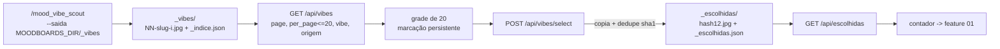

### FDD: painel paginado de seleção das fotos de vibe — ADH-OS-20260902-03

Versão: 1.0 · Data: 2026-09-02 · Domínio: `mood` (biblioteca global de mood boards, `[extensão]`)
Wave 10 · Card: https://trello.com/c/TNvLKcxB · Plano: `docs/domains/mood/planos/plano-03-painel-selecao-pinterest.md`
Recon (terreno compartilhado da wave): `docs/domains/mood/recon-wave-10.md`

> **`[extensão]`.** A aula 009 não ensina pesquisa de vibe no Pinterest. Toda esta feature é
> extensão do Studio (ADR-004), marcada como tal no código e na UI.

---

### 1. Contexto e motivação técnica

A skill `/mood_vibe_scout` entrevista o usuário como um diretor de arte, cruza um catálogo de 30
vibes com sugestões, e coleta N referências por vibe no Pinterest. A saída é uma pasta com dezenas
ou centenas de `.jpg`, um `_indice.json` e folhas de contato. Hoje essa pasta vive em
`processo_manual/moodboard/fotos_vibe/`, **fora de qualquer coisa servida pelo browser** — o
usuário só a vê pelo Finder, e a "peneira" (escolher as boas) é feita copiando arquivo à mão.

Esta feature põe a peneira dentro da tela de mood boards: um painel paginado que lista as fotos
coletadas, deixa marcar várias (inclusive através de páginas), e salva as escolhidas numa pasta
própria. É dessa pasta — e só dela — que a cadeia `mood_orquestrador` (feature 01 da wave) parte.

**Provides** e **Consumes** estão na seção 12 (contrato cross-feature).

### 2. Objetivos técnicos

1. Servir as fotos de vibe ao browser **sem tocar `studio/app.py`** e **sem expor
   `processo_manual/`** (206 imagens de terceiros) — reusando o mount `/mbfiles` que já existe.
2. Paginação **no servidor**, com teto duro de 20 itens por página, porque a pasta pode ter
   centenas de arquivos e a grade não pode carregar tudo.
3. Salvar = **copiar**, com deduplicação por hash de conteúdo, sem teto de quantidade.
4. Degradar com elegância quando o `_indice.json` faltar ou estiver corrompido: as fotos existem
   no disco e continuam listáveis; só os metadados (vibe, `origem_url`) ficam pobres.
5. Expor à feature 01 um contador de escolhidas estável e um caminho absoluto por foto.

### 3. Escopo e exclusões

**Entra**: módulo de serviço `studio/moodboards/vibes.py`; router próprio
`studio/moodboards/vibes_router.py` incluído em `router.py` por duas linhas; cinco endpoints;
painel novo no front (`studio/web/moodboards.js`) sob a pseudo-rota `#/moodboards/_vibes`;
testes cobrindo a matriz de erros; coleção Postman do domínio; diagrama Mermaid do fluxo.

**Não entra**: buscar no Pinterest a partir da tela (feature 04 + 01); editar/recortar/anotar
imagem; subir imagem para qualquer lugar; qualquer mudança em `select`/`MAX_SELECTED` do board
(ADR-007 segue intocada); **atualização do HLD do domínio `mood`** — o HLD (v1.2) está
desatualizado em relação a ADR-013/014/017 e é artefato único compartilhado pelas três frentes da
wave: fica para a fase de integração (W5), conforme risco 13 do recon.

### 4. Fluxos

**Fluxo principal (único).** O usuário roda `/mood_vibe_scout … --saida <MOODBOARDS_DIR>/_vibes` →
abre `#/moodboards` → clica em **Fotos de vibe** → o painel chama `GET /api/vibes/facets` (para o
filtro) e `GET /api/vibes?page=1&per_page=20` → marca fotos (a marcação sobrevive à troca de
página, ao filtro e à recarga da grade) → clica em **Salvar em escolhidas** → `POST
/api/vibes/select` copia os arquivos para `_escolhidas/`, deduplicando por hash → o painel de
escolhidas repinta via `GET /api/escolhidas` e o contador é publicado no evento
`studio:escolhidas`, que a feature 01 escuta para habilitar o botão dela.

**Fluxo secundário.** Remover uma escolhida: `DELETE /api/escolhidas/{id}` apaga a **cópia** e a
entrada de estado; o original em `_vibes/` nunca é tocado.



### 5. Contratos públicos

Todas as rotas são **globais** (sem `pid`), no router próprio `studio/moodboards/vibes_router.py`
(`APIRouter(tags=["vibes"])`), incluído em `studio/moodboards/router.py` com duas linhas.

#### 5.0 Layout no disco (decisão D1)

```
MOODBOARDS_DIR/
  _vibes/                    # saída do mood_vibe_scout (só leitura para esta feature)
    _indice.json             # metadados: vibe, origem, origem_url por arquivo
    01-cyberpunk-neon-1.jpg  # catálogo
    custom-02-neve-suja-3.jpg# a pessoa pediu
    extra-03-brutalismo-1.jpg# a skill sugeriu
  _escolhidas/               # a peneira (escrita por esta feature)
    _escolhidas.json         # {"versao": 1, "itens": [...]}
    a1b2c3d4e5f6.jpg         # cópia nomeada pelo hash
```

`MBID_RE = ^[a-z0-9][a-z0-9-]{0,80}$` rejeita nomes iniciados por `_` e `list_boards()` pula
diretórios sem `moodboard.json`: as duas pastas são **invisíveis** à biblioteca de boards e já
são servidas por `/mbfiles`, sem tocar `studio/app.py` (risco 6 do recon). `MOODBOARDS_DIR` já
está no `.gitignore` (`/moodboards/`), então as imagens de terceiros nunca entram no git.

#### 5.1 `GET /api/vibes`

Query: `page` (int ≥ 1, default 1) · `per_page` (int ≥ 1, default 20, **clampado a 20**) ·
`vibe` (slug, opcional) · `origem` (`catalogo|usuario|sugestao`, opcional).

```json
{
  "items": [{
    "id": "custom-02-neve-suja-3.jpg",
    "arquivo": "custom-02-neve-suja-3.jpg",
    "url": "/mbfiles/_vibes/custom-02-neve-suja-3.jpg",
    "vibe": "neve-suja", "vibe_nome": "Neve suja",
    "origem": "usuario",
    "origem_url": "https://br.pinterest.com/pin/123/",
    "bytes": 148213,
    "escolhida": false
  }],
  "page": 1, "per_page": 20, "total": 57, "pages": 3,
  "indice": {"ok": true, "erro": null, "campanha": "tênis de corrida"},
  "pasta": "/…/moodboards/_vibes"
}
```

`escolhida` é resolvido por hash **apenas para os itens da página** (≤ 20 leituras de arquivo por
request), com cache por `(caminho, mtime, tamanho)`.

#### 5.2 `GET /api/vibes/facets`

```json
{
  "vibes": [{"slug": "neve-suja", "nome": "Neve suja", "origem": "usuario", "total": 3}],
  "origens": [{"origem": "catalogo", "total": 30}, {"origem": "usuario", "total": 3}],
  "total": 57, "escolhidas": 12,
  "indice": {"ok": true, "erro": null, "campanha": "tênis de corrida"},
  "pasta": "/…/moodboards/_vibes"
}
```

#### 5.3 `POST /api/vibes/select`

Body: `{"ids": ["01-cyberpunk-neon-1.jpg", "…"]}` (1 a 500 ids).

```json
{"copiadas": ["01-cyberpunk-neon-1.jpg"], "duplicadas": ["extra-03-brutalismo-1.jpg"],
 "ausentes": [], "total_escolhidas": 13}
```

**Copia, nunca move** (D3): o arquivo em `_vibes/` permanece. **Sem teto** (D5).

#### 5.4 `GET /api/escolhidas`

Query: `page`, `per_page` (mesmas regras de 5.1). Sem filtros.

```json
{
  "items": [{
    "id": "a1b2c3d4e5f6",
    "arquivo": "a1b2c3d4e5f6.jpg",
    "origem_arquivo": "custom-02-neve-suja-3.jpg",
    "url": "/mbfiles/_escolhidas/a1b2c3d4e5f6.jpg",
    "caminho": "/…/moodboards/_escolhidas/a1b2c3d4e5f6.jpg",
    "vibe": "neve-suja", "vibe_nome": "Neve suja", "origem": "usuario",
    "origem_url": "https://br.pinterest.com/pin/123/",
    "bytes": 148213, "escolhida_em": "2026-09-02T18:04:11"
  }],
  "page": 1, "per_page": 20, "total": 13, "pages": 1,
  "pasta": "/…/moodboards/_escolhidas"
}
```

`caminho` é absoluto e é o que a feature 01 passa em `--foto` para `/mood_orquestrador`.

#### 5.5 `DELETE /api/escolhidas/{id}`

`id` = hash de 12 hex. Resposta `{"removida": "a1b2c3d4e5f6", "total_escolhidas": 12}`.
Apaga só a cópia; o original em `_vibes/` continua.

### 6. Erros e fallback — matriz

| # | Situação | Onde | Comportamento | Status |
|---|---|---|---|---|
| E1 | `_vibes/` não existe | `GET /api/vibes`, `/facets` | `total: 0`, `items: []`, `pasta` preenchida; a tela mostra o empty-state com o comando do `mood_vibe_scout` | **200** |
| E2 | `_vibes/` existe e está vazia (ou só com `_*`/não-imagens) | idem | igual a E1 | **200** |
| E3 | `_indice.json` ausente | `GET /api/vibes`, `/facets` | lista pelas fotos do disco; `indice.ok=false`, `indice.erro="ausente"`; `vibe`/`origem` derivados do **nome do arquivo**; `origem_url=null`; a tela mostra aviso | **200** |
| E4 | `_indice.json` corrompido (JSON inválido, raiz não-objeto, `vibes` não-lista) | idem | igual a E3, `indice.erro="corrompido: …"`. Nunca 500: as fotos existem | **200** |
| E5 | `page` < 1, ou não-inteiro | `GET /api/vibes`, `/escolhidas` | validação de query (`ge=1`) | **422** |
| E6 | `per_page` > 20 | idem | **clampado** para 20 e devolvido no envelope (D2: não é erro) | **200** |
| E7 | `per_page` < 1 | idem | validação de query (`ge=1`) | **422** |
| E8 | página além do fim (`page > pages`) | idem | `items: []` com `total`/`pages` corretos; a tela oferece voltar à última página | **200** |
| E9 | `origem` fora de `catalogo\|usuario\|sugestao` | `GET /api/vibes` | `detail` listando os aceitos | **422** |
| E10 | id inválido em `select` (`../x`, `a/b`, `_indice.json`, vazio, > 120 chars) | `POST /api/vibes/select` | request inteiro rejeitado; nada é copiado | **422** |
| E11 | `ids` vazio ou com mais de 500 itens | `POST /api/vibes/select` | rejeitado | **422** |
| E12 | id válido mas arquivo sumiu do disco | `POST /api/vibes/select` | volta em `ausentes`; as demais são copiadas | **200** |
| E13 | duplicata por hash (mesma foto já escolhida, inclusive vinda de outra vibe) | `POST /api/vibes/select` | volta em `duplicadas`; **nenhum arquivo duplicado é gravado** | **200** |
| E14 | id de escolhida fora de `^[0-9a-f]{12}$` | `DELETE /api/escolhidas/{id}` | | **422** |
| E15 | escolhida inexistente | `DELETE /api/escolhidas/{id}` | `detail: "foto escolhida não encontrada: <id>"` | **404** |
| E16 | `_escolhidas.json` ausente/corrompido | leitura de estado | tratado como estado vazio e **reconstruído** na próxima escrita; as cópias órfãs em disco não são reindexadas (o usuário reescolhe) | **200** |
| E17 | falha de I/O ao copiar (permissão, disco cheio) | `POST /api/vibes/select` | exceção propaga com contexto (`raise … from exc`); nada de `except: pass` | **500** |

Regras transversais: nenhum caminho é montado com valor cru — todo id passa por regex antes de
virar `Path`; toda escrita de estado usa `common.atomic.write_json_atomic` dentro de
`common.atomic.project_lock(_escolhidas/)`.

### 7. Observabilidade

Sem logger novo (o Studio não tem um). O que a tela e a API expõem:

- `indice.ok` / `indice.erro` em `/api/vibes` e `/api/vibes/facets` — o front pinta um chip
  `warn` quando `ok=false`, dizendo exatamente qual é o problema do `_indice.json`.
- `pasta` (caminho absoluto) em toda resposta de listagem — é como o usuário descobre onde
  apontar o `--saida` do `mood_vibe_scout`.
- `POST /api/vibes/select` devolve as três listas (`copiadas`, `duplicadas`, `ausentes`), nunca um
  número solto: o toast do front diz o que entrou, o que já estava e o que sumiu.
- `total_escolhidas` em toda mutação, e o evento DOM `studio:escolhidas` com `{total}` — a fonte
  única do contador para quem consome (feature 01).

### 8. Dependências

- `studio/config.MOODBOARDS_DIR` (já existente; **não** é alterado, e nada é acrescentado ao loop
  de `mkdir` do import — risco 7 do recon).
- `studio/common/atomic.write_json_atomic` e `project_lock`.
- `studio/common/ingest.MEDIA_EXT["image"]` para a lista de extensões aceitas.
- Mount `/mbfiles` já existente em `studio/app.py:220`. **`studio/app.py` não é editado.**
- Front: `window.Studio.ui` (`chip`, `modal`, `esc`) e `window.Studio.ctx` (`api`, `toast`).
- Nenhuma dependência de rede, de Higgsfield ou de Claude. **Nenhuma geração de imagem.**

### 9. Critérios de aceite

1. O painel mostra no máximo 20 fotos por página e navega até a última sem perder a marcação.
2. `per_page=100` devolve 20 itens e `per_page: 20` no envelope (não é erro); `page=0` é 422.
3. Filtrar por vibe e por origem funciona, e as contagens de `/facets` batem com o `_indice.json`.
4. Salvar **copia** para `_escolhidas/` sem remover de `_vibes/`; duplicata por hash é reportada
   em `duplicadas` e não gera segundo arquivo.
5. Remover de escolhidas apaga só a cópia; o original segue em `_vibes/`.
6. Com `_vibes/` vazia ou ausente, a tela explica o que fazer (rodar `/mood_vibe_scout` com
   `--saida <pasta>`) em vez de quebrar.
7. Com `_indice.json` ausente ou corrompido, as fotos continuam listáveis e a tela avisa.
8. Cada foto mostra thumb, nome, vibe, badge de origem (catálogo / pedida / sugerida) e o link do
   `origem_url` (rastreabilidade do pin).
9. `make verify` verde (fora das 3 falhas pré-existentes de métrica de fonte no macOS,
   documentadas na seção 10); nenhum teste toca a rede ou abre navegador.
10. `studio/app.py`, `studio/web/index.html`, `studio/web/app.js` e `studio/steps.py` não têm uma
    linha alterada; `studio/etapas/mood/view.*` não ganha nenhum controle novo (ADR-014).
11. `[cross-feature]` A feature 01 consegue habilitar/desabilitar o botão dela pelo contrato da
    seção 12 — verificável **só no estado integrado** (W5).

### 10. Riscos

| Risco | Mitigação |
|---|---|
| Expor `processo_manual/` (imagens de terceiros) ao browser | D1: pastas dentro de `MOODBOARDS_DIR`, que já é servida e gitignored. `processo_manual/` nunca é montado |
| Nome de arquivo virando caminho (path traversal) | `VIBE_ID_RE`/`CHOSEN_ID_RE` antes de qualquer `Path`; o `..` cai no primeiro caractere da regex |
| Colisão em `studio/moodboards/router.py` (3 frentes) | router próprio + 2 linhas num bloco comentado no fim do arquivo |
| Colisão em `studio/web/moodboards.js` (3 frentes) | painel autocontido em bloco próprio no fim do IIFE; footprint no código existente = 1 constante, 1 botão em `renderList`, 1 linha em `open()` |
| Seleção perdida ao paginar/filtrar | `Set` de ids no estado do painel, fora do ciclo de repintura da grade; teste de UI por texto |
| Centenas de arquivos derrubando a tela | paginação no servidor + `loading="lazy"` + a imagem servida é a original (o scout já grava JPEG comprimido, não há thumbs na pasta) |
| Hash de 20 arquivos por request | cache por `(caminho, mtime, tamanho)`; medido em ms para 20 JPEGs |
| 3 falhas pré-existentes de `make verify` no macOS | `test_animate_api.py::test_generate_validates_and_starts_a_job` e 2 de `test_edit_captions.py` — métrica de fonte, verdes no CI, **fora do escopo desta feature** |

### 11. Build order (arquivos)

1. `studio/moodboards/vibes.py` **[novo]** — leitura do índice, listagem, paginação, facetas,
   cópia/dedupe, remoção, contagem.
2. `studio/moodboards/vibes_router.py` **[novo]** — os 5 endpoints.
3. `studio/moodboards/router.py` — **2 linhas** no fim, em bloco comentado.
4. `tests/test_vibes_service.py` **[novo]** — unidade + matriz de erros do serviço.
5. `tests/test_vibes_api.py` **[novo]** — contrato HTTP + matriz de erros + asserts de tela.
6. `studio/web/moodboards.js` — painel `#/moodboards/_vibes` e `window.Studio.vibes`.
7. `docs/domains/mood/postman/mood-vibes.postman_collection.json` + `.postman_environment.json`.
8. `docs/domains/mood/diagrams/mermaid/fluxo-painel-vibes.md`.
9. Este FDD.

Nove arquivos, cinco contratos, um fluxo principal.

### 12. Provides / Consumes (contrato cross-feature)

#### Provides — o que a feature 01 (`ADH-OS-20260902-01`, mood-run) consome

**a) HTTP — fonte de verdade, independente de tela.**

```
GET /api/escolhidas?page=1&per_page=1  →  {"items": [...], "total": <int>, "pages": <int>, ...}
```

`total` é o número de fotos escolhidas. `total >= 1` habilita o botão "Gerar mood com as skills";
`total == 0` desabilita. Nenhuma outra chamada é necessária para o gate do botão.

Para **usar** as fotos, cada item de `GET /api/escolhidas` traz `caminho` — caminho absoluto do
arquivo em `MOODBOARDS_DIR/_escolhidas/`, pronto para virar o `--foto` de `/mood_orquestrador`
(a skill aceita arquivo, trecho de nome ou diretório; a pasta inteira é
`MOODBOARDS_DIR/_escolhidas/`, também devolvida em `pasta`).

**b) JS — açúcar para a mesma tela.** Exportado em `studio/web/moodboards.js`:

```js
window.Studio.vibes = {
  route,                    // "_vibes" — pseudo-rota: location.hash = "#/moodboards/_vibes"
  open(),                   // renderiza o painel
  count(),                  // último total conhecido (0 antes da primeira sincronização)
  async refreshCount(),     // GET /api/escolhidas?per_page=1 → total (fonte autoritativa)
  onChange(cb),             // cb(total) a cada mudança; devolve uma função para desinscrever
};
```

**c) Evento DOM.** A cada mutação de escolhidas (salvar, remover, recarregar o painel), a feature
dispara em `document`:

```js
new CustomEvent("studio:escolhidas", { detail: { total: <int> } })
```

Garantias: o evento é disparado **sempre depois** de o estado em disco já estar gravado;
`count()` nunca fica à frente do disco. Se a feature 01 for carregada sem o painel ter sido
aberto, `count()` devolve 0 — por isso o gate do botão deve chamar `refreshCount()` (ou o
endpoint HTTP) na inicialização, e usar `onChange` só para atualizações incrementais.

#### Consumes

- Saída do `/mood_vibe_scout` em `MOODBOARDS_DIR/_vibes/` (`--saida`). Contrato de nome de arquivo
  e de `_indice.json` conforme `.claude/skills/mood_vibe_scout/references/saida.md`.
- `MOODBOARDS_DIR` de `studio/config.py`.

#### Pendências para a integração (W5)

- Atualizar `docs/domains/mood/hld.md` (v1.2 está desatualizado: não menciona ADR-013/014/017 nem
  a cadeia `mood_`) com a nova área do painel de vibes. **Não feito nesta frente** por ser
  artefato único compartilhado pelas três frentes da wave.
- Critério de aceite 11 (botão da feature 01 gateado pelo contador) só é verificável no estado
  integrado.
- **Confirmar o carve-out em `tests/test_prompter_presets_view.py::test_diff_da_feature_nao_toca_o_nucleo`.**
  Essa guarda (commit `d3673bd`, 2026-08-30) compara o diff da **branch** contra `develop` e
  reprovava qualquer branch que tocasse `studio/web/` — inclusive as **três** frentes da wave 10,
  que por contrato editam `studio/web/moodboards.js`. Nenhum commit em `develop` tocou
  `studio/web/` desde que ela entrou, então esta é a primeira branch a acender o alarme. Foi
  aberta uma exceção só para `studio/web/moodboards.js`, justificada por ADR-013/014 (a área
  global da biblioteca não é núcleo nem `view.*` de plugin) e pelo próprio texto da ADR-010, que
  nomeia `app.js`, `index.html`, `app.py` e `steps.py` — não `studio/web/` inteiro. Todo o resto
  segue guardado. **As frentes 01 e 04 provavelmente farão a mesma edição**: a integração deve
  ficar com uma única versão deste arquivo.
- Ajustar o default de `--saida` do `/mood_vibe_scout` (hoje `processo_manual/moodboard/fotos_vibe`)
  para apontar a `MOODBOARDS_DIR/_vibes`, ou documentar a flag na tela. Esta frente **exibe** o
  caminho esperado no empty-state, mas não edita `SKILL.md` (arquivo de outra frente da wave).
