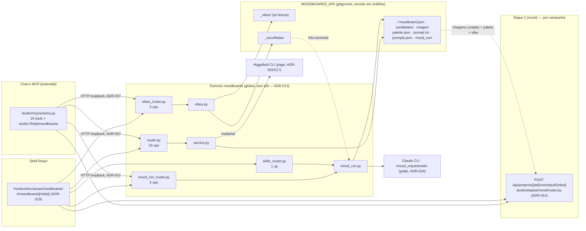

### HLD: moodboards (biblioteca global de mood boards, peneira de vibes e corrida `mood_`) `[extensão]`

Versão: 1.0 (estado do código em 06/09/2026 — biblioteca + multishot + painel de vibes + mood-run + chat)
Data: 2026-09-06
Task-Id: ADH-OS-20260906-14
Responsável: Arthur Diego (modo autônomo /dd-parallel, aprovação total)

---

### Objetivo técnico

Guardar **mood boards reutilizáveis fora de campanha** e alimentar a etapa 2 com eles. O curso
(aula 009) ensina **um** mood de vibe única por campanha; a biblioteca é acréscimo do Studio e
**estende a ADR-007** — cada board continua sendo UMA vibe com até 8 imagens curadas, mas vive numa
área global (ADR-013) e é copiado para a campanha quando o usuário quiser (ADR-014). Todo o domínio
é `[extensão]`.

Em volta do board cresceram três anexos, todos no mesmo diretório global: a **peneira de vibes**
(fotos pesquisadas no Pinterest pela skill `/mood_vibe_scout`), a **corrida `mood_`** (a cadeia de
skills `mood_orquestrador` executada pelo Claude CLI, ADR-034) e o **multishot** da imagem de vibe
(único caminho pago, ADR-017).

### Componentes

| Componente | Papel |
| --- | --- |
| `studio/moodboards/service.py` | Estado em arquivo (ADR-003) sob `MOODBOARDS_DIR`: CRUD de board, ingestão/curadoria (via `common/ingest.py`), paleta derivada, prompt de vibe (via `common/prompter.py`), multishot (`JobRegistry` próprio) e o consumo pelas etapas 2/3 (`board_image_paths`). Dono do `MBID_RE` e do `board_dir` — nenhum id vira `Path` sem regex. |
| `studio/moodboards/vibes.py` | A peneira: lê `_vibes/` (só leitura, saída do `mood_vibe_scout`) e copia — nunca move — as escolhidas para `_escolhidas/`, deduplicando por hash do conteúdo. Sem teto de escolhidas: o teto de 8 é do board. |
| `studio/moodboards/mood_run.py` | A corrida: valida o pedido contra o manifesto das skills, monta a invocação do `/mood_orquestrador`, dispara como job (`common/skill_runner.py`, ADR-034) e lê o `_run.json` que a skill gravou. `gate` é sempre `auto`; `saida` é imposta pelo servidor. |
| `studio/moodboards/skills_params.py` | O manifesto declarado das skills `mood_` (objetivos, defaults, pisos) — fonte única de opções para `mood_run` e para o painel. |
| `studio/moodboards/router.py` | 18 operações do board + inclusão dos três sub-routers. `KeyError`→404, nome duplicado→409, `ValueError`→422, CLI ausente→409. |
| `studio/moodboards/vibes_router.py` · `mood_run_router.py` · `skills_router.py` | As 5 + 5 + 1 operações restantes, em arquivos próprios para reduzir colisão de rebase entre frentes paralelas. |
| `studio/etapas/mood/router.py` | **Fora do domínio**: a ponte de saída `POST /api/projects/{pid}/mood/pull/{mbid}` (ADR-014) — a etapa 2 escolhe e aplica um board. |
| `studio/mcp/actions.py` + `server.py` | As 15 tools `moodboard_*`/`vibes_*`/`escolhidas_list`/`mood_run*`/`mood_pull` do assistente, clientes HTTP da própria API (ADR-037). |
| `frontend/src/areas/moodboards/` | A área do shell: lista de boards, editor, painel de vibes e painel da corrida (ADR-019). |

### Fluxo

1. **Criar** o board (`POST /api/moodboards`): `mbid` é o slug do nome; o diretório nasce com
   `images/` e `candidates/thumbs/`.
2. **Importar** candidatas: `import/upload` (bytes, só pela tela — ADR-040), `import/downloads`
   (pasta do sistema) ou `import/history` (histórico do CLI da Higgsfield).
3. **Curar** (`POST .../select`): o usuário marca as imagens; o serviço copia para `images/` e
   deriva `palette.json`. Remover uma candidata (`DELETE .../candidates/{cid}`) também a tira da
   seleção e recalcula a paleta.
4. **Prompt de vibe** (`GET .../prompt`, `POST .../prompt/generate`): reusa o bot da etapa 2
   (`template` | `brief` | `images`); grava `prompt.txt` e empilha o histórico em `prompts.json`.
5. **Multishot `[extensão]`** (ADR-017): `multishot/cost` estima e `multishot/generate` gera ângulos
   novos de UMA candidata pela Higgsfield (**pago**, gate de login único em `hf.require_cli()`);
   `multishot/job` acompanha. As imagens novas entram como candidatas do próprio board.
6. **Peneira de vibes**: `GET /api/vibes` (paginado, filtros `vibe`/`origem` vindos de
   `/api/vibes/facets`) → `POST /api/vibes/select` copia para `_escolhidas/` →
   `GET /api/escolhidas` lista a peneira, de onde sai o caminho absoluto da foto-semente.
7. **Corrida `mood_`** (grátis em crédito, cara em tempo e downloads): `mood-run/options` e
   `mood-run/estimate` mostram a conta antes; `POST .../mood-run` dispara o job; `mood-run/job`
   acompanha e `mood-run/result` devolve as pranchas já com URL de `/mbfiles`.
8. **Puxar para a campanha** (ADR-014): `POST /api/projects/{pid}/mood/pull/{mbid}` copia as imagens
   curadas, a paleta e a vibe para `mood/selected/` da campanha. A cópia é **independente**: apagar
   o board depois não afeta a campanha. É idempotente — reexecutar sobrescreve.
9. **Pelo chat** (ADR-036/037): as 15 tools cobrem 1–8 exceto upload de bytes, exclusão de candidata
   avulsa, abertura de pasta do sistema e o manifesto. Escolha visual e gasto continuam do usuário
   (ADR-038); o assistente nunca manipula bytes (ADR-040).



### Interfaces

**29 operações HTTP em 26 caminhos.** Arquivo e nome da função de router de cada uma:

`studio/moodboards/router.py` — 18 operações em 15 caminhos:

| Método | Rota | Função | Nota |
| --- | --- | --- | --- |
| GET | `/api/moodboards` | `moodboards` | lista `{id,name,note,vibe,cover,count,created}` |
| POST | `/api/moodboards` | `new_board` | cria `{name, note?}`; 409 se o slug já existe |
| GET | `/api/moodboards/{mbid}` | `board_detail` | detalhe + candidatas + imagens + paleta + prompt |
| PATCH | `/api/moodboards/{mbid}` | `board_patch` | `{name?, note?, vibe?}` |
| DELETE | `/api/moodboards/{mbid}` | `board_delete` | destrutivo; confirmação na tela e no chat |
| GET | `/api/moodboards/{mbid}/candidates` | `board_candidates` | **lista pura**; `thumb` = `thumbs/<sha12>.jpg` |
| DELETE | `/api/moodboards/{mbid}/candidates/{cid}` | `board_candidate_delete` | remove candidata, thumb e seleção; rederiva a paleta |
| GET | `/api/moodboards/{mbid}/downloads-folder` | `board_downloads_folder` | caminho da pasta de Downloads |
| POST | `/api/moodboards/{mbid}/open-folder` | `board_open_folder` | abre a pasta no explorador do sistema |
| POST | `/api/moodboards/{mbid}/import/upload` | `board_upload` | multipart; **único** caminho de bytes (ADR-040) |
| POST | `/api/moodboards/{mbid}/import/downloads` | `board_downloads` | 404 se a pasta não existe |
| POST | `/api/moodboards/{mbid}/import/history` | `board_history` | 409 sem CLI (caminho suave); 502 na falha |
| POST | `/api/moodboards/{mbid}/select` | `board_select` | curadoria → `images/` + `palette.json`; devolve `selected` como **contagem** |
| GET | `/api/moodboards/{mbid}/prompt` | `board_prompt` | prompt de vibe vigente |
| POST | `/api/moodboards/{mbid}/prompt/generate` | `board_prompt_generate` | `mode` = `template` \| `brief` \| `images`; 409 sem Claude |
| POST | `/api/moodboards/{mbid}/multishot/cost` | `board_multishot_cost` | estimativa (não gasta); 404 antes de 409 |
| POST | `/api/moodboards/{mbid}/multishot/generate` | `board_multishot_generate` | **PAGO**; gate de login único; 409 se já há job |
| GET | `/api/moodboards/{mbid}/multishot/job` | `board_multishot_job` | `{state,done,total,added,error,log}` |

`studio/moodboards/vibes_router.py` — 5 operações em 5 caminhos:

| Método | Rota | Função | Nota |
| --- | --- | --- | --- |
| GET | `/api/vibes` | `vibes_list` | paginado; filtros `vibe`/`origem`; 422 em valor inválido |
| GET | `/api/vibes/facets` | `vibes_facets` | os slugs de vibe e as origens aceitas |
| POST | `/api/vibes/select` | `vibes_select` | copia (nunca move) para `_escolhidas/`, dedup por hash |
| GET | `/api/escolhidas` | `escolhidas_list` | a peneira; `total` habilita o botão da corrida |
| DELETE | `/api/escolhidas/{escolhida_id}` | `escolhidas_remove` | 404 traduzido na borda (o handler global fala de "projeto") |

`studio/moodboards/mood_run_router.py` — 5 operações em 5 caminhos:

| Método | Rota | Função | Nota |
| --- | --- | --- | --- |
| GET | `/api/moodboards/{mbid}/mood-run/options` | `mood_run_options` | opções, defaults e pisos, do manifesto |
| POST | `/api/moodboards/{mbid}/mood-run/estimate` | `mood_run_estimate` | quantos downloads; não baixa nem dispara |
| POST | `/api/moodboards/{mbid}/mood-run` | `mood_run_start` | dispara o job; 409 sem Claude CLI ou corrida em andamento |
| GET | `/api/moodboards/{mbid}/mood-run/job` | `mood_run_job` | estado no formato que o `progressJob` consome |
| GET | `/api/moodboards/{mbid}/mood-run/result` | `mood_run_result` | pranchas com URL de `/mbfiles` |

`studio/moodboards/skills_router.py` — 1 operação em 1 caminho:

| Método | Rota | Função | Nota |
| --- | --- | --- | --- |
| GET | `/api/skills/mood/params` | `skills_mood_params` | manifesto declarado das skills `mood_` |

**Fora do domínio** (ponte de saída, ADR-014): `POST /api/projects/{pid}/mood/pull/{mbid}` em
`studio/etapas/mood/router.py`. **Estático**: `/mbfiles` montado em `MOODBOARDS_DIR`
(`studio/app.py`) — é ele que serve thumbs, imagens curadas e pranchas da corrida.

**MCP `[extensão]`** (ADR-036/037), 15 tools: `moodboard_list`, `moodboard_get`, `moodboard_create`,
`moodboard_import`, `moodboard_pick`, `moodboard_prompt`, `moodboard_delete`, `vibes_list`,
`vibes_pick`, `escolhidas_list`, `mood_run`, `mood_run_wait`, `moodboard_multishot`,
`moodboard_multishot_wait`, `mood_pull`; mais o resource `studio://help/moodboards`. Contrato
completo em `features/chat-moodboards-fdd.md`.

### Persistência

`MOODBOARDS_DIR` (`STUDIO_MOODBOARDS`, default `<root>/moodboards`) é criado no boot junto de
`PROJECTS_DIR`/`STATE_DIR` e é **gitignored** — nenhuma imagem de terceiro entra no repositório.

```
MOODBOARDS_DIR/
  <mbid>/                     mbid = slug do nome; MBID_RE rejeita nomes começados por "_"
    moodboard.json            {id, name, note, vibe, created}
    candidates/<sha12>.<ext>  importadas ainda não curadas (ingestão comum com step="",
    candidates/thumbs/<sha12>.jpg   por isso as candidatas ficam na RAIZ do board)
    candidates.json           o índice das candidatas (seleção, origem, prompt)
    images/                   as curadas — o que a etapa 2/3 consome
    palette.json              paleta derivada das curadas
    prompt.txt                o prompt de vibe vigente
    prompts.json              histórico dos últimos 50 prompts
    mood_run/                 saída da corrida: params.json + _run.json + board-<slug>-<objetivo>/
  _vibes/                     saída do /mood_vibe_scout — SÓ LEITURA
  _escolhidas/                a peneira: _escolhidas.json + as cópias <hash12>.<ext>
```

`_vibes/` e `_escolhidas/` moram aqui de propósito: `MOODBOARDS_DIR` já é servida por `/mbfiles` e
já é gitignored, e o prefixo `_` as mantém fora do `MBID_RE` — não viram board fantasma.

### Decisões (ADRs)

| ADR | O que fixa aqui |
| --- | --- |
| ADR-007 | Vibe única, teto de 8 imagens, grid de 4 como orientação de UI — o board herda o teto. |
| ADR-013 | Biblioteca **global** de mood boards reutilizáveis, sem `pid`; estende a ADR-007. |
| ADR-014 | A etapa 2 só **escolhe e aplica** um board: `mood/pull` copia, e a cópia é independente. |
| ADR-017 | Multishot como componente reutilizável — aqui aplicado à imagem de vibe do board (pago). |
| ADR-019 | Rework do editor de mood board: a área global do shell e o desenho das telas. |
| ADR-034 | Execução de skill do Claude CLI com escrita em disco — a corrida `mood_` e sua saída confinada ao board. |

Também vinculantes: ADR-003 (persistência em arquivo), ADR-002 (Higgsfield só pelo CLI oficial),
ADR-016 (gate de custo), ADR-036/037/038/040 (chat, MCP como cliente HTTP, humano-no-laço, agente
sem bytes) e ADR-010 (fronteira de núcleo — o domínio não edita `app.py`/`steps.py`).

### Fora do escopo / follow-ups

- Compartilhar boards entre máquinas ou usuários: a biblioteca é local, como o resto do Studio.
- Gerar imagem de mood board por IA **dentro** da biblioteca: multishot é o único caminho pago; o
  caminho primário continua sendo importar.
- Tools MCP para `DELETE candidates/{cid}`, `open-folder`, `downloads-folder`,
  `DELETE /api/escolhidas/{id}`, `mood-run/options` e `/api/skills/mood/params` — cobertos pela tela
  e pelo escape hatch `api_get`.
- Guarda de drift entre o catálogo de tools do MCP e o `/openapi.json` (ADR-037 §6), nunca
  construída: as tools da biblioteca aumentam a superfície sem essa rede.
- Navegação do chat para `#/moodboards[/<mbid>]`: é da frente F08 (chat-navigate); até lá o
  assistente só instrui a abrir a área pela barra lateral.
