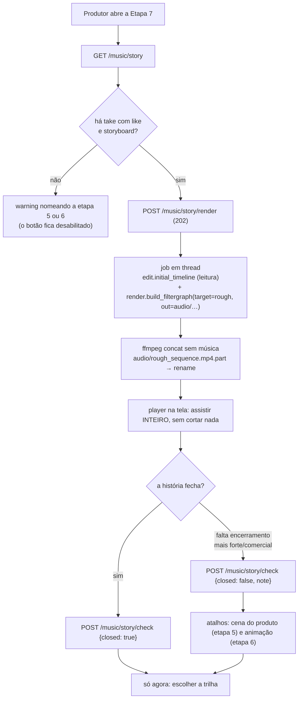
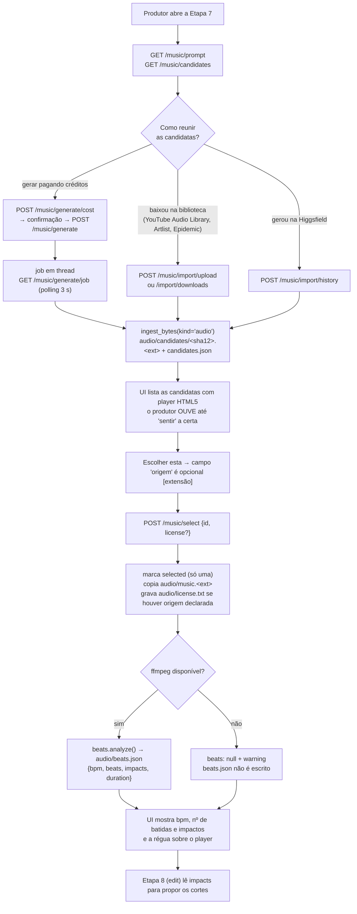
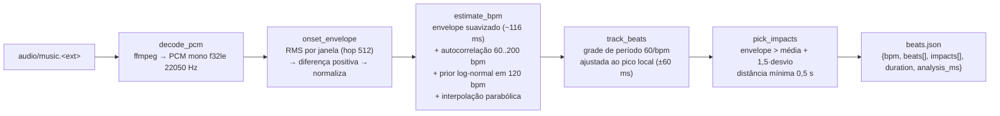
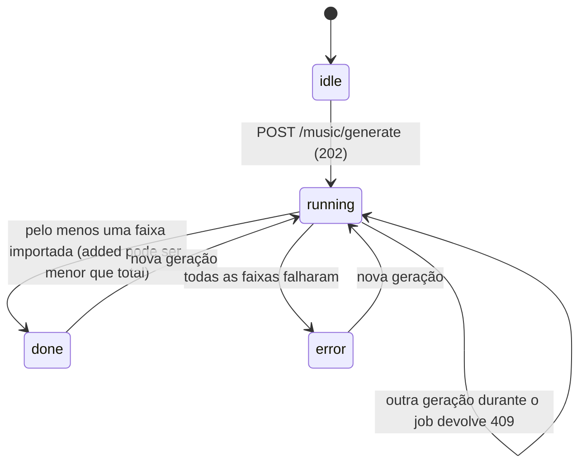

# Etapa 7 — Trilha (aula 013): diagramas do fluxo

Fonte: `docs/domains/music/features/music-fdd.md` (seções 4 e 5) · Implementação: `studio/etapas/music/`, `studio/music/`.

## 0. Passo 0 — assistir a história inteira (aula 013, wave 2)

A aula começa antes da trilha: todas as cenas em ordem, sem cortar nada, para enxergar a história
como um todo e decidir se ela fecha.



O passo 0 **não grava** `edit/timeline.json`: a aula é explícita em que aqui ainda não se edita
(por isso `edit.initial_timeline` é usada em leitura, nunca `edit.get_timeline`).

## 1. Fluxo principal — reunir → sentir → escolher → marcar as batidas



## 2. Detecção de batidas (`studio/music/beats.py`)



O prior de tempo existe por um motivo concreto: sem ele, um período que não cai em número
inteiro de janelas casa melhor com o **dobro** do período e o bpm sai pela metade (120 → 60).

## 3. Sequência do `select`

```mermaid
sequenceDiagram
    participant UI as view.js
    participant R as router (music)
    participant S as music/service
    participant B as music/beats
    participant F as common/ffmpeg
    UI->>R: POST /api/projects/{pid}/music/select {id, license}
    R->>S: select(pid, id, license)
    S->>S: valida o id (404 se inexistente); origem/licença é opcional [extensão]
    S->>S: marca selected, copia audio/music.<ext>, grava license.txt só se houver origem
    alt ffmpeg disponível
        S->>B: analyze(music_path)
        B->>F: run(ffmpeg -i music -ac 1 -ar 22050 -f f32le)
        F-->>B: PCM float32
        B-->>S: {bpm, beats, impacts, duration}
        S->>S: grava audio/beats.json
    else ffmpeg ausente
        S->>S: remove beats.json obsoleto, warning
    end
    S-->>R: {selected, music, beats, warning}
    R-->>UI: 200 JSON
```

## 4. Estados do job de geração por CLI


