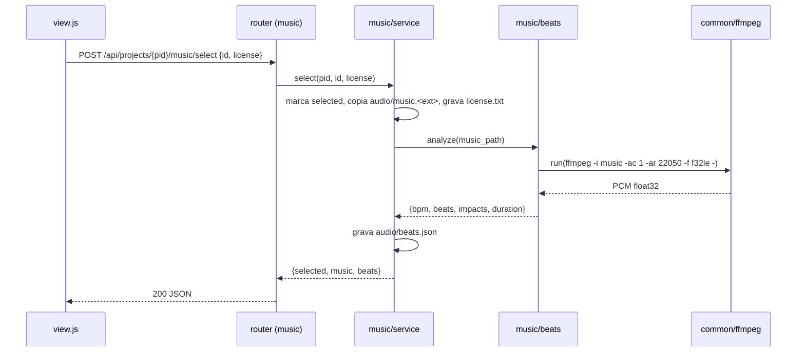

### FDD: music (Etapa 7 · Trilha · aula 013)

Versão: 1.0
Data: 2026-08-25
Responsável: frente OS-007 (wave 1, `/dd-parallel`, modo batch)

---

### 1. Contexto e motivação técnica

A aula 013 ensina que a trilha vem ANTES da montagem: o produtor joga os clipes na timeline sem
editar, ouve várias músicas até "sentir" a certa e usa as batidas fortes como marcação de onde
"algo acontece". Esta feature materializa esse passo como o plugin `studio/etapas/music/` +
serviço `studio/music/`, no monólito FastAPI + SPA vanilla descrito em `docs/domains/studio/hld.md`.

**Provides** (copiado de `wave-1.md`)
- `audio/music.{wav,mp3}` (escolhida), `audio/candidates.json` `[{id,file,name,source,selected}]`
- `audio/beats.json`: `{"bpm": n, "beats":[s…], "impacts":[s…], "duration": s}`
- `audio/license.txt`: origem/licença declarada pelo usuário

**Consumes** (copiado de `wave-1.md`)
- `mood/mood.md` (vibe) ← mood; `project.json` ← núcleo

Atores: o produtor (único usuário, local, sem auth por ADR-001); o CLI da Higgsfield (só via
`studio/higgsfield.py`, ADR-002); ffmpeg estático (`studio/common/ffmpeg.py`); a etapa `edit`
como consumidora de `beats.json`.

Limites: a etapa não monta, não corta, não mixa (etapa 8). A cena extra do produto da aula 013
ficou em `shots` por decisão da wave. O Studio não busca música em bibliotecas de terceiros
(sem API; o usuário baixa na biblioteca e importa).

Suposições e restrições explícitas:
- Persistência em FS sob `projects/<id>/audio/` (pasta já criada por `create_project`, ADR-003).
- Jobs em thread daemon com `studio/common/jobs.JobRegistry` e polling (ADR-006).
- Importação de candidatas via `studio/common/ingest.py` com `step="audio"` e `kind="audio"`.
- `[auto-aceito: a pasta da etapa é "audio" (não "music") para bater com o Provides da wave e com PROJECT_LAYOUT; o id do plugin continua "music"]`
- `[auto-aceito: detecção de batidas com numpy + ffmpeg (PCM mono 22050 Hz decodificado por ffmpeg, envelope de energia por janelas, picos = impactos, tempo por autocorrelação) em vez de librosa; librosa pesa no CI e numpy já entra em requirements.txt pela tarefa transversal do orquestrador]`

---

### 2. Objetivos técnicos

- Reunir N candidatas de áudio por upload, Downloads, histórico do CLI ou geração; invariante:
  `audio/candidates.json` é a única lista e nunca contém duplicatas (dedupe por sha12 do `ingest`).
- Permitir ouvir cada candidata na UI via `/files/<pid>/audio/candidates/<id>.<ext>` (player HTML5),
  sem transcodificar.
- Escolha única: após `select`, exatamente uma candidata tem `selected=true`, existe
  `audio/music.<ext>` e `audio/license.txt`.
- Detecção determinística: para a mesma trilha, `beats.json` é idêntico entre execuções
  (sem aleatoriedade); `bpm` entre 60 e 200; `impacts ⊆ beats` ou próximos (≤ 60 ms) de uma batida;
  `duration` igual ao `probe` do ffmpeg com tolerância de 0,1 s.
- Tempo de detecção ≤ 10 s para trilha de 60 s em CPU comum (numpy vetorizado).
- Geração por CLI só quando `hf.available()` e logado, sempre com `cost` antes.

---

### 3. Escopo e exclusões

**Incluído**
- Plugin `music` (META n=7, aula 013) com `view.html`/`view.js` e router.
- Importação de candidatas: upload multipart (≤ 25 MB por arquivo, ext ∈ wav/mp3/m4a/ogg),
  pasta Downloads (`import_downloads(kind="audio")`), histórico de áudio do CLI (`import_history(kind="audio")`).
- Geração por CLI (`sonilo_music`) com prompt derivado do mood: `cost` + job + import automático dos URLs.
- Player na UI com nome, origem e duração; botão "Escolher esta".
- `select`: copia para `audio/music.<ext>`, grava `license.txt`, roda detecção e grava `beats.json`.
- Recalcular batidas sob demanda (`POST .../beats`), com parâmetros default.
- Testes de serviço e de API com fakes (sem rede), `pytest.skip` quando ffmpeg ausente nos casos que dependem dele.

**Excluído**
- Trim, fade, ganho, corte para o ápice (etapa 8, aula 014).
- SFX (etapa 8). Cena extra do produto (shots).
- Busca/download automático em YouTube Audio Library, Artlist, Epidemic, Envato, Musicbed.
- Validação jurídica de licença; o Studio só registra o que foi declarado.
- Análise de tonalidade, seções, energia por trecho `[INFERÊNCIA]`.
- Edição de arquivos únicos (`higgsfield.py`, `requirements.txt`, `conftest.py`, `test_steps_and_config.py`).

---

### 4. Fluxos detalhados e diagramas

**Fluxo principal (aula 013: reunir → sentir → escolher → marcar batidas)**
- O usuário abre a etapa 7; `onProject()` chama `GET .../music/candidates` e `GET .../music/prompt`.
- O Studio mostra a instrução da aula ("baixe 3 a 5 músicas na biblioteca do YouTube, Artlist ou
  Epidemic; a trilha dita o ritmo; batida forte = algo acontece") e o prompt sugerido para `sonilo_music`,
  montado a partir de `project.json.vibe` + "Paleta dominante"/vibe de `mood/mood.md`:
  `"<vibe>, cinematic, strong beats, no vocals"`, duração 35 s (plano-higgsfield §2).
- Importação: upload (`POST .../import/upload`), Downloads (`POST .../import/downloads`) ou histórico
  (`POST .../import/history`). Cada arquivo passa por `ingest_bytes(root, "audio", data, source, name, kind="audio")`,
  que grava `audio/candidates/<sha12>.<ext>`, mede `duration` via `ffmpeg.probe` e registra em `audio/candidates.json`.
- A UI lista as candidatas com `<audio controls src=ctx.files("audio/candidates/<file>")>`; o usuário ouve ("sente").
- O usuário clica "Escolher esta"; a UI pede em `prompt()` a origem/licença (texto livre, ex.:
  "YouTube Audio Library, 'Frost Rider', livre para uso"), e chama `POST .../select {id, license}`.
- `service.select(pid, id, license)`: valida id, marca `selected` (só um), copia o arquivo para
  `audio/music.<ext>` (removendo `music.*` anterior), grava `audio/license.txt`
  (`Arquivo, Origem/licença declarada, Data`), chama `beats.analyze(music_path)` e grava `audio/beats.json`.
- Resposta traz `{selected, music, beats}`; a UI mostra bpm, nº de batidas e nº de impactos, e
  uma régua simples com marcações (SVG/div) sobre a barra do player.

**Fluxo de geração por CLI (alternativa paga)**
- Chip de status do CLI como no mood; botão "Gerar 3 candidatas" desabilitado sem `logged_in`.
- `POST .../generate/cost {prompt, duration, count}` → `hf.cost("sonilo_music", params)` → `{per_track, total}`.
- `confirm()` na UI → `POST .../generate {prompt, duration, count}` → `registry.start(pid, total=count, fn)`.
- `fn(job)`: para cada i em `count`, `hf.generate("sonilo_music", {"prompt", "duration"})`; extrai URLs de
  áudio de `r["urls"]` (já cobre wav/mp3 após a extensão transversal de `MEDIA_URL_RE`) e, como fallback,
  varre `r["raw"]` com regex `https?://\S+\.(wav|mp3)`; `hf.download` para bytes → `ingest_bytes(..., source="cli", prompt=prompt, meta={"job_id", "model"})`;
  grava `jobs/music_<jobid>.json`; `job["done"] += 1`, `job["added"]`, `job["log"]`.
- UI faz polling em `GET .../generate/job` a cada 3 s; ao `done`, recarrega candidatas.

**Fluxo de detecção (`studio/music/beats.py`)**
- `decode_pcm(path) -> np.ndarray float32`: `ffmpeg -i path -ac 1 -ar 22050 -f f32le -` via `ffmpeg.run`, lido de stdout.
- `onset_envelope(y, sr=22050, hop=512)`: energia RMS por janela → diferença positiva (half-wave rectified) → normalização.
- `estimate_bpm(env, sr, hop)`: autocorrelação do envelope em lags equivalentes a 60..200 bpm; pico máximo → `bpm`.
- `track_beats(env, bpm, sr, hop)`: grade de período `60/bpm` alinhada ao maior pico do envelope no primeiro
  período; cada batida é ajustada ao pico local numa janela de ±60 ms.
- `pick_impacts(env, beats, k)`: batidas cujo envelope excede `mean + k*std` (`k=1.5`) com distância mínima de 0,5 s; são os "algo acontece".
- `analyze(path, k=1.5) -> {"bpm", "beats", "impacts", "duration"}`; arredondamento a 3 casas; listas ordenadas.
- `[auto-aceito: parâmetros default sr=22050, hop=512, k=1.5, distância mínima 0,5 s, faixa 60..200 bpm; expostos como kwargs, sem config de usuário]`

**Fluxos alternativos e exceções**
- Upload com extensão fora de `MEDIA_EXT["audio"]` → `ingest_bytes` devolve None → `added` não conta; UI mostra "N adicionadas".
- Duplicata (mesmo sha) → ignorada silenciosamente (contagem `added` menor que enviada).
- ffmpeg ausente → import continua (sem `duration`); `select` grava `music.*` e `license.txt` e devolve
  `beats: null` com `warning: "ffmpeg indisponível: batidas não detectadas"`; `beats.json` não é escrito.
- Trilha muito curta (< 4 s) ou silêncio → `bpm: null`, `beats: []`, `impacts: []`; arquivo gravado mesmo assim.
- Job de geração concorrente → `RuntimeError` → 409.
- CLI não logado → 409 "CLI da Higgsfield não instalado/logado".
- `select` de id inexistente → `FileNotFoundError` → 404.
- Trocar de trilha após `edit` já ter `timeline.json`: `select` regrava `music.*` e `beats.json`;
  a UI avisa "a montagem (etapa 8) precisa ser refeita" (só aviso; não toca em `edit/`).

**Diagramas**
- Sequência (select):



- Estados do job de geração: `idle → running → done | error` (padrão `JobRegistry`).

---

### 5. Contratos públicos (assinaturas, endpoints, headers, exemplos)

Todas as rotas sob `/api/projects/{pid}/music/`; `pid` inválido ou inexistente → 404 (núcleo).
Corpo JSON salvo onde indicado multipart. Modelos Pydantic no `router.py`.

**Funções do serviço (`studio/music/service.py`)**
- `mood_prompt(pid) -> {"prompt": str, "duration": 35, "model": "sonilo_music", "instructions": str}`
- `list_candidates(pid) -> list[dict]`
- `import_upload(pid, files: list[tuple[str, bytes]]) -> {"added": int}`
- `import_downloads(pid, folder=None, since_minutes=120, limit=40) -> {"added", "scanned", "folder"}`
- `import_history(pid, size=50) -> {"added", "jobs"}`
- `generate_cost(pid, prompt, duration=35, count=3) -> {"per_track": float|None, "total": float|None, "raw"}`
- `start_generate(pid, prompt, duration=35, count=3) -> dict` (job); `job_status(pid) -> dict`
- `select(pid, cand_id, license: str) -> {"selected": dict, "music": str, "beats": dict|None, "warning": str|None}`
- `recompute_beats(pid, k=1.5) -> dict` (relê `audio/music.*`)
- `read_beats(pid) -> dict` (`FileNotFoundError` se não houver)

**Funções de detecção (`studio/music/beats.py`)**
- `decode_pcm(path: Path, sr: int = 22050) -> np.ndarray`
- `analyze(path: Path, sr=22050, hop=512, k=1.5, min_gap=0.5, bpm_range=(60, 200)) -> dict`

**Endpoints**

| Rota | Método | Corpo / query | Resposta | Status |
| --- | --- | --- | --- | --- |
| `.../music/prompt` | GET | | `{prompt, duration, model, instructions}` | 200 |
| `.../music/candidates` | GET | | `[{id, kind:"audio", source, name, prompt, file, duration, selected, imported, job_id?, model?}]` | 200 |
| `.../music/import/upload` | POST | multipart `files[]` | `{added}` | 200, 413 (> 25 MB), 422 (sem arquivo) |
| `.../music/import/downloads` | POST | `{folder?, since_minutes?}` | `{added, scanned, folder}` | 200, 404 (pasta inexistente) |
| `.../music/import/history` | POST | `{size?}` | `{added, jobs}` | 200, 409 (CLI ausente), 502 (falha do CLI) |
| `.../music/generate/cost` | POST | `{prompt, duration?, count?}` | `{per_track, total, raw}` | 200, 409 (CLI ausente) |
| `.../music/generate` | POST | `{prompt, duration?, count?}` | job `{state, done, total, added, log}` | 202, 409 (job ativo / CLI ausente), 422 (prompt vazio, count 1..6, duration 10..120) |
| `.../music/generate/job` | GET | | job | 200 |
| `.../music/select` | POST | `{id, license}` | `{selected, music, beats, warning}` | 200, 404 (id), 422 (license vazia) |
| `.../music/beats` | GET | | `beats.json` | 200, 404 (ainda sem trilha) |
| `.../music/beats` | POST | `{k?}` | `beats.json` | 200, 404 (sem trilha), 409 (ffmpeg ausente) |

Semântica: 202 em `generate` indica job iniciado; 409 em `generate` distingue job ativo (`detail`
"job em andamento") de CLI ausente. Limites: upload 25 MB por arquivo; `generate` bloqueia até
600 s por faixa dentro do job; `select` responde em ≤ 15 s para trilhas de até 3 min (detecção síncrona).
`[auto-aceito: detecção roda síncrona dentro do select, sem job, porque a trilha da aula tem 30..60 s; recompute idem]`

**Exemplo de requisição (`POST .../music/select`)**
```json
{"id": "3fa2c9e1b7d0", "license": "YouTube Audio Library, 'Frost Rider', uso livre com atribuição"}
```

**Exemplo de resposta**
```json
{
  "selected": {"id": "3fa2c9e1b7d0", "kind": "audio", "source": "upload", "name": "frost_rider.mp3",
               "file": "candidates/3fa2c9e1b7d0.mp3", "duration": 34.9, "selected": true},
  "music": "audio/music.mp3",
  "beats": {"bpm": 124.0, "beats": [0.482, 0.966, 1.45], "impacts": [0.482, 8.226, 15.97], "duration": 34.9},
  "warning": null
}
```

**Exemplo (`POST .../music/generate`)**
```json
{"prompt": "icy neon energy drink, cinematic, strong beats, no vocals", "duration": 35, "count": 3}
```
Resposta 202: `{"state": "running", "done": 0, "total": 3, "added": 0, "error": null, "log": []}`

**Formato de `audio/license.txt`**
```
Arquivo: audio/music.mp3
Candidata: 3fa2c9e1b7d0 (frost_rider.mp3, origem: upload)
Origem/licença declarada: YouTube Audio Library, 'Frost Rider', uso livre com atribuição
Declarado em: 2026-08-25T14:02:11
```

Compatibilidade: `beats.json` é o contrato consumido por `edit`; campos e unidades (segundos, float)
não mudam sem novo acordo na wave. `candidates.json` segue o schema do `ingest` (superconjunto do da wave).

---

### 6. Erros, exceções e fallback

**Matriz de erros**

| Condição | Tratamento | Notas |
| --- | --- | --- |
| `pid` inválido/inexistente | `KeyError` → 404 (núcleo) | `project_dir` |
| upload > 25 MB | 413 | `MAX_UPLOAD_BYTES` do padrão mood |
| extensão não suportada / duplicata | ignorado, `added` menor | sem erro HTTP |
| pasta Downloads inexistente | `FileNotFoundError` → 404 | mensagem com o caminho |
| CLI ausente ou não logado | `HTTPException(409)` | history, cost, generate |
| CLI falha em history | 502 com stderr ≤ 400 chars | |
| job concorrente | `RuntimeError` → 409 | `JobRegistry.start` |
| `generate` falha em 1 faixa | job continua, `log` registra, `added` conta só o que entrou | `state=done` com `added < total` |
| todas as faixas falham | `state=error`, `error` com a última mensagem | |
| ffmpeg ausente no select | grava música e licença, `beats=None`, `warning` | não bloqueia a escolha |
| ffmpeg ausente no recompute | 409 "ffmpeg indisponível" | |
| PCM vazio / trilha < 4 s | `bpm=None`, listas vazias | sem exceção |
| `license` vazia | 422 | a aula exige saber a origem |
| `select` de id inexistente | 404 | |

**Resiliência**
- Timeout: ffmpeg decode 120 s; `hf.generate` 600 s por faixa; `hf.download` usa o timeout de `urlopen` do módulo.
- Sem retries automáticos na geração (gasta crédito); o usuário reexecuta.
- Sem backoff nem circuit breaker (local, single-process).

**Política de fallback**
- Caminho principal é "modo UI + importar" (grátis); geração por CLI é alternativa.
- Sem ffmpeg: a etapa cumpre "escolher a trilha" e adia as batidas; `edit` trata ausência de `beats.json` como "sem marcações".

**Invariantes**
- No máximo uma candidata com `selected=true`; `audio/music.*` existe se e só se alguma está selecionada.
- `beats.json`, quando existe, corresponde ao `audio/music.*` atual (regravado a cada select).
- `license.txt` existe sempre que `music.*` existe.
- `beats` e `impacts` ordenados crescentes, em segundos, dentro de `[0, duration]`.

---

### 7. Observabilidade

**Métricas** (derivadas de arquivos e do job; sem sistema de métricas externo, como no HLD)
- Contagem de candidatas por `source` (upload/downloads/higgsfield/cli) em `candidates.json`.
- Job: `done/total/added`, tempo por faixa no `log`.
- Detecção: `bpm`, `len(beats)`, `len(impacts)`, tempo de análise (campo `analysis_ms` no `beats.json`).

**Logs**
- `logging.getLogger("studio.music")`: `import ok pid=… source=… added=…`, `generate start pid=… count=…`,
  `generate track i/n job_id=… urls=…`, `select pid=… id=… ext=…`, `beats pid=… bpm=… beats=… impacts=… ms=…`,
  `beats skipped reason=ffmpeg_unavailable`. Nunca logar conteúdo de `license` além do tamanho.
- JSON bruto do CLI em `projects/<id>/jobs/music_<jobid>.json`.

**Tracing**
- Não há tracing no monólito (ADR-001/006). `job["log"]` cumpre o papel de trilha por execução.

**Dashboards e alertas**
- Chip de status do CLI e painel do job na própria UI; sem alertas externos.

---

### 8. Dependências e compatibilidade

| Componente | Versão mínima | Observações |
| --- | --- | --- |
| Python | 3.12 | `.venv` por worktree |
| FastAPI / Pydantic | 0.141 / 2.13 | já no projeto |
| numpy | 1.26 | adicionado a `requirements.txt` pela tarefa transversal; a frente não edita o arquivo |
| ffmpeg/ffprobe | 7.0 (estático em `~/.local/bin`) | via `studio/common/ffmpeg.py`; ausência degrada, não quebra |
| `studio/common/ingest.py` | wave 1 | `kind="audio"`, `step="audio"` |
| `studio/common/jobs.py` | wave 1 | `JobRegistry` |
| `studio/higgsfield.py` | wave 1 (estendido) | `history_media("audio")`, `generate`, `download`, `cost`; `MEDIA_URL_RE` com wav/mp3 |
| Higgsfield CLI | 1.1.23 | modelo `sonilo_music` não confirmado no catálogo (login pendente) |

**Garantias de compatibilidade**
- `beats.json` estável para `edit` e `prospect` (teaser usa `audio/music.*`).
- `candidates.json` compatível com o schema do `ingest` (mesmos campos do mood + `duration`).
- Sem alteração em arquivos únicos; `META.n = 7` bate com o catálogo `SOON`.

---

### 9. Critérios de aceite técnicos

- `GET /api/steps` lista `music` com `status: ready`, `n: 7`, aula `013`; `view.html`/`view.js` servidos.
- Upload de 2 wav de fixture (`make_audio`) → `candidates.json` com 2 entradas, `duration ≈ 3.0`; reenviar o mesmo → `added: 0`.
- `import_downloads` com `STUDIO_DOWNLOADS` apontando para tmp com 1 mp3 recente → `added: 1`.
- `import_history` com `hf.history_media` fakeado → candidatas com `source: "higgsfield"`.
- `generate/cost` com `hf.cost` fakeado → `total = per_track * count`; sem CLI → 409.
- `generate` com `hf.generate` fakeado (2 faixas ok, 1 falha) → `state: done`, `added: 2`, log com a falha; segundo `generate` durante o job → 409 (gate com `threading.Event`).
- `select` com licença → `audio/music.wav`, `license.txt` com a declaração, `beats.json` com `bpm` em 60..200 para um clique sintético de 120 bpm (fixture gerada por ffmpeg `lavfi` ou numpy) com erro ≤ 3 bpm; `impacts ⊆ beats` (tolerância 60 ms).
- `select` de outra candidata regrava `music.*` (apaga a extensão anterior) e `beats.json`; só uma `selected=true`.
- `select` com `license` vazia → 422; id inexistente → 404.
- `select` com ffmpeg indisponível (monkeypatch `ffmpeg.available` → False) → 200, `beats: null`, `warning` preenchido, `beats.json` ausente.
- `analyze` em silêncio de 5 s → `bpm: null`, listas vazias, sem exceção; em trilha de 2 s → idem.
- `analyze` é determinístico: duas execuções produzem JSON idêntico.
- `[cross-feature]` `beats.json` com `impacts` é lido por `edit` para propor cortes sem adaptação (cobrado na W5 com a trilha real do projeto de teste).
- `ruff check studio tests` limpo; testes sem rede; casos com ffmpeg fazem `pytest.skip` se `ffmpeg.available()` for False.

---

### 10. Riscos e mitigação

### Detecção por energia erra o bpm em trilhas sem batida marcada (ambient, pads)

- **Probabilidade:** média
- **Impacto:** `edit` propõe cortes em pontos errados; usuário perde confiança nas marcações.
- **Mitigação:**
    - autocorrelação restrita a 60..200 bpm e escolha do pico com maior proeminência, não só o máximo;
    - `impacts` independem do bpm (limiar sobre o envelope), então "algo acontece" continua útil;
    - UI mostra as marcações sobre o player para o usuário conferir de ouvido, como manda a aula.
- **Plano de contingência:** ADR trocando para librosa se a taxa de erro em trilhas reais for inaceitável; interface `analyze()` não muda.

### `sonilo_music` inexistente ou com flags diferentes no catálogo vivo

- **Probabilidade:** média
- **Impacto:** geração por CLI falha; usuário fica só com importação.
- **Mitigação:**
    - modelo e parâmetros em constantes do serviço, sem espalhar;
    - erro do CLI vira `log` legível no job e 502/409 na API;
    - caminho principal é importação (grátis), fiel à aula.
- **Plano de contingência:** validar `model get sonilo_music` após login e ajustar constantes (mudança local à frente).

### `hf.generate` devolver `urls=[]` para áudio

- **Probabilidade:** baixa (extensão transversal de `MEDIA_URL_RE` já prevista)
- **Impacto:** faixas geradas e cobradas não importadas.
- **Mitigação:**
    - fallback varrendo `raw` com regex de wav/mp3;
    - JSON bruto salvo em `jobs/music_<jobid>.json` para recuperação manual via `import_history`.
- **Plano de contingência:** usuário baixa na UI da Higgsfield e importa por Downloads.

### Decodificação pesada em trilhas longas

- **Probabilidade:** baixa
- **Impacto:** `select` demora além de 15 s.
- **Mitigação:**
    - PCM mono 22050 Hz (≈ 5 MB/min em float32);
    - operações numpy vetorizadas; sem loops Python por amostra.
- **Plano de contingência:** mover detecção para job com polling (mesmo `JobRegistry`) sem mudar o contrato de `beats.json`.

---

### 11. Sequenciamento de implementação (Build Order)

| Ordem | Etapa | Depende de | Componentes/arquivos prováveis | Critérios que fecha (da seção 9) |
| --- | --- | --- | --- | --- |
| 1 | Plugin mínimo e META | - | `studio/etapas/music/__init__.py`, `router.py` (vazio), `view.html`, `view.js` (esqueleto) | `GET /api/steps` com `music ready`, views servidas |
| 2 | Detecção de batidas | - | `studio/music/beats.py`, `tests/test_music_service.py` (fixtures de clique/silêncio) | `analyze` bpm ±3, impacts ⊆ beats, silêncio, determinismo |
| 3 | Serviço de candidatas e prompt | 1 | `studio/music/__init__.py`, `studio/music/service.py` (`mood_prompt`, `list_candidates`, `import_*`) | upload, dedupe, downloads, history |
| 4 | Select, licença e beats.json | 2, 3 | `studio/music/service.py` (`select`, `recompute_beats`, `read_beats`) | select grava music/license/beats; troca de trilha; ffmpeg ausente |
| 5 | Geração por CLI | 3 | `studio/music/service.py` (`generate_cost`, `start_generate`, `job_status`) | cost, job com falha parcial, 409 concorrente |
| 6 | Router e matriz de erros | 3, 4, 5 | `studio/etapas/music/router.py`, `tests/test_music_api.py` | status 404/409/413/422/502; contratos da seção 5 |
| 7 | UI (player, escolha, régua de batidas, job) | 6 | `studio/etapas/music/view.html`, `view.js` | ouvir, escolher com licença, ver bpm/impactos, polling |
| 8 | Integração cross-feature | 4 | fixture real no projeto de teste da W5 | `[cross-feature]` edit lê `beats.json` |

---

### 12. Pendências levantadas na implementação (frente OS-007) — para o gate da integração (W5)

Registro exigido pelo fluxo: o FDD foi **aprovado em lote** no gate 1 da wave, então a frente
não reescreve o contrato por conta própria. O que a implementação e a revisão cruzada (fiscal de
FDD + coleção Postman executada com newman) encontraram de divergente fica listado aqui, com a
decisão tomada e o que precisa ser confirmado por quem integra.

**Já corrigido no código (o FDD estava certo, a implementação é que estava errada)** — commit `c0b2e5e`:

| # | Achado | Correção |
| --- | --- | --- |
| 1 | `beats.json` da trilha anterior sobrevivia se `analyze()` falhasse com ffmpeg presente (viola o invariante da seção 6) | o arquivo cai antes da análise; a falha vira `warning` sem derrubar a escolha |
| 2 | `generate/cost` e `generate` devolviam 409 (CLI) para `pid` inexistente, em vez do 404 da seção 5 | projeto é validado antes do CLI nas três rotas |
| 3 | 409 valia só para "binário ausente", mas a seção 6 diz "CLI ausente **ou não logado**" | `_require_cli()` checa `hf.status()['logged_in']` |
| 4 | `POST import/downloads` exigia corpo, embora a seção 5 declare os dois campos opcionais | corpo opcional, como nas rotas irmãs |

**Decisões automáticas da frente (dentro do previsto pela seção 10 ou pelos auto-aceites)** — não
mudam contrato, mas precisam ficar visíveis:

- `estimate_bpm` acrescenta três passos que a seção 4 não descrevia: suavização do envelope
  (~116 ms) antes da autocorrelação, prior log-normal centrado em 120 bpm e interpolação
  parabólica do lag. Motivo medido: sem a suavização, um período que não cai em número inteiro
  de janelas casa melhor com o **dobro** do período e 120 bpm sai como 60 bpm. A seção 10 já
  previa "escolha do pico com maior proeminência, não só o máximo"; a assinatura de `analyze()`
  não muda. **Candidato a ADR** (o Studio passa a "preferir" 120 bpm — é escolha musical, não
  detalhe de implementação).
- `decode_pcm` escreve um `.f32le` temporário e lê com `np.fromfile`, em vez de ler o stdout do
  ffmpeg como diz a seção 4: `common/ffmpeg.run` roda em modo texto e corromperia PCM binário —
  e a frente não pode editar `common/ffmpeg.py`. Contrato da função inalterado.
- `mood_prompt` usa a linha `**Vibe em palavras:**` de `mood/mood.md` (a vibe que o usuário
  escreveu) e não a "Paleta dominante": cores hexadecimais não descrevem música. O prompt
  resultante é exatamente o do exemplo da seção 4 (`"icy neon energy drink, cinematic, strong
  beats, no vocals"`).
- Faixa `0..6` para o `k` de `POST .../music/beats` (a seção 5 declara `{k?}` sem faixa).
- `generate/cost` passou a devolver também `error` quando o CLI falha (superconjunto).

**Pendências de decisão — a frente PAROU e não escolheu sozinha:**

| # | Pendência | Por que não foi decidida aqui |
| --- | --- | --- |
| 1 | `GET /api/music/downloads-folder` existe no router (espelha a rota irmã do mood, é o que a UI usa para mostrar a pasta) mas **não está na tabela da seção 5**, e foge do prefixo `/api/projects/{pid}/<id>/` exigido pela `wave-1.md` | criar rota nova é mudar contrato publicado; o precedente do mood sugere lacuna de escopo do FDD, mas quem decide é o gate |
| 2 | `analysis_ms` no `beats.json`: a seção 7 **exige** o campo, a seção 1/5 não o lista e a seção 9 pede "JSON idêntico entre execuções" — o FDD se contradiz | qualquer saída (tirar o campo, tirá-lo só do arquivo, ou reescrever o critério de determinismo) muda um contrato consumido por `edit` |
| 3 | `wave-1.md` manda "librosa; adicionar a requirements.txt"; o FDD auto-aceitou numpy+ffmpeg e é o que está implementado. A troca **não** está nas "Decisões do lote", que prevalecem, e não há ADR | regra 4 do CLAUDE.md pede registro formal (ADR) para desvio; `docs/adrs/` está fora da fatia desta frente |
| 4 | Detecção roda **síncrona** dentro do `select` (auto-aceito da seção 5), enquanto o HLD e a ADR-006 dizem que trabalho longo vai para thread com polling | é exceção a uma ADR vigente: precisa de nota no HLD ou ADR de exceção |
| 5 | Metas de tempo (seção 2: detecção ≤ 10 s para 60 s; seção 5: `select` ≤ 15 s para 3 min) não têm teste automatizado | medido na mão (~40 ms para 30 s de trilha, `select` em 39 ms para 12 s pelo newman), mas sem evidência de regressão |
| 6 | Texto da seção 4/5 desatualizado em detalhes: assinaturas de `estimate_bpm`/`track_beats`/`pick_impacts`, exemplo do campo `file` do `select` (vem só o basename), regex de fallback (cobre também m4a/ogg), `limit` de `import_downloads` não exposto na API, e o `k` ajustável que a seção 3 diz ser fixo | correção de texto do FDD aprovado |

**Pendências para o HLD `docs/domains/studio/hld.md`** (arquivo compartilhado, proibido nesta
frente — entregar na integração): domínio `music` e binário ffmpeg nas dependências; `numpy` nas
tecnologias; linhas de componente para `studio/music/` e para os transversais
`studio/common/{ingest,jobs,ffmpeg}.py`; interfaces `/api/projects/{pid}/music/*`; artefato de
etapa `audio/` no modelo de dados (com `beats.json` como handoff para `edit`); correção do texto
de segurança que ainda diz "só imagens são aceitas na importação"; logger `studio.music` na
observabilidade; e a exceção do trabalho síncrono no `select` frente à ADR-006.

**`[cross-feature]`**: `edit` lendo `audio/beats.json` real continua **não verificado** — por
desenho, é cobrado na W5 com o projeto de teste da wave.
