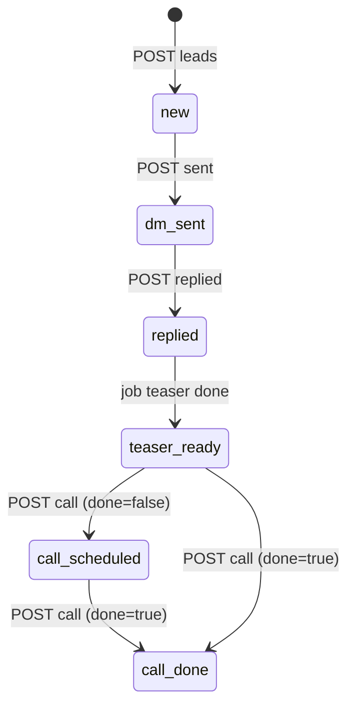
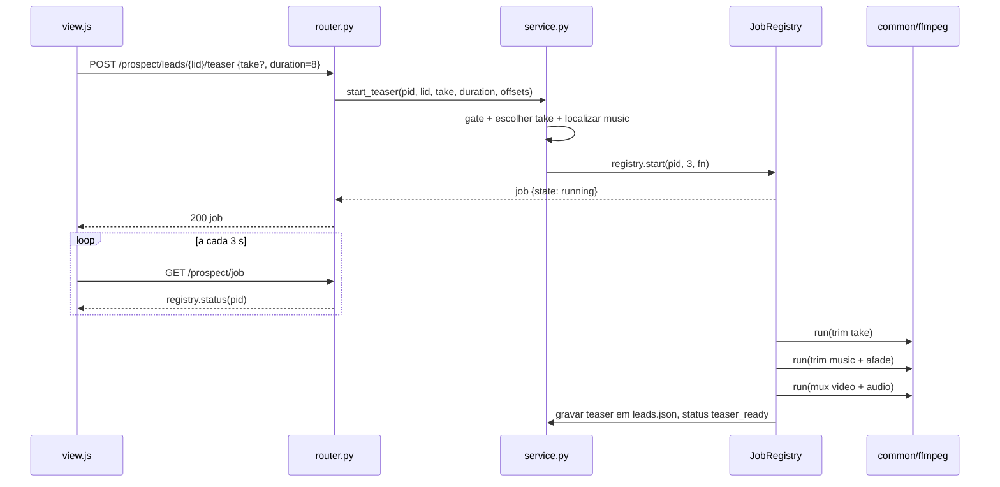

### FDD: prospect (Etapa 11, Prospecção, aula 001)

Versão: 0.1.0
Data: 2026-08-25
Responsável: frente `prospect` da Wave 1 (Task-Id OS-011), gerado em modo batch pelo `/dd-parallel` W3

---

### 1. Contexto e motivação técnica

A etapa 11 é a última do curso "O Orquestrador, Iniciante": a aula 001 ensina como conseguir os primeiros
clientes por DM em pequenos negócios. O Studio hoje termina na etapa 10 (publish). Esta feature implementa o
plugin `studio/etapas/prospect/` + serviço `studio/prospect/service.py`, seguindo o contrato de plugin do HLD
`studio` (descoberta automática, `META` com `n=11` e `aula="001"`, rotas sob `/api/projects/{pid}/prospect/...`,
persistência em arquivos sob `projects/<pid>/prospect/`, jobs em thread via `studio/common/jobs.JobRegistry`,
mídia via `studio/common/ffmpeg`).

Princípio fixo da aula e do `CLAUDE.md`: **o Studio redige e registra; enviar é humano**. Nenhuma integração
com Instagram ou rede social; nenhuma automação de envio.

**Provides** (copiado de `wave-1.md`)
- `prospect/leads.json`: `[{id, business, handle, post_ref, why, dm_text, sent_at, replied, teaser, call_at, status}]`
- `prospect/teasers/<lead>.mp4`: 5 a 10 s com música
- `prospect/pitch.md`: tabela de etapas de produção + ancoragem (sem valores) para a call

**Consumes** (copiado de `wave-1.md`)
- `publish/log.json` (gate: ≥ 4 vídeos publicados) ← publish
- `animate/takes.json`, `audio/music.*` ← animate, music (teaser)

**Atores**: o aluno (usuário único, local, sem auth, ADR-001); o núcleo do Studio (resolve `pid`, serve
`/files`); ffmpeg local (`~/.local/bin`, ADR do ambiente).

**Suposições e restrições**
- Não editar `app.py`, `index.html`, `app.js`, `steps.py`, `conftest.py`, `requirements*.txt` nem plugins de outras etapas.
- `pid` resolvido sempre por `refs.service.project_dir(pid)`; `KeyError` vira 404 no núcleo.
- Handoffs de outras frentes chegam por fixture nos testes (schemas da wave); o handoff real é cobrado na W5.
- [auto-aceito: campos adicionais `role` (fã|consumidor) e `call_note` entram em `leads.json` como campos aditivos ao schema da wave, porque o script literal exige escolher "fã/consumidor" e a aula manda registrar a call; não quebram consumidores porque ninguém consome `leads.json`]

---

### 2. Objetivos técnicos

- Gate determinístico: `gate(root)` devolve `ok = <vídeos DISTINTOS em publish/log.json> >= 4` — conta os valores distintos do campo `video`, não o número de entradas (**decisão 1 da wave 1**: "4 vídeos", não "4 posts"; o mesmo vídeo publicado em 4 redes não abre o gate). Arquivo ausente, ilegível ou inválido conta como 0. Invariante: nenhuma escrita em `prospect/` acontece com `ok == False`.
- DM literal: `dm_text(lead)` produz exatamente o script do instrutor com quatro substituições (`[nome]`, `[fã/consumidor]`, `[X]`, `[empresas/marcas]`) e nenhuma URL (`http`, `www.` e `.com` ausentes no resultado; teste de regressão).
- Teaser: `prospect/teasers/<lead>.mp4` com duração entre 5 e 10 s (tolerância ±0,25 s no `probe`), `has_audio == True`, H.264 + AAC, gerado por um único job por projeto (`JobRegistry`, chave `pid`).
- Contador: `today_sent(leads)` conta leads com `sent_at` na data local de hoje; limite fixo 10; nunca bloqueia (aviso apenas).
- Follow-up literal e pitch determinístico: mesmo input, mesmo texto (snapshot nos testes).
- Tudo sem rede e sem navegador nos testes (ADR-008); ffmpeg via fixtures `make_video`/`make_audio` com `pytest.skip` quando `ffmpeg.available()` é False.

---

### 3. Escopo e exclusões

**Incluído**
- Plugin `studio/etapas/prospect/` (`META`, `router.py`, `view.html`, `view.js`) e serviço `studio/prospect/service.py`.
- Gate "≥ 4 vídeos publicados" lendo `publish/log.json`, com a mensagem da aula quando bloqueado.
- CRUD de leads em `prospect/leads.json` (negócio, `@`, post que ressoou, por quê, papel fã/consumidor).
- Geração do texto da DM (script literal, sem links), botão copiar na UI, marcação "enviada em", marcação "respondeu".
- Contador "N/10 hoje" de DMs marcadas como enviadas.
- Teaser por lead (5 a 10 s, com música): um take de `animate/takes.json` + `audio/music.*` cortados e mixados via ffmpeg → `prospect/teasers/<lead>.mp4`; job com polling.
- Texto de follow-up literal (convite para call de 15 minutos) com botão copiar.
- Registro da call (`call_at`, feito ou não, nota curta).
- `prospect/pitch.md` com a tabela de etapas de produção (conceito, mood board, roteirização, direção criativa, produção, montagem, entrega) sem valores, e os lembretes da aula (oferta só-agora 50% no primeiro, 50/50, faixa inicial R$ 100 a 500 por vídeo de 30 s a 1 min, vender resultado e não IA).
- Testes `tests/test_prospect_service.py` e `tests/test_prospect_api.py`.

**Excluído**
- Envio de DM, leitura de respostas, qualquer API de rede social (a aula manda enviar à mão; anti-spam).
- Geração de vídeo ou música nova para o teaser via Higgsfield CLI (o teaser reaproveita take e trilha já existentes). [auto-aceito: o plano-higgsfield §2 sugere `kling3_0 5s` + `sonilo_music 8s`; a wave fixou "um take de animate + audio/music.*", que é o caminho sem crédito e sem login; a variante por CLI fica como sugestão no PR]
- Texto sobreposto, logo, legenda ou end card no teaser (a aula não ensina).
- Valores de preço na tabela de etapas (a aula manda a tabela só para ancorar; os valores ficam nos lembretes).
- CRM, agenda, lembretes automáticos, exportação de leads.
- Bloqueio duro no limite de 10 DMs/dia. [auto-aceito: a aula dá "10 por dia" como meta de disciplina, não como trava; o Studio mostra o contador e avisa acima de 10, sem impedir a marcação]

---

### 4. Fluxos detalhados e diagramas

**Fluxo principal**
- O usuário abre a etapa 11. `view.js` chama `GET .../prospect/gate`. Se `ok == False`, a tela mostra só o cartão do gate com a mensagem da aula e o contador `N/4`; os painéis de leads ficam ocultos.
- Com o gate aberto, o usuário cadastra um lead (`POST .../prospect/leads`): negócio, `@handle`, post que ressoou, por quê, papel (fã ou consumidor). O serviço normaliza o handle (remove `@`, minúsculas), gera `id` (slug do handle), grava em `leads.json` com `status = "new"` e `dm_text` já preenchido pelo script literal.
- O usuário abre o lead, vê a DM (`GET .../leads/{lid}/dm`), clica "Copiar", envia à mão no Instagram e clica "Marquei como enviada" (`POST .../leads/{lid}/sent`). O serviço grava `sent_at` (ISO local) e `status = "dm_sent"`; a resposta traz `today_sent` para o contador `N/10 hoje`.
- Quando o lead responde, o usuário clica "Respondeu" (`POST .../leads/{lid}/replied`); `replied = true`, `status = "replied"`.
- O usuário clica "Gerar teaser" (`POST .../leads/{lid}/teaser`). O serviço escolhe o take (o informado no corpo; senão o primeiro com `liked == true` em `animate/takes.json`; senão o primeiro take), localiza `audio/music.{wav,mp3}`, e inicia um job (`registry.start(pid, total=3, fn)`): (1) corta o take em `duration` s a partir de `take_offset`; (2) corta a música em `duration` s a partir de `music_offset` com `afade=t=out:d=0.5`; (3) mixa substituindo a faixa de áudio do take (`-map 0:v -map 1:a`, `-c:v libx264 -crf 20 -c:a aac -shortest`) em `prospect/teasers/<lid>.mp4`. Ao concluir, grava `teaser = "prospect/teasers/<lid>.mp4"` e `status = "teaser_ready"`.
- `view.js` faz polling em `GET .../prospect/job` a cada 3 s até `done|error`, exibe o vídeo (`ctx.files(lead.teaser)`), o texto de follow-up (`GET .../leads/{lid}/followup`) e o botão "Copiar".
- O usuário agenda a call e registra (`POST .../leads/{lid}/call {call_at, done, note}`); `status = "call_scheduled"` ou `"call_done"`.
- Antes da call, o usuário abre "Pitch" (`GET .../prospect/pitch`); se `pitch.md` não existir o serviço o gera do template; `POST .../prospect/pitch` regenera.

**Fluxos alternativos e exceções**
- Gate fechado: todo `POST`, `PUT` e `DELETE` sob `/prospect/` responde 409 com a mensagem da aula: `"A aula manda publicar 4 vídeos criativos antes de prospectar. Você tem N/4."`. `GET` continua funcionando (a UI mostra o cartão do gate).
- `publish/log.json` ausente ou JSON inválido: conta como 0 publicados (gate fechado); nunca levanta exceção.
- Handle duplicado ou vazio, ou negócio vazio: `ValueError` → 422.
- Lead inexistente: `FileNotFoundError` → 404.
- Teaser sem `animate/takes.json`, sem takes, ou sem `audio/music.*`: `FileNotFoundError` → 404 com mensagem indicando a etapa pendente (6 ou 7).
- `duration` fora de 5 a 10, take mais curto que 5 s, `take` informado inexistente: `ValueError` → 422.
- ffmpeg indisponível: `HTTPException(409, "ffmpeg não disponível")`.
- Job já em execução para o projeto: `RuntimeError` → 409.
- Falha do ffmpeg dentro do job: `state = "error"` com `error` = stderr truncado; `leads.json` não muda; arquivo parcial removido.
- Take mais curto que `duration` mas com ≥ 5 s: o teaser usa a duração do take (arredondada para baixo em 0,1 s) e registra em `job.log`.
- Regerar teaser de um lead que já tem teaser: sobrescreve o arquivo (mesmo nome) sem confirmação no serviço; a UI pede `confirm()`.

**Diagramas**





---

### 5. Contratos públicos (assinaturas, endpoints, headers, exemplos)

Todas as rotas vivem em `studio/etapas/prospect/router.py`, prefixo `/api/projects/{pid}/prospect`, JSON, sem auth (ADR-001). `pid` inválido ou inexistente → 404 pelo núcleo. Modelos Pydantic declarados no próprio `router.py`.

**Gate**
- Tipo: endpoint
- Assinatura/Rota: `GET /api/projects/{pid}/prospect/gate`
- Método: GET
- Semântica de status/headers:
  - 200: sempre, mesmo com gate fechado (a UI decide o que mostrar)
  - 404: projeto inexistente

**Exemplo de resposta**
```json
{"published": 2, "posts": 3, "required": 4, "ok": false,
 "message": "A aula manda publicar 4 vídeos criativos antes de prospectar. Você tem 2/4.",
 "today_sent": 0, "daily_limit": 10}
```
`published` = vídeos distintos (o que abre o gate); `posts` = entradas do log (o mesmo vídeo em várias redes).
Com o gate aberto, `message` vira `"Portfólio pronto: N vídeos publicados. Pode prospectar."`.

**Leads (listar e criar)**
- Tipo: endpoint
- Assinatura/Rota: `GET /api/projects/{pid}/prospect/leads` e `POST /api/projects/{pid}/prospect/leads`
- Método: GET, POST
- Semântica de status/headers:
  - 200: lista `{leads: [...], today_sent, daily_limit}` (GET) ou o lead criado (POST)
  - 409: gate fechado (POST), corpo `{"detail": "<mensagem da aula>"}`
  - 422: `business` ou `handle` vazios, handle duplicado, `role` fora de `fã|consumidor`

**Exemplo de requisição (POST)**
```json
{"business": "Padaria do Zé", "handle": "@padariadoze", "post_ref": "o pão de fermentação natural das 6h",
 "why": "fotos com luz de manhã, combina com o mood do Gelo Zero", "role": "consumidor"}
```

**Exemplo de resposta (POST)**
```json
{"id": "padariadoze", "business": "Padaria do Zé", "handle": "padariadoze",
 "post_ref": "o pão de fermentação natural das 6h", "why": "fotos com luz de manhã, combina com o mood do Gelo Zero",
 "role": "consumidor", "dm_text": "Oi Padaria do Zé. Eu sou consumidor da sua marca. O seu post a respeito de o pão de fermentação natural das 6h realmente ressoou comigo. Quero ser bem direto: eu produzo anúncios criativos para marcas. Você pode acompanhar meu portfólio no meu perfil. Tive uma inspiração e criei algo para o seu negócio. Quer ver como ficou?",
 "sent_at": null, "replied": false, "teaser": null, "call_at": null, "call_note": "", "status": "new",
 "created": "2026-08-25T10:12:00"}
```

[auto-aceito: `[empresas/marcas]` do script vira a palavra fixa "marcas" (o próprio script fala "da sua marca"); `[nome]` recebe `business`; `[X]` recebe `post_ref`; `why` não entra na DM, é anotação para o humano]

**Lead (obter, atualizar, remover)**
- Tipo: endpoint
- Assinatura/Rota: `GET|PUT|DELETE /api/projects/{pid}/prospect/leads/{lid}`
- Método: GET, PUT, DELETE
- Semântica de status/headers:
  - 200: lead (GET/PUT) ou `{"removed": true}` (DELETE; apaga também `prospect/teasers/<lid>.mp4` se existir)
  - 404: lead inexistente
  - 409: gate fechado (PUT/DELETE)
  - 422: PUT com `business` vazio ou `role` inválido; PUT que altera `business`, `post_ref` ou `role` regenera `dm_text` somente se `sent_at` for `null` (DM já enviada não muda)

**Exemplo de requisição (PUT)**
```json
{"post_ref": "a vitrine de Natal", "why": "post mais comentado do perfil"}
```

**DM: texto e marcações**
- Tipo: endpoint
- Assinatura/Rota: `GET .../leads/{lid}/dm`, `POST .../leads/{lid}/sent`, `POST .../leads/{lid}/replied`
- Método: GET, POST
- Semântica de status/headers:
  - 200 (GET): `{"text": "<dm_text>", "chars": n}`
  - 200 (POST sent): lead atualizado + `{"today_sent": n, "daily_limit": 10, "over_limit": bool}`; corpo opcional `{"sent_at": "ISO"}` (default: agora, hora local)
  - 200 (POST replied): lead com `replied = true`, `status = "replied"`; corpo opcional `{"replied": false}` para desfazer
  - 409: gate fechado (POST)
  - 422: `sent_at` não ISO 8601

**Exemplo de resposta (POST sent)**
```json
{"lead": {"id": "padariadoze", "status": "dm_sent", "sent_at": "2026-08-25T10:20:00"},
 "today_sent": 3, "daily_limit": 10, "over_limit": false}
```

**Teaser (job)**
- Tipo: endpoint
- Assinatura/Rota: `POST /api/projects/{pid}/prospect/leads/{lid}/teaser` e `GET /api/projects/{pid}/prospect/job`
- Método: POST, GET
- Semântica de status/headers:
  - 200 (POST): job `{state: "running", done: 0, total: 3, lead: lid, log: []}`
  - 200 (GET): `registry.status(pid)`; `{"state": "idle"}` quando nunca rodou; em `done` inclui `teaser` (caminho relativo) e `lead`
  - 404: lead inexistente; `animate/takes.json` ausente ou sem takes ("Etapa 6 sem takes"); `audio/music.*` ausente ("Etapa 7 sem trilha")
  - 409: gate fechado; job já em execução; ffmpeg não disponível
  - 422: `duration` fora de 5 a 10; `take` informado não encontrado; take escolhido com menos de 5 s

**Exemplo de requisição**
```json
{"take": {"scene": "cena01", "shot": "shot01", "take": "take1"}, "duration": 8, "take_offset": 0, "music_offset": 0}
```
Todos os campos são opcionais. [auto-aceito: default `duration = 8` s, dentro de 5 a 10 e igual ao `sonilo_music 8s` do plano; `take` default = primeiro `liked`, senão o primeiro take; offsets 0]

**Exemplo de resposta (GET job, concluído)**
```json
{"state": "done", "done": 3, "total": 3, "added": 1, "error": null, "lead": "padariadoze",
 "teaser": "prospect/teasers/padariadoze.mp4", "duration": 8.0,
 "log": ["take cena01/shot01/take1 (5.0 s) cortado em 8.0 s -> usando 5.0 s", "música audio/music.wav cortada", "teaser gravado"]}
```

**Follow-up**
- Tipo: endpoint
- Assinatura/Rota: `GET /api/projects/{pid}/prospect/leads/{lid}/followup`
- Método: GET
- Semântica de status/headers:
  - 200: `{"text": "Aqui está o início. Se quiser, podemos agendar uma call de 15 minutinhos e te explico a minha ideia para esse anúncio completo.", "teaser": "prospect/teasers/padariadoze.mp4"|null}`
  - 404: lead inexistente

**Call**
- Tipo: endpoint
- Assinatura/Rota: `POST /api/projects/{pid}/prospect/leads/{lid}/call`
- Método: POST
- Semântica de status/headers:
  - 200: lead com `call_at`, `call_note` e `status` (`call_scheduled` se `done == false`, `call_done` se `true`)
  - 404: lead inexistente
  - 409: gate fechado
  - 422: `call_at` não ISO 8601

**Exemplo de requisição**
```json
{"call_at": "2026-08-27T15:00:00", "done": false, "note": "quer ver o anúncio da vitrine de Natal"}
```

**Pitch**
- Tipo: endpoint
- Assinatura/Rota: `GET /api/projects/{pid}/prospect/pitch` e `POST /api/projects/{pid}/prospect/pitch`
- Método: GET, POST
- Semântica de status/headers:
  - 200: `{"file": "prospect/pitch.md", "markdown": "<conteúdo>"}`; GET gera o arquivo se não existir; POST regenera a partir do template (sobrescreve)
  - 409: gate fechado (POST)

**Conteúdo fixo de `pitch.md`** (template no serviço, `project.name` no título)
```markdown
# Pitch: <nome do projeto>

## Etapas de produção (ancoragem de valor, sem preço na tabela)
| Etapa | O que envolve | Entrega |
| --- | --- | --- |
| Conceito | ideia central e mensagem | uma frase de conceito |
| Mood board | referências de estilo, cor e clima | painel de referências |
| Roteirização | história em cenas | roteiro de 5 cenas |
| Direção criativa | ângulos, câmera, ritmo | storyboard com ângulos |
| Produção | geração das cenas e takes | takes por cena |
| Montagem | cortes na trilha, transições, som | vídeo base |
| Entrega | formatos e publicação | 16:9, 9:16 e 1:1 |

## Lembretes da aula 001
- Oferta só-agora: 50% de desconto no primeiro trabalho, válida só nesta conversa.
- Pagamento 50% na entrada e 50% na entrega.
- Faixa inicial: R$ 100 a R$ 500 por vídeo de 30 s a 1 min.
- Vender o resultado (o anúncio), não a IA.
- A call dura 15 minutos: mostrar o teaser, explicar a ideia, apresentar a tabela.
```
[auto-aceito: colunas "O que envolve" e "Entrega" derivadas das etapas 1 a 10 do próprio Studio; a aula pede apenas a tabela de etapas para ancorar, sem especificar colunas]

**Assinaturas do serviço** (`studio/prospect/service.py`)
- Tipo: function
- Assinatura/Rota:
  - `gate(root: Path) -> dict` (`{published, required, ok, message}`)
  - `require_gate(root: Path) -> None` (levanta `GateClosed(RuntimeError)` com a mensagem da aula)
  - `load_leads(root) -> list[dict]`, `save_leads(root, leads) -> None`, `get_lead(root, lid) -> dict`
  - `create_lead(root, business, handle, post_ref, why, role="fã") -> dict`
  - `update_lead(root, lid, **fields) -> dict`, `delete_lead(root, lid) -> None`
  - `dm_text(lead: dict) -> str`, `followup_text() -> str`
  - `mark_sent(root, lid, sent_at: str | None = None) -> dict`, `mark_replied(root, lid, replied=True) -> dict`
  - `today_sent(leads, today: date | None = None) -> int`, `DAILY_LIMIT = 10`
  - `pick_take(root, take: dict | None) -> dict` (devolve `{scene, shot, take, file, duration}`)
  - `find_music(root) -> Path`
  - `start_teaser(root, pid, lid, take=None, duration=8.0, take_offset=0.0, music_offset=0.0) -> dict`
  - `job_status(pid) -> dict`
  - `register_call(root, lid, call_at: str, done: bool = False, note: str = "") -> dict`
  - `pitch_markdown(project: dict) -> str`, `write_pitch(root, project) -> Path`, `read_pitch(root, project) -> str`
- Semântica de status/headers: exceções `GateClosed`/`RuntimeError` → 409, `ValueError` → 422, `FileNotFoundError` → 404 (tradução no router, padrão do recon).

Limites: payload JSON ≤ 64 KB (campos de texto do lead ≤ 2.000 caracteres cada, `ValueError` acima); teaser `run(..., timeout=120)` por chamada de ffmpeg; um job por projeto. Versionamento: `leads.json` é uma lista; campos novos são aditivos; ausência de campo é lida como default.

---

### 6. Erros, exceções e fallback

**Matriz de erros previstos e tratamentos**

| Condição | Tratamento | Notas |
| --- | --- | --- |
| `publish/log.json` ausente, vazio ou inválido | `published = 0`, gate fechado | nunca levanta; log `warning` só se JSON inválido |
| Gate fechado em POST/PUT/DELETE | 409 `{"detail": mensagem da aula com N/4}` | GET nunca bloqueia |
| `business`/`handle` vazio, handle duplicado, `role` inválido, texto > 2.000 chars | 422 `ValueError` | handle normalizado antes de comparar |
| Lead inexistente | 404 `FileNotFoundError` | |
| `sent_at`/`call_at` fora do ISO 8601 | 422 | `datetime.fromisoformat` |
| `animate/takes.json` ausente ou sem takes | 404 "Etapa 6 (animação) sem takes" | |
| `audio/music.{wav,mp3}` ausente | 404 "Etapa 7 (trilha) sem música" | primeiro `wav`, depois `mp3` |
| `take` informado não existe; `duration` fora de 5 a 10; take < 5 s | 422 | validado antes de iniciar o job |
| ffmpeg indisponível | 409 "ffmpeg não disponível" | `ffmpeg.available()` |
| Job já `running` para o `pid` | 409 `RuntimeError` | `JobRegistry.start` |
| ffmpeg falha dentro do job | `state = error`, `error` = stderr ≤ 400 chars, arquivo parcial removido, `leads.json` intacto | usuário tenta de novo |
| `leads.json` corrompido | 500 com log `error`; o serviço não tenta reparar | pendência abaixo |

**Estratégias de resiliência**: timeout de 120 s por chamada de ffmpeg (teaser tem no máximo 10 s); sem retries (ação humana); sem backoff nem circuit breaker (tudo local, ADR-001). Escrita de `leads.json` atômica (grava em `.tmp` e `os.replace`).

**Política de fallback**: teaser sem música não existe (a aula manda "com música"); se a trilha faltar, o job não inicia e a UI aponta a etapa 7. Se o take for mais curto que `duration`, usa o take inteiro (≥ 5 s). Se `pitch.md` foi editado à mão, `GET` devolve o editado; só `POST` sobrescreve.

**Invariantes**
- Nenhuma escrita em `prospect/` com gate fechado.
- `dm_text` nunca contém link; `dm_text` de lead com `sent_at != null` nunca muda.
- `status` segue a máquina de estados da seção 4; `replied` só é `true` a partir de `dm_sent`.
- No máximo um job por projeto; `teaser` em `leads.json` só é preenchido depois de `probe` confirmar `has_audio` e duração entre 5 e 10 s.

---

### 7. Observabilidade

**Métricas** (sem backend de métricas, ADR-001; expostas nos próprios endpoints)
- `published/required` e `today_sent/daily_limit` no `GET gate` e `GET leads`.
- `job.done/total` e `job.log` no `GET job`.
- Contagem por `status` dos leads devolvida em `GET leads` como `by_status` (`{new, dm_sent, replied, teaser_ready, call_scheduled, call_done}`).

**Logs**
- Logger `studio.prospect` (stdlib `logging`, formato do núcleo). Eventos `info`: `lead_created`, `dm_sent`, `replied`, `teaser_started`, `teaser_done`, `call_registered`, `pitch_written`; `warning`: `gate_closed`, `over_daily_limit`, `publish_log_invalid`; `error`: `teaser_failed` (com stderr truncado). Campos: `pid`, `lead`, `event`, `status`, `duration` quando aplicável. Nunca logar `dm_text` completo nem `why` (dado pessoal do lead).
- `job.log` humano em pt-BR (take escolhido, duração efetiva, arquivo gravado).

**Tracing**
- Não há tracing (monólito local). Correlação por `pid` + `lead` nos logs.

**Dashboards e alertas**
- Nenhum. A tela da etapa é o painel: cartão do gate (`N/4`), contador `N/10 hoje` (chip `warn` acima de 10), lista de leads por status, progresso do job.

---

### 8. Dependências e compatibilidade

| Componente | Versão mínima | Observações |
| --- | --- | --- |
| Python | 3.12 | stdlib apenas no serviço (json, datetime, pathlib, re, logging) |
| FastAPI / Pydantic | 0.141 / 2.13 | modelos de request no `router.py` |
| `studio/common/jobs.py` | wave 1 | `JobRegistry` por módulo, chave `pid` |
| `studio/common/ffmpeg.py` | wave 1 | `available()`, `run()`, `probe()`; ffmpeg 7.0.2 estático em `~/.local/bin` |
| `studio/refs/service.project_dir` | atual | resolução e validação de `pid` |
| `tests/conftest.py` | wave 1 | `studio_env["svc"]("prospect")`, `make_video`, `make_audio`, `client` |
| `publish/log.json` | schema wave 1 | lista `[{id, video, network, url, posted_at, note}]`; só `len()` é usado |
| `animate/takes.json` | schema wave 1 | `shots[].takes[]` com `file`, `liked`, `duration` |
| `audio/music.{wav,mp3}` | schema wave 1 | primeiro encontrado |

**Garantias de compatibilidade**
- Não toca arquivos únicos (`app.py`, `steps.py`, `conftest.py`, `requirements*.txt`, plugins de outras etapas); `META = {"id": "prospect", "n": 11, "title": "Prospecção", "aula": "001", "desc": ...}` bate com `SOON`.
- Leitura tolerante dos handoffs: campos ausentes em `takes.json` viram default (`liked = False`, `duration` via `probe`).
- `leads.json` aditivo: leitores ignoram campos desconhecidos; ninguém além desta etapa lê o arquivo.
- Nenhuma dependência nova em `requirements.txt`.

---

### 9. Critérios de aceite técnicos

- `[cross-feature]` Com `publish/log.json` real do projeto de teste contendo `< 4` entradas, `POST .../prospect/leads` responde 409 com a mensagem da aula e `N/4` correto; com `>= 4`, responde 200.
- `[cross-feature]` O teaser é montado a partir de um take real de `animate/takes.json` (arquivo `videos/cenaNN/shotMM_takeK.mp4`) e de `audio/music.*` reais do projeto integrado; `probe` do resultado: duração entre 5 e 10 s, `has_audio == True`, `width/height` iguais ao take.
- `dm_text` de um lead é exatamente o script literal com as quatro substituições; teste compara com string fixa e garante ausência de `http`, `www.` e `.com`.
- `followup_text()` é exatamente o texto literal da aula (snapshot).
- `mark_sent` grava `sent_at` e `status = "dm_sent"`; `today_sent` conta só leads de hoje (teste com 3 de hoje e 2 de ontem devolve 3); acima de 10 a resposta traz `over_limit = true` e a marcação não é impedida.
- `dm_text` de lead com `sent_at` preenchido não muda após `PUT` em `business`/`post_ref`/`role`.
- Job de teaser: segundo `POST` durante `running` responde 409; ffmpeg ausente responde 409; falha do ffmpeg deixa `state = error` sem tocar `leads.json`; conclusão grava `teaser` e `status = "teaser_ready"`.
- Sem `takes.json` ou sem `audio/music.*`, `POST teaser` responde 404 com a mensagem da etapa pendente.
- `register_call` grava `call_at`, `call_note` e status `call_scheduled`/`call_done`; `call_at` inválido responde 422.
- `GET pitch` cria `prospect/pitch.md` com as sete etapas na ordem (conceito, mood board, roteirização, direção criativa, produção, montagem, entrega), sem `R$` dentro da tabela, e com os quatro lembretes (50% no primeiro, 50/50, R$ 100 a 500, resultado e não IA).
- `DELETE lead` remove a entrada e o arquivo de teaser.
- `GET /api/steps` lista `prospect` com `status = "ready"`, `n = 11`, e `GET /steps/prospect/view.{html,js}` respondem 200 (validação dinâmica de `tests/test_steps_and_config.py`).
- `ruff check studio tests` e `pytest` verdes; testes de ffmpeg pulam com `pytest.skip` quando `ffmpeg.available()` é False.
- UI: com gate fechado, só o cartão do gate aparece; botões "Copiar" usam `navigator.clipboard.writeText` com fallback em `textarea` + `execCommand("copy")` e `ctx.toast("Copiado")`.

---

### 10. Riscos e mitigação

### Handoffs de animate/music não chegam no formato do schema

- **Probabilidade:** média
- **Impacto:** teaser não encontra take ou música na integração (W5)
- **Mitigação:**
    - Leitura tolerante de `takes.json` (defaults, `probe` para duração ausente)
    - Busca de `audio/music.*` por glob (`wav`, `mp3`) em vez de nome fixo
    - Fixtures dos testes copiam literalmente os schemas de `wave-1.md`
- **Plano de contingência:** corpo do `POST teaser` aceita `take` explícito com caminho relativo (`file`), permitindo montar o teaser mesmo se o índice divergir

### ffmpeg indisponível ou lento no CI

- **Probabilidade:** baixa
- **Impacto:** testes de teaser não rodam ou estouram tempo
- **Mitigação:**
    - `pytest.skip` quando `ffmpeg.available()` é False
    - Fixtures de 2 a 6 s em 320x240 (`make_video`, `make_audio`)
    - Timeout de 120 s por chamada
- **Plano de contingência:** testes de serviço com `monkeypatch` em `ffmpeg.run` cobrindo o fluxo sem binário

### Tentação de "ajudar demais" na DM (personalização, links, emoji)

- **Probabilidade:** média
- **Impacto:** desvio da aula (ADR-004) e risco de a DM parecer spam
- **Mitigação:**
    - Script como constante única no serviço, com teste de igualdade literal
    - Sem campo de edição da DM na UI (só copiar); o humano adapta no próprio Instagram se quiser
    - Teste de regressão contra links
- **Plano de contingência:** qualquer variação vira `[extensão]` com aprovação explícita

### `leads.json` corrompido por escrita concorrente ou edição manual

- **Probabilidade:** baixa
- **Impacto:** etapa 11 inoperante até correção manual
- **Mitigação:**
    - Escrita atômica (`.tmp` + `os.replace`)
    - Todas as mutações passam pelo mesmo `save_leads`
- **Plano de contingência:** log `error` com o caminho; o usuário restaura à mão (sem reparo automático nesta versão)

---

### 11. Sequenciamento de implementação (Build Order)

| Ordem | Etapa | Depende de | Componentes/arquivos prováveis | Critérios que fecha (da seção 9) |
| --- | --- | --- | --- | --- |
| 1 | Plugin mínimo e gate | - | `studio/etapas/prospect/__init__.py` (`META`), `studio/prospect/__init__.py`, `studio/prospect/service.py` (`gate`, `require_gate`, `GateClosed`, `load/save_leads`), `studio/etapas/prospect/router.py` (`GET gate`), `tests/test_prospect_service.py`, `tests/test_prospect_api.py` | gate `[cross-feature]`, `/api/steps` com `prospect` ready |
| 2 | Leads e DM | 1 | `service.py` (`create/update/delete_lead`, `dm_text`, `mark_sent`, `mark_replied`, `today_sent`), `router.py` (leads CRUD, `dm`, `sent`, `replied`), testes | script literal sem links, contador, DM imutável após envio, DELETE |
| 3 | Teaser (job ffmpeg) | 2 | `service.py` (`pick_take`, `find_music`, `start_teaser`, `job_status`, `registry = JobRegistry()`), `router.py` (`POST teaser`, `GET job`), testes com `make_video`/`make_audio` e `monkeypatch` em `ffmpeg.run` | teaser `[cross-feature]`, 409/404/422 do job, `state = error` sem tocar `leads.json` |
| 4 | Follow-up, call e pitch | 2 | `service.py` (`followup_text`, `register_call`, `pitch_markdown`, `write_pitch`, `read_pitch`), `router.py` (`followup`, `call`, `pitch`), testes | follow-up literal, call, `pitch.md` com sete etapas e lembretes |
| 5 | UI | 1 a 4 | `studio/etapas/prospect/view.html`, `studio/etapas/prospect/view.js` (`Studio.register("prospect", ...)`, polling 3 s, botões copiar, `confirm()` ao regerar teaser) | critérios de UI, gate fechado só com cartão |
| 6 | Logs e verificação | 2 a 5 | logger `studio.prospect` no `service.py`; `make verify` | ruff + pytest verdes, skip sem ffmpeg |

---

### Pendências para o lote (W3)

- Nenhuma divergência com contrato publicado: o domínio `prospect` não tem `contratos.md` nem `openapi.yaml` prévios.
- Confirmar no lote os auto-aceites desta feature: campos aditivos `role` e `call_note`; `[empresas/marcas]` fixado em "marcas"; `why` fora da DM; limite 10/dia como aviso e não trava; teaser só a partir de take + trilha existentes (sem CLI); `duration` default 8 s; colunas da tabela do pitch.
- Reparo automático de `leads.json` corrompido ficou fora (só log); decidir se entra depois.

---

### 10. Divergências e adições da implementação (OS-011)

Registradas no fechamento da frente; todas aditivas e cobertas por teste.

| # | Ponto | O que foi implementado | Por quê |
| --- | --- | --- | --- |
| 1 | Gate | conta vídeos **distintos** do campo `video`, não `len(log)` | **decisão 1 da wave 1** prevalece sobre a seção 2 original |
| 2 | `GET .../prospect/gate` | ganha o campo `posts` (entradas do log) ao lado de `published` | deixa visível a diferença entre 4 posts e 4 vídeos |
| 3 | `GET .../prospect/leads` | devolve também `by_status` (seção 7) e `gate` | a UI decide em uma chamada só se mostra os painéis |
| 4 | `POST .../leads/{lid}/replied` | 422 quando o lead ainda não tem `sent_at` | invariante da seção 6 ("`replied` só é `true` a partir de `dm_sent`") explicitada como erro |
| 5 | `POST .../leads/{lid}/teaser` | a checagem de job em andamento (409) vem **antes** da busca do take e da trilha (404) | clicar duas vezes devolve "já existe um trabalho em andamento", não "Etapa 6 sem takes" |
| 6 | teaser (trilha) | o corte da música usa `-stream_loop -1` | garante o teaser com música mesmo se a trilha for mais curta que a duração pedida; sem isso o `-shortest` do mux encurtaria o vídeo abaixo de 5 s |
| 7 | `find_music` | aceita `music.{wav,mp3,m4a,ogg}` | mesma lista de `common/ingest.MEDIA_EXT["audio"]`; a wave fixa `wav`/`mp3`, os outros são aditivos |
| 8 | `GET .../prospect/pitch` | com o gate fechado devolve o markdown mas **não** grava `pitch.md`; grava a partir da primeira leitura com o gate aberto | a seção 5 diz "GET gera o arquivo se não existir" e a seção 6 proíbe escrita em `prospect/` com o gate fechado; a leitura continua livre |
| 9 | `PUT .../leads/{lid}` | aceita também `handle` (com checagem de duplicado); o `id` do lead nunca muda | corrigir um `@` digitado errado sem perder o histórico do lead |

### 11. Pendências para a integração (W5)

- `[cross-feature]` O gate lê `publish/log.json` **direto do arquivo**. Quando `publish` (OS-010) estiver
  integrado e expuser `distinct_videos`, avaliar se `prospect` deve consumir o serviço em vez do arquivo.
  Enquanto isso, as duas pontas precisam concordar no schema `[{id, video, ...}]`.
- `[cross-feature]` Teaser com take real de `animate/takes.json` (OS-006) e `audio/music.*` real (OS-007):
  aqui foi validado com fixtures geradas por ffmpeg (`make_video`/`make_audio`) e com um smoke no navegador.
- O HLD do domínio `studio` (`docs/domains/studio/hld.md`) ainda não cita a etapa 11: é artefato único
  compartilhado entre as frentes da wave e só pode ser editado na integração (W5) — bump de versão +
  parágrafo da fatia `prospect`.
- `.claude/skills/ft-pr` é um symlink para `.agents/skills/ft-pr`, que não existe no repositório (falha
  pré-existente, fora do escopo desta frente). O gate `.agents/gates/ft-pr.md` foi cumprido diretamente.
- Sugestão não implementada (fora da aula 001): o `plano-higgsfield` §2 propõe gerar o teaser por CLI
  (`kling3_0 5s` + `sonilo_music 8s`). A wave fixou "take de animate + trilha da etapa 7", que não gasta
  crédito nem exige login. Fica como sugestão, nunca como implementação silenciosa.
