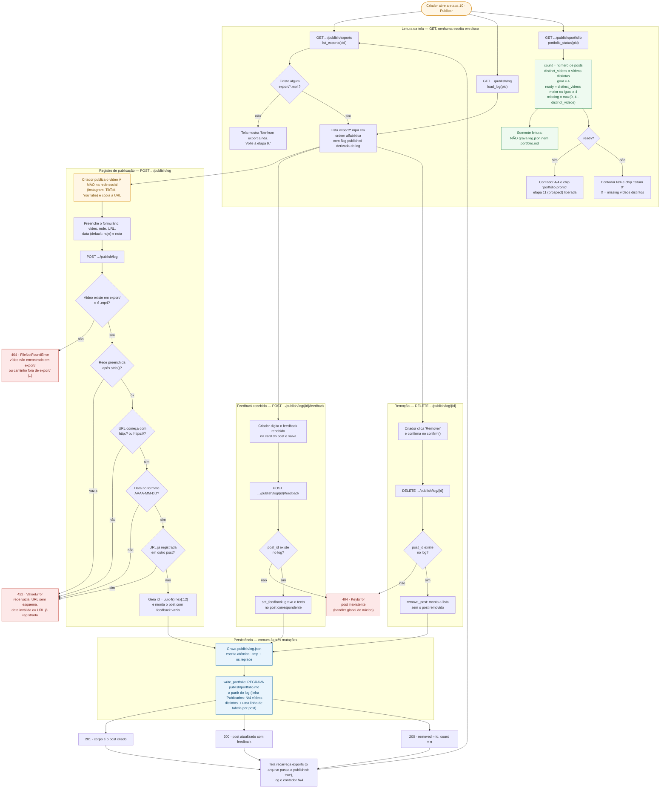

# publish (Etapa 10) — Fluxo de registro de uma publicação

Fonte: `docs/domains/publish/features/publish-fdd.md` (v0.2.0, seções 4, 5 e 6),
`studio/publish/service.py` e `studio/etapas/publish/router.py`.
Diagrama tipo `flowchart TD` — o que está sendo modelado é um fluxo com decisões de validação
e ramos de erro, e não uma troca de mensagens no tempo.

## Como ler

Publicar continua sendo **ato humano** na interface da rede social: o Studio não faz upload nem
chama API de rede. O que o diagrama mostra é o registro do que já foi publicado.

Os três blocos de leitura (`GET exports`, `GET log`, `GET portfolio`) não têm efeito colateral —
em especial `GET portfolio` **não grava** `portfolio.md`, apenas conta. As três mutações
(`POST log`, `POST log/{id}/feedback`, `DELETE log/{id}`) convergem no mesmo par de escritas:
`publish/log.json` de forma atômica (`.tmp` + `os.replace`) e, logo em seguida,
**regravação completa** de `publish/portfolio.md` a partir do log.

A cadeia de validação do `POST log` é sequencial e para no primeiro erro: vídeo ausente em
`export/` (ou caminho fora do diretório, ou extensão diferente de `.mp4`) devolve **404**
(`FileNotFoundError`); rede vazia, URL sem `http(s)://`, data fora de `AAAA-MM-DD` e URL
duplicada devolvem **422** (`ValueError`). `post_id` inexistente no feedback e no delete devolve
**404** (`KeyError` tratado pelo handler global do núcleo).

**Regra normativa do gate (decisão 1 do lote, `docs/domains/studio/waves/wave-1.md`):** o
portfólio conta **vídeos distintos**, não posts — `ready = distinct_videos >= 4`. O mesmo
`export/9x16.mp4` publicado no Instagram e no TikTok vale 1 vídeo e 2 posts. A rota `portfolio`
expõe os dois números (`count` de posts e `distinct_videos`) justamente para que a diferença
fique explícita na tela.

## Fluxo

