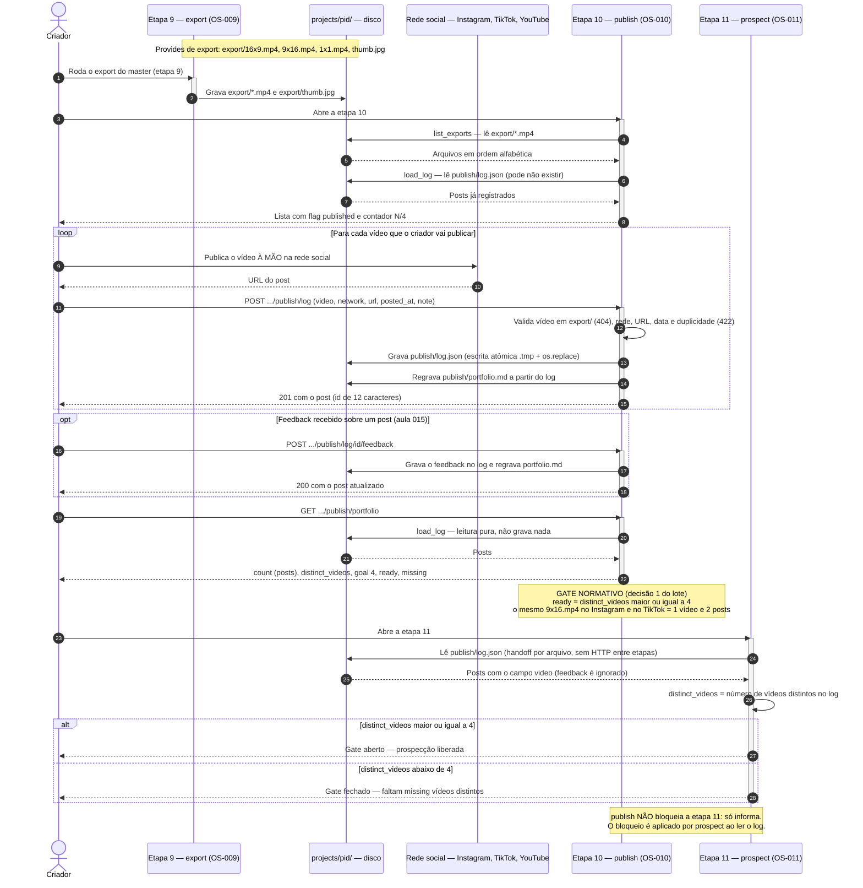

# publish (Etapa 10) — Handoff da wave: export → publish → prospect

Fonte: `docs/domains/publish/features/publish-fdd.md` (v0.2.0, seções 1, 5 e 9),
`docs/domains/studio/waves/wave-1.md` (Provides/Consumes e decisão 1 do lote),
`studio/publish/service.py` e `studio/etapas/publish/router.py`.
Diagrama tipo `sequenceDiagram` — o que está sendo modelado é a troca de artefatos entre três
frentes ao longo do tempo, com o gate no final.

## Como ler

O handoff da wave 1 nesta ponta é feito **por arquivo**, não por chamada entre serviços:

1. A etapa 9 (`export`, OS-009) produz `export/*.mp4` (e `export/thumb.jpg`) dentro de
   `projects/<pid>/`.
2. A etapa 10 (`publish`, OS-010) **consome** `export/*.mp4` só para listar o que pode ser
   postado, e **provê** `publish/log.json` e `publish/portfolio.md`. Publicar é ato humano na
   rede social; o Studio registra rede, URL, data, nota e feedback.
3. A etapa 11 (`prospect`, OS-011) **consome** `publish/log.json` como **gate**: só libera a
   prospecção quando o portfólio fechou.

**Regra normativa do gate (decisão 1 do lote):** o gate conta **vídeos distintos** —
`ready = distinct_videos >= 4` — e não o número de posts. Cinco posts sobre três vídeos
distintos mantêm o gate fechado (`ready: false`, `missing: 1`). A rota
`GET .../publish/portfolio` expõe `count` (posts) **e** `distinct_videos`; `prospect` precisa
usar `distinct_videos`. Nenhuma das duas etapas chama a outra por HTTP: `prospect` lê o mesmo
`publish/log.json` do disco, e por isso o schema da wave (`id, video, network, url, posted_at,
note`) é mantido, com `feedback` apenas aditivo.

`publish` **não bloqueia** a etapa 11 — ele só informa. O bloqueio é aplicado por `prospect`.

## Sequência

