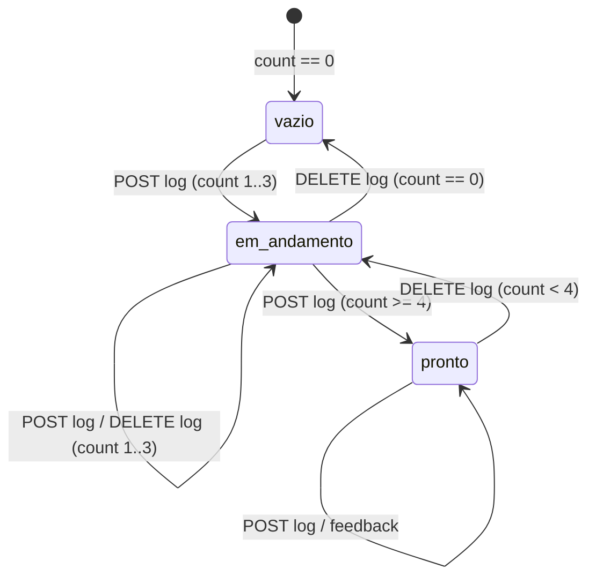

### FDD: publish (Etapa 10, Publicar)

Versão: 0.1.0
Data: 2026-08-25
Responsável: frente OS-010 (wave 1, `/dd-parallel`), gerado em modo batch com auto-aceites

---

### 1. Contexto e motivação técnica

A aula 015 encerra a produção com três ordens: publicar os vídeos nas redes, ter um portfólio de
4 vídeos antes de prospectar e pedir feedback. A aula 014 reforça "publicar mesmo que o primeiro
fique ruim". O Studio não tem hoje nenhum ponto que registre o que foi publicado, então a etapa 11
(prospect) não tem como saber se o gate de 4 vídeos foi cumprido.

Encaixe no HLD `studio`: plugin `studio/etapas/publish/` descoberto automaticamente, serviço puro
sobre `Path` em `studio/publish/service.py`, persistência em `projects/<pid>/publish/` (ADR-003),
sem job em thread (nada é longo), sem Higgsfield (ADR-002 não se aplica). Publicar continua sendo
ato humano na interface da rede social; o Studio registra rede, URL, data, nota e feedback.

Atores: o criador (único usuário local) e a etapa `prospect` (consumidora de `publish/log.json`).

Provides e Consumes (copiados de `docs/domains/studio/waves/wave-1.md`):

**Provides**
- `publish/log.json`: `[{id, video, network, url, posted_at, note}]`; `publish/portfolio.md`
**Consumes**
- `export/*.mp4` (vem de export)

[auto-aceito: o schema de `log.json` ganha o campo aditivo `feedback` (string, default ""), porque o
prompt da wave pede "campo de feedback recebido por post" e `prospect` só conta entradas]

Suposições e restrições:
- ADR-001: sem auth, sem porta extra, sem integração externa; ADR-004: só o que a aula ensina.
- O contador usa o número de entradas do log, não vídeos distintos: o mesmo `export/9x16.mp4`
  publicado no Instagram e no TikTok vale 2 posts.
  [auto-aceito: a aula fala em "4 vídeos publicados"; contar posts é a leitura mais simples e a que
  `prospect` já assume ("bloqueia com < 4 entradas em publish/log.json")]

---

### 2. Objetivos técnicos

- Listar os `export/*.mp4` do projeto em ordem alfabética com flag `published` derivada do log
  (invariante: `published == any(post.video == file)`).
- Persistir cada publicação em `publish/log.json` de forma atômica (gravar em `.tmp` e renomear),
  com validação de vídeo existente, rede não vazia, URL `http(s)://` e data ISO `YYYY-MM-DD`.
- Expor `count`, `goal = 4`, `ready = count >= 4` e `missing = max(0, 4 - count)` em uma rota de
  status, sem efeitos colaterais.
- Regravar `publish/portfolio.md` a cada mutação do log (adicionar, remover, feedback), nunca em GET.
- Nenhuma dependência de rede, CLI ou ffmpeg: a etapa funciona só com a stdlib.

---

### 3. Escopo e exclusões

**Incluído**
- Plugin `studio/etapas/publish/` (`META` com `id="publish"`, `n=10`, `aula="015"`), rotas sob
  `/api/projects/{pid}/publish/...`.
- Serviço `studio/publish/service.py`: `list_exports`, `load_log`, `add_post`, `set_feedback`,
  `remove_post`, `portfolio_status`, `write_portfolio`.
- UI: cabeçalho da etapa com a instrução da aula ("publique, monte o portfólio de 4 vídeos e peça
  feedback"), lista de exports com miniatura (`export/thumb.jpg` quando existir), formulário de
  registro (vídeo, rede, URL, data, nota), lista de posts com campo de feedback e botão remover,
  contador `N/4` e chip "portfólio pronto".
- Geração de `publish/portfolio.md`.
- Testes `tests/test_publish_service.py` e `tests/test_publish_api.py`.

**Excluído**
- Qualquer chamada a API de rede social, upload do arquivo, agendamento ou métricas de alcance.
- Geração automática de legenda, hashtag ou copy (a aula não ensina; `note` é campo livre).
- Edição de `app.py`, `steps.py`, `index.html`, `app.js`, `conftest.py` ou de outros plugins.
- Bloquear a etapa 11: o gate é aplicado por `prospect` lendo `log.json`; `publish` só informa.

---

### 4. Fluxos detalhados e diagramas

**Fluxo principal (registrar uma publicação)**
- O usuário abre a etapa 10; `view.js` chama `GET .../publish/exports` e `GET .../publish/portfolio`.
- A tela lista `export/*.mp4` (nome, tamanho, `published`) e mostra `N/4`.
- O usuário publica o vídeo manualmente na rede, copia a URL e clica em "Registrar publicação"
  no arquivo; preenche rede, URL, data (default hoje) e nota.
- `POST .../publish/log` valida, gera `id`, grava `log.json`, regrava `portfolio.md` e devolve o post.
- A tela recarrega exports (o arquivo passa a `published: true`), o log e o contador.

**Fluxo de feedback**
- Em cada post da lista há um campo "Feedback recebido" com botão salvar.
- `POST .../publish/log/{id}/feedback` grava `feedback` no post e regrava `portfolio.md`.

**Fluxo de remoção**
- Botão "Remover" no post pede `confirm()`; `DELETE .../publish/log/{id}` remove e regrava `portfolio.md`.

**Fluxos alternativos e exceções**
- `export/` inexistente ou vazio: `exports` devolve `[]` e a tela mostra "Nenhum export ainda.
  Volte à etapa 9." (`.empty`).
- Vídeo informado não existe em `export/`: 404 (`FileNotFoundError`).
- URL sem `http://` ou `https://`, rede vazia, data fora de `YYYY-MM-DD`: 422 (`ValueError`).
- URL já registrada em outro post: 422 ("URL já registrada").
  [auto-aceito: duplicidade por URL é o único sinal confiável de post repetido]
- `id` de post inexistente em feedback ou delete: 404 (`KeyError`, handler global do núcleo).
- `log.json` corrompido (JSON inválido): o serviço trata como lista vazia, registra `warning` no
  log de aplicação e sobrescreve na próxima mutação.
  [auto-aceito: comportamento tolerante, igual ao que `mood/service.py` faz com `candidates.json`]

**Diagrama de estados do portfólio**



---

### 5. Contratos públicos (assinaturas, endpoints, headers, exemplos)

Todas as rotas exigem `pid` válido (`project_dir` levanta `KeyError` e o núcleo responde 404).
Caminhos de arquivo nas respostas são relativos à raiz do projeto (ex.: `export/9x16.mp4`),
para uso com `ctx.files(rel)`.

**Contrato 1: listar exports disponíveis**
- Tipo: endpoint
- Assinatura/Rota: `GET /api/projects/{pid}/publish/exports`
- Método: GET
- Semântica de status:
  - 200: lista (possivelmente vazia) de arquivos `export/*.mp4`
  - 404: projeto inexistente

**Exemplo de resposta**
```json
{
  "files": [
    {"name": "16x9.mp4", "file": "export/16x9.mp4", "size": 8123456, "modified": "2026-08-25T10:12:00", "published": false},
    {"name": "9x16.mp4", "file": "export/9x16.mp4", "size": 6011234, "modified": "2026-08-25T10:12:30", "published": true}
  ],
  "thumb": "export/thumb.jpg"
}
```
`thumb` é `null` quando `export/thumb.jpg` não existe.
[auto-aceito: sem `ffprobe` na listagem (duração/resolução ficam de fora) para manter a etapa
independente de ffmpeg; `export/qa_report.md` já traz esses dados]

**Contrato 2: ler o log de publicações**
- Tipo: endpoint
- Assinatura/Rota: `GET /api/projects/{pid}/publish/log`
- Método: GET
- Semântica de status: 200 sempre que o projeto existe (log vazio devolve `posts: []`).

**Exemplo de resposta**
```json
{
  "posts": [
    {"id": "a1b2c3d4e5f6", "video": "export/9x16.mp4", "network": "instagram", "url": "https://www.instagram.com/reel/XYZ/", "posted_at": "2026-08-25", "note": "primeiro reel da campanha", "feedback": ""}
  ],
  "count": 1,
  "goal": 4
}
```

**Contrato 3: registrar publicação**
- Tipo: endpoint
- Assinatura/Rota: `POST /api/projects/{pid}/publish/log`
- Método: POST (JSON)
- Semântica de status:
  - 201: post criado; corpo é o post
  - 404: projeto ou vídeo inexistente em `export/`
  - 422: rede vazia, URL inválida, data inválida ou URL duplicada

**Exemplo de requisição**
```json
{"video": "export/9x16.mp4", "network": "instagram", "url": "https://www.instagram.com/reel/XYZ/", "posted_at": "2026-08-25", "note": "primeiro reel da campanha"}
```
Campos: `video` (obrigatório, aceita `export/9x16.mp4` ou só `9x16.mp4`), `network` (obrigatório,
string livre; a UI sugere `instagram`, `tiktok`, `youtube`, `outro`), `url` (obrigatório,
`http(s)://`), `posted_at` (opcional, default data de hoje), `note` (opcional, default "").
[auto-aceito: rede como string livre com sugestões, porque a aula 007 cita Instagram, TikTok e
YouTube mas a 015 fala só em "redes sociais"]

**Exemplo de resposta**
```json
{"id": "a1b2c3d4e5f6", "video": "export/9x16.mp4", "network": "instagram", "url": "https://www.instagram.com/reel/XYZ/", "posted_at": "2026-08-25", "note": "primeiro reel da campanha", "feedback": ""}
```

**Contrato 4: registrar feedback recebido**
- Tipo: endpoint
- Assinatura/Rota: `POST /api/projects/{pid}/publish/log/{post_id}/feedback`
- Método: POST (JSON)
- Semântica de status: 200 post atualizado; 404 projeto ou post inexistente.
[auto-aceito: feedback como sub-rota POST do log, e não PATCH, para ficar dentro de "log GET/POST/DELETE"]

**Exemplo de requisição**
```json
{"feedback": "3 amigos acharam o corte rápido demais no final"}
```

**Exemplo de resposta**
```json
{"id": "a1b2c3d4e5f6", "video": "export/9x16.mp4", "network": "instagram", "url": "https://www.instagram.com/reel/XYZ/", "posted_at": "2026-08-25", "note": "primeiro reel da campanha", "feedback": "3 amigos acharam o corte rápido demais no final"}
```

**Contrato 5: remover publicação**
- Tipo: endpoint
- Assinatura/Rota: `DELETE /api/projects/{pid}/publish/log/{post_id}`
- Método: DELETE
- Semântica de status: 200 `{"removed": "<id>", "count": n}`; 404 projeto ou post inexistente.

**Contrato 6: status do portfólio**
- Tipo: endpoint
- Assinatura/Rota: `GET /api/projects/{pid}/publish/portfolio`
- Método: GET
- Semântica de status: 200 sempre que o projeto existe. Não grava nada.

**Exemplo de resposta**
```json
{"count": 4, "distinct_videos": 2, "goal": 4, "ready": true, "missing": 0, "portfolio_md": "publish/portfolio.md"}
```
`portfolio_md` é `null` quando o arquivo ainda não foi gerado (log nunca teve mutação).
`distinct_videos` é informativo (vídeos de `export/` distintos no log); `ready` usa `count`.

**Contrato 7: serviço (`studio/publish/service.py`)**
- Tipo: function
- Assinaturas:
  - `PORTFOLIO_GOAL: int = 4`
  - `list_exports(pid: str) -> dict` (`{"files": [...], "thumb": str | None}`)
  - `load_log(pid: str) -> list[dict]`
  - `add_post(pid: str, video: str, network: str, url: str, posted_at: str | None = None, note: str = "") -> dict`
  - `set_feedback(pid: str, post_id: str, feedback: str) -> dict`
  - `remove_post(pid: str, post_id: str) -> int` (devolve o novo `count`)
  - `portfolio_status(pid: str) -> dict`
  - `write_portfolio(pid: str) -> Path` (regrava `publish/portfolio.md`)
- Exceções: `KeyError` (projeto ou post inexistente), `FileNotFoundError` (vídeo não está em
  `export/`), `ValueError` (validação de campos).
- `id` do post: `uuid4().hex[:12]`.
  [auto-aceito: id aleatório curto evita colisão após remoções; sha do conteúdo não se aplica a um registro]

**Formato de `publish/portfolio.md`**
```markdown
# Portfólio: <nome do projeto>

Publicados: 4/4. Portfólio pronto: pode começar a prospecção (etapa 11).

| # | Vídeo | Rede | URL | Data | Nota | Feedback |
| --- | --- | --- | --- | --- | --- | --- |
| 1 | export/9x16.mp4 | instagram | https://... | 2026-08-25 | primeiro reel | corte rápido no fim |
```
Com menos de 4 posts a segunda linha vira "Publicados: N/4. Faltam X para o portfólio da aula 015."

---

### 6. Erros, exceções e fallback

**Matriz de erros**

| Condição | Tratamento | Observação |
| --- | --- | --- |
| `pid` inválido ou projeto ausente | `KeyError` no serviço, 404 pelo núcleo | padrão `project_dir` |
| `export/` ausente | `list_exports` devolve `files: []` | tela orienta voltar à etapa 9 |
| `video` não existe em `export/` ou não é `.mp4` | `FileNotFoundError`, 404 | também rejeita caminhos fora de `export/` (`..`) |
| `network` vazio após `strip()` | `ValueError`, 422 | |
| `url` sem esquema `http(s)://` | `ValueError`, 422 | sem validação de domínio |
| `posted_at` fora de `YYYY-MM-DD` | `ValueError`, 422 | `date.fromisoformat` |
| `url` já registrada | `ValueError` "URL já registrada", 422 | comparação exata após `strip()` |
| `post_id` inexistente | `KeyError`, 404 | feedback e delete |
| `log.json` inválido | tratado como `[]`, `warning` no logger | próxima mutação sobrescreve |
| falha de escrita em disco | `OSError` sobe como 500 | sem retry; arquivo `.tmp` nunca substitui o bom |

- Estratégias de resiliência: não há chamadas externas, então não há timeout, retry nem circuit
  breaker. Escrita atômica (`.tmp` + `os.replace`) protege `log.json` e `portfolio.md`.
- Política de fallback: sem ffmpeg, sem CLI e sem rede a etapa funciona integralmente.
- Invariantes:
  - `count == len(log.json)` e `ready == (count >= 4)` em qualquer leitura.
  - `portfolio.md` reflete o último estado do log após toda mutação bem sucedida.
  - Nenhuma entrada do log aponta para arquivo fora de `export/` no momento do registro
    (o arquivo pode ser apagado depois; a listagem então mostra o post sem export correspondente).

---

### 7. Observabilidade

**Métricas**
- Não há sistema de métricas no monólito local (ADR-001). Os contadores expostos são `count`,
  `goal`, `missing` e `ready` na rota `portfolio`.

**Logs**
- Logger `studio.publish` (stdlib `logging`), nível INFO: `publish.add pid=<pid> id=<id>
  network=<rede> count=<n>`, `publish.remove pid=<pid> id=<id> count=<n>`,
  `publish.feedback pid=<pid> id=<id>`; WARNING quando `log.json` está corrompido.
- Nunca logar `note` ou `feedback` (texto livre do usuário).

**Tracing**
- Não se aplica (sem spans no projeto).

**Dashboards e alertas**
- A própria tela: contador `N/4` e chip `chip ok` "portfólio pronto" / `chip warn` "faltam X".

---

### 8. Dependências e compatibilidade

| Componente | Versão mínima | Observações |
| --- | --- | --- |
| Python | 3.12 | stdlib apenas (`json`, `uuid`, `datetime`, `pathlib`, `logging`) |
| FastAPI / Pydantic | 0.141 / 2.13 | modelos de request declarados em `router.py` |
| `studio.refs.service.project_dir` | atual | resolução da raiz e validação de `pid` |
| `studio/etapas/discover()` | atual | `META` com `id="publish"`, `n=10` |
| etapa `export` (OS-009) | wave 1 | produz `export/*.mp4` e `export/thumb.jpg` |
| `tests/conftest.py` | atual | `studio_env`, `client`; vídeos de teste são bytes fictícios `.mp4` |

**Garantias de compatibilidade**
- `log.json` mantém os campos da wave (`id, video, network, url, posted_at, note`); `feedback` é
  aditivo e `prospect` deve ignorá-lo. Leitura tolera entradas sem `feedback`.
- Nenhum arquivo único do repositório é editado (`app.py`, `steps.py`, `conftest.py`, etc.).
- `META.n = 10` bate com o catálogo `SOON`; o ajuste de `test_steps_and_config.py` é tarefa
  transversal do orquestrador, não desta frente.

---

### 9. Critérios de aceite técnicos

- `GET /steps/publish/view.html` e `view.js` servidos pelo núcleo; `GET /api/steps` mostra
  `publish` com `status: ready` e `n: 10`.
- Projeto com `export/9x16.mp4` e `export/16x9.mp4`: `GET .../publish/exports` devolve os dois em
  ordem alfabética com `published: false`. `[cross-feature]` lê os `export/*.mp4` reais gerados
  pela etapa 9 no projeto de integração.
- `POST .../publish/log` válido devolve 201 com `id` de 12 caracteres, grava `publish/log.json` e
  cria `publish/portfolio.md`; o mesmo vídeo passa a `published: true` na listagem.
- Após 4 posts, `GET .../publish/portfolio` devolve `{"count": 4, "ready": true, "missing": 0}`;
  com 3, `ready: false` e `missing: 1`. `[cross-feature]` `publish/log.json` com 4 entradas é lido
  por `prospect` sem adaptação e libera a etapa 11; com 3, `prospect` bloqueia.
- `POST .../publish/log/{id}/feedback` persiste o texto e ele aparece em `portfolio.md`.
- `DELETE .../publish/log/{id}` reduz `count`, regrava `portfolio.md` e devolve 404 na segunda chamada.
- 404 para vídeo fora de `export/` e para `../` no caminho; 422 para rede vazia, URL sem esquema,
  data inválida e URL duplicada.
- `log.json` corrompido não derruba nenhuma rota (`GET log` devolve `posts: []`).
- `portfolio.md` contém a linha "Publicados: N/4" e uma linha de tabela por post.
- Nenhum teste toca rede, CLI ou ffmpeg; `ruff check studio tests` limpo; `make verify` verde.
- UI: contador `N/4`, chip "portfólio pronto" quando `ready`, campo de feedback por post,
  formulário sem campo de legenda/hashtag.

---

### 10. Riscos e mitigação

### Leitura "4 vídeos" versus "4 posts"

- **Probabilidade:** média
- **Impacto:** o gate de `prospect` pode liberar cedo se o usuário registrar o mesmo vídeo em 4 redes.
- **Mitigação:**
    - Contar entradas do log (leitura da wave) e expor também `distinct_videos` na rota `portfolio`
      para o usuário enxergar a diferença.
    - Pendência registrada no lote para o humano confirmar a leitura da aula 015.
- **Plano de contingência:** trocar `count` por número de vídeos distintos é mudança de uma linha
  no serviço, sem alterar contrato.

### Divergência de schema com `prospect`

- **Probabilidade:** baixa
- **Impacto:** `prospect` não conseguir ler `log.json` na integração W5.
- **Mitigação:**
    - Manter exatamente os campos da wave; `feedback` só aditivo.
    - Fixture `publish/log.json` de exemplo em `tests/test_publish_service.py` reutilizável pela frente 11.
- **Plano de contingência:** ajuste na integração em série (publish integra antes de prospect).

### Export apagado após o registro

- **Probabilidade:** baixa
- **Impacto:** post aponta para arquivo inexistente; listagem confusa.
- **Mitigação:**
    - `list_exports` só lista o que existe; o post permanece no log (a publicação na rede continua válida).
    - Tela mostra o post com aviso "arquivo não está mais em export/".
- **Plano de contingência:** o usuário remove o post manualmente.

---

### 11. Sequenciamento de implementação (Build Order)

| Ordem | Etapa | Depende de | Componentes/arquivos prováveis | Critérios que fecha (da seção 9) |
| --- | --- | --- | --- | --- |
| 1 | Serviço: log, validações, status, portfolio.md | - | `studio/publish/__init__.py`, `studio/publish/service.py`, `tests/test_publish_service.py` | contador N/4, 404/422, log corrompido, portfolio.md |
| 2 | Listagem de exports | 1 | `studio/publish/service.py` (`list_exports`), `tests/test_publish_service.py` | exports em ordem com `published`, `[cross-feature]` export |
| 3 | Plugin e rotas | 1, 2 | `studio/etapas/publish/__init__.py` (`META`), `studio/etapas/publish/router.py`, `tests/test_publish_api.py` | todos os contratos HTTP, status codes, `/api/steps` ready |
| 4 | UI da etapa | 3 | `studio/etapas/publish/view.html`, `studio/etapas/publish/view.js` | contador, chip, feedback por post, sem campo de copy |
| 5 | Handoff com prospect | 1 | fixture `log.json` com 4 entradas em `tests/test_publish_service.py` | `[cross-feature]` prospect lê `log.json` |
