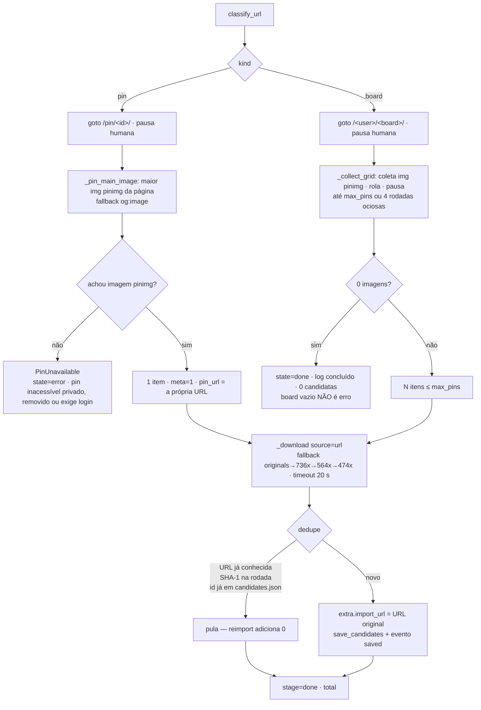

# Etapa 1 — Import de pin/board do Pinterest por URL (Wave 9, ADR-004/ADR-005)

`[extensão]` — a aula 009 ensina a **buscar por termos**. Trazer um pin ou um board que o usuário
já tem, colando a URL, é atalho do Studio: produz o MESMO artefato da etapa (candidatas em
`refs/candidates/`, schema `Candidate` inalterado, `source="url"`).

Spec: [`refs-import-url-fdd.md`](../../features/refs-import-url-fdd.md).

## Fluxo 1: do POST ao job (classificação síncrona, exclusão mútua com a busca)

```mermaid
sequenceDiagram
    autonumber
    actor U as Usuário
    participant V as view.js (etapa 1)
    participant R as router.py (refs)
    participant S as service.start_import_url
    participant P as pinterest.import_url
    participant FS as projects/&lt;pid&gt;/refs/candidates/

    U->>V: cola a URL e clica "Importar URL"
    V->>R: POST /api/projects/{pid}/refs/import/url {url, max_pins, headless}
    R->>S: start_import_url(pid, url, max_pins, headless)
    S->>S: project_dir(pid)

    alt projeto inexistente
        S-->>V: 404 (KeyError → handler global)
    else URL não classificável (host de terceiro, pin.it, /search/pins/)
        S->>S: pinterest.classify_url(url) levanta ValueError
        S-->>V: 422 IMPORT_URL_HELP — NENHUM job criado
    else já há job de coleta (busca OU import) em _jobs[pid]
        S-->>V: 409 "Já existe uma busca em andamento para este projeto."
    else
        S->>S: cria _jobs[pid] {state:running, terms:[term], meta: 1 (pin) | max_pins (board)}
        S-->>V: 200 job_status(pid) — mesmo shape do search
        S->>P: thread daemon (perfil persistente, ritmo humano)
        loop polling 2 s (ui.progressJob)
            V->>R: GET /api/projects/{pid}/refs/job
        end
        P->>FS: _download + save_candidates incremental
        P-->>S: done | PinUnavailable | exceção
        S->>FS: _write_last_job → last_job.json ANTES de marcar done
        V->>R: GET /api/projects/{pid}/refs/candidates
    end
```

## Fluxo 2: dentro do `import_url` (pin × board)



## Notas de fidelidade e limites

- **ADR-005** (ritmo humano, teto, sessão do usuário): o import reusa `_launch` (perfil persistente),
  `_human_pause`, a rolagem variável e `_download` do search. Teto `max_pins` default 30, máx 100.
  O aviso de ToS aparece na tela da etapa e no docstring de `pinterest.import_url`.
- **ADR-004**: a marca de extensão está no docstring do serviço/rota/função, no guia da etapa
  (`guide.py`) e na tela (bloco "Extensão do Studio" + `[extensão]` no modal de progresso).
- **Um job de coleta por projeto**: import e busca compartilham `_jobs[pid]` e `_lock`, então a tela
  reusa o `GET .../refs/job` existente e as duas ações se travam mutuamente.
- **Fora de escopo** (FDD §4): shortlink `pin.it` (422), URLs de perfil, outras fontes por URL,
  migração para `JobRegistry` (o domínio refs mantém o job dict local, de propósito).
