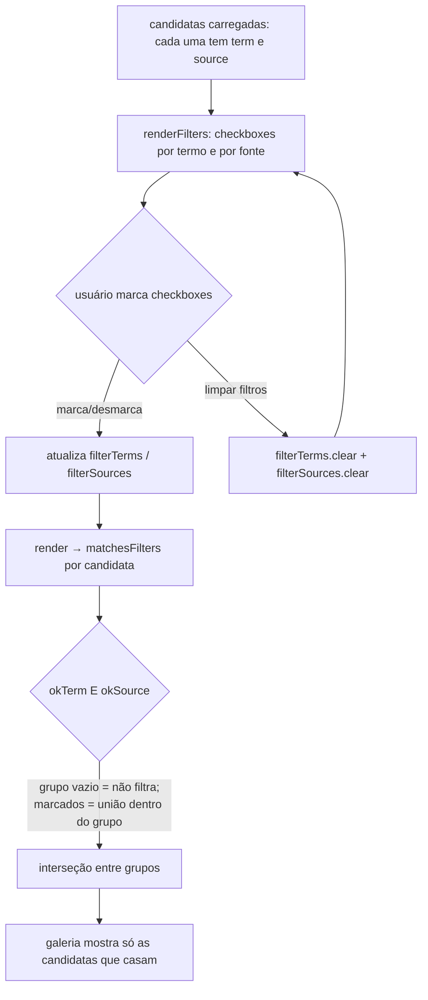

# Etapa 1 — Marca validada persistida e filtros multiseleção (ADH-OS-20260828-21, ADR-020)

`[extensão]` — a marca validada da aula 009 passa a persistir no domínio refs e vira a fonte única
das sugestões de termos; o filtro único de termo vira filtros multiseleção (termo × fonte).

## Fluxo 1: salvar marca validada e sugerir termos só a partir dela

```mermaid
sequenceDiagram
    autonumber
    actor U as Usuário
    participant V as view.js (SPA)
    participant R as router.py (/api/… /refs)
    participant S as studio/refs/service.py
    participant FS as projects/&lt;pid&gt;/refs/

    Note over V: ao abrir a etapa, view.js carrega a marca validada
    V->>R: GET /api/projects/{pid}/refs/validated-brand
    R->>S: get_validated_brand(pid)
    S->>FS: lê validated_brand.json (ou "" se ausente)
    S-->>V: {"brand": "Red Bull"}

    U->>V: edita #brand e clica "Salvar marca validada"
    V->>R: PUT /api/projects/{pid}/refs/validated-brand {"brand":"Red Bull"}
    R->>S: set_validated_brand(pid, "Red Bull")
    S->>FS: grava validated_brand.json {"brand":"Red Bull"}
    Note over S,FS: arquivo próprio do domínio refs — NÃO toca project.json.brand nem base/brand.json

    U->>V: clica "Sugerir termos a partir do projeto"
    V->>R: GET /api/suggest-terms?product&vibe&brand&pid={pid}
    R->>S: get_validated_brand(pid) → "Red Bull"
    R->>S: suggest_terms(..., validated_brand="Red Bull")
    alt com marca validada persistida
        S-->>V: ≥12 termos SÓ da marca (estilo, enquadramento, mood, material, luz)
    else sem marca validada
        S-->>V: comportamento atual (marca digitada + product/vibe como complemento)
    end
```

## Fluxo 2: filtros multiseleção (client-side)


