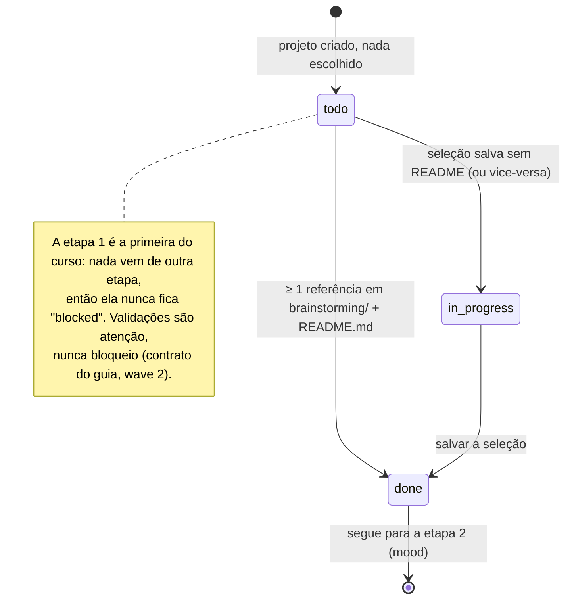

# Etapa 1 — Referências (aula 009) com o guia da wave 2

## Fluxo principal: marca validada → buraco de minhoca → brainstorming

```mermaid
sequenceDiagram
    autonumber
    actor U as Usuário
    participant V as view.js (SPA)
    participant UI as Studio.ui (/static/ui.js)
    participant R as router.py (/api/… /refs)
    participant S as studio/refs/service.py
    participant G as etapas/refs/guide.py
    participant FS as projects/&lt;pid&gt;/

    U->>V: abre a Etapa 1
    V->>UI: renderGuide("refs")
    UI->>R: GET /api/projects/{pid}/guide/refs
    R->>G: guide(pid)  (leitura pura, nunca escreve)
    G->>FS: lê project.json, refs/candidates.json, refs/brainstorming/, refs/README.md
    G-->>UI: o que fazer · entradas · saídas · validações · próxima ação
    Note over G,UI: validações §1.5 — ≥3 refs (aviso), invariante selected↔brainstorming,<br/>termo com marca validada, lixo de DOM no alt, produto preenchido

    U->>V: informa a marca validada ("Red Bull")
    V->>R: GET /api/suggest-terms?product&vibe&brand
    R->>S: suggest_terms(product, vibe, brand)
    S-->>V: "Red Bull ads", "Red Bull snow neon ads", … + termos por produto

    U->>V: Buscar e baixar
    V->>R: POST refs/search {terms, max_per_term, headless}
    R->>S: start_search → thread (Playwright, ritmo humano)
    S->>FS: refs/candidates/&lt;sha12&gt;.jpg + thumbs + candidates.json
    loop a cada 2 s (Studio.ui.poll — encerrado por destroy())
        V->>R: GET refs/job
    end

    alt Segunda fonte da aula: Explore do Midjourney [extensão]
        U->>V: arrasta as imagens salvas à mão
        V->>R: POST refs/import/upload (multipart)
        R->>S: import_upload → dedupe sha1 + thumb
        S->>FS: candidata source="upload"
    end

    U->>V: marca o que gosta e escreve o "por quê" [extensão]
    V->>R: POST refs/select {ids, notes}
    R->>S: select
    S->>FS: copia para refs/brainstorming/, apaga desmarcadas, escreve README.md
    V->>UI: ctx.guide() (o guia recalcula depois de cada ação)
```

## Estados da etapa no guia


