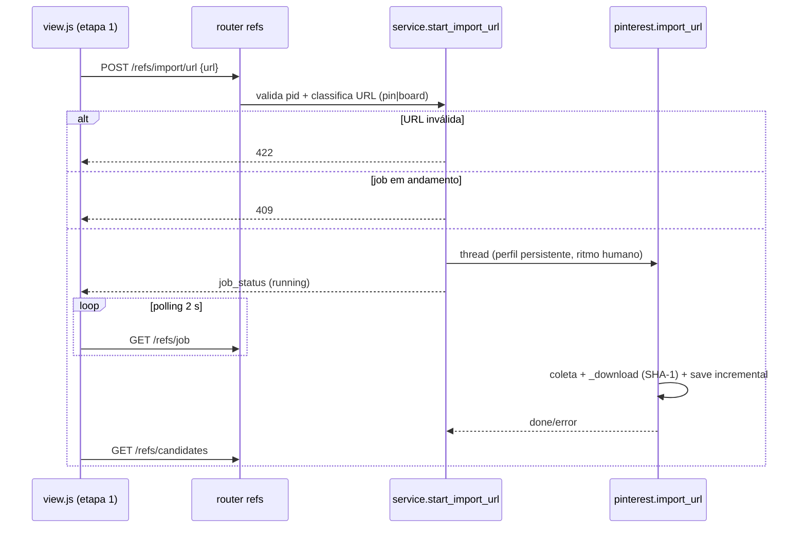

### FDD: refs-import-url · importar pin ou board do Pinterest por URL na etapa 1 [extensão]

Versão: 1.0 (spec pré-aprovada da Wave 9, modo batch)
Data: 2026-08-30
Responsável: Arthur Diego (gerado em modo batch; aprovação no gate em lote da wave)

**Wave 9 · Sub-wave 1 · Recon:** `docs/domains/studio/recon-wave-9.md` · Contratos da wave:
`docs/domains/studio/waves/wave-9.md`. Marcação `[extensão]` obrigatória (ADR-004); método de
coleta regido por ADR-005 (scraping via Playwright, sessão do usuário, ritmo humano, teto).

Contexto de produto (o domínio refs não tem `prd.md`; o contexto vive aqui): a aula 009 manda
buscar campanhas reais no Pinterest e salvar o que o usuário gostou. Hoje o Studio cobre a busca
por termos e o upload manual. Falta o caso em que o usuário JÁ tem o link de um pin específico ou
de um board inteiro (dele ou de terceiros) e quer trazê-lo para as candidatas sem refazer a busca.
Isso é `[extensão]`: a aula não ensina import por URL, mas ele produz o mesmo artefato da etapa
(candidatas em `refs/candidates/`), então entra rotulado e separado do que é do curso.

---

### 1. Provides / Consumes (contrato da wave)

**Provides**
- Novo endpoint `POST /api/projects/{pid}/refs/import/url` (body `{url, max_pins?, headless?}`),
  que detecta pin vs board pelo path da URL e dispara um job assíncrono no padrão local do
  domínio (`_jobs` dict próprio de `studio/refs/service.py`, como `start_search`).
- Nova função `studio/refs/pinterest.py::import_url(...)` reusando `_launch` (perfil
  persistente/cookies), ritmo humano (`_human_pause`, `mouse.wheel`) e `_download`
  (dedupe SHA-1, fallback de tamanhos, thumbnail).
- Candidatas devolvidas no MESMO schema `Candidate` existente (`pinterest.py:28`), com
  `source="url"` e `term` derivado, para a galeria, os filtros e o `select` atuais funcionarem
  sem nenhuma mudança.
- Campo de URL + botão "Importar URL" na tela da etapa 1 (`studio/etapas/refs/view.{html,js}`),
  aditivo, com aviso de ToS.

**Consumes**
- Nada de outras features da Wave 9 (candidata imediata, sub-wave 1). Reusa apenas o que já
  existe no domínio: `_launch`, `_download`, `_collect_from_page`, `load/save_candidates`,
  `_jobs`/`_lock`, `job_status`, `GET /api/projects/{pid}/refs/job`.

---

### 2. Contexto e motivação técnica

O scraper atual (`pinterest.search`, `pinterest.py:102-165`) só entra pela página de busca por
termo. Um pin ou board apontado por URL é a mesma superfície de conteúdo (imagens `pinimg.com`
dentro de uma página do Pinterest), então o mecanismo de coleta e download é 100% reutilizável;
o que muda é a página de entrada e o critério de parada. O domínio refs usa deliberadamente um
job dict próprio (`_jobs`, `service.py:17`), não o `JobRegistry` comum: esta feature segue o
padrão LOCAL do domínio e não migra nada (restrição do recon, "não misturar").

Atores: usuário do Studio (cola a URL na tela da etapa 1); Pinterest (site de terceiro, sem API,
ADR-005). Limites: nenhuma edição em `app.py`/`steps.py`/`web/*` (ADR-010); nenhum teste com
rede/navegador real (ADR-008); nada de crawler agressivo de boards (ADR-005).

Suposições e restrições explícitas:
- O aviso de ToS do Pinterest permanece aviso visível, nunca validação bloqueante (decisão
  registrada na ADR-005); esta feature repete o aviso no docstring da função nova e na UI.
- `candidates.json` nunca muda de schema; campos novos, se necessários, entram em
  `Candidate.extra` (dict livre já existente).

---

### 3. Objetivos técnicos

- Importar 1 pin por URL em até ~30 s (1 navegação + 1 download), criando exatamente 1 candidata
  nova quando a imagem ainda não existe no projeto (invariante: dedupe por SHA-1 idêntico ao do
  search; reimport do mesmo pin adiciona 0).
- Importar um board respeitando teto configurável de pins (default 30, máx 100) e parada por
  ociosidade (4 rolagens sem novidade), no mesmo ritmo humano do search.
- Zero mudança de contrato nas rotas e schemas existentes: `GET .../refs/job`,
  `GET .../refs/candidates`, `POST .../refs/select` e a tela continuam funcionando sem edição
  fora do plugin refs.
- Exclusão mútua com o job de busca: 1 job de coleta por projeto (mesmo `_jobs[pid]` + `_lock`).

---

### 4. Escopo e exclusões

**Incluído**
- Detecção pin vs board pelo path da URL, com validação de host.
- `pinterest.import_url(url, out_dir, max_pins, headless, progress)` com eventos de progresso no
  formato já consumido por `_log_line`/`job_status`.
- `service.start_import_url(pid, url, max_pins, headless)` no padrão de `start_search`
  (thread daemon, `_write_last_job` ao concluir, estado em `_jobs[pid]`).
- Rota `POST /api/projects/{pid}/refs/import/url` + modelo Pydantic.
- UI aditiva na etapa 1: campo URL, botão, progresso via `ui.progressJob` apontando para o
  `GET .../refs/job` existente, nota `[extensão]` + aviso ToS.
- Testes sem rede (fakes/monkeypatch de `pinterest.import_url`, teste puro da detecção de URL).

**Excluído**
- Migração para `JobRegistry` (padrão local do domínio é mantido).
- Suporte a outras fontes por URL (Instagram, Behance etc.) e a URLs de perfil de usuário.
- Seções de board (`/<user>/<board>/<section>/`) como caso dedicado: são tratadas como board
  comum (a página rola do mesmo jeito). [auto-aceito: tratar section como board genérico; o
  mecanismo de coleta é idêntico e evita matriz de casos sem valor]
- Resolução de shortlinks `pin.it`: rejeitada com erro claro nesta versão. [auto-aceito: exigir
  URL canônica pinterest.com evita navegação extra só para descobrir o tipo; opção mais
  conservadora; fica sugerida como melhoria futura]
- Metadados ricos do board (nome de exibição, dono): só o slug do path é usado.

---

### 5. Fluxos detalhados e diagramas

**Fluxo principal (board)**
- UI envia `POST .../refs/import/url {url}`.
- Router valida `pid`; service valida/classifica a URL (síncrono, ANTES de criar o job):
  host `pinterest.com` ou subdomínio regional (`www.`, `br.`, `pt.` etc.); path
  `/pin/<id>` = pin; path com 2 segmentos `/<user>/<board>/` (nenhum deles em palavras
  reservadas: `pin`, `search`, `login`, `ideas`, `settings`, `today`, `videos`) = board;
  qualquer outra coisa = 422.
- Com `_lock`: se `_jobs[pid].state == "running"`, 409 (mesma mensagem-padrão de job em
  andamento). Senão cria job `{state:"running", terms:[<term derivado>], events:[], total:0,
  meta:<max_pins ou 1>, log:[], error:None}` e sobe a thread.
- Thread: `pinterest.import_url` abre `_launch` (perfil persistente), reporta
  `stage="start"` com `logged_in`, navega até a URL do board, pausa humana, e repete o laço de
  coleta do search (coletar `img[pinimg]` da página, `_best_url`, rolar, pausar) até atingir
  `max_pins` ou 4 rodadas ociosas; baixa cada imagem com `_download` (dedupe SHA-1 contra as
  candidatas existentes), salvando `candidates.json` incrementalmente e emitindo
  `stage="saved"`; ao final `stage="done"` com o total.
- Service grava `last_job.json` antes de marcar `done` (mesma ordem do search).
- UI faz polling em `GET .../refs/job` e recarrega as candidatas ao concluir.

**Fluxo alternativo (pin)**
- Mesmo esqueleto, mas: navega até `/pin/<id>/`, espera a imagem principal
  (`img[src*="pinimg.com"]` de maior resolução na página, com fallback para `og:image`),
  baixa só ela via `_download` com `pin_url` apontando para a própria URL importada e
  `meta=1`. Sem rolagem.

**Fluxos de exceção**
- URL inválida/não reconhecida: 422 imediato, nenhum job criado.
- Pin privado/removido: a página não expõe nenhuma imagem `pinimg` após o carregamento (tela de
  404 ou de login do Pinterest); o job termina em `state="error"` com mensagem
  "pin inacessível (privado, removido ou exige login)".
- Board vazio (0 imagens coletadas): job termina em `state="done"` com `total` inalterado e a
  linha de log "concluído · 0 candidatas"; a UI mostra o resultado sem tratar como erro.
  [auto-aceito: board vazio é resultado válido, não falha, coerente com o search que também pode
  voltar 0]
- Sem login: o job NÃO é bloqueado; `stage="start"` já carrega `logged_in=false` (comportamento
  atual do search) e a UI existente já mostra o estado de login. Conteúdo gated pode render 0
  imagens; nesse caso vale a regra do board vazio, e a mensagem de erro do pin já cita
  "exige login". [auto-aceito: mesma política best-effort do search; ADR-005 registra que sem
  login o resultado é reduzido, não proibido]

**Diagrama (sequência resumida)**



---

### 6. Contratos públicos

**Contrato 1: importar por URL**
- Tipo: endpoint HTTP
- Assinatura/Rota: `POST /api/projects/{pid}/refs/import/url`
- Método: POST
- Body (Pydantic `ImportUrlReq`): `url: str` (obrigatória), `max_pins: int = 30` (teto para
  board, ignorado para pin; faixa aceita 1..100), `headless: bool = True`.
  [auto-aceito: teto default 30 e máximo 100, mesmo espírito e faixa do `max_per_term` do
  search (HLD refs: "5-100 imagens/termo"; ADR-005: volume deliberadamente baixo)]
- Semântica de status:
  - `200` job criado; corpo = `job_status(pid)` (mesmo shape do search: `{state, terms, total,
    meta, log, last, error}`).
  - `404` projeto inexistente (via `service.project_dir`).
  - `409` já existe um job de coleta (busca OU import) em andamento para o projeto.
  - `422` URL inválida ou não reconhecida como pin/board do Pinterest (inclui `pin.it` e hosts
    de terceiros); `detail` explica o formato aceito.
- Limites: 1 job por projeto; board com no máximo `max_pins` imagens; timeout de download por
  imagem 20 s (herdado de `_download`); ritmo humano torna o job lento por design.

**Exemplo de requisição**
```json
{"url": "https://br.pinterest.com/usuario/campanhas-energetico/", "max_pins": 30}
```

**Exemplo de resposta**
```json
{"state": "running", "terms": ["campanhas energetico"], "total": 0,
 "meta": 30, "log": [], "last": {"stage": "start", "logged_in": true}, "error": null}
```

**Contrato 2: polling (existente, sem mudança)**
- `GET /api/projects/{pid}/refs/job` passa a refletir também o job de import (mesmo
  `_jobs[pid]`); nenhum campo novo obrigatório. `terms` carrega o term derivado da URL,
  para a barra "baixadas/meta" e o log do protótipo funcionarem sem edição.

**Contrato 3: schema `Candidate` (existente, valores novos)**
- `source="url"`; `term` derivado: para board, o slug do board com hifens trocados por espaço
  (ex.: `campanhas-energetico` vira `campanhas energetico`); para pin, o literal `"url"`.
  [auto-aceito: term derivado do slug dá filtro útil na galeria multiseleção do
  refs-filtros-termos sem campo novo; pin avulso agrupa em "url"]
- `pin_url` = URL do pin (pin importado ou o `/pin/` de cada card do board, quando o DOM o
  expõe); `url` = URL da imagem baixada; demais campos idênticos aos do search. A URL original
  digitada fica em `extra={"import_url": "<url>"}` para auditoria, sem mudar o schema.

**Compatibilidade**
- Tudo aditivo (ADR-004): nenhuma rota, campo ou mensagem existente muda; `candidates.json`
  antigos continuam válidos; a tela e o `select` não distinguem `source="url"` de
  `"pinterest"`/`"upload"` além dos filtros já existentes.

---

### 7. Erros, exceções e fallback

**Matriz de erros**

| Condição | Detecção | Tratamento | Resposta/estado |
| --- | --- | --- | --- |
| URL vazia, sem host Pinterest, `pin.it`, path não classificável | validação síncrona no service | nenhum job criado | `422` com detail em pt-BR dizendo os dois formatos aceitos |
| Projeto inexistente | `project_dir` | `KeyError` do padrão atual | `404` |
| Job (busca ou import) em andamento | `_lock` + `_jobs[pid]` | rejeita | `409` "Já existe uma busca em andamento para este projeto." |
| Pin privado/removido/exige login | 0 imagens `pinimg` na página do pin após carga + pausa | job encerra | `state="error"`, `error="pin inacessível (privado, removido ou exige login)"` |
| Board vazio ou 100% duplicado | laço termina com 0 downloads novos | job conclui normal | `state="done"`, log "concluído · 0 candidatas" |
| Sem login (`logged_in=false`) | cookie `_auth` ausente | best-effort, não bloqueia | evento `start` com `logged_in:false`; UI existente já sinaliza |
| Falha de download de uma imagem | `_download` devolve `None` | pula a imagem, segue o job | invariante: falha parcial nunca derruba o job |
| Exceção inesperada (DOM mudou, timeout de navegação) | `except` da thread (padrão `start_search`) | job encerra | `state="error"` com `TypeName: msg` |

**Resiliência**: timeout 20 s por download com fallback de tamanhos (`originals→736x→564x→474x`,
já existente); sem retry de navegação (falha vira erro de job, padrão do domínio); sem circuit
breaker (app local mono-usuário). **Fallback**: nenhum provedor alternativo (ADR-005 registra
SerpAPI/Pexels como opção futura, fora deste FDD). **Invariantes**: `candidates.json` só cresce
(save incremental atômico por reescrita completa, padrão atual); dedupe por SHA-1 garante que
reimport não duplica; um único job de coleta por projeto.

---

### 8. Observabilidade

**Métricas (via job/eventos, padrão do domínio; sem sistema de métricas externo)**
- `total` de candidatas novas por job; `meta` (teto) para a barra "baixadas/meta".
- Evento `start` com `logged_in`; eventos `saved` por imagem; `done` com total.

**Logs**
- Reuso de `_log_line`: `[HH:MM] <term> · N imagens` no download e `[HH:MM] concluído · N
  candidatas` (verde) no fim; erro aparece no campo `error` do job e na UI.
- Resumo persistido em `refs/last_job.json` (`_write_last_job`), para a tela reabrir preenchida,
  igual ao search.

**Tracing**: não se aplica (ADR-006, app local). **Painel mínimo**: a própria coluna de status
da etapa 1 (barra + log), sem tela nova.

---

### 9. Dependências e compatibilidade

| Componente | Versão mínima | Observações |
| --- | --- | --- |
| Playwright (sync) + Chromium | a do repo | reuso de `_launch`/perfil persistente `PINTEREST_PROFILE` |
| Pillow | a do repo | thumbnails via `_download` |
| `studio/refs/{pinterest.py,service.py}` | atual | funções novas aditivas; nada renomeado |
| `studio/etapas/refs/{router.py,view.html,view.js}` | atual | rota e UI aditivas; CSS escopado no `<style>` do view.html |

**Garantias**: nenhum teste existente muda de expectativa; `make verify` verde; testes novos sem
rede/navegador (ADR-008): a detecção de URL é função pura testável e `pinterest.import_url` é
monkeypatchado nos testes de rota/serviço.

---

### 10. Critérios de aceite técnicos

1. `POST .../refs/import/url` com URL de board válida responde 200 com job `running` e, com
   `pinterest.import_url` fake, o job conclui com as candidatas fake em `candidates.json`,
   `source="url"` e `term` igual ao slug do board com espaços.
2. Com URL de pin válida, `meta==1` e no máximo 1 candidata nova é criada; reimport do mesmo
   conteúdo (mesmo SHA-1) adiciona 0.
3. URL inválida (`https://exemplo.com/x`, `https://pin.it/abc`, path `/search/pins/`) responde
   422 sem criar job; a classificação pin vs board é coberta por teste unitário puro
   (casos: `/pin/123/`, `/user/board/`, `/user/board/section/`, host `br.pinterest.com`).
4. Segundo POST (import ou search) com job em andamento responde 409.
5. Job de pin inacessível termina `state="error"` com a mensagem de pin inacessível; board com
   0 imagens termina `state="done"` com log "concluído · 0 candidatas".
6. `GET .../refs/job` e `GET .../refs/candidates` continuam com o shape atual (testes existentes
   intocados e verdes); tela de seleção e `select` funcionam com candidatas `source="url"` sem
   nenhuma edição fora do plugin refs.
7. UI: campo de URL e botão na etapa 1 rotulados `[extensão]`, com o aviso de ToS visível
   (texto curto apontando o risco e a recomendação de conta secundária, ADR-005), progresso via
   `ui.progressJob` no `jobUrl` existente.
8. `max_pins` fora de 1..100 é normalizado ou rejeitado por validação Pydantic (`ge=1, le=100`).
9. `make verify` verde; nenhum arquivo do núcleo (`app.py`, `steps.py`, `studio/web/*`) editado.

---

### 11. Riscos e mitigação

### DOM do Pinterest muda (página de pin/board difere da busca)

- **Probabilidade:** alta
- **Impacto:** import quebra silenciosamente (0 imagens) sem quebrar o app
- **Mitigação:**
    - Reusar o seletor genérico `img[src*="pinimg.com"]` (mesma estratégia resiliente do search)
    - Fallback `og:image` no caso do pin
    - Erro de job com mensagem clara em vez de exceção não tratada
- **Plano de contingência:** ajustar seletor via bugfix; fallback SerpAPI/Pexels segue como
  opção futura registrada na ADR-005

### Board grande vira coleta agressiva (risco de bloqueio de conta, ToS)

- **Probabilidade:** média
- **Impacto:** bloqueio/suspensão da conta do usuário
- **Mitigação:**
    - Teto `max_pins` (default 30, máx 100) validado no contrato
    - Ritmo humano herdado (`_human_pause`, rolagem variável, sem paralelismo)
    - 1 job por projeto (exclusão mútua com o search)
    - Aviso ToS repetido na UI e no docstring da função nova
- **Plano de contingência:** reduzir default do teto; recomendar conta secundária (já é o aviso
  padrão da ADR-005)

### Ambiguidade de classificação de URL (paths novos do Pinterest)

- **Probabilidade:** baixa
- **Impacto:** URL legítima rejeitada com 422
- **Mitigação:**
    - Lista de palavras reservadas curta e explícita, coberta por teste unitário puro
    - Mensagem de 422 mostra os dois formatos aceitos para o usuário se autocorrigir
- **Plano de contingência:** ampliar o classificador em bugfix, sem mudança de contrato

---

### 12. Sequenciamento de implementação (Build Order)

| Ordem | Etapa | Depende de | Componentes/arquivos prováveis | Critérios que fecha (seção 10) |
| --- | --- | --- | --- | --- |
| 1 | Classificador de URL (função pura) + testes unitários | - | `studio/refs/service.py` (ou helper em `pinterest.py`), `tests/test_refs_import_url.py` | 3, 8 (parcial) |
| 2 | `pinterest.import_url` (pin e board, reuso `_launch`/`_download`/eventos) | 1 | `studio/refs/pinterest.py` | 1, 2, 5 (comportamento) |
| 3 | `service.start_import_url` (job `_jobs`, lock, `last_job`) | 2 | `studio/refs/service.py` | 4, 5, 6 |
| 4 | Rota `POST .../refs/import/url` + `ImportUrlReq` + testes de API com fake | 3 | `studio/etapas/refs/router.py`, `tests/test_refs_import_url.py` | 1, 2, 3, 4, 8 |
| 5 | UI etapa 1 (campo URL, botão, `[extensão]`, aviso ToS, `progressJob`) | 4 | `studio/etapas/refs/view.html`, `view.js` | 7 |
| 6 | Verificação final | 5 | `make verify` | 6, 9 |

---

### Registro de decisões do modo batch

- [auto-aceito: teto de board `max_pins` default 30, máximo 100, espelhando `max_per_term` e a
  faixa 5-100 do HLD; ADR-005 pede volume baixo]
- [auto-aceito: job no `_jobs` dict local compartilhando a chave `pid` com o search (exclusão
  mútua e reuso de `GET .../refs/job` e da UI de progresso sem rota nova de polling)]
- [auto-aceito: `source="url"`; `term` = slug do board com espaços (pin avulso: `"url"`), sem
  campo novo no schema; URL original preservada em `extra.import_url`]
- [auto-aceito: `pin.it` e URLs de section rejeitadas/normalizadas conservadoramente nesta
  versão (section tratada como board; shortlink 422)]
- [auto-aceito: sem login é best-effort (não bloqueia), igual ao search; board vazio é `done`
  com 0, não erro]
- Pendências: nenhuma divergência com contrato publicado encontrada (a rota é nova e não consta
  em `contratos.md`/HLD; tudo aditivo). Sem "porquê" de negócio órfão: a motivação vem do
  bloco da wave-9 e do padrão de fontes da aula 009 (upload manual como precedente `[extensão]`).

---

### Registro de execução da frente (Wave 9 · sub-wave 1)

Caminho escolhido: **implementação direta** pela regra determinística do fluxo (3 contratos
públicos na seção 6, 1 fluxo principal na seção 5, 7 arquivos na seção 12 — abaixo do corte de
SDD). Nenhum runner Compozy foi acionado.

**Pendência levantada na implementação (para o gate de integração W5), não decidida aqui:**

O critério de aceite 7 pede o campo e o botão de URL "rotulados `[extensão]`" na tela. O teste
existente `tests/test_refs_view.py::test_view_no_longer_collects_the_why_of_each_reference`
afirma `assert "por quê" not in html and "[extensão]" not in html`, ou seja, proíbe a string
literal `[extensão]` dentro de `studio/etapas/refs/view.html`. A seção 9 deste FDD garante que
"nenhum teste existente muda de expectativa", então a frente **não** alterou aquele teste.

Resolução conservadora aplicada (reversível, sem inventar contrato):
- `view.html` traz a marca de extensão por extenso — "Extensão do Studio — a aula 009 busca por
  termos; importar um link pronto é atalho nosso" — junto do aviso de ToS da ADR-005, seguindo o
  precedente do próprio plugin: o `import/upload` `[extensão]` também não carrega a string literal
  no HTML.
- A string literal `[extensão]` aparece na UI em tempo de execução (subtítulo do modal de
  progresso, em `view.js`), no guia da etapa (`guide.py`) e nos docstrings de `router.py`,
  `service.py` e `pinterest.py`.

Isso satisfaz a exigência substantiva da ADR-004 (marca de extensão na UI e no código) sem quebrar
o teste da wave 4. **Decisão pendente para o dono/W5:** ou aceitar essa rotulagem, ou relaxar a
asserção daquele teste para `[extensão]` do campo "por quê" especificamente, liberando a string
literal no `view.html`.
