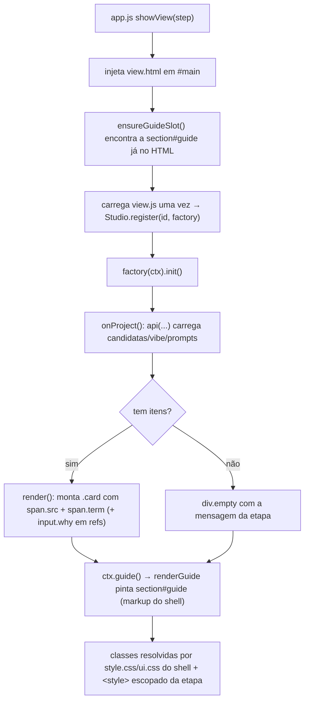

### FDD: views-refs-mood — etapas 1 e 2 no redesign da wave 3

Versão: 1.0
Data: 2026-08-26
Responsável: Arthur Diego (implementação: frente `views-refs-mood` da wave 3, `ADH-OS-20260826-03`)
Domínios: `refs` (etapa 1) e `mood` (etapa 2)

Modo: **batch** — Gate 1 (spec) pré-aprovado em lote pelo dono do produto
(`docs/domains/studio/waves/wave-3.md` §"Decisões do lote" #1: "tome todas as decisões
recomendadas e só pare quando tiver acabado tudo"). Nenhuma entrevista foi conduzida; todo
ponto que exigiria pergunta está decidido aqui e rotulado `[auto-aceito: …]`.

Spec normativa: `docs/domains/studio/waves/wave-3.md` (regras da wave, catálogo transversal de
classes, §"Feature: views-refs-mood", decisões do lote).
Contrato consumido: `docs/domains/studio/features/shell-redesign-fdd.md` §5 (catálogo definitivo
de classes e helpers `Studio.ui.tile/pipe/beats/copyBtn/copy`), já mergeado em `develop` (`a8795bb`).
Terreno: `docs/domains/studio/recon-wave-3.md` §1 (contrato DOM de refs e mood) e §2 (strings
fixadas por teste).
FDDs anteriores dos mesmos domínios (comportamento, inalterado por esta feature):
`docs/domains/refs/features/refs-guia-fidelidade-fdd.md`,
`docs/domains/mood/features/mood-guia-fidelidade-fdd.md`.
Fonte de verdade visual (fora do repositório, nunca versionada):
`Análise de codebase/design_handoff_redesign_frontend/README.md` +
`Redesign Orquestrador Studio.dc.html` l. 130–224 (refs), 226–331 (mood), 988–1000 (tiles).

Bloco de contrato da wave (`wave-3.md` §"Features e contratos"):

- **Provides**: `studio/etapas/{refs,mood}/view.html` + `view.js` no padrão do protótipo — refs
  com painel 01 de busca (`.grid2` com coluna `.status`: CTA `.cta`, `.progress-lbl`
  "Último scrape", `.log`), upload manual como painel 02 (funcionalidade mantida) e escolha como
  painel 03 (filtro, chip de contagem, "Salvar seleção", tiles com badge de origem e legenda do
  termo); mood com 4 painéis (vibe, prompt do bot, importação do grid, escolha do mood). Textos
  de aula longos em `details.lesson`.
- **Consumes**: catálogo de classes do shell ← `shell-redesign` (sub-wave 0).

---

### 1. Contexto e motivação técnica

A wave 3 aplica o redesign dark-first do handoff a **todos** os arquivos reais do frontend. A
sub-wave 0 (`shell-redesign`, `ADH-OS-20260826-02`) já entregou em `develop` o shell inteiro e o
catálogo transversal de classes: `.pn` (número do painel), `details.lesson`, `.field`,
`.gallery`/`.gallery.sm`, `.card` com `.src`/`.term`/`.up`, `.prompt` novo, `.progress-lbl`,
`.note`, `.ext`, `.cli`, `.palette .lbl`, `.drop`, `button.primary.cta`, `button.link`, além dos
helpers `Studio.ui.tile/pipe/beats/copyBtn/copy`.

Esta frente é a **sub-wave 1** para as duas primeiras telas do curso. As telas de refs e mood
hoje ainda estão no visual da wave 2: painéis numerados no texto do `h3` ("1. Buscar no
Pinterest"), parágrafos de aula longos soltos como `p.fine`, controles em `label.inline` sem
coluna `.field`, galerias sem badge de origem e um `input.why` estilizado por `style=""` inline
(apontado como dívida no recon §"LACUNAS", item de inline styles). O problema técnico é o
descasamento entre o markup das telas e o catálogo que o shell agora provê: sem a atualização,
as duas telas ficam visualmente fora do sistema (números no texto, hierarquia tipográfica errada,
tiles sem legenda/badge) e o inline style do `input.why` briga com os tokens do tema.

Atores e limites: só o frontend das duas etapas. Nenhuma rota, serviço, `guide.py`, `steps.py` ou
arquivo de `studio/web/` é tocado — a propriedade de arquivos da wave (regra 3) é o que torna as
seis frentes de tela paralelizáveis com segurança (ADR-010).

`[auto-aceito: escopo por etapa]` As duas etapas vão na mesma frente porque compartilham a mesma
aula (009) e o mesmo vocabulário visual (galeria + escolha), como definido no grafo de sub-waves.

### 2. Objetivos técnicos

1. `refs/view.html` e `mood/view.html` reproduzem a estrutura, a ordem dos painéis e os textos de
   cabeçalho do protótipo (eyebrow, `h2`, `p.lede`), com painéis numerados por `<span class="pn">`.
2. Todo id do contrato DOM (recon §1, refs e mood) continua existindo, com o mesmo elemento e o
   mesmo tipo — nenhum `view.js` deixa de encontrar o que consulta.
3. Nenhuma funcionalidade é removida: os painéis que o protótipo omite (upload manual de refs,
   campos de brief do mood, histórico de prompts, bloco CLI) continuam, reorganizados no mesmo
   padrão visual (decisão do lote #4).
4. Nenhum texto de aula é apagado: o que era `p.fine` longo vira `details.lesson` com o `summary`
   "O que a aula 009 manda fazer aqui" (regra 1 da wave; ADR-004).
5. As galerias passam a usar o tile do catálogo (`span.src` de origem, `span.term` de legenda,
   `.sel` com o check do shell) e o `input.why` perde o `style=""` inline.
6. `make verify` verde; smoke visual (claro, escuro e `--timers`) sem erro de console e sem timer
   órfão nas duas telas.

### 3. Escopo e exclusões

**Incluído** (únicos arquivos que esta frente edita):

- `studio/etapas/refs/view.html`, `studio/etapas/refs/view.js`
- `studio/etapas/mood/view.html`, `studio/etapas/mood/view.js`
- `docs/domains/refs/**`, `docs/domains/mood/**`
- `tests/test_refs_view.py`, `tests/test_mood_view.py`

**Excluído**:

- `studio/web/*` (dono exclusivo: `shell-redesign`; ADR-010). Se faltar classe, a saída é um
  `<style>` escopado no topo do `view.html` com prefixo da etapa (`.rf-…`/`.md-…`) e o registro da
  lacuna no final report, para a W5 decidir se promove ao shell (regra 3 da wave).
- Backend: rotas, `service.py`, `guide.py`, `steps.py`, `router.py` das duas etapas. Nenhum
  contrato HTTP novo → **sem coleção Postman** (a seção 5 não declara contrato HTTP).
- Lógica dos `view.js`: polling, `destroy()`, `ctx.guide()`, uploads, `confirmCost`, teto de 4
  imagens de vibe, cálculo de contagens. Só a **montagem de HTML** muda.
- Chips extras do guia compacto (`g.summary`) — decisão do lote #5: nenhum `guide.py` muda nesta
  wave, então esses chips ficam de fora.
- Dados de exemplo do protótipo (Gelo Zero, "94/120", "412 créditos", "sessão ativa") — decisão do
  lote #6: tudo continua vindo da API.

### 4. Fluxos detalhados e diagramas

O fluxo funcional das duas etapas **não muda**. O diagrama abaixo mostra o único fluxo desta
feature: a renderização da tela a partir do catálogo do shell.



Fluxo de interação preservado (refs): clique no `.card` alterna `.sel` e recalcula `#counts`;
clique dentro de `input.why` **não** marca o card (guarda `closest("input.why")`); duplo clique
abre o original; `#btnSave` envia `{ids, notes}` e recarrega o guia. Mood: teto de 4 na galeria de
vibe, `button.copy` copia o textarea irmão e escreve "copiado ✓" no `.ok` por 1,5 s,
`#btnMoodGen` passa por `ui.confirmCost`.

`[auto-aceito: sem diagrama de sequência novo]` Os diagramas de `docs/domains/{refs,mood}/diagrams/`
descrevem o fluxo de dados das etapas, que esta feature não altera; o Mermaid acima cobre a fatia.

### 5. Contratos públicos — mapa "painel do protótipo → markup e ids preservados"

Não há contrato HTTP novo. O contrato público desta feature é o **markup** consumido pelos
`view.js` e pelos testes. As tabelas abaixo são normativas: coluna "ids preservados" lista o que o
`view.js` consulta (recon §1) e **precisa** continuar existindo com o mesmo tipo de elemento.

#### 5.1 `refs/view.html` (protótipo l. 130–224)

| # | Painel do protótipo | Markup | ids preservados |
|---|---|---|---|
| — | header (l. 131–135) | `header.stephead` > `span.eyebrow` "Etapa 1 · aula 009" + `h2` "Referências" + `p.lede` | — |
| — | guia (l. 136–158) | `<section id="guide" class="guide"></section>` (markup gerado pelo shell) | `#guide` |
| 01 | "Buscar no Pinterest" (l. 159–200) | `.panel` > `.panel-head` (`h3` com `span.pn` "01"; `.row.wrap` com chip + `button.ghost`) + `details.lesson` + `.grid2` (`.col` com dois `label.field` + `.row.wrap` de opções e `button.link`; `.status` com `button.primary.cta`, `.progress-lbl`, `.progress`, `.log`, `.note`) | `#loginState` (span, className reescrito), `#btnLogin`, `#brand` (input), `#terms` (textarea), `#maxPer` (number), `#headed` (checkbox), `#btnSuggest`, `#btnSearch` (disabled), `#progress` > `.bar`, `#log` |
| 02 | *(não existe no protótipo — mantido, decisão do lote #4)* | `.panel` > `.panel-head` (`h3` `span.pn` "02" + `span.ext` "[extensão]") + `details.lesson` + `.row.wrap` > `label.drop` | `#refsDrop`, `#refsUpload` |
| 03 | "Escolher o que você gosta" (l. 201–223) | `.panel` > `.panel-head` (`h3` `span.pn` "03"; `.row.wrap` com `select`, checkbox, chip, `button.primary`) + `details.lesson` + `p.fine` curto + `#gallery.gallery` + `p.note` | `#filterTerm` (select), `#onlySel` (checkbox), `#counts` (span), `#btnSave`, `#gallery` |

HTML gerado por `refs/view.js` em `#gallery` (contrato com o CSS do shell e com os handlers):

```html
<div class="card sel" data-id="…" tabindex="0" title="…">
  
  <span class="src">pinterest</span>          <!-- c.source: pinterest | upload -->
  <span class="term">red bull snow ads</span>
  <input class="why rf-why" data-id="…" placeholder="por quê? (opcional)" value="…">
</div>
```

Vazio → `<div class="empty">…</div>` (mensagens atuais preservadas).

`#scrapeCount` é o **único id novo** da tela: segundo `<span>` do `.progress-lbl`, escrito pelo
`view.js` com `N/M termos` durante a busca e `N candidatas` no fim.
`[auto-aceito: contador do "Último scrape"]` O protótipo desenha "Último scrape 94/120"; o número
vem do job real (`l.index+1/l.n_terms`) e da lista de candidatas, nunca de dado de exemplo
(decisão do lote #6). Nenhum teste fixa o conjunto de ids de refs (ao contrário de publish), então
o id novo é seguro.

#### 5.2 `mood/view.html` (protótipo l. 226–331)

| # | Painel do protótipo | Markup | ids preservados |
|---|---|---|---|
| — | header (l. 227–231) | `header.stephead` > eyebrow "Etapa 2 · aula 009" + `h2` "Mood board" + `p.lede` | — |
| — | guia (l. 232–237) | `<section id="guide" class="guide"></section>` | `#guide` |
| 01 | "Achar a vibe" (l. 238–263) | `.panel` > `.panel-head` (`span.pn` "01"; chips) + `p.fine` curto + `details.lesson` + `.row.wrap` (`label.drop` + `.col` com botão e `label.inline`) + `#vibeGallery.gallery.sm` | `#claudeState`, `#vibeCount`, `#vibeDrop`, `#vibeUpload`, `#btnVibeDownloads`, `#vibeMinutes`, `#vibeGallery` |
| 02 | "Prompt de vibe — o \"bot\" da aula" (l. 264–291) | `.panel` > `.panel-head` (`span.pn` "02"; dois `select`) + `details.lesson` + `.col` (`#explorePrompt`, `#briefFields`, `#moodInstruction`, `.row.wrap` de ações, `#moodHint`, `p.fine`, `#promptList.prompts`, `details` do histórico, `.row.wrap.cli`) | `#moodMode`, `#moodModel`, `#explorePrompt`, `#briefFields`, `#bfPurpose`, `#bfTone`, `#bfRef`, `#moodInstruction`, `#moodNoPeople`, `#btnMoodGenPrompt`, `#btnMoodPrompts`, `#btnCopyAll`, `#promptStatus`, `#moodHint`, `#promptList`, `#promptHistory`, `#hfState`, `#moodCount`, `#moodUseRefs`, `#moodBest`, `#btnMoodGen`, `#moodGenLog` |
| 03 | "Importar o grid que você gerou na UI" (l. 292–303) | `.panel` > `.panel-head` (`span.pn` "03") + `.row.wrap` (`label.drop` + `.col` com dois botões) | `#drop`, `#upload`, `#btnDownloads`, `#dlFolder`, `#dlMinutes`, `#btnHistory` |
| 04 | "Escolher o mood" (l. 304–330) | `.panel` > `.panel-head` (`span.pn` "04"; `input`, chip, `button.primary`) + `details.lesson` + `#palette.palette` (com `span.lbl`) + `#moodGallery.gallery.sm` + `p.note` | `#moodNote`, `#moodCounts`, `#btnMoodSave`, `#palette`, `#moodGallery` |

Tags **literais** exigidas por teste, preservadas byte a byte:

- `<input id="moodNoPeople" type="checkbox" checked>`
- `Produto, texto e logo <b>não</b> são proibidos`
- `<section id="guide" class="guide"></section>`

HTML gerado por `mood/view.js`:

```html
<!-- #vibeGallery / #moodGallery -->
<div class="card sel" data-id="…" tabindex="0" title="…">
  <span class="src">upload</span><span class="term">…</span>
</div>

<!-- #promptList -->
<div class="prompt">
  <div class="row"><span class="eyebrow">Prompt gerado</span>
    <button class="link copy" data-i="0">Copiar</button><span class="ok"></span></div>
  <textarea data-i="0">…</textarea>
  <div class="fine mono">…</div>
</div>

<!-- #palette -->
<span style="background:#0E1B26" title="#0E1B26"></span>…<span class="lbl">palette.json · derivado técnico [extensão]</span>
```

`[auto-aceito: eyebrow do prompt]` "Vibe da campanha" vira **"Prompt gerado"** (texto do protótipo
l. 281). É rótulo de UI, não texto de aula, e nenhum teste o fixa.
`[auto-aceito: rótulo da paleta no JS]` O `span.lbl` "palette.json · derivado técnico [extensão]"
é escrito pelo `view.html` (estático) e o `view.js` passa a inserir só os swatches **antes** dele,
para o rótulo não sumir ao salvar o mood.

#### 5.3 Classe local (lacuna do catálogo)

O catálogo do shell não tem regra para o `input.why` de refs (recon §3: "Só hooks de JS, sem CSS
— refs `why`"). Contorno previsto pela regra 3 da wave: `<style>` escopado no topo de
`refs/view.html`, prefixo `.rf-`:

```css
.card input.why.rf-why { /* campo discreto sobre a legenda do tile */ }
.card input.why.rf-why:placeholder-shown { opacity:.5 }
```

O `view.js` passa a emitir `class="why rf-why"` (a classe `why` continua sendo o hook do JS e a
string fixada pelo teste). Lacuna registrada no final report para a W5 decidir a promoção.

### 6. Erros, exceções e fallback

| Situação | Comportamento (preservado) |
|---|---|
| Sem projeto selecionado (`ctx.pid()` vazio) | refs: `#btnSearch`/`#btnSave` desabilitados e `div.empty` "Crie ou selecione um projeto."; mood: `onProject()` retorna cedo. `renderGuide` escreve o `div.empty` padrão do shell |
| Falha de rede em qualquer `api(...)` | `toast(err.message)`; nenhum estado parcial é gravado; o polling para após 3 erros (`ui.poll`) |
| Job de busca em erro | `#log` recebe `ERRO: …`, `#btnSearch` reabilitado, `toast` |
| Sem termos digitados | `toast("Informe ao menos um termo")`, nenhuma chamada |
| Mood, modo `images` sem imagem de vibe marcada | `toast("Marque de 1 a 4 imagens de vibe")` |
| Teto de vibe atingido | `toast("Máximo de 4 imagens de vibe")`, seleção não muda |
| Claude CLI ausente | `#claudeState` vira `chip warn`, `#moodMode` cai para `template` e as demais opções ficam `disabled` |
| CLI Higgsfield deslogado | `#btnMoodGen` permanece `disabled` (via `ui.hfChip`) |
| `navigator.clipboard` indisponível | `Studio.ui.copy` (shell) tem fallback `execCommand`; os handlers próprios do mood mantêm o comportamento atual |
| Classe do catálogo ausente | fallback já aplicado: `<style>` escopado com prefixo da etapa (§5.3) |

Nenhum caminho de erro novo é introduzido: a feature não adiciona chamada, estado nem validação.

### 7. Observabilidade

Frontend estático local, sem telemetria (ADR-001/ADR-008). Os sinais observáveis continuam sendo
os da tela:

- `#log` (refs): linhas do job de scrape, com `.ok` verde na conclusão.
- `#progress .bar` + `.progress-lbl`/`#scrapeCount`: progresso do scrape por termo.
- `#loginState`, `#claudeState`, `#hfState`: estado de sessão/CLI como `chip ok|warn|mode`.
- `#promptStatus`, `#moodGenLog`, `#promptHistory`: estado da geração de prompt e do job do CLI.
- `#counts`, `#vibeCount`, `#moodCounts`: contagens de candidatas e escolhidas.
- `section#guide`: fonte única do estado da etapa, sempre vinda de `GET /api/projects/{pid}/guide`
  (nunca calculada no front).

Verificação: `scripts/smoke_ui.py` falha em qualquer `pageerror`/`console.error|warning` e
`--timers` acusa requisição órfã 8 s após a troca de tela.

### 8. Dependências e compatibilidade

- **Depende de**: `shell-redesign` (`ADH-OS-20260826-02`) já integrado em `develop` (`a8795bb`) —
  todas as classes consumidas existem em `studio/web/style.css` (verificado: `.pn`,
  `details.lesson`, `.field`, `.gallery.sm`, `.progress-lbl`, `.note`, `.ext`, `.cli`,
  `.card .src/.term`, `.palette .lbl`, `button.primary.cta`, `button.link`, `.prompt`).
- **Não depende de** nenhuma outra frente da sub-wave 1: os arquivos são disjuntos.
- **Compatibilidade**: nenhuma dependência nova, nenhum build (ADR-001); nenhuma rota alterada;
  `Studio.ui` só é consumido, nunca estendido (ADR-010).
- **Retrocompatibilidade dos testes**: as strings de fidelidade ao roteiro (recon §2) são
  preservadas; os asserts de estrutura que mudam de forma justificada são atualizados no mesmo
  commit, e os novos asserts do redesign (`.pn`, `details.lesson`, `.gallery.sm`, `field`) são
  acrescentados.
- **Reversibilidade**: `git revert` do commit desta frente devolve as telas da wave 2 sem tocar em
  mais nada.

### 9. Critérios de aceite técnicos

1. `make verify` verde (ruff + pytest), com a suíte em 650+ testes.
2. `tests/test_refs_view.py` e `tests/test_mood_view.py` continuam cobrindo todas as strings de
   fidelidade à aula 009 (nenhum assert de fidelidade removido) e ganham asserts do redesign:
   presença de `class="pn"`, de `details class="lesson"`, de `gallery sm` (mood) e de `field`.
3. As tags literais `<input id="moodNoPeople" type="checkbox" checked>`,
   `Produto, texto e logo <b>não</b> são proibidos` e
   `<section id="guide" class="guide"></section>` existem byte a byte.
4. Ordem `header.stephead` → `section#guide` → primeiro `section.panel` nas duas telas.
5. Todo id do recon §1 (refs e mood) existe no `view.html` com o mesmo tipo de elemento.
6. Nenhuma funcionalidade removida: upload manual de refs, campos de brief, histórico de prompts,
   bloco CLI, importação por Downloads e por histórico continuam operáveis.
7. Todo texto de aula preservado — o que era `p.fine` longo está em `details.lesson`.
8. `[cross-feature]` Smoke visual (`scripts/smoke_ui.py`) claro e escuro, 1440×900: zero
   `pageerror`/`console.error` nas duas telas; prints `01-refs.png` e `02-mood.png` batendo com o
   protótipo em estrutura, ordem dos painéis e textos de cabeçalho.
9. `[cross-feature]` `--timers`: 11/11 etapas sem timer órfão (as duas telas param `job` e
   `loginJob` em `destroy()`).
10. `[cross-feature]` Sem scroll horizontal a 1440 px e a 900 px.
11. `[cross-feature]` Interação real no navegador: marcar/desmarcar um card em refs e em mood,
    salvar seleção, gerar prompt no modo `template`, salvar mood — sem erro de console.
12. `[cross-feature]` No estado integrado (W5), as duas telas continuam sem classe órfã sob o CSS
    do shell e o guia renderiza nos dois estados (compacto e expandido).

Os critérios 8 a 12 só são plenamente verificáveis no estado integrado; nesta frente foram
verificados na worktree, contra o `develop` que já contém o shell.

### 10. Riscos e mitigação

#### Risco 1 — quebrar um id que o `view.js` consulta
Um `view.html` reescrito pode perder um id e derrubar a tela com `Cannot read properties of null`.
**Mitigação**: o mapa da seção 5 lista os ids do recon §1 painel a painel; verificação mecânica
comparando os ids consultados no `view.js` com os presentes no `view.html` antes do commit, mais o
smoke (que falha em `pageerror`).

#### Risco 2 — quebrar um assert de string exato
`test_mood_view.py` fixa HTML literal (`<input id="moodNoPeople" type="checkbox" checked>`,
`Produto, texto e logo <b>não</b> são proibidos`) e `test_refs_view.py` proíbe
`nada entra no vídeo final`. Reformatar o markup pode alterar espaçamento interno da tag.
**Mitigação**: essas linhas são copiadas sem reformatação; `make verify` roda antes do push.

#### Risco 3 — texto de aula perdido ao mover para `details.lesson`
**Mitigação**: nenhum parágrafo é reescrito; o conteúdo migra literalmente para dentro do
`<details>`, e os asserts de substring continuam passando porque o teste lê o HTML inteiro.

#### Risco 4 — o `<style>` escopado vazar para outras telas
O `view.html` é injetado em `#main` e o `<style>` fica no documento até a troca de tela.
**Mitigação**: todo seletor é prefixado (`.rf-why`) e ancorado em `.card input.why`, que só existe
em refs; nenhuma regra genérica de elemento.

#### Risco 5 — divergência de julgamento com o protótipo
O protótipo tem 2 painéis em refs e o código tem 3 (upload manual). Ler "idêntico ao protótipo"
como "remover o painel" contraria "aplicação absolutamente funcional".
**Mitigação**: decisão do lote #4 já resolve — painel mantido, renumerado, mesmo padrão visual.

### 11. Sequenciamento de implementação (Build Order)

Estimativa: 8 arquivos tocados (4 de código, 2 de teste, 2 de doc + este FDD).

1. FDD (este documento) e as linhas de ponteiro nos FDDs existentes de refs e mood.
2. `refs/view.html`: header, guia, painéis 01–03 com `.pn`, `details.lesson`, `.field`,
   `.progress-lbl`, `.note`, `.ext`, `<style>` escopado.
3. `refs/view.js`: tile com `span.src`/`span.term`, `input.why` sem inline style, `#scrapeCount`.
4. `mood/view.html`: header, guia, painéis 01–04 com `.pn`, `details.lesson`, `.gallery.sm`,
   `.cli`, rótulo da paleta.
5. `mood/view.js`: tiles do catálogo, `.prompt` com `button.link.copy`, paleta preservando o
   `span.lbl`.
6. `tests/test_refs_view.py` e `tests/test_mood_view.py`: asserts do redesign.
7. `make verify`.
8. Smoke: `PORT=8766 ./run.sh` + `smoke_ui.py` claro, escuro e `--timers`; inspeção dos prints
   `01-refs.png` e `02-mood.png` contra o protótipo; verificação de interação por Playwright.
9. Commits com `Task-Id: ADH-OS-20260826-03`, gate `ft-pr`, PR para `develop`.
