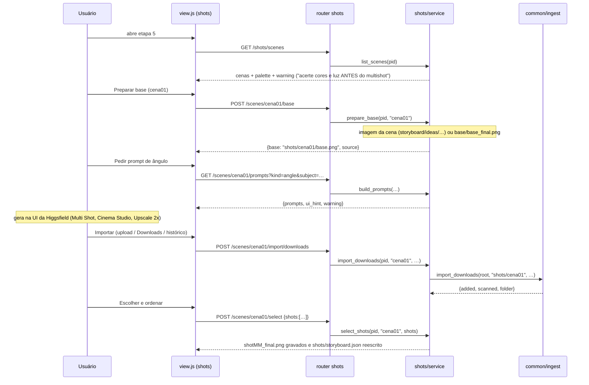
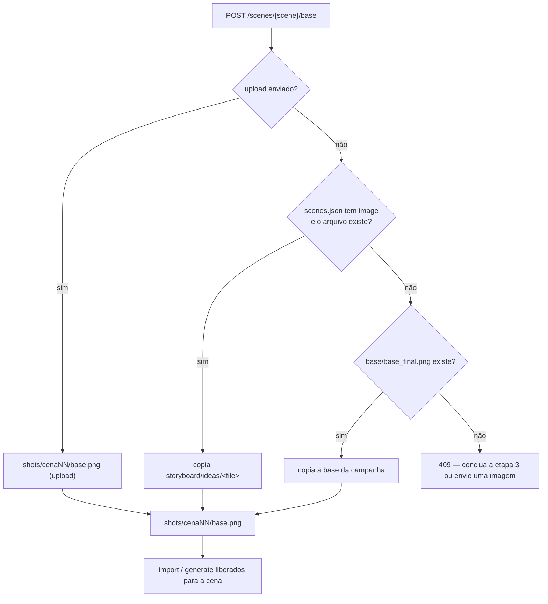
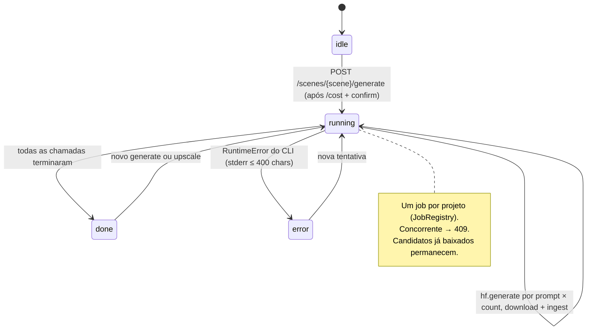
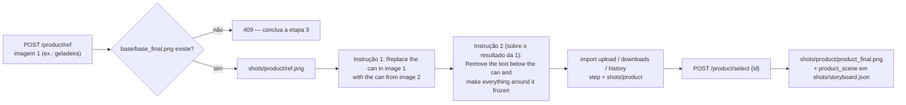

# Diagramas — shots (Etapa 5 · Ângulos por cena · aula 011 + cena do produto · aula 013)

Fonte: `docs/domains/shots/features/shots-fdd.md` §4. Atualizar junto com o FDD quando o fluxo mudar.

## 1. Fluxo principal por cena (modo UI + importar)

## 2. Origem da base de cada cena

## 3. Modo CLI (opcional, gasta créditos) — estados do job

## 4. Cena extra do produto (aula 013)

