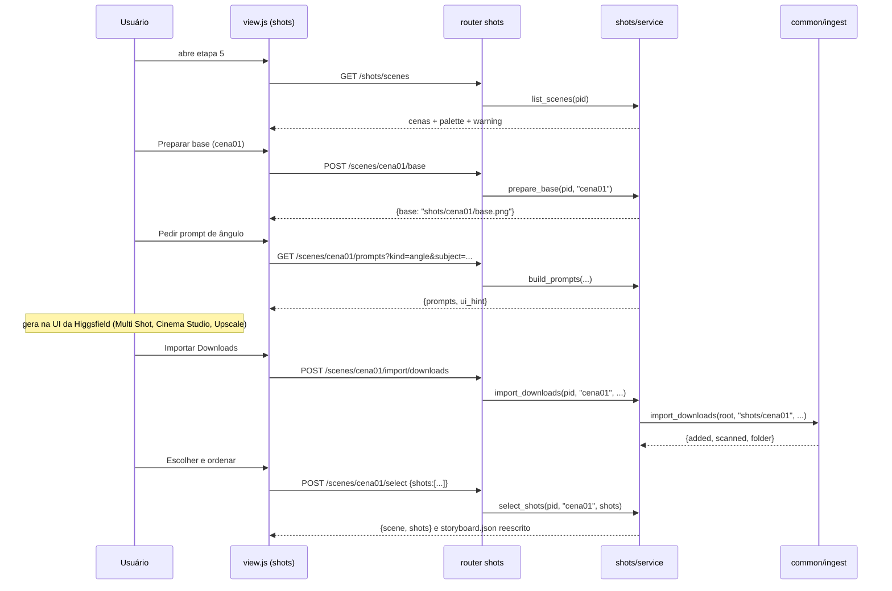

### FDD: shots (Etapa 5 · Ângulos por cena · aula 011 + cena extra do produto · aula 013)

Versão: 0.1.0
Data: 2026-08-25
Responsável: frente OS-005 da Wave 1 (`/dd-parallel`, modo batch; aprovação em lote na W5)

Fontes: `docs/domains/studio/waves/wave-1.md` (bloco "Feature: shots"), `docs/domains/studio/waves/wave-1-api-transversal.md`, `docs/domains/studio/recon-wave-1.md`, `CLAUDE.md`. Nenhum código foi reexplorado além disso.

---

### 1. Contexto e motivação técnica

A etapa 5 do curso (aula 011) recebe as cenas roteirizadas da etapa 4 e produz, para cada cena, vários ângulos consistentes da mesma imagem: imagem base da cena, prompt "me traga outro ponto de vista desta imagem, quero um close em …" (Multi Shot), escolher, upscale, salvar em `cena N`, ordenar os prints no storyboard. A aula 013 acrescenta uma cena final que mostra o produto ("troque a lata da imagem 1 pela da imagem 2"; "retire o texto abaixo da lata e faça com que tudo ao redor dela esteja congelado"). O Studio hoje lista a etapa como `soon` em `studio/steps.py` (n=5); não há plugin, serviço nem artefato.

Encaixe no HLD `studio`: plugin `studio/etapas/shots/` (META, router, view) + serviço puro `studio/shots/service.py`; persistência em `projects/<pid>/shots/` (ADR-003); jobs em thread com `studio/common/jobs.JobRegistry` (ADR-006); Higgsfield somente via CLI, com "modo UI + importar" como caminho principal (ADR-002); importação de mídia via `studio/common/ingest.py` (API transversal da wave). Atores: o aluno operando o Studio local; o CLI da Higgsfield (opcional, pago); a UI da Higgsfield (fora do Studio, ilimitada).

**Provides** (copiado de wave-1.md)
- `shots/storyboard.json`: `{"scenes":[{"id":"cena01","base":"shots/cena01/base.png","shots":[{"id":"shot01","file":"shots/cena01/shot01_final.png","order":1,"prompt":"…"}]}], "product_scene": {...}|null}`
- `shots/cenaNN/*.png`: frames escolhidos e upscalados por cena

**Consumes** (copiado de wave-1.md)
- `storyboard/scenes.json` (de storyboard): `{"scenes":[{"id":"cena01","n":1,"text":"…","image":"storyboard/ideas/<file>|null"}]}`
- `base/base_final.png` (de base)
- `mood/palette.json` (de mood, consistência de cor): `{colors:[#hex ×≤6], note}`

Limites: a etapa não edita `scenes.json` (etapa 4), não anima (etapa 6) e não implementa shotlist com gramática de cinema, character sheet, color match ou hook (itens [INFERÊNCIA] vetados pelo ADR-004).

Suposições e restrições:
- Arquivos únicos da wave (`app.py`, `steps.py`, `higgsfield.py`, `common/*`, `conftest.py`, `requirements*.txt`) não são editados por esta frente.
- Prompts de geração em inglês; rótulos, avisos e UI em pt-BR (CLAUDE.md, aula 007).
- IDs de modelo não ficam fixos no código como verdade: são defaults substituíveis pelo corpo da requisição (ADR-002). Defaults: `nano_banana_2` para ângulos, edições e cena do produto; `bytedance_image_upscale` para upscale. `[auto-aceito: IDs vindos do plano-higgsfield e do bloco shots da wave; catálogo vivo não pôde ser consultado (CLI sem login)]`

---

### 2. Objetivos técnicos

- Para toda cena de `scenes.json` existe a operação "preparar base" que materializa `shots/cenaNN/base.png` (cópia da imagem da cena, ou de `base/base_final.png` quando `image` é null); invariante: base existe antes de qualquer prompt/import da cena.
- Os prompts entregues são determinísticos para os mesmos parâmetros e reproduzem as fórmulas da aula: ângulo ("Bring me another point of view of this image. I want a close-up on {subject}."), edição numerada ("1. … 2. … keep everything else identical, realistic") e bloco de câmera opcional ("shot on RED Komodo 6K, {lens}mm, f/{aperture}, {scale} shot, {angle} angle").
- A seleção grava `shots/cenaNN/shotMM_final.png` na ordem informada (MM = ordem, 2 dígitos) e reescreve `shots/storyboard.json`; invariante: `order` é 1..N contíguo por cena e todo `file` referenciado existe no disco.
- `storyboard.json` é lido por `animate` sem adaptação (schema da wave); campos extras são opcionais e nunca removem os obrigatórios `id, base, shots[].id, shots[].file, shots[].order, shots[].prompt`, `product_scene`.
- Um job de CLI por projeto por vez (`JobRegistry`); tentativa concorrente responde 409.
- Todo o fluxo "modo UI + importar" funciona com CLI ausente (`hf.available() == False`).
- Aviso "acerte cores e luz ANTES do multishot" e paleta são devolvidos em toda listagem de cenas e exibidos antes do botão de geração.

---

### 3. Escopo e exclusões

**Incluído**
- Plugin `studio/etapas/shots/` (`META n=5, aula 011`), rotas sob `/api/projects/{pid}/shots/...`.
- Serviço `studio/shots/service.py`: leitura de `scenes.json`, preparo da base por cena, geração de prompts (ângulo, edição numerada, bloco de câmera, produto), importação por cena (upload, Downloads, histórico), listagem de candidatos, custo e geração por CLI (job), upscale por CLI (job), seleção e ordenação, cena do produto, escrita de `storyboard.json`.
- View: lista de cenas com status, paleta e aviso de cores/luz, painel por cena (base, prompts com copiar, importar, galeria de candidatos, escolher/ordenar, marcar "já upscalado"), painel da cena do produto.
- Testes `tests/test_shots_service.py` e `tests/test_shots_api.py` com fixtures locais dos artefatos consumidos.

**Excluído**
- Shotlist com gramática de cinema, character sheet/Soul ID, color match, hook 3 s, end card ([INFERÊNCIA]; só como `[extensão]` aprovada).
- Animação dos frames (etapa 6), montagem (etapa 8).
- Edição de `storyboard/scenes.json` ou de `base/base_final.png`.
- Automação da UI da Higgsfield; chamadas a `api.higgsfield.ai` (ADR-002).
- Upscale local por Pillow (não é o que a aula faz; ficaria como extensão). `[auto-aceito: sem upscale local; upscale é na UI (importado) ou `bytedance_image_upscale` via CLI]`

---

### 4. Fluxos detalhados e diagramas

**Fluxo principal (por cena, aula 011)**
1. UI carrega `GET .../shots/scenes`: cenas de `scenes.json` com status (`base_ready`, `candidates`, `selected`), paleta de `mood/palette.json` e `warning` "Acerte cores e luz ANTES do multishot" (texto fixo da aula). Se `scenes.json` não existe: 409 com orientação "conclua a etapa 4".
2. Usuário abre a cena e clica "Preparar base": `POST .../scenes/{scene}/base` copia `storyboard/ideas/<file>` (ou `base/base_final.png` quando `image` é null; ou o upload enviado) para `shots/cenaNN/base.png`. Idempotente.
3. Usuário pede o prompt: `GET .../scenes/{scene}/prompts?kind=angle&subject=the astronaut&scale=close&realism=true&lens=35&aperture=2.8&angle=eye-level`. Resposta traz `ui_hint` ("Na Higgsfield: abra a imagem base da cena, use Multi Shot com este prompt; para realismo use o Cinema Studio ou o bloco de câmera") e os prompts. Para `kind=edit`, o corpo das instruções vem em `edits` (lista) e o serviço numera e fecha com "keep everything else identical, realistic".
4. Modo UI (padrão): usuário gera na Higgsfield e importa: `POST .../scenes/{scene}/import/upload` (multipart), `.../import/downloads` ou `.../import/history`. Cada import usa `ingest_bytes`/`import_*` da API transversal com `step = "shots/cenaNN"`. `[auto-aceito: step com subpasta ("shots/cena01") para reaproveitar as três funções de import sem meta; se ingest recusar subpasta, a frente itera `ingest_bytes` com `meta={"scene"}`, sem mudar o contrato HTTP]`
5. Modo CLI (opcional): `POST .../scenes/{scene}/cost` e depois `POST .../scenes/{scene}/generate` (`{model, prompts[], count}`) inicia job que chama `hf.generate(model, {"image_references":[base.png], "prompt": p})` `count` vezes por prompt, baixa cada URL (`hf.download`) e ingere como candidato com `meta={"job_id","model"}`; JSON bruto vai para `projects/<pid>/jobs/shots_<jobid>.json`. UI faz polling em `GET .../shots/job` a cada 3 s.
6. Usuário escolhe o(s) candidato(s). Upscale: na UI (Upscale 2x High Fidelity, importa o resultado e marca `upscaled: true` na seleção) ou `POST .../scenes/{scene}/upscale {id}` (job CLI `bytedance_image_upscale --image-references <candidato>`; resultado vira novo candidato com `meta={"role":"upscale","parent":id}` e `upscaled: true`).
7. Ordenar e salvar: `POST .../scenes/{scene}/select {"shots":[{"id":"<cand>","upscaled":true}, …]}`. Ordem = posição na lista. Serviço copia cada candidato para `shots/cenaNN/shotMM_final.png` (MM = ordem), apaga `shotMM_final.png` anteriores da cena, marca `selected` em `candidates.json` e reescreve `shots/storyboard.json` (todas as cenas, preservando as demais).
8. Repete 2..7 para cada cena. `GET .../shots/storyboard` devolve o arquivo final para conferência (é o que `animate` lê).

**Fluxo da cena extra do produto (aula 013)**
1. `POST .../shots/product/ref` (multipart, 1 imagem): a "imagem 1" (ex.: mulher pegando lata na geladeira) vai para `shots/product/ref.png`. A "imagem 2" é sempre `base/base_final.png` (a lata com o rótulo próprio); 409 se não existir.
2. `GET .../shots/product/prompts` devolve as duas instruções da aula, uma por rodada: (1) "Replace the can in image 1 with the can from image 2. Keep everything else identical, realistic."; (2) "Remove the text below the can and make everything around it frozen. Keep everything else identical, realistic." e `ui_hint` (Nano Banana com as duas imagens como referência; segunda instrução sobre o resultado da primeira).
3. Import (`.../product/import/{upload,downloads,history}`) ou CLI (`POST .../product/generate {model, prompt, count, image_references?}`: por padrão `[ref.png, base/base_final.png]`; para a rodada 2 a UI envia `image_references: ["<candidato da rodada 1>"]`).
4. `POST .../product/select {"id": "<cand>", "upscaled": bool}` grava `shots/product/product_final.png` e `product_scene` em `storyboard.json`:
   `{"id":"product","base":"shots/product/ref.png","shots":[{"id":"shot01","file":"shots/product/product_final.png","order":1,"prompt":"…"}]}`. `[auto-aceito: product_scene com o mesmo shape de uma cena, id "product", para animate tratar como cena comum; wave só diz `{...}|null`]`

**Fluxos alternativos e exceções**
- Cena sem imagem em `scenes.json` e sem `base/base_final.png`: `POST .../base` responde 409 "Cena sem imagem: conclua a etapa 3 ou envie uma imagem".
- Import sem novidades (duplicado por sha): `{"added": 0}`; UI mostra toast.
- CLI ausente ou não logado: rotas `cost`, `generate`, `upscale` respondem 409 "CLI da Higgsfield não instalado"/"não autenticado"; UI mantém botões desabilitados e mostra o caminho "gere na UI e importe".
- Job já em execução para o projeto: 409 (RuntimeError do registry).
- `hf.generate` lança RuntimeError (stderr ≤ 400 chars): job vai para `state=error` com a mensagem no `log`; candidatos já baixados permanecem.
- `select` com id inexistente ou de outra cena: 422; lista vazia: limpa a cena (remove `shotMM_final.png` e deixa `shots: []`).
- Re-seleção: arquivos `_final` anteriores são removidos antes de gravar os novos; `storyboard.json` reescrito por inteiro a partir do estado em disco (fonte de verdade: `candidates.json` de cada cena + ordem salva em `shots/cenaNN/selection.json`). `[auto-aceito: `selection.json` por cena guarda ordem e flag upscaled para reconstruir `storyboard.json` de forma idempotente]`

**Diagramas**
- Sequência (modo UI, uma cena):



- Estados do job por projeto: `idle -> running -> done | error` (padrão `JobRegistry`).

---

### 5. Contratos públicos (assinaturas, endpoints, headers, exemplos)

Prefixo de todas as rotas: `/api/projects/{pid}/shots`. `pid` inválido ou inexistente: 404 pelo núcleo. Content-Type `application/json` salvo onde indicado multipart. Sem versionamento de rota (monólito local, ADR-001); mudanças incompatíveis passam por FDD novo.

**Listar cenas com status**
- Tipo: endpoint
- Assinatura/Rota: `GET /api/projects/{pid}/shots/scenes`
- Método: GET
- Semântica de status:
  - 200: lista de cenas de `storyboard/scenes.json` enriquecida
  - 409: `storyboard/scenes.json` ausente (etapa 4 não concluída)

Exemplo de resposta
```json
{
  "warning": "Acerte cores e luz ANTES do multishot: as variações herdam o que a base tiver.",
  "palette": {"colors": ["#0b1d3a", "#39ff14"], "note": "neon na neve"},
  "base_final": "base/base_final.png",
  "scenes": [
    {"id": "cena01", "n": 1, "text": "close no astronauta andando na nevasca", "image": "storyboard/ideas/a1b2c3d4e5f6.png",
     "base": "shots/cena01/base.png", "base_ready": true, "candidates": 4, "selected": 2}
  ],
  "product_scene": {"ref_ready": false, "selected": false}
}
```

**Preparar base da cena**
- Tipo: endpoint
- Assinatura/Rota: `POST /api/projects/{pid}/shots/scenes/{scene}/base`
- Método: POST (JSON `{"source": "storyboard"|"base"}`, default `storyboard`; ou multipart `file` para enviar outra imagem)
- Semântica de status:
  - 200: `{"scene": "cena01", "base": "shots/cena01/base.png", "source": "storyboard"}`
  - 404: `scene` não está em `scenes.json`
  - 409: nenhuma imagem disponível para a cena
  - 413: upload acima de 25 MB
  - 422: extensão não aceita (fora de png/jpg/jpeg/webp)

**Prompts da cena**
- Tipo: endpoint
- Assinatura/Rota: `GET /api/projects/{pid}/shots/scenes/{scene}/prompts`
- Método: GET
- Query: `kind=angle|edit` (default `angle`); `subject` (default: `project.product`); `scale=close|medium|wide` (default `close`); `realism=true|false` (default `true`); `lens` (default 35); `aperture` (default 2.8); `angle=eye-level|low|high` (default `eye-level`); `edits` (repetível; obrigatório quando `kind=edit`); `model` (default `nano_banana_2`); `count` (default 4)
- Semântica de status:
  - 200: prompts prontos para copiar (UI) ou enviar a `generate`
  - 404: cena desconhecida
  - 422: `kind=edit` sem `edits`

Exemplo de resposta (`kind=angle`)
```json
{
  "model": "nano_banana_2",
  "aspect_ratio": "16:9",
  "count": 4,
  "ui_hint": "Na Higgsfield: abra shots/cena01/base.png, use Multi Shot com este prompt. Para realismo use o Cinema Studio (câmera, lente, abertura) ou mantenha o bloco de câmera do prompt.",
  "warning": "Acerte cores e luz ANTES do multishot.",
  "prompts": [
    {"label": "Outro ponto de vista (aula 011: 'me traga um outro ponto de vista desta imagem, quero um close no astronauta')",
     "text": "Bring me another point of view of this image. I want a close-up on the astronaut. Same scene, same lighting and colors. Shot on RED Komodo 6K, 35mm, f/2.8, close shot, eye-level angle. Realistic."}
  ]
}
```

Exemplo de resposta (`kind=edit&edits=Make the helmet visor tinted so the face cannot be seen&edits=Remove the can in the background&edits=Make him walking through the blizzard`)
```json
{
  "model": "nano_banana_2",
  "count": 1,
  "ui_hint": "Uma rodada de edição por vez; se precisar de mais, gere de novo sobre o resultado.",
  "prompts": [
    {"label": "Edição numerada (aula 011: 'Quero as seguintes modificações. 1. … 2. … 3. …')",
     "text": "I want the following modifications. 1. Make the helmet visor tinted so the face cannot be seen. 2. Remove the can in the background. 3. Make him walking through the blizzard. Keep everything else identical, realistic."}
  ]
}
```

**Importar candidatos da cena**
- Tipo: endpoint (três rotas, mesmo padrão da etapa 2)
- Assinatura/Rota:
  - `POST /api/projects/{pid}/shots/scenes/{scene}/import/upload` (multipart `files[]`, campo `prompt` opcional)
  - `POST /api/projects/{pid}/shots/scenes/{scene}/import/downloads` (JSON `{"folder": null, "since_minutes": 120}`)
  - `POST /api/projects/{pid}/shots/scenes/{scene}/import/history` (JSON `{"size": 50, "prompt_filter": null}`)
- Semântica de status:
  - 200: `{"added": n}` / `{"added", "scanned", "folder"}` / `{"added", "jobs"}`
  - 404: cena desconhecida; pasta de Downloads inexistente
  - 409: base da cena não preparada; CLI ausente (history)
  - 413: upload acima de 25 MB
  - 502: falha do CLI em `history`

**Listar candidatos da cena**
- Tipo: endpoint
- Assinatura/Rota: `GET /api/projects/{pid}/shots/scenes/{scene}/candidates`
- Método: GET
- 200: `{"scene": "cena01", "base": "shots/cena01/base.png", "candidates": [Candidate]}` com `Candidate = {id, kind:"image", source, name, prompt, file, thumb, width, height, selected, imported, order?, upscaled?, role?, parent?, job_id?, model?}` (campos do `ingest_bytes` + meta desta etapa). `file`/`thumb` relativos à raiz do projeto, servidos por `/files/{pid}/...`.

**Custo e geração por CLI**
- Tipo: endpoint
- Assinatura/Rota: `POST /api/projects/{pid}/shots/scenes/{scene}/cost` e `POST /api/projects/{pid}/shots/scenes/{scene}/generate`
- Método: POST, corpo `{"model": "nano_banana_2", "prompts": ["…"], "count": 4, "resolution": "2k"}`
- Semântica de status:
  - 200 (`cost`): `{"per_prompt": 12, "total": 48, "raw": {...}}` (`credits: null` quando o CLI não informa)
  - 200 (`generate`): job `{"state": "running", "done": 0, "total": 4, "added": 0, "log": []}`
  - 409: CLI ausente/não logado; job já em execução; base não preparada
  - 422: `prompts` vazio, `count` fora de 1..8
- Limites: `count ≤ 8` por chamada; timeout por geração 600 s (`hf.generate`); imagens baixadas via `hf.download` para `ingest_bytes`.

**Status do job**
- Tipo: endpoint
- Assinatura/Rota: `GET /api/projects/{pid}/shots/job`
- 200: `registry.status(pid)` → `{"state": "idle|running|done|error", "done", "total", "added", "error", "log": [], "scene", "op": "generate|upscale"}`

**Upscale por CLI**
- Tipo: endpoint
- Assinatura/Rota: `POST /api/projects/{pid}/shots/scenes/{scene}/upscale`
- Método: POST, corpo `{"id": "<candidato>", "model": "bytedance_image_upscale"}`
- 200: job (total 1); resultado ingerido como candidato com `role: "upscale"`, `parent: id`, `upscaled: true`
- 404: candidato inexistente na cena; 409: CLI ausente/job em execução

**Selecionar e ordenar shots da cena**
- Tipo: endpoint
- Assinatura/Rota: `POST /api/projects/{pid}/shots/scenes/{scene}/select`
- Método: POST

Exemplo de requisição
```json
{"shots": [{"id": "9f3c1a77be02", "upscaled": true}, {"id": "0d1e2f3a4b5c", "upscaled": false}]}
```

Exemplo de resposta
```json
{
  "scene": "cena01",
  "base": "shots/cena01/base.png",
  "shots": [
    {"id": "shot01", "file": "shots/cena01/shot01_final.png", "order": 1, "prompt": "Bring me another point of view…", "candidate": "9f3c1a77be02", "upscaled": true},
    {"id": "shot02", "file": "shots/cena01/shot02_final.png", "order": 2, "prompt": "I want the following modifications…", "candidate": "0d1e2f3a4b5c", "upscaled": false}
  ],
  "storyboard": "shots/storyboard.json"
}
```
- Semântica de status: 200 gravado; 404 cena desconhecida; 422 id inexistente/duplicado. Lista vazia limpa a cena.

**Cena do produto (aula 013)**
- Tipo: endpoint (grupo)
- Assinatura/Rota:
  - `POST /api/projects/{pid}/shots/product/ref` (multipart `file`): grava `shots/product/ref.png`; 409 se `base/base_final.png` não existir; 413/422 como no upload
  - `GET /api/projects/{pid}/shots/product/prompts`: `{"model", "image_references": ["shots/product/ref.png", "base/base_final.png"], "ui_hint", "prompts": [{"label": "1. Trocar a lata (aula 013: 'troque a lata da imagem 1 pela da imagem 2')", "text": "Replace the can in image 1 with the can from image 2. Keep everything else identical, realistic."}, {"label": "2. Congelar tudo ao redor (aula 013: 'retire o texto abaixo da lata e faça com que tudo ao redor dela esteja congelado')", "text": "Remove the text below the can and make everything around it frozen. Keep everything else identical, realistic."}]}`; 409 sem `ref.png`
  - `POST .../product/import/{upload|downloads|history}`: mesmos corpos e status das rotas por cena, `step = "shots/product"`
  - `GET .../product/candidates`: `{"ref": "shots/product/ref.png", "candidates": [Candidate]}`
  - `POST .../product/cost` e `POST .../product/generate`: corpo `{"model", "prompt", "count": 1, "image_references": null}` (null = `[ref.png, base_final.png]`; rodada 2 envia o candidato da rodada 1)
  - `POST .../product/select` corpo `{"id": "<cand>", "upscaled": false}` → 200 `{"product_scene": {...}}`; `{"id": null}` remove a cena do produto (`product_scene: null`)

**Storyboard final da etapa**
- Tipo: endpoint
- Assinatura/Rota: `GET /api/projects/{pid}/shots/storyboard`
- 200: conteúdo de `shots/storyboard.json`; 404 quando nenhuma seleção foi feita ainda

Exemplo de resposta
```json
{
  "scenes": [
    {"id": "cena01", "base": "shots/cena01/base.png",
     "shots": [{"id": "shot01", "file": "shots/cena01/shot01_final.png", "order": 1, "prompt": "Bring me another point of view of this image…", "upscaled": true}]},
    {"id": "cena02", "base": "shots/cena02/base.png", "shots": []}
  ],
  "product_scene": {"id": "product", "base": "shots/product/ref.png",
    "shots": [{"id": "shot01", "file": "shots/product/product_final.png", "order": 1, "prompt": "Remove the text below the can and make everything around it frozen…"}]}
}
```
Toda cena de `scenes.json` aparece (mesmo sem shots), na ordem de `n`. `[auto-aceito: cenas sem seleção aparecem com `shots: []` para animate saber o que falta, sem quebrar o schema]`

**Pasta de Downloads**
- Tipo: endpoint
- Assinatura/Rota: `GET /api/shots/downloads-folder` → `{"folder": "/mnt/c/Users/x/Downloads", "exists": true}` (usa `ingest.DOWNLOADS_DEFAULT`)

**Assinaturas do serviço (`studio/shots/service.py`)**
```python
SCENE_RE = r"^cena\d{2}$"; STEP = "shots"; DEFAULT_MODEL = "nano_banana_2"; UPSCALE_MODEL = "bytedance_image_upscale"
WARNING_COLORS = "Acerte cores e luz ANTES do multishot: as variações herdam o que a base tiver."
registry = JobRegistry()
load_scenes(pid) -> list[dict]                       # lê storyboard/scenes.json; FileNotFoundError se ausente
list_scenes(pid) -> dict                             # scenes + palette + warning + product_scene status
prepare_base(pid, scene, source="storyboard", data: bytes | None = None, name="") -> dict
build_prompts(pid, scene, kind="angle", subject=None, scale="close", realism=True, lens=35, aperture=2.8,
              angle="eye-level", edits=None, model=DEFAULT_MODEL, count=4) -> dict
product_prompts(pid, model=DEFAULT_MODEL) -> dict
import_upload(pid, scene, files, prompt="") / import_downloads(pid, scene, folder=None, since_minutes=120) / import_history(pid, scene, size=50, prompt_filter=None)
list_candidates(pid, scene) -> dict
cost(pid, scene, model, prompts, count, resolution=None) -> dict
start_generate(pid, scene, model, prompts, count, resolution=None, image_references=None) -> dict   # RuntimeError se job ativo
start_upscale(pid, scene, cand_id, model=UPSCALE_MODEL) -> dict
job_status(pid) -> dict
select_shots(pid, scene, shots: list[dict]) -> dict  # grava _final, selection.json e storyboard.json
set_product_ref(pid, data, name) -> dict; select_product(pid, cand_id, upscaled=False) -> dict
write_storyboard(pid) -> dict                       # reconstrói shots/storyboard.json a partir do disco
load_storyboard(pid) -> dict                         # FileNotFoundError se ausente
```
`scene` aceita `cena01..cena99` e o literal `product` nas funções compartilhadas (import/candidates/cost/generate/upscale); `product` mapeia para `step = "shots/product"`.

---

### 6. Erros, exceções e fallback

**Matriz de erros**

| Condição | Tratamento | Notas |
| --- | --- | --- |
| `pid` inválido/inexistente | `KeyError` de `project_dir` → 404 (núcleo) | sem código próprio |
| `storyboard/scenes.json` ausente | `FileNotFoundError` → 409 "Conclua a etapa 4 (storyboard)" | `list_scenes`, `prepare_base` |
| `scene` fora de `scenes.json` ou fora do regex | `LookupError` → 404 / `ValueError` → 422 | regex evita path traversal |
| Cena sem imagem e sem `base/base_final.png` | `FileNotFoundError` → 409 "Cena sem imagem" | UI oferece upload de base |
| Base da cena não preparada em import/generate | `RuntimeError` → 409 "Prepare a base da cena" | garante `base.png` antes do multishot |
| Upload > 25 MB | 413 | `MAX_UPLOAD_BYTES` do padrão mood |
| Extensão fora de `MEDIA_EXT["image"]` | `ValueError` → 422 | `ingest_bytes` devolve None → contado como não adicionado |
| Duplicado por sha12 | `added` não incrementa | comportamento do `ingest_bytes` |
| CLI ausente / não logado | `HTTPException(409)` em cost/generate/upscale/history | `hf.available()`, `hf.status()["logged_in"]` |
| Job concorrente no projeto | `RuntimeError` do registry → 409 | um job por projeto por serviço (ADR-006) |
| `hf.generate` falha (RuntimeError) | job `state=error`, `error` = stderr ≤ 400 chars, `log` mantém progresso | candidatos já baixados ficam |
| `hf.generate` sem URLs (`urls == []`) | job registra "sem imagem retornada" no log e segue | `raw` salvo em `jobs/shots_<jobid>.json` |
| Falha de download da URL (expirada) | tenta 2 vezes com 2 s; depois log e segue | links expiram (recon) |
| `select` com id inexistente/duplicado/de outra cena | `ValueError` → 422 | valida antes de tocar no disco |
| `product/ref` sem `base/base_final.png` | 409 "Conclua a etapa 3 (base)" | imagem 2 da aula é a lata própria |
| `shots/storyboard.json` ausente em GET | 404 | nada selecionado ainda |

**Estratégias de resiliência**
- Timeouts: `hf.generate(timeout_s=600)` por chamada; job serial, `total = len(prompts) * count`.
- Retries: só no download de URL (2 tentativas). Sem retry de geração (gasta crédito).
- Sem backoff/circuit breaker: ferramenta local, single-process (ADR-001/006).

**Política de fallback**
- Sem CLI: todo o fluxo por "modo UI + importar" (upload/Downloads/histórico) permanece funcional; é o caminho principal, não o fallback.
- Cena sem imagem de ideação: base da campanha (`base/base_final.png`) vira base da cena.
- Upscale indisponível: seleção aceita `upscaled: false` e `storyboard.json` registra; animate não depende do flag.

**Invariantes**
- `shots/cenaNN/base.png` existe antes de qualquer candidato da cena.
- `storyboard.json` é reconstruído por inteiro a cada `select`/`select_product` a partir do disco (`selection.json` + `candidates.json` por cena); nunca editado parcialmente.
- `order` contíguo 1..N por cena; `file` sempre existe; `shotMM_final.png` órfãos são removidos na re-seleção.
- Nada fora de `projects/<pid>/shots/` é escrito por esta etapa (exceto `projects/<pid>/jobs/shots_*.json`).
- Prompts nunca vão à Higgsfield sem passar pela UI (modo UI) ou por `generate` com `cost` disponível antes.

---

### 7. Observabilidade

**Métricas**
- Não há backend de métricas (ferramenta local). Contadores expostos pelo próprio estado: `candidates`/`selected` por cena em `GET .../scenes`; `done/total/added` no job.

**Logs**
- Logger `studio.shots` (formato do núcleo: nível, módulo, mensagem). Campos por linha: `pid`, `scene`, `op` (`prepare_base|import_upload|import_downloads|import_history|generate|upscale|select|product_select`), `added`/`count`, `model` quando CLI.
- `job["log"]` recebe uma linha por prompt/iteração ("cena01 prompt 1/2 imagem 3/4: <id>") e a mensagem de erro em falha.
- JSON bruto de cada chamada ao CLI em `projects/<pid>/jobs/shots_<jobid>.json`.
- Nunca logar conteúdo de imagem nem caminhos fora do projeto; o prompt é logado truncado a 120 chars.

**Tracing**
- Não aplicável (single-process, sem spans). O `job_id` do CLI é o identificador de correlação entre `log`, `candidates.json` (`job_id`) e `jobs/shots_<jobid>.json`.

**Dashboards e alertas**
- Painel mínimo é a própria view: chip de status do CLI, barra `progress` do job, `log` do job, contadores por cena e aviso de cores/luz.

---

### 8. Dependências e compatibilidade

| Componente | Versão mínima | Observações |
| --- | --- | --- |
| Python | 3.12 | `.venv` por worktree |
| FastAPI / Pydantic | 0.141 / 2.13 | modelos de request no `router.py` |
| Pillow | 12.3 | thumbs via `ingest_bytes`; sem processamento próprio |
| `studio/common/ingest.py` | wave 1 | `ingest_bytes`, `import_upload/downloads/history`, `load/save_candidates`; usado com `step="shots/cenaNN"` e `"shots/product"` |
| `studio/common/jobs.py` | wave 1 | `JobRegistry` único do módulo |
| `studio/higgsfield.py` | wave 1 (estendido) | `available`, `status`, `cost`, `generate`, `download`, `history_media` |
| CLI Higgsfield | 1.1.23 | opcional; só para cost/generate/upscale/history |
| storyboard (etapa 4) | wave 1 | `storyboard/scenes.json` no schema da wave |
| base (etapa 3) | wave 1 | `base/base_final.png` |
| mood (etapa 2) | 0.3.0 | `mood/palette.json` (só leitura; ausência não bloqueia, paleta vazia) |

**Garantias de compatibilidade**
- `shots/storyboard.json` respeita o schema publicado em `wave-1.md`; campos extras (`upscaled`, `candidate`) são opcionais e ignoráveis por `animate`, `edit` e `export`.
- Não altera nenhum arquivo único da wave nem plugins de outras etapas; `META = {"id": "shots", "n": 5, "title": "Ângulos por cena", "aula": "011", "desc": ...}` bate com `SOON`.
- Rotas novas apenas sob `/api/projects/{pid}/shots/...` e `/api/shots/downloads-folder`; nenhum contrato existente muda.

---

### 9. Critérios de aceite técnicos

- `GET /api/steps` lista `shots` com `status: ready`, `n: 5`, `aula: 011`; `GET /steps/shots/view.html` e `view.js` respondem 200 (validação dinâmica de `tests/test_steps_and_config.py`).
- Com fixture `storyboard/scenes.json` de 5 cenas (2 com `image` apontando para PNG gerado por `make_image`, 3 com `null`) e `base/base_final.png`: `prepare_base` cria `shots/cenaNN/base.png` para as 5 (2 da ideação, 3 da base); sem `base_final.png` as 3 respondem 409.
- `build_prompts(kind="angle", subject="the astronaut", scale="close", realism=True)` contém "Bring me another point of view of this image", "close-up on the astronaut" e "Shot on RED Komodo 6K, 35mm, f/2.8, close shot, eye-level angle"; com `realism=False` o bloco de câmera não aparece.
- `build_prompts(kind="edit", edits=[a, b, c])` devolve um único prompt com "1. a 2. b 3. c" e termina com "Keep everything else identical, realistic."; sem `edits` → 422 na API.
- `GET .../scenes` devolve `warning` com "ANTES do multishot" e `palette.colors` igual a `mood/palette.json`; sem `palette.json` devolve `colors: []` e 200.
- Import por upload de 2 PNGs distintos em `cena01` → `added: 2`, arquivos em `shots/cena01/candidates/`, thumbs em `candidates/thumbs/`; reenviar os mesmos → `added: 0`; import antes de `prepare_base` → 409.
- `select_shots("cena01", [b, a])` grava `shot01_final.png` (= b) e `shot02_final.png` (= a), `storyboard.json` com `order` 1 e 2 e `prompt` do candidato; nova seleção `[a]` remove `shot02_final.png`; id inexistente → 422.
- Cena do produto: `product/ref` sem `base_final.png` → 409; com ela, `product/prompts` devolve as duas instruções da aula 013 na ordem (troca da lata; congelar ao redor); `product/select` grava `shots/product/product_final.png` e `product_scene` no schema; `{"id": null}` volta a `null`.
- `generate` com `hf.generate` fakeado devolvendo 4 URLs e `hf.download` fakeado: job termina `done`, `added == 4`, candidatos com `job_id`/`model`; `hf.generate` lançando RuntimeError → `state == error` com mensagem; segunda chamada durante job ativo (gate com `threading.Event`) → 409; CLI ausente → 409 sem iniciar job.
- `upscale` fakeado gera candidato com `role: "upscale"`, `parent` igual ao id de origem e `upscaled: true`.
- `[cross-feature]` consome `storyboard/scenes.json` real produzido pela frente storyboard (W5) e produz `shots/storyboard.json` que a frente animate lê sem adaptação: toda cena presente na ordem de `n`, `shots[].file` existentes no disco, `product_scene` no shape de cena ou `null`.
- Testes rodam sem rede e sem CLI (`hf` fakeado via monkeypatch); `ruff check studio tests` limpo; `make verify` verde.

---

### 10. Riscos e mitigação

### `ingest` não aceitar `step` com subpasta (`"shots/cena01"`)

- **Probabilidade:** média
- **Impacto:** import por cena precisa de outro mecanismo de separação
- **Mitigação:**
    - Primeiro teste da frente valida `ingest_bytes(root, "shots/cena01", ...)` em `tmp_path`
    - Plano B já desenhado: `step="shots"` único + `meta={"scene"}` e filtro em `list_candidates`; contrato HTTP não muda
- **Plano de contingência:** iterar `ingest_bytes` manualmente para upload/downloads/history lendo pastas e `history_media`, sem tocar em `common/ingest.py`

### IDs de modelo (`nano_banana_2`, `bytedance_image_upscale`) não confirmados no catálogo vivo

- **Probabilidade:** média
- **Impacto:** `cost`/`generate` falham com CLI logado
- **Mitigação:**
    - Modelo sempre vem do corpo da requisição; defaults são só sugestão na UI (campo editável)
    - Erro do CLI aparece no `log` do job e no toast, com orientação para o modo UI
- **Plano de contingência:** modo UI + importar cobre 100% do que a aula faz

### Divergência de schema com `animate` (consumidora) ou `storyboard` (produtora)

- **Probabilidade:** baixa
- **Impacto:** integração em série quebra na W5
- **Mitigação:**
    - Schemas copiados literalmente da `wave-1.md`; campos extras são opcionais
    - Teste de contrato em `test_shots_service.py` valida chaves obrigatórias de `storyboard.json` e leitura de um `scenes.json` fixture idêntico ao exemplo da wave
- **Plano de contingência:** ajuste no orquestrador (tarefa transversal), nunca na frente isolada

### Geração serial longa (N prompts × count, 600 s cada)

- **Probabilidade:** média
- **Impacto:** UI presa em polling por muito tempo; usuário gasta créditos sem perceber
- **Mitigação:**
    - `count ≤ 8` e `cost` obrigatório na UI com `confirm()` antes de `generate`
    - Log por imagem e `done/total` visíveis; candidatos aparecem conforme baixados
- **Plano de contingência:** usuário gera na UI (ilimitado) e importa

### Perda de fidelidade (inventar gramática de shots)

- **Probabilidade:** baixa
- **Impacto:** viola ADR-004 e o gate do CLAUDE.md
- **Mitigação:**
    - Escopo fechado nas fórmulas da aula 011/013; parâmetros de câmera são só o bloco de realismo do plano §3.5b (troca de ferramenta, não de processo)
    - Qualquer preset de shotlist fica como sugestão no PR, não em código
- **Plano de contingência:** revisão em lote da W5 remove o que exceder a aula

---

### 11. Sequenciamento de implementação (Build Order)

| Ordem | Etapa | Depende de | Componentes/arquivos prováveis | Critérios que fecha (da seção 9) |
| --- | --- | --- | --- | --- |
| 1 | Plugin mínimo e META | - | `studio/etapas/shots/__init__.py`, `studio/etapas/shots/router.py` (router vazio), `studio/etapas/shots/view.html`, `studio/etapas/shots/view.js` (esqueleto `Studio.register("shots", …)`) | `GET /api/steps` com shots ready; view.html/js 200 |
| 2 | Leitura de cenas, paleta, base por cena | 1 | `studio/shots/__init__.py`, `studio/shots/service.py` (`load_scenes`, `list_scenes`, `prepare_base`, `write_storyboard` vazio), rotas `GET scenes`, `POST scenes/{scene}/base`; `tests/test_shots_service.py` (fixtures `scenes.json`, `base_final.png`, `palette.json`) | prepare_base 5 cenas; warning + palette; 409 sem base |
| 3 | Prompts da aula (ângulo, edição, câmera, produto) | 2 | `service.build_prompts`, `service.product_prompts`, rotas `GET scenes/{scene}/prompts`, `GET product/prompts`; testes de texto | critérios de prompts angle/edit; prompts do produto |
| 4 | Import por cena e do produto, candidatos | 2 | `service.import_*`, `list_candidates`, `set_product_ref`, rotas `import/{upload,downloads,history}`, `candidates`, `product/ref`, `GET /api/shots/downloads-folder`; `tests/test_shots_api.py` | import upload/dup/409 antes da base; product/ref 409 |
| 5 | Seleção, ordenação e `storyboard.json` | 4 | `service.select_shots`, `select_product`, `write_storyboard`, `load_storyboard`, rotas `select`, `product/select`, `GET storyboard`; `shots/cenaNN/selection.json` | select/reselect; product_scene; `[cross-feature]` schema |
| 6 | CLI: cost, generate, upscale, job | 4 | `service.cost`, `start_generate`, `start_upscale`, `job_status` com `JobRegistry`; rotas `cost`, `generate`, `upscale`, `job`; fakes de `hf` nos testes | job done/error/409; upscale role/parent |
| 7 | View completa | 3, 5, 6 | `view.html` (stephead, painel de cenas com paleta e aviso, painel por cena, painel do produto, progress/log), `view.js` (polling 3 s, confirm() antes de generate, botões desabilitados sem `logged_in`, upload multipart) | fluxo manual ponta a ponta em modo UI |
| 8 | Fechamento | 7 | `ruff`, `pytest`, final report com auto-aceites, PR para `develop` (gate `ft-pr`) | make verify verde |
