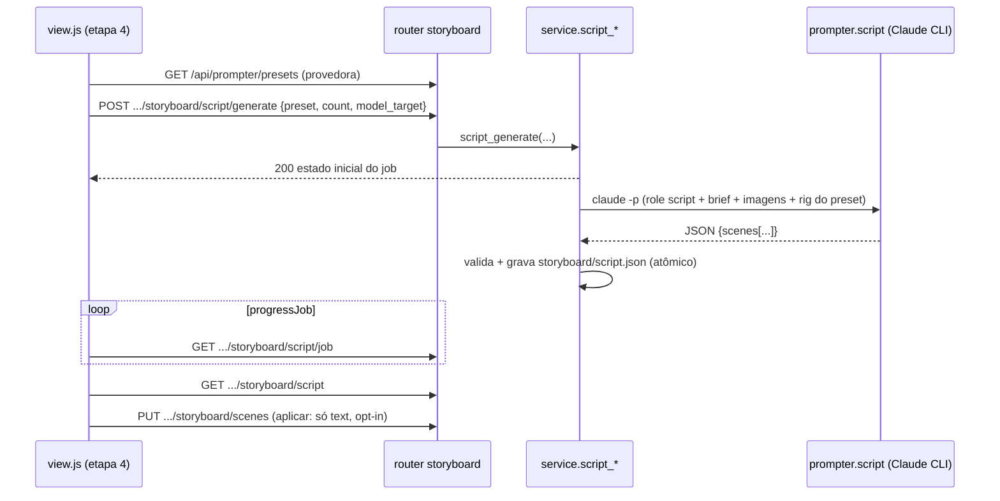

# FDD: storyboard-roteiro-llm — roteiro completo por LLM na etapa 4 `[extensão]`

Versão: 1.2 (implementada e reconciliada no fechamento da frente — ver seção 13)
Data: 2026-08-30 · Reconciliação: 2026-08-31
Responsável: Wave 9, sub-wave 2 (`docs/domains/studio/waves/wave-9.md`)
Recon: `docs/domains/studio/recon-wave-9.md` · Base: `develop` @ `7162c41`

> **Gate de fidelidade (CLAUDE.md / ADR-004):** a aula 010 manda o ALUNO escrever a história
> em ~5 cenas; a docstring de `studio/storyboard/service.py:12` hoje diz explicitamente
> "nada de roteiro por LLM". Esta feature CONTRARIA esse texto e por isso é inteira
> `[extensão]`: aprovada pelo dono na abertura da Wave 9 (card da wave), marcada `[extensão]`
> na UI e no código, e **exige ADR nova (ADR-025)** registrando a decisão. O esqueleto da ADR
> está na seção 12 deste FDD como **pendência de fechamento** (a ADR nasce no fechamento da
> implementação; a decisão fica declarada aqui). O texto gerado é sempre **sugestão
> editável**: o método da aula (usuário escreve) continua sendo o caminho padrão da etapa.

---

### 1. Provides / Consumes (contrato da wave)

**Provides**

- Novo papel `script` em `prompter.ROLES` + função nova `prompter.script(...)` (aditiva):
  gera roteiro completo de vídeo publicitário com N cenas, cada uma com texto em pt-BR e
  prompt de imagem em inglês no formato "briefing de diretor de fotografia" da skill
  `/generate_realistic_prompt_images`, aplicando o preset de realismo escolhido.
- Endpoints aditivos da etapa 4:
  - `POST /api/projects/{pid}/storyboard/script/generate` (job assíncrono via Claude CLI;
    sem custo de créditos Higgsfield, logo **sem `confirmCost`**, mas com `progressJob`);
  - `GET /api/projects/{pid}/storyboard/script/job` (polling do job);
  - `GET /api/projects/{pid}/storyboard/script` (última sugestão persistida em
    `storyboard/script.json`).
- Bloco de UI `[extensão]` no painel de cenas da etapa 4 com os controles: preset de
  realismo/rig, nº de cenas, aspect ratio (herdado do projeto, somente leitura), modelo
  alvo (default Nano Banana Pro) e os botões "Gerar roteiro" / "Aplicar às cenas".

**Consumes**

- Catálogo `REALISM_PRESETS` + endpoint `GET /api/prompter/presets` + parâmetro `preset`
  no prompter ← providos por **prompter-presets-realismo** (sub-wave 1). Esta feature não
  redefine preset algum: só lista, seleciona e repassa o `id`.
- Resolução de preset default por ação no padrão ADR-016 (`settings`), provida pela mesma
  feature. **Contrato do gate W3 (P2, vinculante):** a chave de ação é `storyboard.script`,
  com preset default de código `documentary-street`. A provedora entrega `PRESET_ACTIONS`,
  `preset_default_for` e `resolve_preset` abertos a ações novas; esta consumidora REGISTRA
  a chave `storyboard.script` em `PRESET_ACTIONS` (aditivo) e nunca mantém segunda lista.
- `[cross-feature]` **Critério de aceitação de handoff (validado na W5, estado integrado):**
  o seletor de preset da tela do roteiro lista os presets reais devolvidos por
  `GET /api/prompter/presets` (ao menos `documentary-street` e `arri-natural-narrative`) e
  o preset escolhido aparece aplicado no prompt de imagem de cada cena gerada (o rig do
  preset: corpo + lente + formato aparecem literalmente no bloco de câmera do prompt).

---

### 2. Contexto e motivação técnica

Depois da etapa 3 o usuário tem a imagem base (`base/base_final.png`), o mood aplicado
(`mood/selected/`) e o produto/vibe em `project.json`. A aula 010 pede a história em ~5
cenas escritas à mão; o levantamento do curso identificou a lacuna: para quem trava na
escrita, um roteiro inicial gerado por LLM acelera a etapa sem tirar o controle do usuário.

Encaixe no terreno (recon Wave 9):

- Precedente de LLM na etapa 4: `video_prompt` (`service.py:736`) já chama
  `prompter.from_images("motion", ...)`. O roteiro segue o mesmo canal (Claude CLI via
  `studio/common/prompter.py`, assinatura do usuário, grátis).
- `scenes.json` (ADR-018/022) fica **intocado em estrutura**: a sugestão vive em arquivo
  próprio (`storyboard/script.json`) e a aplicação preenche apenas o campo `text` das
  cenas, via o contrato existente `PUT .../storyboard/scenes`.
- Jobs longos seguem ADR-006: thread + `JobRegistry` próprio + polling.
- Atores: usuário único local (ADR-001); Claude CLI local; nenhum crédito Higgsfield.

Suposições e restrições:

- Claude CLI é o mesmo binário do prompter (`prompter.BIN`); sem ele a geração de roteiro
  **não existe** (ver seção 6, decisão 409 vs fallback).
- Núcleo intocado (ADR-010): tudo em `studio/storyboard/`, `studio/etapas/storyboard/` e
  `studio/common/prompter.py` (papel/função aditivos).
- Prompts de geração de imagem em inglês (aula 007); textos de cena e UI em pt-BR.

---

### 3. Objetivos técnicos

- Gerar, em um único job, N cenas (default 5, máx 10) cobrindo o arco da aula 010
  (`SCENE_ARC`: começo → descoberta → ação → desfecho, mapeado por `scene_arc(n, total)`),
  cada cena com `text` (pt-BR, ≤ 500 caracteres, limite `MAX_SCENE_TEXT` vigente) e
  `image_prompt` (inglês, formato briefing de diretor de fotografia).
- Invariante de não destruição: **nenhuma chamada desta feature sobrescreve `text` já
  digitado sem ação explícita do usuário**. `script/generate` só escreve `script.json`;
  a aplicação às cenas é opt-in na UI (preencher vazias sem confirmação; substituir
  preenchidas só mediante confirmação explícita).
- Invariante de estrutura: `scenes.json` mantém exatamente o schema ADR-018/022
  (`{id,n,text,images,primary,videos,photos,...}`); esta feature nunca acrescenta campo lá.
- Invariante de preset: o rig (corpo, lente, formato) do preset escolhido aparece
  literalmente no `image_prompt` de todas as cenas geradas (verificável por teste com fake).
- Zero gasto: nenhuma chamada a `hf.*`, nenhum `record_generation` (o livro-caixa ADR-016 é
  de créditos Higgsfield; o Claude CLI é assinatura do usuário).
  [auto-aceito: roteiro não entra no livro-caixa porque não consome créditos, mesmo padrão
  do `video_prompt` que também não registra]

---

### 4. Escopo e exclusões

**Incluído**

- Papel `script` em `ROLES` + função `prompter.script(...)` (aditiva, ver seção 5.5).
- Serviço: `script_generate` (job), `script_status` (job), `load_script` (última sugestão),
  persistência atômica de `storyboard/script.json`.
- Rotas aditivas no router da etapa 4 (seção 5.1 a 5.3).
- Bloco de UI `[extensão]` no painel de cenas: controles + geração com `progressJob` +
  painel de sugestão por cena (texto pt-BR + prompt inglês com botão copiar) + botões
  "Aplicar às cenas vazias" e "Substituir tudo" (este com confirmação).
- Atualização da docstring de `studio/storyboard/service.py` (o trecho "nada de roteiro por
  LLM" ganha a ressalva `[extensão]` + referência à ADR-025).
- Testes com fake do Claude CLI (monkeypatch de `prompter.BIN`/`subprocess.run`, padrão
  `tests/test_prompter.py`, ADR-008).

**Excluído**

- Qualquer geração de imagem ou vídeo (os prompts gerados são insumo para os fluxos
  existentes de ideação/ângulos; quem gera é o usuário, pelos caminhos de sempre).
- Mudança de schema de `scenes.json` (ADR-018/022) e das rotas existentes.
- Novo campo em `scenes.json` para o prompt de imagem: o prompt vive em `script.json` e é
  copiado pelo usuário. [auto-aceito: escopo do wave-9.md diz "só o campo text"; guardar o
  prompt por cena dentro de `scenes.json` seria mudança de schema, vetada pela restrição
  "estrutura intocada"]
- Definição/edição de presets de realismo (é da provedora prompter-presets-realismo).
- Tradução automática de cenas já escritas, reescrita parcial, regeneração por cena
  individual (v1 regenera o roteiro inteiro; o arquivo anterior é substituído).
- Handoff automático para o animate (etapa 5): inalterado, via `scenes.json`/`storyboard.json`.

---

### 5. Fluxos, contratos públicos e componentes

**Fluxo principal**

1. UI carrega o bloco `[extensão]` do roteiro: busca `GET /api/prompter/presets` (provedora)
   e pré-seleciona o preset default resolvido pelo servidor (campo `preset_default` do
   status, ver 5.4); nº de cenas default 5; aspect ratio exibido de `project.aspect_ratio`;
   modelo alvo default Nano Banana Pro.
2. Usuário clica "Gerar roteiro (Claude) `[extensão]`" → `POST .../storyboard/script/generate`.
3. Serviço valida (base presente, Claude CLI presente, sem job em andamento, parâmetros) e
   inicia job em thread (`JobRegistry` próprio, `_script_registry`).
4. Dentro do job: monta o brief (produto, vibe, aspect ratio, arco por cena via
   `scene_arc`), resolve as imagens (`base/base_final.png` + até 3 ideias ESCOLHIDAS da galeria
   em `storyboard/ideas/` + até 3 de `mood/selected/`, teto `prompter.MAX_IMAGES = 4`) e chama
   `prompter.script(...)` com o preset. O Claude lê as imagens (`--allowedTools Read`) e devolve
   JSON com as N cenas.
   [auto-aceito: imagens de contexto = base final + até 3 ideias escolhidas na galeria + até 3
   do mood selecionado, nessa ORDEM de prioridade (a base nunca sai; ideias antes do mood), na
   ordem de arquivo dentro de cada grupo, porque o teto de 4 imagens é contrato vigente do
   prompter e a base é a imagem obrigatória da etapa]
   [ADR-028: as ideias escolhidas são a costura galeria→roteiro do Card `xhtT5B24` (fotos que o
   multishot da base gerou e o usuário selecionou); marcações (inpaint, `role:"annotation"`)
   nunca entram — mesmo invariante da galeria pública (FDD §6 do inpaint-marcação)]
5. Serviço valida/normaliza a resposta (N cenas, `text` pt-BR truncado em 500, prompt de
   imagem não vazio contendo o rig do preset), grava `storyboard/script.json` (escrita
   atômica, `common/atomic.write_json_atomic`) e encerra o job (`state: done`).
6. UI (que acompanhou via `Studio.ui.progressJob` + `GET .../script/job`) busca
   `GET .../storyboard/script` e renderiza a sugestão por cena.
7. Usuário revisa e clica "Aplicar às cenas vazias": a UI monta o array de cenas atual,
   preenche `text` **somente das cenas com `text` vazio** com o texto sugerido e envia o
   `PUT .../storyboard/scenes` existente (que regrava `storyboard.md` junto). "Substituir
   tudo" faz o mesmo para todas as cenas, mas só depois de um diálogo de confirmação
   explícita que diz quantos textos serão sobrescritos.
   [auto-aceito: a aplicação é client-side via o PUT /scenes existente, sem endpoint novo de
   escrita, porque o contrato publicado já cobre a operação e evita segundo caminho de
   escrita em scenes.json (ADR-018/022)]

**Fluxos alternativos e exceções**

- Nº de cenas ≠ 5: o arco continua o de `scene_arc(n, total)` (1 = começo, 2 = descoberta,
  última = desfecho, miolo = ação); com N=1 o job é aceito e gera uma cena única de arco
  "começo". [auto-aceito: limites 1..10 herdam `MAX_SCENES` e a validação vigente de
  `save_scenes`]
- Claude devolve menos/mais cenas que N: o serviço corta em N ou marca `state: error` se
  vierem menos que N ou JSON inválido (sem completar com conteúdo inventado
  deterministicamente); a mensagem vai no `error`/`log` do job.
  [auto-aceito: resposta incompleta = erro do job, não completação silenciosa, coerente com
  "porquê sem fonte não se inventa"]
- Regeração: novo `script/generate` com job idle substitui `script.json` inteiro (o anterior
  não é versionado). A sugestão nunca toca `scenes.json`, então nada do usuário se perde.
- Sem mood selecionado: o job segue só com a base + brief (vibe textual do projeto).
- Sem ideias escolhidas na galeria (ADR-028): o contexto é o de antes (base + mood) — a costura
  galeria→roteiro é aditiva e nunca vira pré-requisito.

**Diagrama (sequência resumida)**



#### 5.1 `POST /api/projects/{pid}/storyboard/script/generate`

- Tipo: http_endpoint · Método: POST
- Body (`ScriptGenerateReq`, todos os campos opcionais):

```json
{
  "preset": "documentary-street",
  "count": 5,
  "model_target": "nano_banana_2",
  "instruction": "a história deve terminar com o produto na mão do personagem"
}
```

- Semântica dos campos:
  - `preset`: id de `REALISM_PRESETS` (provedora). Ausente → default resolvido por settings
    (projeto → global → código, ADR-016; código = `documentary-street`, decisão da wave).
  - `count`: 1..10, default 5 (`DEFAULT_SCENES`/`MAX_SCENES` vigentes).
  - `model_target`: **gate W3 (P3, vinculante): v1 aceita SOMENTE `nano_banana_2`**
    (Nano Banana Pro), que também é o default quando o campo é omitido. `gpt_image_2` e
    qualquer outro id → 422. O formato do prompt é o de Nano Banana (prompt técnico longo,
    seção "Ajustes por modelo" da skill). O campo continua no body porque a extensão para
    outros alvos é aditiva-reversível; o catálogo `SCRIPT_MODELS` da etapa é a fonte única
    dos ids aceitos e a UI mostra o alvo como leitura fixa (sem seletor na v1).
  - `instruction`: instrução livre do usuário em pt-BR (≤ 300, mesmo teto `MAX_TEXT` da
    etapa), incorporada ao brief. Opcional.
  - Aspect ratio NÃO entra no body: é herdado de `project.aspect_ratio` no servidor (mesma
    regra `_aspect_ratio` do vídeo; ausente/inválido → `16:9`).
- Resposta 200: estado inicial do job (mesmo formato dos demais jobs da etapa):

```json
{ "state": "running", "done": 0, "total": 1, "error": null, "log": [] }
```

  **Reconciliado com a implementação (2026-08-31):** a resposta traz também a chave `added`
  (sempre `0` no roteiro), herdada do `JobRegistry` compartilhado da etapa — o mesmo acontece em
  `GET .../storyboard/script/job`. Não é um campo do roteiro; quem consome deve tratar o objeto
  como "contém ao menos estas chaves", nunca como conjunto fechado. A coleção Postman do domínio
  asserta com `include.keys` por causa disso.

- Status: 200 job iniciado · 404 projeto inexistente · 409 pré-requisito (base ausente,
  Claude CLI ausente, job em andamento) · 422 parâmetro inválido (matriz na seção 6).
- Limites: 1 job por projeto (registry próprio); timeout da chamada Claude = 300 s
  (`prompter.TIMEOUT_S` é 180 para um prompt; o roteiro de até 10 cenas ganha teto próprio).
  [auto-aceito: timeout 300 s como constante nova `SCRIPT_TIMEOUT_S`, valor entre o do
  prompter (180) e o dos jobs pagos (600)]

#### 5.2 `GET /api/projects/{pid}/storyboard/script/job`

- Tipo: http_endpoint · Método: GET
- Resposta 200 (formato de `job_status` da etapa; `idle` quando nunca rodou):

```json
{ "state": "done", "done": 1, "total": 1, "error": null,
  "log": ["roteiro gerado: 5 cenas (preset documentary-street, 41.3s)"] }
```

- Em falha: `state: "error"`, `error` com a mensagem, `log` com o detalhe.

#### 5.3 `GET /api/projects/{pid}/storyboard/script`

- Tipo: http_endpoint · Método: GET
- Resposta 200 com a última sugestão, ou `{"script": null}` quando nunca houve geração.
  [auto-aceito: 200 com `script: null` em vez de 404, porque a UI consulta no boot do painel
  e ausência de sugestão é estado normal, não erro]

```json
{
  "script": {
    "generated_at": "2026-08-30T14:22:05",
    "preset": "documentary-street",
    "model_target": "nano_banana_2",
    "aspect_ratio": "16:9",
    "count": 5,
    "source": "claude",
    "seconds": 41.3,
    "notes_pt": "Arco fechado no desfecho com o produto em primeiro plano.",
    "scenes": [
      {
        "n": 1,
        "arc": "comeco",
        "text": "Amanhecer gelado na trilha: o alpinista prepara o equipamento e a lata aparece presa à mochila.",
        "image_prompt": "A cinematic photograph of a lone climber checking gear at a frozen trailhead at dawn, the energy drink can strapped to his backpack. Shot on Blackmagic Pocket 6K Pro with a Cooke S4 28mm lens at T2.8, Super 35, wide shot, handheld documentary feel [...] Negative: no plastic skin, no HDR glow, no text, no watermark, no CGI look.",
        "negative": "plastic skin, HDR glow, text, watermark, CGI look"
      }
    ]
  }
}
```

- Semântica: `scenes[].n` alinha com a numeração de `scenes.json` (`cena01..cenaNN`);
  `arc` ∈ ids de `SCENE_ARC`; `text` pt-BR ≤ 500; `image_prompt` inglês, formato briefing
  (sujeito+ação+ambiente → câmera/lente/abertura do rig → luz → texturas → grade → composição
  + aspect ratio → fidelidade → negativos, template universal da skill); `source` sempre
  `"claude"` (não existe `source: "template"` para roteiro, ver seção 6).

  **Frente B (2026-08-31, ADR-028 — ver §14):** cada cena ganha `shots` (inteiro 3–6, quantas
  fotos a cena pede, inferido pelo modelo) e `shot_prompts` (array de `shots` briefings de DoP
  coesos entre si). `image_prompt` passa a ser `shot_prompts[0]`; cenas sem `shot_prompts` caem
  em `shots: 1`. Campos aditivos; o exemplo acima (uma foto) continua válido como `shots: 1`.

#### 5.4 Status da etapa (campo aditivo)

`GET /api/projects/{pid}/storyboard` ganha campos aditivos (sem tocar os existentes):

```json
{ "script": { "exists": true, "generated_at": "2026-08-30T14:22:05" },
  "script_preset_default": "documentary-street",
  "script_models": [{ "id": "nano_banana_2", "label": "Nano Banana Pro", "default": true }],
  "script_cli": true }
```

[auto-aceito: o default de preset exposto no status evita uma rodada extra da UI; nome dos
campos aditivos livre porque nenhum contrato publicado os fixa]

**Reconciliado com a implementação (2026-08-31):** são QUATRO campos aditivos, não dois. O
`script_models` (objetos `{id,label,default}`, não ids soltos) existe para a tela não adivinhar o
alvo permitido, e o `script_cli` para ela desabilitar o botão quando o Claude CLI não está no
PATH — os dois exigidos pelas amendas A5/A6 da seção 0. Nenhum campo pré-existente do status
mudou.

#### 5.5 `prompter.script(...)` (contrato interno, aditivo)

- Assinatura: `script(images: list[Path], brief: dict, preset: str, count: int, arcs: list[str], model_target: str) -> dict`
- `ROLES["script"]` (novo, inglês): "You are a commercial film director and screenwriter.
  Task: write a complete N-scene advertising video script from the given brand images
  (base image first, then mood frames), following the course arc (opening → discovery →
  action → payoff). For each scene return: a short scene description in Brazilian
  Portuguese (`text`, max 500 chars) and ONE photorealistic image prompt in English written
  as a director-of-photography briefing (subject → action → environment → camera/lens/
  aperture from the given rig → lighting with one dominant source → textures and real
  imperfections → color/film grade → composition + aspect ratio → fidelity block →
  negatives). Use EXACTLY the camera rig given below in every scene. No contradictions."
- O bloco do rig vem de `REALISM_PRESETS[preset]` (provedora): corpo, lente, formato,
  focal/abertura default, luz/grade sugeridas e vocabulário de fidelidade.
- Output spec próprio (fence ```json): `{"scenes": [{"n", "arc", "text", "image_prompt",
  "negative"}], "notes_pt"}`; parser próprio `_parse_script` (o `_parse` vigente é de prompt
  único e não muda).
  **Frente B (2026-08-31, ADR-028 — ver §14):** o output spec passa a pedir também `shots`
  (3–6) e `shot_prompts` (array coeso) por cena; `_parse_script` chama `_normalize_shots`
  (fonte da verdade = `shot_prompts`, `shots` = tamanho da lista cortada no teto,
  `image_prompt` = primeira foto). Assinatura de `script(...)` inalterada.
- `from_brief`/`from_images` e `PROMPT_FORMAT`/`split_sections`/`provenance` ficam
  intocados (garantia para base-prompt-provenance).

**Compatibilidade**: todos os contratos são aditivos; nenhuma rota, campo ou mensagem
existente muda. `scenes.json`, `storyboard.md`, `ideas.json` e os jobs de ideação/vídeo
não são afetados. `script.json` é arquivo novo, ignorável por qualquer código antigo.

---

### 6. Erros, exceções e fallback

**Decisão de fallback (Claude CLI ausente): 409, sem fallback determinístico.**
[auto-aceito: diferente do `video_prompt` (1 prompt, template preenchível), um roteiro de N
cenas exige conteúdo narrativo que um template determinístico só produziria inventando N
cenas iguais; o "fallback da aula" já existe e é o fluxo padrão (o usuário escreve as cenas
com os hints do `SCENE_ARC`). Portanto Claude ausente → 409 com mensagem que aponta o modo
manual, mesmo padrão de precondição dos 409 da etapa]

Matriz de erros:

| Condição | Tratamento | Notas |
| --- | --- | --- |
| `pid` inexistente/ inválido | 404 | `refs.project_dir` (`KeyError`), padrão da etapa |
| `base/base_final.png` ausente | 409 "Imagem base ausente: conclua a etapa 3 (base)" | mesma mensagem/`Precondition` vigente |
| Claude CLI ausente (`prompter.available()` falso) | 409 "Claude CLI não encontrado no PATH: escreva as cenas manualmente (aula 010) ou instale o Claude Code" | decisão acima; a UI desabilita o botão quando o status indicar indisponível |
| Job de roteiro em andamento | 409 "Já existe uma geração de roteiro em andamento para este projeto." | `RuntimeError` do `JobRegistry.start` |
| `count` fora de 1..10 | 422 | mesma régua de `MAX_SCENES` |
| `preset` desconhecido (não está em `REALISM_PRESETS`) | 422 com os ids válidos | validação contra o catálogo da provedora |
| `model_target` fora de `SCRIPT_MODELS` (v1: só `nano_banana_2`) | 422 | gate W3 P3 |
| `instruction` > 300 caracteres | 422 | teto `MAX_TEXT` vigente |
| Claude falha/timeout dentro do job | job `state: "error"`, mensagem em `error`/`log` | sem retry automático; nova tentativa é manual |
| Claude devolve JSON inválido ou menos cenas que `count` | job `state: "error"` com detalhe | nunca completar com conteúdo inventado |
| `text` de cena vindo > 500 caracteres | truncado em 500 no serviço, com nota no `log` | garante aplicabilidade via `save_scenes` |
| Cena sem o rig do preset no `image_prompt` (com preset ativo) | job `state: "error"` citando as cenas e as partes do rig que faltaram | reconciliado 2026-08-31 (review 001, issue_002): é o que torna o critério 3 `[cross-feature]` uma invariante do SERVIDOR, e não uma aposta na obediência do modelo. Mesma régua da linha "JSON inválido"; regenerar é grátis |
| Falha de I/O ao gravar `script.json` (`OSError` em `mkdir`/`write`) | job `state: "error"`, linha `script_job` no logger e detalhe em `job["log"]`; `script.json` anterior byte-idêntico | reconciliado 2026-08-31 (review 001, issue_003) |
| `GET /script` sem geração prévia | 200 `{"script": null}` | estado normal |

- Resiliência: timeout único de 300 s na chamada Claude; sem retry/backoff (operação manual
  e barata de repetir); 1 job por projeto (registry próprio) evita concorrência de escrita.
- Política de fallback: nenhuma no servidor (ver decisão). Na UI, indisponibilidade do
  Claude mantém o fluxo manual da aula intacto e visível.
- Invariantes: `scenes.json` nunca é escrito por rota desta feature; `script.json` só é
  escrito por job concluído com resposta válida (escrita atômica); aplicar sugestão passa
  sempre pelo `PUT /scenes` com as validações vigentes.

---

### 7. Observabilidade

**Métricas/eventos (via logs estruturados, padrão do monólito, sem stack de métricas):**

- `script_generate` no início do job: `{pid, preset, count, model_target, aspect_ratio, images}`.
- `script_job` no fim: `{pid, state: done|error, scenes, seconds, source: "claude"}`.
- `script_apply` não existe no servidor (aplicação é o `PUT /scenes`); o `scenes_saved` já
  logado por `save_scenes` cobre a auditoria do apply.

**Logs**

- Logger `studio.storyboard` (existente); formato `evento %s` + dict, como os demais.
- O prompt/roteiro completo NÃO vai para o log (tamanho); somente contagens e tempos. O
  conteúdo auditável fica em `storyboard/script.json`.

**Tracing**

- Não há tracing no monólito (ADR-001); `seconds` do prompter persiste em `script.json`
  para diagnóstico de lentidão do CLI.

**Painéis/alertas**

- Nenhum (app local). O `progressJob` da UI é o feedback operacional do usuário.

---

### 8. Dependências e compatibilidade

| Componente | Versão mínima | Observações |
| --- | --- | --- |
| prompter-presets-realismo (sub-wave 1) | integrada em develop antes desta (ordem W5) | `REALISM_PRESETS`, `GET /api/prompter/presets`, preset default por settings |
| Claude CLI (`claude`) | a instalada do usuário | mesma dependência opcional do prompter; ausência → 409 |
| `studio/common/prompter.py` | atual | papel `script` e função `script()` aditivos; `_parse`/`PROMPT_FORMAT` intocados |
| `studio/storyboard/service.py` | atual | docstring :12 atualizada com ressalva `[extensão]` + ADR-025 |
| `PUT /api/projects/{pid}/storyboard/scenes` | contrato vigente | canal único de aplicação da sugestão |
| `common/atomic.write_json_atomic` | atual | escrita de `script.json` |

**Garantias de compatibilidade**

- Tudo aditivo: rotas, campos de status, papel do prompter, arquivo novo. Nenhum teste
  existente muda de mensagem/fixture.
- Projetos antigos (sem `script.json`) funcionam idênticos; `script.json` órfão (feature
  removida) é ignorado por todo o resto do código.
- ADR-018/021/022: schema de `scenes.json` e fluxos de vídeo intactos.

---

### 9. Critérios de aceite técnicos

1. `POST .../storyboard/script/generate` com fake do Claude (monkeypatch de
   `prompter.BIN`/`subprocess.run`) gera job que termina `done` e grava
   `storyboard/script.json` com `count` cenas, cada uma com `text` pt-BR ≤ 500 e
   `image_prompt` em inglês não vazio.
2. O arco é respeitado: com `count=5`, `scenes[0].arc == "comeco"`,
   `scenes[1].arc == "descoberta"`, `scenes[4].arc == "desfecho"`, miolo `"acao"`
   (mapa `scene_arc`).
3. `[cross-feature]` (W5, estado integrado): o seletor de preset da tela do roteiro lista
   os presets reais de `GET /api/prompter/presets` e o rig do preset escolhido (corpo +
   lente + formato de `REALISM_PRESETS`) aparece no `image_prompt` de cada cena gerada.
4. Preset ausente no pedido → o serviço usa o default resolvido por settings (projeto →
   global → código `documentary-street`) e o registra em `script.json`.
5. Aspect ratio do projeto aparece no bloco de composição dos prompts; projeto sem
   `aspect_ratio` cai em `16:9`.
6. Aplicar às cenas vazias: com cenas 1 e 3 já escritas, o apply preenche somente 2, 4 e 5;
   os textos 1 e 3 permanecem byte a byte iguais (verificado via `PUT /scenes` + leitura).
7. Substituir tudo só ocorre após confirmação explícita na UI; nenhum caminho de código do
   servidor sobrescreve `text` fora do `PUT /scenes` disparado pelo usuário.
8. Claude CLI ausente → `POST script/generate` responde 409 (mensagem da matriz); nenhum
   arquivo é criado.
9. Claude devolvendo JSON inválido ou cenas de menos → job `state: "error"` e `script.json`
   anterior (se existia) permanece intacto.
10. `GET .../storyboard/script` sem geração → 200 `{"script": null}`; após geração → 200 com
    o schema da seção 5.3.
11. Nenhuma chamada a `hf.*` e nenhum novo registro no livro-caixa em todo o fluxo.
12. UI marca o bloco como `[extensão]` e `make verify` (ruff + pytest, sem rede) passa.

---

### 10. Riscos e mitigação

### Risco 1: qualidade/estrutura instável da resposta do LLM (JSON malformado, cenas genéricas)

- **Probabilidade:** média
- **Impacto:** job em erro ou sugestão fraca que o usuário descarta
- **Mitigação:**
    - Output spec rígido com fence ```json + parser dedicado com validação por cena;
    - exemplo de estrutura no prompt do papel `script` (padrão `PROMPT_FORMAT` de mostrar a ESTRUTURA, nunca o conteúdo);
    - erro claro no `log` do job para o usuário simplesmente regenerar.
- **Plano de contingência:** o fluxo manual da aula continua sendo o caminho padrão; a feature é opt-in de ponta a ponta.

### Risco 2: sobrescrita acidental de texto do usuário

- **Probabilidade:** baixa
- **Impacto:** alto (perda de trabalho manual, violação da restrição da wave)
- **Mitigação:**
    - servidor nunca escreve em `scenes.json` nesta feature;
    - apply client-side com dois botões distintos e confirmação explícita no destrutivo;
    - teste de aceite 6/7 congela o comportamento.
- **Plano de contingência:** `storyboard.md` regravável e o texto anterior recuperável do editor aberto (sem undo formal, v1).

### Risco 3: divergência com o contrato da provedora (nomes/estrutura de `REALISM_PRESETS`, chave de settings)

- **Probabilidade:** média (FDD da provedora nasce em paralelo)
- **Impacto:** retrabalho na integração W5
- **Mitigação:**
    - esta spec consome apenas o que wave-9.md publica (ids, endpoint, param `preset`);
    - a chave `storyboard.script` está rotulada como hipótese (seção 1) para conferência no handoff;
    - critério `[cross-feature]` roda no estado integrado antes do PR final.
- **Plano de contingência:** ajustar a consumidora (esta) à provedora, nunca o inverso (ordem de integração da wave).

### Risco 4: lentidão do Claude CLI para 10 cenas com imagens

- **Probabilidade:** média
- **Impacto:** espera longa; timeout
- **Mitigação:** timeout próprio de 300 s; `progressJob` com log de andamento; default de 5 cenas.
- **Plano de contingência:** usuário reduz `count` ou gera sem instrução extra.

---

### 11. Sequenciamento de implementação (Build Order)

| Ordem | Etapa | Depende de | Componentes/arquivos prováveis | Critérios que fecha (seção 9) |
| --- | --- | --- | --- | --- |
| 1 | Papel `script` + `prompter.script()` + parser + testes com fake | provedora integrada (REALISM_PRESETS) | `studio/common/prompter.py`, `tests/test_prompter.py` | 1 (parcial), 3 (parcial), 9 |
| 2 | Serviço: job, validações, `script.json`, status aditivo, docstring | 1 | `studio/storyboard/service.py`, `tests/test_storyboard*.py` | 1, 2, 4, 5, 8, 9, 10, 11 |
| 3 | Rotas aditivas `script/generate`, `script/job`, `script` | 2 | `studio/etapas/storyboard/router.py` | 1, 8, 10 |
| 4 | UI: bloco `[extensão]`, controles, progressJob, apply opt-in | 3 | `studio/etapas/storyboard/view.js`, `view.html` | 3, 6, 7, 12 |
| 5 | Fechamento: ADR-025, mapping, doc-sync, coleção Postman | 2 a 4 | `docs/adrs/generated/STUDIO/ADR-025-*.md`, `docs/adrs/mapping.md`, `docs/domains/storyboard/postman/` | 12 |

---

### 12. Pendência de fechamento: ADR-025 (esqueleto proposto)

A ADR nasce no fechamento da implementação (padrão dd-parallel); a decisão fica declarada
aqui para o gate em lote.

- **Título:** ADR-025: roteiro de storyboard gerado por LLM como extensão opt-in da etapa 4
- **Status:** aprovada no gate W3 em lote (2026-08-30); formalizar no fechamento da frente
- **Contexto:** a aula 010 manda o aluno escrever ~5 cenas; `storyboard/service.py`
  documenta "nada de roteiro por LLM" (ADR-004, fidelidade). O levantamento do curso
  (Wave 9) identificou a lacuna de apoio à escrita, e o dono aprovou a extensão.
- **Decisão:** oferecer geração de roteiro completo (texto pt-BR + prompt de imagem em
  inglês por cena, formato briefing de diretor de fotografia com preset de realismo) via
  Claude CLI (papel `script` do prompter), como `[extensão]` opt-in: sugestão em
  `storyboard/script.json`, aplicação manual que preenche apenas `text` (vazias sem
  confirmação; substituição só com confirmação explícita), sem custo Higgsfield, sem
  fallback determinístico (Claude ausente → 409; o fluxo manual da aula é o padrão).
- **Consequências:** docstring da etapa ganha a ressalva; `scenes.json` intocado
  (ADR-018/022); dependência opcional do Claude CLI ampliada (antes só prompts, agora
  roteiro); marca `[extensão]` na UI. Relaciona ADR-004 (desvio registrado), ADR-006
  (job/polling), ADR-016 (preset default por ação, via provedora), ADR-018/022 (schema
  preservado). Atualizar `docs/adrs/mapping.md` (numeração: 024 é a última sequencial;
  030 existe fora de sequência).

---

### Pendências do gate em lote — RESOLVIDAS (gate W3, 2026-08-30)

Registro em `docs/domains/studio/waves/wave-9.md` § "Gate W3 — aprovação em lote".

1. **P1 — ADR-025: APROVADA.** Nasce no fechamento desta frente, a partir do esqueleto da
   seção 12. Registra a extensão "roteiro por LLM" e o default ATIVO de `storyboard.script`
   (enquanto mood/base/motion nascem opt-in com default `null`).
2. **P2 — Chave de settings: `storyboard.script`, preset default `documentary-street`.**
   Contrato de handoff fechado; provedora e consumidora implementam exatamente essa chave.
   Divergência na W5 reconcilia neste contrato.
3. **P3 — Modelo alvo v1: só `nano_banana_2` (Nano Banana Pro).** GPT-Image fica fora do
   roteiro (reversível, aditivo). Refletido em 5.1 e na matriz de erros da seção 6.

---

### 13. Reconciliação pós-implementação (2026-08-31)

Fechamento da frente. Além das reconciliações já inseridas em 5.1, 5.4 e na matriz da seção 6,
ficam registradas as observações que a execução real produziu e que NÃO mudam o contrato:

1. **Precedência de validação.** Os 422 de parâmetro (`count`, `preset`, `model_target`,
   `instruction`) são avaliados ANTES dos 409 de pré-requisito (base ausente, Claude CLI
   ausente). É o oposto da ordem do caminho pago da mesma etapa (divergências 4 e 5 já
   registradas em `postman/divergencias.md`). Consequência prática boa: um cliente consegue
   exercitar as validações de parâmetro sem ter concluído a etapa 3.
2. **Os três estados de `preset` não são observáveis na resposta síncrona.** "Campo ausente" e
   `preset: null` produzem o mesmo 200 de job iniciado; o preset efetivamente resolvido só
   aparece depois, em `script.json`, e o default da ação aparece em `script_preset_default` do
   status. Quem precisar auditar a resolução usa esses dois lugares.
3. **Nome do `JobRegistry`.** O registro do job chama-se `_story_registry` e não
   `_script_registry` como dizia a seção 5: `studio/common/reset.py::_registries` descobre os
   registros de uma etapa por uma lista FECHADA de nomes (`_registry`, `registry`,
   `_story_registry`), e qualquer outro nome deixaria o job invisível para o reset da etapa.
   Troca de identificador, sem efeito em contrato público. (Gap pré-existente registrado e NÃO
   corrigido aqui: o `_video_registry` da mesma etapa também está fora dessa lista.)
4. **Duas asserções de conjunto fechado em testes pré-existentes foram afrouxadas** para
   acomodar campos aditivos — o mapa `defaults` de `GET /api/prompter/presets` (que agora traz
   também `storyboard.script`) e o dict de `status` da etapa 4. Nenhum comportamento anterior
   mudou; só deixou de ser "exatamente estas chaves".
5. **Fora do escopo, registrado como sugestão ao dono:** o guia da etapa
   (`studio/etapas/storyboard/guide.py`, `CHECKLIST` + `check`s por artefato) não anuncia o
   roteiro. Seria natural fazê-lo, mas a seção 4 deste FDD não o inclui — "sugerir é permitido,
   inventar não" (gate 2 do CLAUDE.md).
6. **Evidência de runtime do critério 3 `[cross-feature]`.** Além dos testes com fake, o caminho
   feliz foi exercitado contra o Claude CLI REAL pela coleção Postman do domínio: job `done` em
   61,7 s, 5 cenas, arcos `comeco/descoberta/acao/acao/desfecho`, e o rig do preset
   `documentary-street` (`Blackmagic Pocket 6K Pro`, `Cooke S4`, `Super 35`) literalmente nas
   cinco cenas. Detalhes e números em `docs/domains/storyboard/postman/README.md`.

---

### 14. Reconciliação Frente B — fotos inferidas por cena + ordem do painel (2026-08-31, ADR-028)

A Frente B da wave de storyboard estendeu esta feature de forma **estritamente aditiva** sobre a
ADR-025 aqui documentada. Decisão em [ADR-028](../../../adrs/generated/STUDIO/ADR-028-roteiro-por-cena-fotos-inferidas-e-roteiro-antes-da-historia.md).
O que muda no contrato deste FDD:

1. **Cada cena passa a carregar N fotos inferidas, não uma.** O contrato de `prompter.script`
   (5.5) e o schema de cena de `GET .../script` (5.3) ganham dois campos aditivos por cena:
   - `shots` — inteiro na faixa **3–6** (`SHOTS_MIN`/`SHOTS_MAX`), quantas fotos a cena pede,
     JULGADO pelo modelo a partir da descrição. O servidor só normaliza a faixa e nunca inventa
     acima do que o modelo escreveu (`_normalize_shots`): `shots` efetivo = tamanho da lista
     `shot_prompts` (cortada no teto), prompts vazios descartados; o piso 3 é um PEDIDO no prompt,
     não preenchimento do servidor.
   - `shot_prompts` — array de exatamente `shots` briefings de DoP em inglês, **visualmente coesos
     dentro da cena** (mesmo local/produto/paleta/luz/mundo; variam só momento/enquadramento/ângulo).
   - `image_prompt` **permanece** e passa a ser `shot_prompts[0]` (a primeira foto) — consumidor de
     uma foto por cena não muda. Roteiro sem `shot_prompts` (formato ADR-025 puro) cai em
     `shots = 1` com `image_prompt` como única foto.
2. **O rig do preset (critério 3 `[cross-feature]`) é cobrado em TODAS as fotos.** `_require_preset_rig`
   varre cada `shot_prompt`; falta de corpo/lente/formato em QUALQUER foto derruba o job em
   `state: "error"` citando "cena N foto J". A matriz da seção 6 continua válida, agora por foto.
3. **`scenes.json` segue intocado.** `shots`/`shot_prompts` vivem só em `script.json`, ao lado de
   `image_prompt`. A aplicação às cenas (`PUT /scenes`, opt-in) continua preenchendo apenas `text`;
   o **encaixe das fotos no roteiro real permanece MANUAL** por decisão explícita — nenhum caminho
   novo escreve cena sozinho.
4. **Ordem do painel na etapa 4.** O painel "Roteiro por Claude" passou a PRECEDER "A história em
   cenas" no stepper (ordem física das `<section>`, sem lógica de índice): roteiro=`02`,
   história=`03`, ângulos=`04`, cena=`05`. As referências textuais "painel NN" em
   `studio/etapas/storyboard/view.js` e `guide.py` acompanham a renumeração. Fluxo inalterado — o
   roteiro sempre originou as cenas por `id`, não por posição.
5. **Asserções de conjunto fechado afrouxadas** (mesma nota do item 4 da §13, agora também): o
   schema de cena de `script.json` nos testes ganhou `shots`/`shot_prompts`, e a contagem/ordem dos
   badges `.pn` do `view.html` passou a `("01","02","03","04","05")` com o roteiro (02) antes da
   história (03). Nenhum comportamento anterior mudou.
