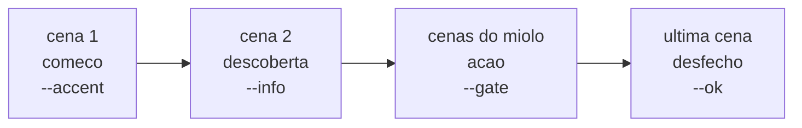

### FDD: views-storyboard-shots (ADH-OS-20260826-05) · Redesign das etapas 4 e 5

Versão: 1.0
Data: 2026-08-26
Responsável: frente `views-storyboard-shots` da Wave 3 (sub-wave 1, `/dd-parallel`, modo batch); gate de specs pré-aprovado em lote (decisão 1 da wave)

Fontes normativas: `docs/domains/studio/waves/wave-3.md` (regras da wave, catálogo transversal, bloco "Feature: views-storyboard-shots", decisões do lote), `docs/domains/studio/features/shell-redesign-fdd.md` §5 (catálogo de classes e helpers `Studio.ui`), `docs/domains/studio/recon-wave-3.md` §1–§3 (contrato DOM e strings fixadas por teste), `docs/domains/storyboard/features/storyboard-fdd.md`, `docs/domains/shots/features/shots-fdd.md`, `CLAUDE.md` (gates de fidelidade ao roteiro).
Fonte visual (fora do repositório, nunca versionada): `Análise de codebase/design_handoff_redesign_frontend/README.md` e `Redesign Orquestrador Studio.dc.html`, linhas 401–457 (storyboard), 459–520 (shots), 988 e 1002–1021 (tile, momentos, cenas, ordem/upscale).

---

### 1. Contexto e motivação técnica

O shell (`ADH-OS-20260826-02`, sub-wave 0) já entregou em `develop` o design system dark-first completo: tokens, controles, painéis numerados (`.pn`), `details.lesson`, tiles (`.card` com `.src`/`.term`/`.up`/`.sel[data-ord]`/`.src-of`), linhas (`.rowcard`, `.scene-row` com `.mom[data-mom]`, `.thumb`), `.palette.sm` com `.lbl`, `.prompt` novo, `.drop.sm`, `.note`, e os helpers `Studio.ui.tile/pipe/beats/copyBtn/copy`. As telas das etapas 4 (storyboard) e 5 (shots) continuam com o markup da wave 2: painéis numerados no texto ("1. …"), parágrafos `.fine` longos soltos, tiles montados à mão com `style` inline (`CARD_BTN`), cenas renderizadas como `div.prompt` e cards de cena como `.card` 3/4.

O problema técnico: enquanto os `view.html`/`view.js` não consomem o catálogo, as duas telas ficam visualmente fora do sistema (proporções, hierarquia e espaçamento errados) e mantêm CSS inline que briga com os tokens do shell — exatamente o que o recon §1 (item "Inline styles em view.js que vão brigar com o redesign") aponta como pendência da frente de etapa.

Atores e limites: a frente edita **somente** `studio/etapas/storyboard/{view.html,view.js}`, `studio/etapas/shots/{view.html,view.js}`, `docs/domains/{storyboard,shots}/**` e `tests/test_{storyboard,shots}_*.py`. Backend, rotas, serviços, `studio/web/*` e demais plugins ficam intocados. Nenhuma dependência nova.

Suposições e restrições explícitas:
- `[auto-aceito]` O shell é o dono do CSS. Toda classe que faltar entra como `<style>` escopado no topo do `view.html` da etapa, com prefixo `.sb-` (storyboard) ou `.sh-` (shots), e vira lacuna registrada para a integração W5 decidir se promove.
- `[auto-aceito]` Regra 1 da wave: onde o protótipo condensa ou omite um painel que o app tem, o painel continua existindo no mesmo padrão visual. Nenhuma funcionalidade some.
- `[auto-aceito]` Texto de aula longo migra para `<details class="lesson"><summary>O que a aula NNN manda fazer aqui</summary>…</details>`; nada é apagado.
- Prompts de geração em inglês (aula 007); textos de UI em pt-BR.

---

### 2. Objetivos técnicos

- Todo id consultado por `storyboard/view.js` e `shots/view.js` (inventário do recon §1, itens "storyboard" e "shots") continua existindo no `view.html` correspondente, com o mesmo elemento e o mesmo tipo (`img`, `select`, `input[type=number]`, `textarea`, `a`, `button`, `span`).
- Zero `style="…"` inline de layout nos dois `view.js` (o `CARD_BTN` de storyboard e o de shots desaparecem); o único inline remanescente é o `background` de cor da `.palette` (valor de dado, não de layout).
- Os painéis das duas telas são numerados com `<span class="pn">NN</span>` em dois dígitos, na ordem visual, e o texto do `h3` perde o prefixo "N.".
- As cenas da etapa 4 renderizam como `.scene-row` com `.mom[data-mom="comeco|descoberta|acao|desfecho"]` derivado de `arcOf()`; os botões `.sbUp/.sbDown/.sbDel` continuam **sem elementos filhos** (o handler usa `e.target.classList.contains`).
- Os tiles da galeria da etapa 5 carregam `data-ord` com o número da ordem quando escolhidos (o `::after` do shell vira o número) e `span.up[.ok]` com "upscalado 2x"/"sem upscale".
- As strings fixadas por teste (recon §2, linhas de `test_storyboard_api.py` e `test_shots_api.py`) continuam presentes, incluindo a tag exata `<section id="guide" class="guide"></section>`.
- `make verify` verde; smoke `scripts/smoke_ui.py` (claro, escuro e `--timers`) com 0 erros de console e 11/11 telas; nenhuma das duas telas gera scroll horizontal a 1440 e a 900 px.

---

### 3. Escopo e exclusões

**Incluído**
- Reescrita do markup de `studio/etapas/storyboard/view.html` (4 painéis) e `studio/etapas/shots/view.html` (4 painéis) sobre o catálogo do shell.
- Ajuste das funções de render de `storyboard/view.js` (`renderIdeas`, `renderScenes`, `collect`, handler de `#sbScenes`) e `shots/view.js` (`loadScenes`, `openScene`, `renderCands`, `loadProd`, `prompts`, handler de `#sceneList`).
- `<style>` escopado por etapa para o que o catálogo do shell não cobre.
- Testes de estrutura acrescentados em `tests/test_storyboard_api.py` e `tests/test_shots_api.py`.
- Este FDD.

**Excluído**
- Qualquer arquivo em `studio/web/` (shell), `studio/*/service.py`, `studio/etapas/*/router.py`, backend, `steps.py`, `app.py`, `index.html`.
- Novos endpoints, novos campos de resposta, mudança de regra de negócio ou de aula.
- Coleção Postman (`[auto-aceito]`: a feature não cria nem altera contrato HTTP — a seção 5 é um contrato de markup, não de rede).
- Chips extras do guia a partir de `g.summary` (decisão 5 do lote: nenhum `guide.py` muda nesta wave).
- E2E de emulador/dispositivo (recurso físico único, fica para a integração).

---

### 4. Fluxos detalhados

Fluxo principal único: **render de tela de etapa** (o mesmo para as duas telas, pois é o contrato de plugin do shell).

```
app.js troca de hash
  → GET /steps/<id>/view.html      (markup estático desta frente)
  → GET /steps/<id>/view.js        (registro do plugin)
  → Studio.register("<id>", ctx => ({init, onProject, destroy}))
  → init(): liga os handlers nos ids do markup
  → onProject(): Studio.ui.hfChip(...) · carrega estado da API · funções de render
                 escrevem innerHTML usando as classes do catálogo
  → Studio.ui.renderGuide("<id>") preenche <section id="guide" class="guide">
  → ao sair: destroy() para o poll do job
```

Sub-fluxos de render afetados:

| Tela | Função | Antes | Depois |
| --- | --- | --- | --- |
| storyboard | `renderIdeas` | `.card` + `button.ghost.sbSrc[style=CARD_BTN]` | `.card` + `button.link.sbSrc.sb-tilebtn` (posição pelo `<style>` escopado) |
| storyboard | `renderScenes` | `div.prompt[data-i]` + `div.row` + `textarea.sbTxt` | `div.scene-row[data-i]` + `span.mom[data-mom]` + `.thumb` + `select.sbImg` + `textarea.sbTxt` + `button.sbUp/.sbDown/.sbDel` sem filhos |
| storyboard | `collect` / handler `#sbScenes` | seletor `#sbScenes .prompt` | seletor `#sbScenes .scene-row` |
| shots | `loadScenes` | `#sceneList` com `.card` 3/4 + `.src` + `.term` | `#sceneList` com `.rowcard.sh-scene` (thumb 16/9 + "cena NN" + chip "u/m upscalados"), `.cur` na aberta, `.sel` quando já tem shots salvos |
| shots | `loadScenes` | `#shotsPalette` só spans | spans + `span.lbl` "paleta do mood" |
| shots | `openScene` | `#sceneTitle` = "2. cenaNN — texto" | `#sceneTitle` = "Cena NN — escolher e ordenar"; texto da cena em `#sceneText` |
| shots | `renderCands` | `.card` + `.src` "ordem N" + `.term` upscale + `button.ghost.asBase[style]` | `.card[data-ord]` + `.src` origem + `span.up[.ok]` + `button.link.asBase.sh-tilebtn` |
| shots | `prompts` / `prodPrompts` | `button.ghost.copy` | `button.link.copy` (estilo `.prompt .row button.copy` do shell) |
| shots | `loadProd` | `.card` + `.src` + `.term` | `.card` + `.src` + `.term` + `span.up.ok` quando upscalado |

Diagrama do arco narrativo (etapa 4), que alimenta `data-mom`:



---

### 5. Contratos públicos — mapa painel → markup e ids

Esta feature **não cria nem altera contrato HTTP**. O contrato público é o **markup**: o conjunto de ids/elementos que o `view.js` de cada etapa consulta e as classes do catálogo que o CSS do shell estiliza. Os três contratos abaixo são normativos.

#### Contrato 1 — `studio/etapas/storyboard/view.html`

Ordem fixa: `header.stephead` → `<section id="guide" class="guide"></section>` (tag exata, vazia) → 4 × `section.panel`.

| Bloco | Markup | Ids / classes obrigatórios |
| --- | --- | --- |
| Cabeçalho | `header.stephead` | `span.eyebrow` "Etapa 4 · aula 010" · `h2` "Storyboard" · `p.lede` com "começo, descoberta, ação e desfecho" |
| Guia | `<section id="guide" class="guide"></section>` | tag exata, sem conteúdo (preenchida por `Studio.ui.renderGuide`) |
| Painel 01 | `h3` = `<span class="pn">01</span>Ideias a partir da imagem base`; `.panel-head .row.wrap` | `#sbBaseChip` (`span.chip`), `#sbCounts` (`span.chip`) |
| Painel 01 · corpo | `.grid2.rev` | esquerda: `div.card.wide.sb-base` > `img#sbBase.hidden` + `span.term` "base/base_final.png"; abaixo `p#sbBaseWarn.fine.hidden` |
| Painel 01 · direita | `.col` | `select#sbKind` · `select#sbPreset` (1ª option "— fórmulas da aula —") · `span#sbKindHint.fine` · `textarea#sbText[rows=2]` · `button#sbGen4.primary` "Montar instrução — gere 4 na Higgsfield (incerto)" · `button#sbGen1.ghost` "Montar instrução — gere 1 na Higgsfield (tweak)" · `div.prompt` > `.row`(`span.eyebrow` "Cole isto na Higgsfield" + `button#sbCopy.link.copy` + `span#sbCopied.ok`) + `textarea#sbInstruction[readonly]` + `p#sbHint.fine` |
| Painel 01 · aula | `details.lesson` | `span#sbUpscaleNote` (contém "etapa 5"), "aula 007", "não gastam crédito", nota do Draw to Edit com "usar como origem" |
| Painel 01 · CLI | `div.row.wrap.cli` | `span#sbHfState.chip` · `select#sbModel` · `span#sbSourceChip.chip.mode` · `button#sbSourceClear.ghost` · `button#sbCliGen[disabled]` · `span#sbJobLog.mono.fine` |
| Painel 02 | `h3` = `<span class="pn">02</span>Importar as ideias que você gerou` | `label#sbDrop.drop` + `input#sbUpload[type=file][hidden]` · `button#sbBtnDownloads` · `input#sbMinutes[type=number]` · `button#sbBtnHistory` · `details.lesson` |
| Painel 03 | `h3` = `<span class="pn">03</span>Escolher as ideias do storyboard` | `button#sbUse.primary` "Usar no storyboard" · `div#sbGallery.gallery.sm` · `p.note` |
| Painel 04 | `h3` = `<span class="pn">04</span>A história em cenas` | `button#sbAdd.ghost` "+ cena" · `button#sbRender.ghost` "Gerar storyboard.md" · `button#sbSave.primary` "Salvar cenas" · `a#sbMd.hidden` · `details.lesson` · `div#sbScenes.rowlist` |

Markup gerado por `renderIdeas` (um por ideia):

```html
<div class="card [sel] [src-of]" data-id="<id>" tabindex="0" title="<prompt>">
  " alt=""><span class="src"><origem></span>
  <button type="button" class="link sbSrc sb-tilebtn" data-src="<id>">usar como origem|origem ✓</button>
</div>
```

Markup gerado por `renderScenes` (um por cena; **os três botões nunca recebem filhos**):

```html
<div class="scene-row" data-i="<i>">
  <span class="mom" data-mom="comeco|descoberta|acao|desfecho"><rótulo do arco></span>
  <div class="sb-scene-media">
    <div class="thumb">[ quando a cena tem imagem]</div>
    <select class="sbImg">…</select>
  </div>
  <div class="sb-scene-body">
    <textarea class="sbTxt" rows="2">…</textarea>
    <div class="sb-scene-acts">
      <button type="button" class="ghost sbUp" title="subir">↑</button>
      <button type="button" class="ghost sbDown" title="descer">↓</button>
      <button type="button" class="ghost sbDel" title="remover">✕</button>
    </div>
  </div>
</div>
```

Semântica de `data-mom`: `arcOf(n, total).label` normalizado (NFD, sem diacríticos, minúsculo, só `[a-z]`) — "começo"→`comeco`, "ação"→`acao`.

#### Contrato 2 — `studio/etapas/shots/view.html`

Ordem fixa: `header.stephead` → `<section id="guide" class="guide"></section>` → 4 × `section.panel` (o segundo é `#scenePanel`).

| Bloco | Markup | Ids / classes obrigatórios |
| --- | --- | --- |
| Cabeçalho | `header.stephead` | `span.eyebrow` "Etapa 5 · aula 011 (+ cena do produto, aula 013)" · `h2` "Ângulos por cena" · `p.lede` do protótipo |
| Guia | `<section id="guide" class="guide"></section>` | tag exata, vazia |
| Painel 01 | `h3` = `<span class="pn">01</span>Cenas do storyboard` | `span#shotsWarn.chip.warn` · `span#shotsRatio.chip.mode` · `button#btnShotsReload.ghost` · `div#shotsPalette.palette.sm` (à direita do head) |
| Painel 01 · corpo | | `details.lesson` · `div#sceneList.gallery` (auto-fill 168 px, filhos `.rowcard.sh-scene`) |
| Painel 02 | `section#scenePanel`; `h3` = `<span class="pn">02</span><span id="sceneTitle">…</span>` | `span#sceneStatus.chip` · `button#btnPrepBase.ghost` · `button#btnPrepBaseCampaign.ghost` · `label#baseDrop.drop.sm.sh-basedrop` "outra imagem" + `input#baseUpload[type=file][hidden]` · `p#sceneText.fine` · `details.lesson` |
| Painel 02 · prompt | `.grid2` esquerda `.col` | `select#promptKind` · `input#promptSubject` (placeholder com "close no rosto") · `select#promptScale` · `select#promptAngle` · `input#promptRealism[type=checkbox]` · `select#promptCamera` · `input#promptLens[type=number]` · `input#promptAperture[type=number]` · `button#btnPrompts.ghost` "Gerar prompt" · `p#focusExamples.fine` · `div#editsBox.hidden` > `textarea#promptEdits` · `p#shotsHint.fine` · `div#shotsPrompts.prompts` |
| Painel 02 · CLI | `div.row.wrap.cli` | `span#shotsHf.chip.mode` · `input#shotsCount[type=number]` · `button#btnShotsGen.primary[disabled]` · `span#shotsGenLog.mono.fine` · depois `div#shotsProgress.progress > div.bar` e `div#shotsLog.log.mono` |
| Painel 02 · importação | `.grid2` direita `.col.status` | `label#shotsDrop.drop` + `input#shotsUpload[hidden]` · `button#btnShotsDownloads` · `span#shotsDlFolder.fine.mono` · `input#shotsDlMinutes[type=number]` · `button#btnShotsHistory` · `div.thumb.sh-basethumb > img#baseThumb.hidden` |
| Painel 02 · sub-head | `.panel-head` "Escolher e ordenar" | `span#shotsCounts.chip.mode` · `button#btnShotsUpscale.ghost[disabled]` · `input#shotsUpscaled[type=checkbox]` "já upscalei estes na UI" · `button#btnShotsSave.primary` "Salvar ordem da cena" |
| Painel 02 · galeria | | `div#shotsGallery.gallery.sm` · `p.note` "Clique na ordem em que os frames entram na cena — o número é a ordem (`shot01_final.png`…)" |
| Painel 03 | `h3` = `<span class="pn">03</span>Cena do produto (aula 013)` | `span#prodStatus.chip.mode` · `label#prodRefDrop.drop.sm.sh-basedrop` + `input#prodRefUpload[hidden]` · `button#btnProdPrompts.ghost` · `details.lesson` com `p#prodNote` · `div#prodPrompts.prompts` · `label#prodDrop.drop` + `input#prodUpload[hidden]` · `button#btnProdDownloads` · `button#btnProdClear.ghost` · `div#prodGallery.gallery.sm` |
| Painel 04 | `h3` = `<span class="pn">04</span>Storyboard da etapa` | `button#btnBoard.ghost` · `a#shotsMd.hidden` · `details.lesson` · `div#boardOut.log.mono` |

Markup gerado por `loadScenes` (um por cena):

```html
<div class="rowcard sh-scene [sel] [cur]" data-scene="cena01" tabindex="0"
     title="<texto> · N candidatos · M shot(s) escolhidos">
  <div class="thumb">[ | <div class="empty">sem base</div>]</div>
  <div class="row"><span class="mono sh-scene-id">cena 01</span>
    <span class="chip sm [warn]">U/M upscalados</span></div>
</div>
```
`.cur` = cena aberta; `.sel` = cena que já tem shots salvos; chip `warn` quando `M > 0 && U < M`.

Markup gerado por `renderCands` (um por candidato):

```html
<div class="card [sel]" [data-ord="N"] data-id="<id>" tabindex="0" title="<prompt>">
  " alt=""><span class="src"><origem></span>
  <span class="up[ ok]">upscalado 2x|sem upscale</span>
  <button type="button" class="link asBase sh-tilebtn" data-base="<id>">Usar como base da cena</button>
</div>
```

#### Contrato 3 — CSS escopado por etapa (lacunas do catálogo do shell)

Declarado em `<style>` no topo de cada `view.html`. Prefixos `.sb-` e `.sh-`. Cada regra abaixo é uma lacuna que a integração W5 pode promover para `studio/web/style.css`.

| Classe | Etapa | Por que o catálogo não cobre |
| --- | --- | --- |
| `.sb-tilebtn` / `.sh-tilebtn` | 4 e 5 | O shell estiliza `.card .src`, `.term` e `.up`, mas **não** posiciona um `button` dentro de `.card` (que é `overflow:hidden`); sem regra o botão fica fora do recorte |
| `.sb-base` | 4 | `.card` é sempre clicável (`cursor:pointer`, hover `translateY`); a imagem base do painel 01 é só exibição |
| `.sb-scene-media` / `.sb-scene-body` / `.sb-scene-acts` | 4 | `.scene-row` do shell prevê texto estático na 3ª coluna; a etapa 4 é editável (select + textarea + 3 botões) |
| `.sh-scene` | 5 | `.rowcard` é linha horizontal; o card de cena do protótipo é coluna (thumb 16/9 em cima, meta embaixo) |
| `.sh-basedrop` | 5 | `.drop` tem `flex:1;min-width:240px`; dentro de um `.panel-head .row` isso domina a linha |
| `.sh-basethumb` | 5 | `.thumb` não tem largura própria; na coluna de importação precisa de teto de altura |

---

### 6. Erros, exceções e fallback

Nenhum caminho de erro novo. Comportamento preservado (regra 5 da wave):

| Situação | Comportamento (inalterado) |
| --- | --- |
| Sem campanha (`ctx.pid()` vazio) | `onProject` retorna cedo; `renderGuide` mostra `.empty` "Sem campanha selecionada" |
| Sem `base/base_final.png` | `#sbBaseChip` vira `chip warn`, `#sbBase` fica `.hidden`, `#sbBaseWarn` aparece, `#sbGen4`/`#sbGen1` ficam `disabled` |
| Galeria vazia | `div.empty` dentro da `.gallery` (`grid-column:1/-1` do shell) |
| `GET .../shots/scenes` falha | `#sceneList` recebe `div.empty` com a mensagem do erro |
| CLI sem login | `hfChip` marca `chip warn`; `#sbCliGen`/`#btnShotsGen` continuam `disabled` |
| Job do CLI em execução | `ui.poll` a cada 3 s; `destroy()` chama `job.stop()` ao trocar de tela |
| Erro de API em qualquer ação | `toast(err.message)`, estado da tela intacto |
| Clipboard bloqueado | `Studio.ui.copy` cai para `execCommand`; `#sbCopy` mantém o handler próprio da tela |

Fallback de CSS: se uma classe do catálogo sumir do shell, o markup degrada para blocos sem estilo — nunca quebra JS, porque nenhum seletor de comportamento depende de classe de aparência (os seletores de comportamento são `#id`, `.sbSrc`, `.sbImg`, `.sbTxt`, `.sbUp/.sbDown/.sbDel`, `.scene-row`, `.rowcard[data-scene]`, `.card[data-id]`, `.asBase`, `button.copy`).

---

### 7. Observabilidade

Aplicação local, sem telemetria (ADR-001). O que valida o comportamento:

- Console do navegador durante o smoke: `scripts/smoke_ui.py` falha se houver qualquer erro de console nas 11 telas (claro e escuro).
- `scripts/smoke_ui.py --timers`: nenhuma requisição 8 s depois da troca de tela (prova que `destroy()` parou o poll).
- Prints por tela em `<scratch>/{light,dark}/04-storyboard.png` e `05-shots.png`, comparados com o protótipo.
- `make verify` (ruff + pytest): os testes de estrutura das duas telas são a rede de segurança do contrato de markup.
- Feedback ao usuário na própria tela: `toast`, chips de estado (`#sbBaseChip`, `#sbCounts`, `#sceneStatus`, `#shotsCounts`, `#shotsWarn`), `#sbJobLog`/`#shotsGenLog`, `#shotsProgress`, `#shotsLog`, `#boardOut`.

---

### 8. Dependências e compatibilidade

- **Depende de** (sub-wave 0, já integrada em `develop` @ `a8795bb`): catálogo de classes de `studio/web/style.css` + `ui.css` e helpers `Studio.ui.tile/pipe/beats/copyBtn/copy` de `studio/web/ui.js`. Preflight verificado: `.pn`, `details.lesson`, `.grid2.rev`, `.gallery.sm`, `.card.wide`, `.card .up[.ok]`, `.card.sel[data-ord]::after`, `.card.src-of`, `.thumb`, `.rowcard[.grid][.sel][.cur]`, `.rowlist`, `.scene-row`, `.mom[data-mom]`, `.palette.sm`/`.lbl`, `.drop.sm`, `.note`, `.cli`, `.prompt .row button.copy|button.link` presentes.
- **Não depende de** nenhuma outra frente da sub-wave 1 (arquivos disjuntos).
- **Consumidores**: nenhum. As duas telas são folhas do grafo; `shots` lê `storyboard/scenes.json` pela API, não pelo DOM.
- **Compatibilidade**: nenhuma API muda. `guide.py`, `router.py` e `service.py` das duas etapas ficam byte-idênticos.
- **Sem dependência nova**: nada de CDN, biblioteca ou fonte adicional.

---

### 9. Critérios de aceite técnicos

1. `make verify` verde na worktree (ruff + pytest, 650+ testes). Testes de estrutura ajustados só com justificativa registrada; acrescentados asserts de `.pn`, `details.lesson`, `scene-row`, `data-mom`, `data-ord` e `span class="up` nas duas telas.
2. Smoke visual com a campanha `2026-08-wave-teste` copiada para `projects/`, servidor em porta própria (`8768` ou a próxima livre; nunca `8765`): `python scripts/smoke_ui.py http://127.0.0.1:<porta> 2026-08-wave-teste <scratch>/light`, o mesmo com `dark` e com `--timers` → **0 erros, 11/11 telas** nas três execuções.
3. Comparação visual de `04-storyboard.png` e `05-shots.png` com as linhas 401–457 e 459–520 do protótipo: painéis numerados, `.grid2.rev` do painel 01 da etapa 4, cenas em `.scene-row` com o momento colorido, cards de cena da etapa 5 em coluna com thumb 16/9 e chip de upscale, tiles da galeria com o número da ordem no check e o selo `.up`.
4. Nenhuma das duas telas gera scroll horizontal a 1440×900 nem a 900 px de largura.
5. `[cross-feature]` Todos os ids do recon §1 (blocos `storyboard` e `shots`) existem no `view.html` correspondente.
6. `[cross-feature]` Via Playwright, sem erro de console: adicionar cena, mover cena (↑/↓), remover cena, salvar cenas na etapa 4; abrir uma cena na etapa 5, marcar a ordem em 2 tiles (os números 1 e 2 aparecem nos checks), salvar a ordem da cena.
7. Nenhuma funcionalidade removida: todo botão, campo e bloco da versão anterior continua presente (eventualmente dentro de `details.lesson` quando for texto de aula).
8. Strings fixadas por teste preservadas: `<section id="guide" class="guide"></section>` (exato), "Etapa 4 · aula 010", "Montar instrução — gere 4 na Higgsfield (incerto)", "Montar instrução — gere 1 na Higgsfield (tweak)", "começo, descoberta, ação e desfecho", "etapa 5", "usar como origem", "Etapa 5 · aula 011", "Usar como base da cena", "close no rosto".
9. `git status` limpo ao final (campanha de smoke removida, uvicorn morto).

---

### 10. Riscos e mitigação

| Risco | Impacto | Mitigação |
| --- | --- | --- |
| Botão de cena ganhar filho e quebrar `e.target.classList.contains` | Alto — ↑/↓/✕ param de funcionar em silêncio | Texto puro nos três botões; contrato registrado na seção 5; validação no cenário Playwright do critério 6 |
| Perder um id no rewrite do markup | Alto — `$("#id").algo` estoura `TypeError` | Inventário do recon §1 conferido id a id; teste de estrutura que varre a lista; smoke com 0 erros de console |
| Quebrar a tag exata do guia | Médio — teste vermelho | Tag escrita literalmente, sem atributos extras, e assert já existente nos dois arquivos de teste |
| `#sceneTitle` perder o `.pn` ao ser reescrito por `textContent` | Médio — número do painel some | `.pn` fica **fora** de `#sceneTitle`, dentro do `h3` |
| CSS escopado divergir do shell na integração | Baixo | Prefixos `.sb-`/`.sh-`, regras mínimas, cada uma listada como lacuna no contrato 3 e no final report |
| Texto de aula perdido ao mover para `details.lesson` | Médio — gate de fidelidade ao roteiro do `CLAUDE.md` | Nenhum parágrafo apagado; os asserts de substring dos testes continuam valendo (o texto continua no HTML) |
| Regressão visual só perceptível a olho | Médio | Prints claro/escuro lidos e comparados com o protótipo antes do PR |

---

### 11. Sequenciamento de implementação (Build Order)

Estimativa de arquivos tocados: 5 (2 `view.html`, 2 `view.js`, 2 arquivos de teste, este FDD) — dentro do teto de 8 da regra do Passo 6; combinado com 1 fluxo principal e um contrato que não é HTTP, a decisão é **implementação direta** (também é o override da decisão 8 do lote).

1. `studio/etapas/storyboard/view.html` — `<style>` escopado, cabeçalho, guia, 4 painéis numerados, textos de aula em `details.lesson`.
2. `studio/etapas/storyboard/view.js` — `renderIdeas` sem `CARD_BTN`, `renderScenes` em `.scene-row` com `.mom`, `collect`/handler no novo seletor, `momOf`.
3. `studio/etapas/shots/view.html` — `<style>` escopado, cabeçalho, guia, 4 painéis, sub-head "Escolher e ordenar", `#sceneText`.
4. `studio/etapas/shots/view.js` — `loadScenes` em `.rowcard.sh-scene` + `.lbl` da paleta, `openScene` com o novo título, `renderCands` com `data-ord`/`.up`, `loadProd`, `prompts` com `button.link.copy`.
5. `tests/test_storyboard_api.py` e `tests/test_shots_api.py` — asserts de estrutura do redesign.
6. `make verify`.
7. Smoke (claro, escuro, `--timers`) + leitura dos prints + cenário Playwright do critério 6.
8. Commits com `Task-Id: ADH-OS-20260826-05`, gate `ft-pr`, PR para `develop`.

---

### 12. Decisões automáticas do modo batch

Todas `[auto-aceito]` (gate 1 da wave pré-aprovado pelo dono do produto):

1. Lede do cabeçalho da etapa 4 = a do protótipo; "aula 007" e "etapa 5" migram para o `details.lesson` do painel 01 (o teste é substring no HTML, continua válido).
2. Eyebrow da etapa 5 mantém a forma atual "Etapa 5 · aula 011 (+ cena do produto, aula 013)" em vez da do protótipo ("aula 011 + cena do produto (013)") porque o teste exige a substring "Etapa 5 · aula 011".
3. `#sceneTitle` passa a ser "Cena NN — escolher e ordenar"; o texto da cena, que antes ia no título, ganha `#sceneText` logo abaixo do head — nada de informação se perde.
4. Card de cena da etapa 5: `.cur` marca a cena aberta e `.sel` marca a cena que já tem shots salvos (o markup anterior usava `.sel` para "aberta"); a contagem de candidatos migra para o `title` do card, como no protótipo, que só mostra um chip.
5. Botão de remover cena vira "✕" (era "remover"), conforme o protótipo e a restrição de "sem filhos".
6. `button.sbSrc` e `button.asBase` viram `button.link` posicionados por CSS escopado da etapa, já que o shell não define regra para `button` dentro de `.card` — lacuna registrada.
7. `#sbGen1` recebe `class="ghost"` explícita (antes era `button` sem classe, visualmente igual ao `.ghost` do shell).
8. Sem coleção Postman e sem diagrama C4: a feature não toca contrato de rede nem componente novo; o único diagrama é o do arco narrativo, embutido na seção 4.
9. Trello sem board `orquestrador-studio` (decisão 9 do lote): PR + final report são o registro.
