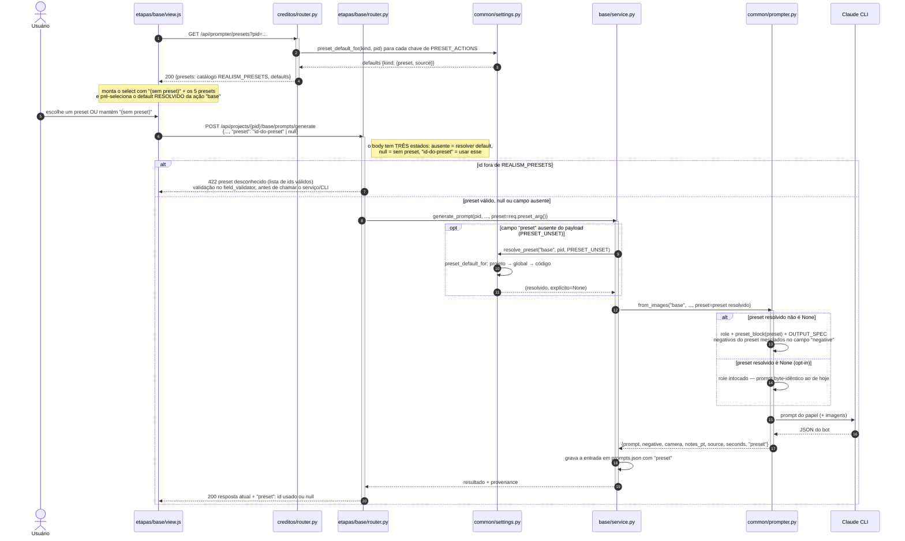
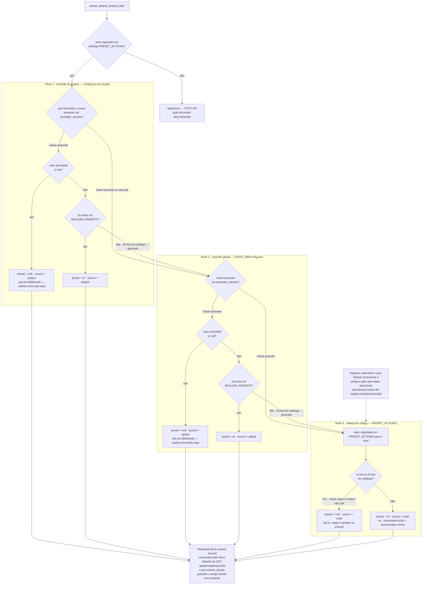

# prompter-presets-realismo — fluxo de geração com preset e resolução de default

Diagramas da feature `prompter-presets-realismo` (Wave 9, `[extensão]`), fonte normativa
`docs/domains/studio/features/prompter-presets-realismo-fdd.md` — em especial a seção 0
(amendas do gate W3), que vence sobre o restante do FDD. Conferidos contra a implementação em
`studio/common/prompter.py`, `studio/common/settings.py`, `studio/creditos/router.py`,
`studio/etapas/base/router.py` e `studio/base/service.py`.

## 1. Fluxo principal de geração com preset (etapa 3 · base)

A tela da etapa 3 carrega o catálogo em `GET /api/prompter/presets` (rota hospedada em
`studio/creditos/router.py`) e monta o `<select>` `#baseRealismPreset`, sempre com a opção
`(sem preset)` na frente. No "Gerar prompt", o `view.js` manda o campo aditivo `preset` no body do
`POST /api/projects/{pid}/base/prompts/generate`: id escolhido ou `null`. O router valida o id
contra `REALISM_PRESETS` no `field_validator` do `PromptGenReq` — id desconhecido vira **HTTP 422
antes** de o endpoint rodar, isto é, antes de qualquer chamada ao Claude CLI. Quando o campo vem
**ausente** do payload (clientes de API; a tela sempre envia o campo), o sentinela
`settings.PRESET_UNSET` atravessa o router e quem resolve o default é o serviço, via
`settings.resolve_preset("base", pid, preset)` → `preset_default_for` (projeto → global → código).
O `prompter` só injeta `preset_block` quando o preset resolvido não é `None`; sem preset o texto
enviado ao CLI é byte-idêntico ao de antes da extensão. A resposta e o histórico
(`prompts.json`) sempre carregam a chave `"preset"`, inclusive com o valor `null`.

## 2. Resolução do preset default por ação (projeto → global → código)

`settings.preset_default_for(kind, pid)` resolve o preset default de uma **ação** registrada em
`settings.PRESET_ACTIONS` — registro aberto, inicializado com `{"mood": None, "base": None,
"motion": None}` e extensível por outros módulos em import time (a feature consumidora
`storyboard-roteiro-llm`, da sub-wave 2, acrescenta a chave pontuada `storyboard.script` com
default `documentary-street`; ela não é entregue por esta frente). A cadeia é projeto → global →
código e tem três desfechos que importam: um `null` **persistido** encerra a cadeia naquele nível
(opt-out deliberado, `source` é aquele nível); uma chave **ausente** cai para o próximo nível; e um
id configurado que **saiu do catálogo** `REALISM_PRESETS` é ignorado como se ausente, também caindo
para o próximo nível — a UI nunca fica presa a um id morto. O default de código de `mood`, `base` e
`motion` é `null` (gate W3, amendas A1/A2): o comportamento é **opt-in**, sem preset a menos que
alguém configure um override.

## 3. Notas de divergência FDD × código

- **Pré-seleção da UI.** O FDD §4 diz que a UI "pré-seleciona `documentary-street` como sugestão
  visual". O `studio/etapas/base/view.js` implementado pré-seleciona o default **resolvido**
  (`defaults["base"].preset`), que com o opt-in do gate W3 é `null` — ou seja, a tela abre em
  `(sem preset)`. É o comportamento coerente com as amendas A1/A2 (a seção 0 vence).
- **Campo sempre presente vindo da tela.** A tela envia `preset` em toda requisição (id ou `null`),
  então o caminho "campo ausente → serviço resolve o default" vale na prática para clientes de API;
  a distinção ausente × `null` é sustentada pelo sentinela `settings.PRESET_UNSET`.
- **Validação do id.** O FDD §5 previa `preset_block` levantando `KeyError` convertido em 422 pelo
  router; o código introduziu `prompter.valid_preset` (levanta `ValueError`) usado no
  `field_validator` do body, o que produz o 422 mais cedo, antes do corpo do endpoint.
- **Etapa 2 (mood).** Conforme a amenda A4, o seletor de preset **não** foi entregue na tela da
  etapa 2 (endpoint morto por ADR-014); o campo `preset` no endpoint é aditivo e fica pronto para
  quando a tela existir. Por isso o diagrama 1 usa a etapa 3 (base) como fluxo principal.
