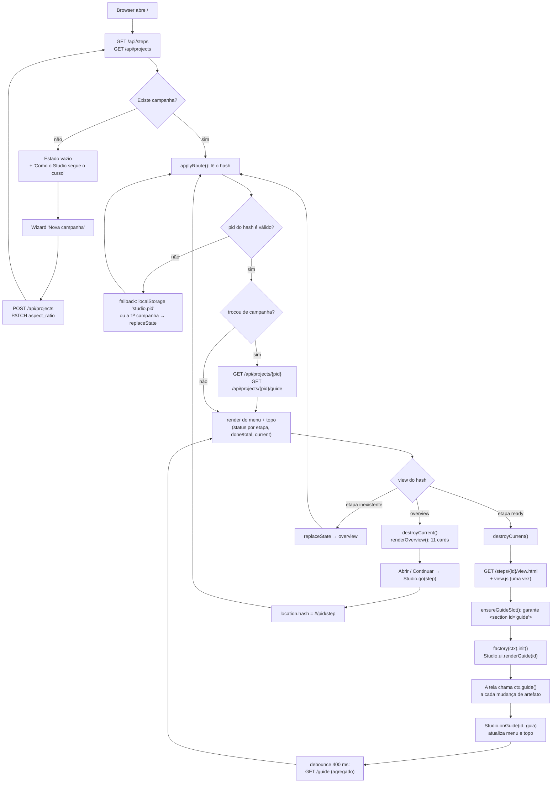
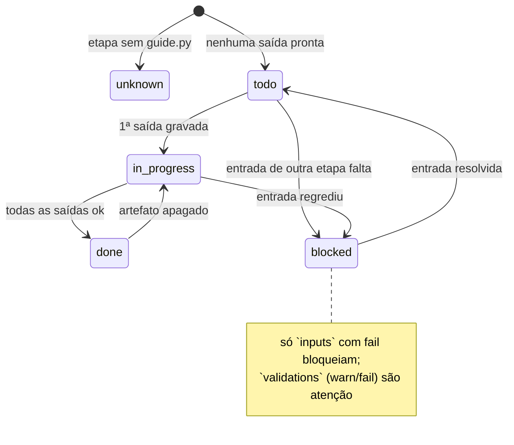
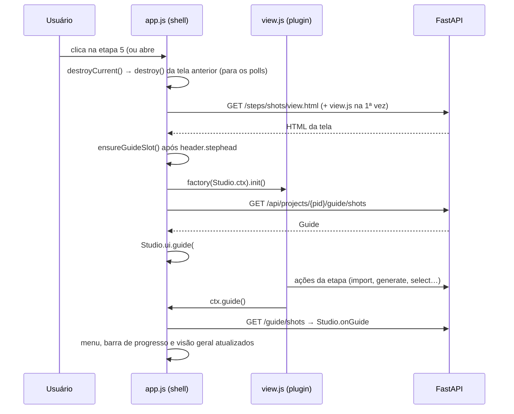

# Shell — navegação e roteamento (OS-013)

Fonte: `docs/domains/studio/features/shell-fdd.md` · Código: `studio/web/{index.html, app.js, ui.js}`
Versão: 1.0 (wave 2) · Data: 2026-08-25

O hash é a fonte de verdade da navegação (`#/<pid>/<step>` e `#/<pid>/overview`); o
`localStorage` (`studio.pid`, `studio.view`) só entra quando o hash está vazio ou aponta para
algo que não existe. O estado de cada etapa vem sempre do guia do backend.

## Fluxo de navegação

## Estados de uma etapa no menu e nos cards

## Ciclo de vida de uma tela de etapa

