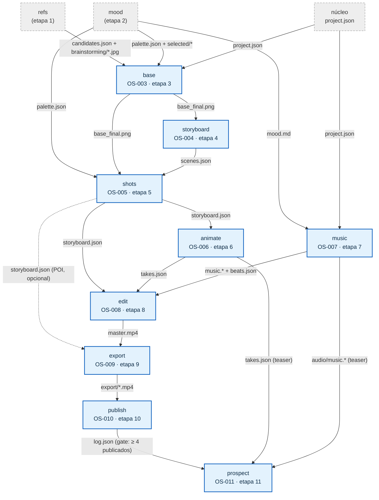
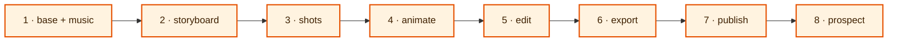

# Wave 1 — Grafo de dependências entre as frentes

Fonte: `docs/domains/studio/waves/wave-1.md` (seções "Feature: …" com Provides/Consumes e
"Grafo e sub-waves"). Diagrama tipo `graph TD` — o que está sendo modelado é uma rede de
dependências direcionada entre features, e não um fluxo de decisão.

## Como ler

Cada nó é uma feature da Wave 1 (`base`, `storyboard`, `shots`, `animate`, `music`, `edit`,
`export`, `publish`, `prospect`), com o Task-Id do backlog. Os nós em estilo diferente
(tracejados, mais claros) são artefatos **já existentes** antes da wave: `refs` e `mood`
(etapas 1 e 2) e o núcleo, que provê `project.json` — incluído por aparecer explicitamente
nos "Consumes" de `base` e de `music`. Cada aresta A→B significa "B consome o que A provê" e
é rotulada com o **artefato principal** do handoff (por exemplo `base_final.png`,
`scenes.json`, `takes.json`, `beats.json`, `master.mp4`). Portanto a seta aponta no sentido
do dado, não da chamada: quem recebe a ponta da seta é a frente bloqueada até o arquivo
existir. Durante a execução paralela (W4) essas arestas são satisfeitas por **fixtures** —
cada frente cria o artefato que consome — e só na integração (W5) o handoff real é cobrado,
seguindo a ordem topológica do segundo diagrama. Note que `edit` e `prospect` são os nós de
maior fan-in (três entradas cada), e que `prospect` tem uma aresta de gate a partir de
`publish` (`log.json` com ≥ 4 vídeos) além das duas arestas de conteúdo do teaser.

## Grafo de dependências

## Ordem topológica de integração (W5)

A integração é **em série**, na ordem declarada na wave: `base` e `music` não dependem uma da
outra e entram juntas no primeiro nível; o restante é uma cadeia linear.

## Premissas explícitas

- O nó `núcleo` (`project.json`) não estava na lista pedida de nós, mas aparece nos "Consumes"
  de `base` e `music`; foi incluído no mesmo estilo dos nós já existentes.
- A aresta `shots → export` é tracejada porque a própria wave marca o consumo de
  `shots/storyboard.json` (POI por shot) como **opcional**.
- `edit` também produz `edit/last_frames/<shot>_last.png`, descrito na wave como um "pedido de
  start/end de volta à etapa 6". Isso não é um Consumes declarado de `animate`, e representar
  como aresta criaria um ciclo no grafo; ficou fora do diagrama e registrado aqui.
