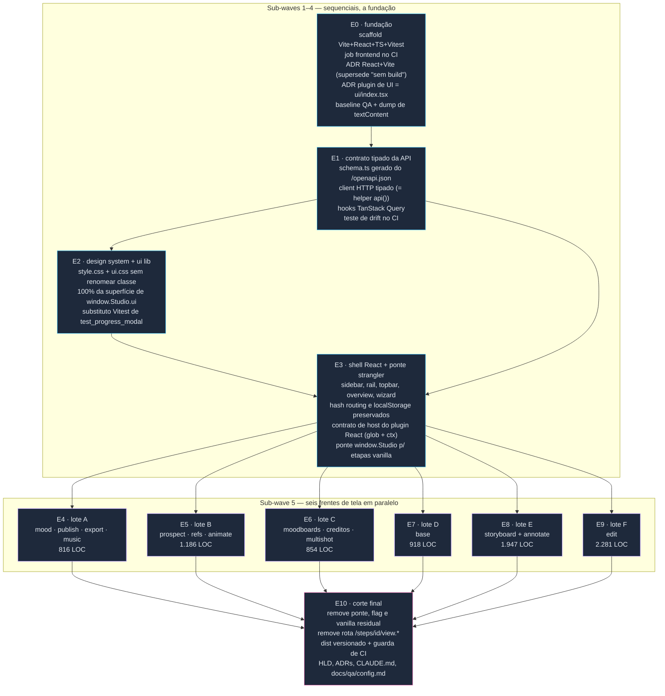

# Wave 10 — grafo de dependências

Migração integral do frontend para React (Vite + React + TypeScript + TanStack Query).
Onze frentes em **seis sub-waves**: as quatro primeiras estritamente sequenciais (cada uma
constrói a fundação que a próxima consome), a quinta com **seis frentes de tela em
paralelo** tocando pastas disjuntas, e a sexta fechando o corte.

**Correção ao plano original:** o plano previa `E6 → E8` ("storyboard consome o
multishot"). O código desmente — `studio/etapas/storyboard/view.js` tem zero ocorrências de
`multishot`, e o único consumidor de `window.Studio.multishot` é `studio/web/moodboards.js`,
que está no próprio lote E6. A aresta foi removida e a sub-wave 5 paraleliza inteira.

Fonte: `docs/domains/studio/waves/wave-10.md`.

## Por que o paralelismo é seguro na sub-wave 5

As seis frentes tocam conjuntos de arquivos **disjuntos** — cada uma só escreve dentro de
`studio/etapas/<id>/ui/` das suas telas (ou `studio/web/` no caso da E6) e remove os
próprios `view.{html,js}` e testes pytest correspondentes.

O que torna isso possível é a decisão de descoberta por `import.meta.glob` tomada na E0:
**não existe registry central para as frentes editarem**. Uma tela nova entra no app só por
existir na pasta. Sem essa escolha, as seis frentes disputariam o mesmo arquivo de
registro e o paralelismo viraria fila de conflitos.

O segundo artefato compartilhado — `studio/web/dist/` — é neutralizado por regra: fica no
`.gitignore` durante a wave e só é commitado uma vez, na E10.
