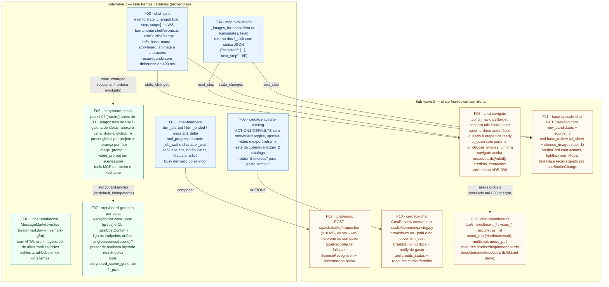

# Wave 11 — grafo de dependências

Doze frentes (F01–F12) em duas sub-waves, fechando os 9 comportamentos relatados pelo dono
(chat, refs, base, créditos, moodboards, storyboard), os 3 itens adicionais do storyboard e
2 bugs achados na análise (`base_pick`, ledger fora de `ACTIONS`).

**Sub-wave 1** = sete frentes sem `consumes` real — as cinco primeiras estritamente
independentes, e as duas de storyboard ligadas só por uma chave registrada de forma
idempotente. **Sub-wave 2** = as cinco consumidoras, cada uma amarrada a um contrato
publicado na sub-wave 1 (exceto `chat-moodboards`, que mocka a fronteira de navegação).

Arestas cheias = dependência de contrato real (a provedora entrega antes). Arestas
tracejadas = **fronteira mockada ou idempotente**: a frente entrega e valida sozinha, e o
encaixe só é comprovado no estado integrado.

Fonte: `docs/domains/studio/waves/wave-11.md` (seções "Contratos entre features" e
"Grafo e sub-waves").

## Leitura das arestas

| De → Para | Contrato | Tipo |
|---|---|---|
| F03 → F06 | `state_changed` (galeria atualiza após geração vinda do chat) | tracejada — opcional, mesma sub-wave; sem ela, refresh no `done` do job da própria tela |
| F06 → F07 | chave `storyboard.angles` em `PRESET_ACTIONS` | tracejada — F07 registra com `setdefault`; conflito trivial no rebase |
| F03 → F08 | `state_changed` + `invalidarGuia` no dock | cheia |
| F04 → F08 | `next_step` no retorno dos `*_pick` | cheia |
| F02 → F09 | estado do composer / status do dock (mesmo trecho de `ChatDock.tsx`) | cheia — motivo real é conflito de arquivo |
| F05 → F10 | catálogo `ACTIONS` completo | cheia |
| F03 → F11 | `state_changed` / `useStudioChange` | cheia |
| F04 → F11 | `_images_for` corrigido + `next_step` | cheia |
| F08 → F12 | navegação para áreas globais (`moodboards[/<mbid>]`) | tracejada — mockada até F08 integrar |

Ordem de integração (W5): sub-wave 1 — `mcp-pick-shape` → `creditos-actions-catalog` →
`chat-markdown` → `chat-sync` → `chat-feedback` → `storyboard-geracao-por-cena` →
`storyboard-cenas` (as duas de storyboard por último, por serem as maiores e tocarem
`router.py`/`service.py` da etapa); sub-wave 2 — `creditos-chat` → `chat-navigate` →
`base-upscale-chat` → `chat-audio` → `chat-moodboards`.
