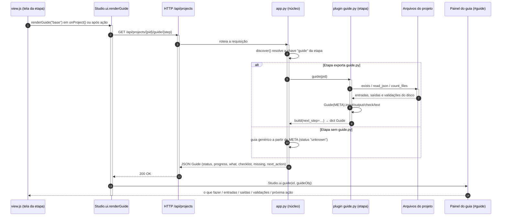

# Wave 2 — Grafo de dependências entre o preparo e as 7 frentes

Fonte: `docs/domains/studio/waves/wave-2.md` (seções "Features e contratos" com Provides/Consumes
e "Grafo e sub-waves"). Formato espelhado de `wave-1-dependencias.md`.
Diagramas: um `graph TD` (rede de dependências direcionada, não fluxo de decisão), um
`sequenceDiagram` do fluxo "tela pede o guia" e um `graph LR` da ordem de integração da W5.

## Como ler

Cada nó cheio é uma frente da Wave 2, com o Task-Id do backlog: `shell` (OS-013),
`refs+mood` (OS-014), `base` (OS-015), `storyboard+shots` (OS-016), `animate` (OS-017),
`music+edit` (OS-018) e `export+publish+prospect` (OS-019). O nó `preparo`
(`ADH-OS-20260825-06`) é a **sub-wave 0**: um PR único mergeado antes de tudo, do qual saem
as arestas de contrato para as 7 frentes. Cada aresta preparo→frente é rotulada com o
**artefato de contrato** efetivamente consumido, conforme os "Consumes" declarados na wave:
`studio/common/guide.py` (helpers `Guide`, `build()`, `exists`, `read_json`, `count_files`),
`Studio.ui` (`ui.js` + `ui.css`, com `guide()` e `renderGuide()`), os endpoints
`GET /api/projects/{pid}/guide[/{step}]` e `PATCH /api/projects/{pid}`.

Os nós tracejados e mais claros são **dependências de dados já existentes em `develop`** —
artefatos produzidos pelas etapas da Wave 1, que a Wave 2 apenas lê nos `guide.py`. A seta
aponta no sentido do dado: quem recebe a ponta está bloqueado até o arquivo existir. Durante
a execução paralela (W4) as arestas de dados são satisfeitas por **fixtures**; só na
integração (W5) o handoff real é cobrado.

Note que, ao contrário da Wave 1, aqui **não há aresta entre frentes**: os arquivos são
disjuntos (`studio/web/*` só na shell; cada frente só nas pastas das suas etapas,
`docs/domains/<etapa>/` e `tests/test_<etapa>_*`). Todo o acoplamento passa pelo preparo, o
que torna o grafo uma estrela — o fan-out do `preparo` é 7 e o fan-in de cada frente vem
apenas dele e dos dados de `develop`.

## Grafo de dependências

```mermaid
graph TD
    %% Sub-wave 0
    preparo["preparo<br/>ADH-OS-20260825-06<br/>núcleo + contratos"]

    %% Frentes da Wave 2 (sub-wave 1, em paralelo)
    shell["shell<br/>OS-013 · núcleo web"]
    refsmood["refs+mood<br/>OS-014 · etapas 1–2"]
    base["base<br/>OS-015 · etapa 3"]
    storyshots["storyboard+shots<br/>OS-016 · etapas 4–5"]
    animate["animate<br/>OS-017 · etapa 6"]
    musicedit["music+edit<br/>OS-018 · etapas 7–8"]
    exportpub["export+publish+prospect<br/>OS-019 · etapas 9–11"]

    %% Dados já existentes em develop (Wave 1)
    prompter["common/prompter.py<br/>(já em develop)"]
    lastframes["edit/last_frames/*.png<br/>(já em develop)"]
    takes["animate/takes.json<br/>(já em develop)"]
    storyjson["shots/storyboard.json<br/>(já em develop)"]
    masters["edit/master.mp4 + export/*.mp4<br/>(já em develop)"]
    portfolio["portfólio global<br/>projetos com post registrado"]

    %% Contratos do preparo para as frentes
    preparo -->|"GET /api/projects/{pid}/guide + Studio.ui"| shell
    preparo -->|"guide.py comum + Studio.ui + PATCH /api/projects/{pid}"| refsmood
    preparo -->|"guide.py comum + Studio.ui"| base
    preparo -->|"guide.py comum + Studio.ui"| storyshots
    preparo -->|"guide.py comum + Studio.ui"| animate
    preparo -->|"guide.py comum + Studio.ui"| musicedit
    preparo -->|"guide.py comum + Studio.ui"| exportpub

    %% Dependências de dados (leitura pura nos guide.py)
    prompter -.->|"prompter.from_images(&quot;base&quot;, …)"| base
    lastframes -.->|"start/end aceita last_frames"| animate
    takes -.->|"takes liked → rough_sequence.mp4"| musicedit
    storyjson -.->|"cenas e ordem dos shots"| musicedit
    masters -.->|"vídeos para publicar"| exportpub
    portfolio -.->|"gate de prospect (GET /api/portfolio)"| exportpub

    classDef preparoCls fill:#f3e5f5,stroke:#6a1b9a,stroke-width:3px,color:#2e0b3f
    classDef feature fill:#e3f2fd,stroke:#1565c0,stroke-width:2px,color:#0d2b45
    classDef existente fill:#eeeeee,stroke:#999999,stroke-width:1px,stroke-dasharray: 5 3,color:#333333
    class preparo preparoCls
    class shell,refsmood,base,storyshots,animate,musicedit,exportpub feature
    class prompter,lastframes,takes,storyjson,masters,portfolio existente
```

## Fluxo "a tela pede o guia"

Sequência do contrato transversal do guia: a tela nunca calcula estado próprio — pede ao
backend, que lê os artefatos do projeto em disco (leitura **pura**, ADR-003: o `guide.py` de
cada etapa nunca cria nem regrava artefato, nunca chama CLI/ffprobe).

Regras de derivação aplicadas no `build()` (`guide.py` comum): `inputs` com `fail` → `blocked`;
nenhum `output` ok → `todo`; todos os `outputs` ok → `done`; caso contrário `in_progress`.
`progress` = saídas ok / saídas totais. `validations` **nunca** bloqueiam — `warn` e `fail`
viram itens de "atenção" no painel.

## Ordem de integração (W5)

Integração **em série**, na ordem do curso, para que o smoke visual siga o pipeline. A shell
entra primeiro porque as 7 telas dependem do `Studio.ui` redesenhado e da visão geral; as
frentes de etapa seguem na sequência das aulas.

```mermaid
graph LR
    n0["0 · preparo<br/>ADH-OS-20260825-06"] --> n1["1 · shell<br/>OS-013"]
    n1 --> n2["2 · refs+mood<br/>OS-014"]
    n2 --> n3["3 · base<br/>OS-015"]
    n3 --> n4["4 · storyboard+shots<br/>OS-016"]
    n4 --> n5["5 · animate<br/>OS-017"]
    n5 --> n6["6 · music+edit<br/>OS-018"]
    n6 --> n7["7 · export+publish+prospect<br/>OS-019"]

    classDef base0 fill:#f3e5f5,stroke:#6a1b9a,stroke-width:3px,color:#2e0b3f
    classDef nivel fill:#fff3e0,stroke:#e65100,stroke-width:2px,color:#3e2000
    class n0 base0
    class n1,n2,n3,n4,n5,n6,n7 nivel
```

Cobrado ao fim da W5 (critérios cross-feature da wave):

1. `GET /api/projects/2026-08-wave-teste/guide` devolve as 11 etapas sem `unknown`, com
   `done`/`in_progress` coerentes com os artefatos existentes.
2. Smoke visual (Playwright, script do orquestrador): as 11 telas renderizam com o painel de
   guia, sem erro de JS, em tema claro e escuro.
3. Todo plugin expõe `destroy()` e nenhum timer sobrevive à troca de tela.
4. `pytest` ≥ 392 + novos, `ruff` limpo, strings fixadas por teste preservadas.

## Premissas explícitas

- O `PATCH /api/projects/{pid}` aparece como rótulo apenas na aresta `preparo → refs+mood`,
  que é a única frente com consumo declarado (o `mood` grava `project.vibe` no `select`). O
  wizard "Nova campanha" da shell também usa o núcleo de projetos, mas a wave declara nos
  "Consumes" da shell somente `GET /api/projects/{pid}/guide` e o contrato `Studio.ui`.
- `common/prompter.py` não estava na lista pedida de nós tracejados, mas é um "Consumes … já
  em develop" declarado por `base` (OS-015); entrou no mesmo estilo dos demais nós existentes.
- O **portfólio global** (`GET /api/portfolio`) é *provido* pela própria frente OS-019 e lido
  pelo gate de `prospect` dentro dela. Foi desenhado como nó tracejado de dado, e não como
  aresta entre frentes, para não criar um ciclo — a dependência real é sobre projetos com post
  registrado, dado que já existe em `develop` (teste cross-feature com 2 projetos).
- `edit/master.mp4` e `export/*.mp4` foram agrupados num único nó tracejado por serem
  consumidos pela mesma frente (OS-019) e citados juntos no "Consumes" da wave.
- Não há arestas entre frentes: por decisão do lote, frentes de etapa nunca editam
  `studio/web/*`, `app.py` ou `steps.py`, e a shell nunca edita plugins.
