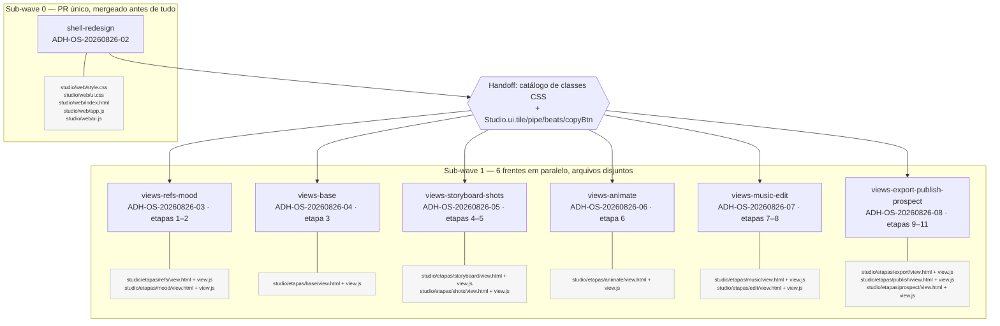

# Wave 3 — Dependências entre o shell e as 6 frentes de tela

Fonte: `docs/domains/studio/waves/wave-3.md` (seções "Features e contratos" e "Grafo e sub-waves").

## Grafo de dependências

A sub-wave 0 (`shell-redesign`, PR único mergeado antes de tudo) publica o catálogo de classes CSS e os helpers `Studio.ui.tile/pipe/beats/copyBtn`, que as 6 frentes de tela da sub-wave 1 consomem em paralelo sobre arquivos disjuntos.

## Fluxo de integração da W5

Os PRs entram na ordem do curso, e cada merge só acontece depois do smoke visual (`scripts/smoke_ui.py`, 1440×900, claro e escuro) e da checagem de timers (`--timers`) passarem como gate.

```mermaid
flowchart LR
    develop(["develop com<br/>shell-redesign mergeado"])
    p1["PR views-refs-mood<br/>etapas 1–2"]
    p2["PR views-base<br/>etapa 3"]
    p3["PR views-storyboard-shots<br/>etapas 4–5"]
    p4["PR views-animate<br/>etapa 6"]
    p5["PR views-music-edit<br/>etapas 7–8"]
    p6["PR views-export-publish-prospect<br/>etapas 9–11"]
    final(["Estado integrado:<br/>make verify verde + smoke<br/>das 11 telas e visão geral"])

    %% cada aresta rotulada é o gate obrigatório antes do merge daquele PR
    develop --> p1
    p1 -- "gate 1: smoke visual claro/escuro<br/>+ timers (8 s) → merge" --> p2
    p2 -- "gate 2: smoke visual claro/escuro<br/>+ timers (8 s) → merge" --> p3
    p3 -- "gate 3: smoke visual claro/escuro<br/>+ timers (8 s) → merge" --> p4
    p4 -- "gate 4: smoke visual claro/escuro<br/>+ timers (8 s) → merge" --> p5
    p5 -- "gate 5: smoke visual claro/escuro<br/>+ timers (8 s) → merge" --> p6
    p6 -- "gate 6: smoke visual claro/escuro<br/>+ timers (8 s) → merge" --> final
```

