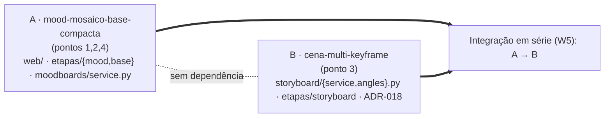

# Wave 5 — grafo de dependências

Duas frentes independentes (sem `consumes` entre elas, sem sobreposição de arquivos).
Integração em série apenas por prudência (A de menor risco primeiro).

```mermaid
graph LR
  A["A · mood-mosaico-base-compacta<br/>(pontos 1,2,4)<br/>web/ · etapas/{mood,base} · moodboards/service.py"]
  B["B · cena-multi-keyframe<br/>(ponto 3)<br/>storyboard/{service,angles}.py · etapas/storyboard · ADR-018"]
  A -. sem dependência .- B
  A ==> INT["Integração em série (W5): A → B"]
  B ==> INT
```
