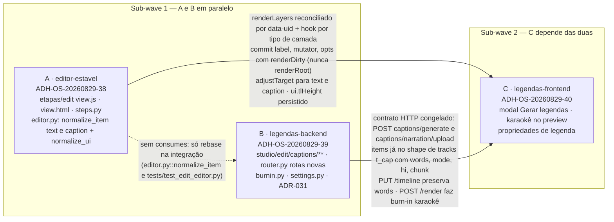
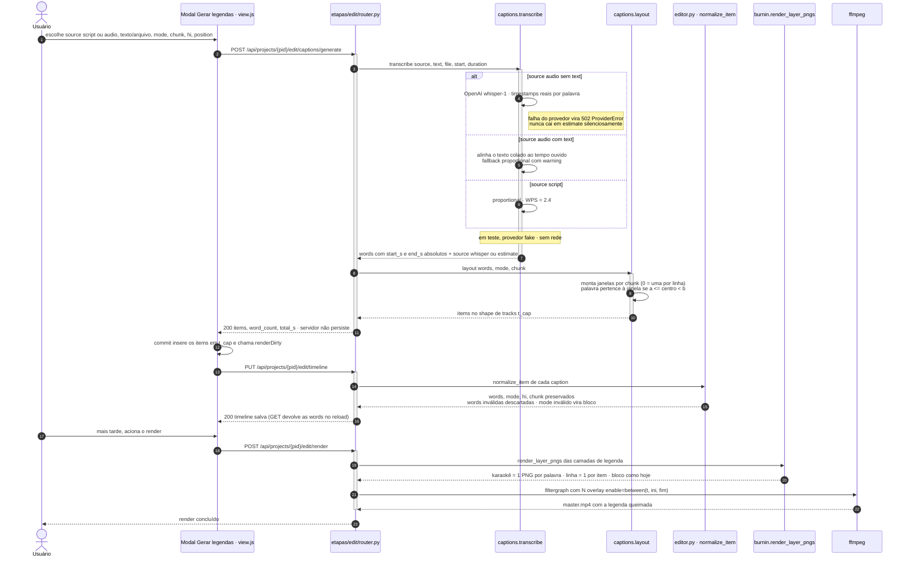

# Wave 8 — grafo de dependências e fluxo "Gerar legendas"

Três frentes em duas sub-waves: **1** = A ∥ B (arquivos disjuntos, salvo `editor.py`),
**2** = C (nasce da `develop` já com A e B integradas).

## 1. Grafo de dependências entre as frentes

Critérios cross-feature cobrados na W5: **C ← A** legenda com `words` vira spans
`[data-cap-widx]` dentro da camada reconciliada e `paintKaraoke` sobrevive a arrastar/trim;
**C ← B** os itens devolvidos pelo modal sobrevivem ao `PUT /timeline` + reload.

## 2. Fluxo "Gerar legendas" (geração → persistência → render)

